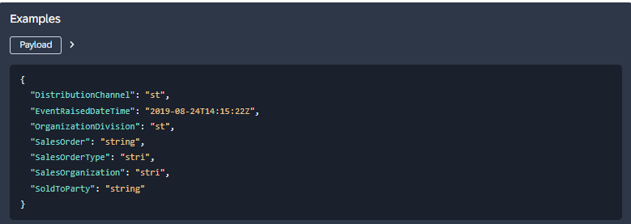

<!-- loiob5687dae692d4b4e8b0c30afc5a6afb1 -->

# Direct Logging API


<a name="loiob5687dae692d4b4e8b0c30afc5a6afb1__section_ywb_t5c_g2c"/>

## Context

You can use the class-based**Direct Logging API** to write to the business event log without creating a Business Event. For example, you can use this API to add entries for past business events to the business event log.

For an entry in the Business Event Log, the attribute ‘source of data’ will indicate whether the entry was created via Business Event or via the Direct Logging API.


<a name="loiob5687dae692d4b4e8b0c30afc5a6afb1__section_xkz_xmc_zcc"/>

## Creating an instance to log business event

To write business events to the business event log, you require an instance of class CL\_BEL\_DIRECT\_LOGGING. To create this instance, the class CL\_BEL\_DIRECT\_LOGGING provides the following methods:

**Methods**


<table>
<tr>
<th valign="top">

Method

</th>
<th valign="top">

Description

</th>
</tr>
<tr>
<td valign="top">

`IF_BEL_DIRECT_LOGGING~LOG_BUSINESS_EVENT`

</td>
<td valign="top">

Logs business events

</td>
</tr>
<tr>
<td valign="top">

`GET_INSTANCE`

</td>
<td valign="top">

Creates an object instance

</td>
</tr>
</table>

The Class `CL_BEL_DIRECT_LOGGING` can be consumed via the interface `IF_BEL_DIRECT_LOGGING`. Create the instance of the API using `GET_INSTANCE` method of class `CL_BEL_DIRECT_LOGGING`. The method returns the object reference of type `IF_BEL_DIRECT_LOGGING`.


The API is invoked via the `LOG_BUSINESS_EVENT` method of interface `IF_BEL_DIRECT_LOGGING`. The method takes input as different events and returns the results in terms of return code and an internal table containing processing results of each event.


<a name="loiob5687dae692d4b4e8b0c30afc5a6afb1__section_ipx_b1d_g2c"/>

## Method Parameters

The method has the following parameters:

-   `IT_EVENTS`: This is an input parameter of type table and contains the list of events that need to be logged into the Business Event Logging component. The main components of this parameter are:

    ****


    <table>
    <tr>
    <th valign="top">

    Parameter
    
    </th>
    <th valign="top">

    Description
    
    </th>
    </tr>
    <tr>
    <td valign="top">
    
    `EVENT_GUID`
    
    </td>
    <td valign="top">
    
    Unique identifier for a given event. This has to be provided by the consumer application, and it helps us identify whether an event has already been logged. By default, an empty GUID is automatically generated for EVENT\_GUID.

    > ### Note:  
    > If you want to use the direct event API to add single or multiple events with past timestamp to the business event log, you should generate the EVENT\_GUID manually. You do this the same way that you generate the event ID for events. With the same EVENT\_GUID, the ID will be stored only once, even if it is added multiple times. For example, you can create the event ID by concatenating and then hashing the object key, event type, and timestamp of the event.


    
    </td>
    </tr>
    <tr>
    <td valign="top">
    
    `SOURCE_SYSTEM`
    
    </td>
    <td valign="top">
    
    This identifies the system where the event was generated. It is an optional parameter. By default, it would be filled with the current logical system.
    
    </td>
    </tr>
    <tr>
    <td valign="top">
    
    `TRANSACTION_ID`
    
    </td>
    <td valign="top">
    
    An ID uniquely identifying the transaction in which the business event was run. Business events with the same IDs are considered to have been run at the same time and by default the transaction\_ID will be automatically filled with the ID of the current kernel transaction.

    > ### Note:  
    > If you want to use the direct event API to add single or multiple events with past timestamp to the business event log, then we recommend that you provide the transaction ID manually. Ensure that you provide a unique ID for each event. For example: Use the same ID that you have used for the event id.


    
    </td>
    </tr>
    <tr>
    <td valign="top">
    
    `EXEC_USER`
    
    </td>
    <td valign="top">
    
    This identifies the user who performed the business activity that created the event. Although it is an optional parameter, we recommend that you provide it. By default, it will be filled with the current logon user.
    
    </td>
    </tr>
    <tr>
    <td valign="top">
    
    `EXEC_TIMESTAMP`
    
    </td>
    <td valign="top">
    
    Timestamp at which the event was created. Although it is an optional parameter, we recommend that you provide it. By default, it would be filled with the current timestamp. The timestamp can be in the past.
    
    </td>
    </tr>
    <tr>
    <td valign="top">
    
    `EVENT_TYPE`
    
    </td>
    <td valign="top">
    
    This is a mandatory parameter. This string carries the metadata such as the object and version information about the event. It is given in a specific format. For example:

    > ### Sample Code:  
    > ```
    > sap.s4.beh.salesorder.v1.SalesOrder.Changed.v1
    > ```

    In the event type string, the Object is **SalesOrder**, the Event Operation is **Changed**, and the Event Version is **v1**.

    For a given business event, the EVENT\_TYPE from the event binding can be found in the events section on the SAP Business Accelerator Hub.

    

    When you copy the string, ensure that you copy from "sap" and replace the forward slash \(/\) with a period \(.\).

    For an internal business event, the EVENT\_TYPE must be formed in the following format:

    **<BO Interface Name\>.<Sap Object Type\>.<Operation\>**

    The above entities can be found in the *Business Object Interfaces* section under *On-Stack Extensibility* on the SAP Business Accelerator Hub.

    For example:

    `I_SalesOrderTP.SalesOrder.Changed`

    -   *Business Object Interface*: I\_SalesOrderTP

    -   *SAP Object Type*: SalesOrder

    -   *Operation*: The name of the operation in the business object interface and can include a version. If the operation includes a version, then the format is:

        **<Business Object Interface\>.<Sap Object Type\>.<Operation\>\_<Version\>**


    
    </td>
    </tr>
    <tr>
    <td valign="top">
    
    `EVENT_DATA`
    
    </td>
    <td valign="top">
    
    This is a mandatory parameter. It carries event information such as business event data \(payload\) of an event. The definition will consist of the fields of event.

    For a given business event, the EVENT\_DATA structure and data types can be found in the events section on the SAP Business Accelerator Hub.

    An example of event\_data is given below:

    

    > ### Note:  
    > The fields don't have to be in the same order as in the SAP Business Accelerator Hub.


    
    </td>
    </tr>
    <tr>
    <td valign="top">
    
    `EV_RETCODE`
    
    </td>
    <td valign="top">
    
    The return code may consist of 3 different values indicating the result of processing.

    -   0 = Successful.
    -   1 = Successful with warnings.

    -   2 = Errors.


    
    </td>
    </tr>
    <tr>
    <td valign="top">
    
    `CT_RETURN`
    
    </td>
    <td valign="top">
    
    This table parameter consists of the result of processing of each event which was passed via the IT\_EVENTS parameter. The components of the return table are as

    -   `EVENT_GUID`: Event identifier passed by the consumer application.

    -   `EVENT_TYPE`: Event type passed by the consumer application.

    -   `EXEC_TIMESTAMP`: Event's timestamp passed by consumer application.

    -   `EVENT_DATA`: Event-specific data passed by the consumer application.

    -   `TYPE`: Message type: S Success, E Error, W Warning

    -   `ID`: Message Class

    -   `NUMBER`: Message Number
    -   `MESSAGE_V1`: Event identifier passed by the consumer application.
    -   `MESSAGE_V2`: Event type passed by the consumer application.
    -   `MESSAGE_V3`: First 50 characters of event data.
    -   MESSAGE\_V4: Event's timestamp passed by consumer application.


    
    </td>
    </tr>
    </table>
    

Below is an example of how the API can be consumed. This sample contains the mandatory parameters:

> ### Sample Code:  
> ```
> TYPES : BEGIN OF ty_so_changed,
>           DistributionChannel  TYPE c LENGTH 2,
>           EventRaisedDateTime  TYPE tzntstmpl,
>           OrganizationDivision TYPE c LENGTH 2,
>           SalesOrder           TYPE c LENGTH 10,
>           SalesOrderType       TYPE c LENGTH 4,
>           SalesOrganization    TYPE c LENGTH 4,
>           SoldToParty          TYPE c LENGTH 10,
>         END OF ty_so_changed.
> 
> 
> DATA : lr_structdescr TYPE REF TO cl_abap_structdescr,
>        lr_typedescr   TYPE REF TO cl_abap_typedescr,
>        lo_data        TYPE REF TO data,
>        lt_event       TYPE REF TO bel_t_event_data,
>        lv_retcode     TYPE bel_api_retcode,
>        lt_return      TYPE REF TO bel_t_api_return.
> 
> 
> DATA : lo_log_api TYPE REF TO if_bel_direct_logging.
> 
> 
> cl_abap_typedescr=>describe_by_name(
>   EXPORTING
>     p_name         = 'ty_so_changed'
>   RECEIVING
>     p_descr_ref    = lr_typedescr
>   EXCEPTIONS
>     type_not_found = 1
>     OTHERS         = 2
> ).
> IF sy-subrc <> 0.
>   MESSAGE ID sy-msgid TYPE sy-msgty NUMBER sy-msgno
>     WITH sy-msgv1 sy-msgv2 sy-msgv3 sy-msgv4.
> ENDIF.
> 
> lr_structdescr = CAST cl_abap_structdescr( lr_typedescr ).
> CREATE DATA lo_data TYPE HANDLE lr_structdescr.
> 
> ASSIGN lo_data->* TO FIELD-SYMBOL(<fs_data>).
> 
> 
> CHECK <fs_data> IS ASSIGNED.
> 
> ASSIGN COMPONENT  'DistributionChannel' OF STRUCTURE <fs_data> TO FIELD-SYMBOL(<fs_dc>).
> IF sy-subrc = 0.
>   <fs_dc> = '01'.
> ENDIF.
> 
> 
> ASSIGN COMPONENT  'EventRaisedDateTime' OF STRUCTURE <fs_data> TO FIELD-SYMBOL(<fs_tstp>).
> IF sy-subrc = 0.
>   GET TIME STAMP FIELD <fs_tstp>.
> ENDIF.
> 
> ASSIGN COMPONENT  'OrganizationDivision' OF STRUCTURE <fs_data> TO FIELD-SYMBOL(<fs_od>).
> IF sy-subrc = 0.
>   <fs_od> = 'AB'.
> ENDIF.
> 
> ASSIGN COMPONENT  'SalesOrder' OF STRUCTURE <fs_data> TO FIELD-SYMBOL(<fs_so>).
> IF sy-subrc = 0.
>   <fs_so> = '0000000100'.
> ENDIF.
> 
> 
> ASSIGN COMPONENT  'SalesOrderType' OF STRUCTURE <fs_data> TO FIELD-SYMBOL(<fs_sotyp>).
> IF sy-subrc = 0.
>   <fs_sotyp> = 'ABCD'.
> ENDIF.
> 
> ASSIGN COMPONENT  'SalesOrganization' OF STRUCTURE <fs_data> TO FIELD-SYMBOL(<fs_soorg>).
> IF sy-subrc = 0.
>   <fs_soorg> = 'WXYZ'.
> ENDIF.
> 
> ASSIGN COMPONENT  'SoldToParty' OF STRUCTURE <fs_data> TO FIELD-SYMBOL(<fs_spty>).
> IF sy-subrc = 0.
>   <fs_spty> = '2000200001'.
> ENDIF.
> 
> CREATE DATA lt_event   TYPE bel_t_event_data.
> CREATE DATA lt_return  TYPE bel_t_api_return.
> 
> lt_event->* = VALUE #( (  event_type = 'sap.s4.beh.salesorder.v1.SalesOrder.Changed.v1'  event_data = lo_data   ) ).
> 
> lo_log_api = cl_bel_direct_logging=>get_instance( ).
> 
> 
> lo_log_api->log_business_event(
>   EXPORTING
>     it_events  = lt_event
>   IMPORTING
>     ev_retcode = lv_retcode
>   CHANGING
>     ct_return  = lt_return
> ).
> 
> ```


### Troubleshooting issues

The API can throw a Warning\(W\) return code in case the event is already existing in the BEL database or the event is not activated to be logged into the BEL framework. The API can return error\(E\) return code in case the mandatory parameters are not passed or passed with initial values, if the authorization check fails, if the EVENT\_DATA definition is passed incorrectly. The details of the error/warning can be seen in the CT\_RETURN table parameter of the API. Some examples of error/warning are given below:

-   Business Event is not defined \(E\): The supplied business event is not defined. Ensure that the business event exists in the SAP Business Accelerator Hub.

-   Business event with Identical ID exists \(W\): The business event supplied already exists in the system. The corresponding event will be skipped.

-   Business Event not enabled for logging \(W\): The business event is not enabled for logging in the system.

-   Business event processed successfully \(S\): Business event is successfully logged into the system.

-   Business event data not supplied \(E\): Event-related data is not supplied. It is mandatory to provide the event data.

-   Business event keys can't be determined \(E\): For the given event, refer to SAP Business Accelerator Hub and verify if the fields are correct.

-   Keys can't be retrieved from event data \(E\): For the given event, refer to SAP Business Accelerator Hub and verify if the fields are correct


