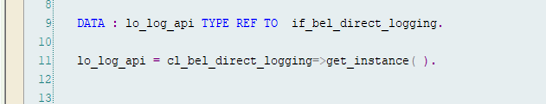

<!-- loiob5687dae692d4b4e8b0c30afc5a6afb1 -->

# Direct Logging API

You can use the**Direct Logging API** to write to the Business Event Log without creating a Business Event. For an entry in the Business Event Log, the attribute ‘source of data’ will indicate whether the entry was created via Business Event or via the Direct Logging API.


<a name="loiob5687dae692d4b4e8b0c30afc5a6afb1__section_xkz_xmc_zcc"/>

## Creating an instance to log business event

This class `CL_BEL_DIRECT_LOGGING` offers the functionality to log business events directly into the Business Event Logging component. The class contains the following list of methods to log business events:

****


<table>
<tr>
<th valign="top">

Method

</th>
<th valign="top">

Description

</th>
</tr>
<tr>
<td valign="top">

`IF_BEL_DIRECT_LOGGING~LOG_BUSINESS_EVENT`

</td>
<td valign="top">

Logs business events

</td>
</tr>
<tr>
<td valign="top">

`GET_INSTANCE`

</td>
<td valign="top">

Creates an object instance

</td>
</tr>
</table>


### Create the instance of the API

The ABAP Class `CL_BEL_DIRECT_LOGGING` can be consumed via the interface `IF_BEL_DIRECT_LOGGING`. Create the instance of the API using `GET_INSTANCE` method of class `CL_BEL_DIRECT_LOGGING`. The method returns the object reference of type `IF_BEL_DIRECT_LOGGING`.




### Parameters

The API is invoked via method `LOG_BUSINESS_EVENT` of interface `IF_BEL_DIRECT_LOGGING`. The method takes input as different events and returns the results in terms of return code and an internal table containing processing results of each event.

The method has the following parameters:.

-   `IT_EVENTS`: This is an input parameter of type table and contains the list of events that need to be logged into the Business Event Logging component. The main components of this parameter are:

    -   `EVENT_GUID`: Unique identifier for a given event. This has to be provided by the consumer application. Although it is an optional parameter, we recommend that you provide it. It identifies whether an event has already been logged. By default, a GUID is generated.
    -   `SOURCE_SYSTEM`: This identifies the system where the event was generated. It is an optional parameter. By default it would be filled with the current logical system.
    -   `TRANSACTION_ID`: An ID uniquely identifying the transaction in which the business event was run. Although it is an optional parameter, we recommend that you provide it. Business events with the same ID are considered to have been run at the same time. By default the transaction\_ID would be filled with the ID of the current kernel transaction.
    -   `EXEC_USER`: This identifies the user who performed the business activity that created the event.Although it is an optional parameter, we recommend that you provide it. By default it will be filled with the current logon user.
    -   `EXEC_TIMESTAMP`: Timestamp at which the event was created. Although it is an optional parameter, we recommend that you provide it. By default it would be filled with the current timestamp. The timestamp can be in the past.
    -   `EVENT_TYPE`: This string carries the metadata such as the object and version information about the event. It is given in a specific format. For example:

        > ### Sample Code:  
        > ```
        > sap.s4.beh.salesorder.v1.SalesOrder.Changed.v1
        > ```

        In the event type string, the Object is **SalesOrder**, the Event Operation is **Changed**, and the Event Version is **v1**.

        EVENT\_TYPE is a mandatory parameter and can be found for a given Business Event in the events section on the SAP API Business Accelerator Hub.


-   `EVENT_DATA`: This is a mandatory parameter. It carries event information such as payload of an event containing the keys and business data. The structure will consist of key fields of the object and object components and the fields of event abstract entity.

    For example, in the **sales order changed** event, the EVENT\_DATA has structure with "SalesOrder" as the key field and the following fields:

    -   Object = SalesOrder

    -   Event Operation = Changed


    Using the object details and event operation, determine the Event binding from EVTB\_PRODUCER table. Then using the Event Binding, get the CDS behaviour definition from table EVTB\_EVENT.

-   `EV_RETCODE`: The return code may consist of three different values indicating the result of processing.

    -   0 = Successful.
    -   1 = Successful with warnings.

    -   2 = Errors.


-   `CT_RETURN`: This table parameter consists of result of processing of each event which was passed via IT\_EVENTS parameter. The components of return table are as

    -   `EVENT_GUID`: Event identifier passed by the consumer application.

    -   `EVENT_TYPE`: Event type passed by the consumer application.

    -   `EVENT_TYPE`: Event type passed by the consumer application.

    -   `EXEC_TIMESTAMP`: Event timestamp passed by consumer application.

    -   `EVENT_DATA`: Event specific data passed by consumer application.

    -   `TYPE`: Message type: S Success, E Error, W Warning

    -   `ID`: Message Class

    -   `NUMBER`: Message Number:
        -   `MESSAGE_V1`: Event identifier passed by the consumer application.

        -   `MESSAGE_V2`: Event type passed by the consumer application.

        -   `MESSAGE_V3`: First 50 characters of event data.

        -   `MESSAGE_V4`: Event timestamp passed by consumer application.


### Troubleshooting issues

The API can throw a Warning\(W\) return code in case the event is already existing in BEL database or event is not activated to be logged into BEL framework. The API can return error\(E\) return code in case the mandatory parameters are not passed or passed with initial values, if authorization check fails , if the EVENT\_DATA structure is passed incorrectly.The details of the error/warning can be seen in CT\_RETURN table parameter of the API. Some examples of error/warning are given below:

-   Business Event is not defined \(E\) : The supplied business even is not defined either in Business Event Handling or RAP framework.

-   No change auth for Object \(E\) : No authorization to log the business events directly.

-   Business event with Identical ID exists \(W\) : The business event supplied already exists in system.

-   Business Event not enabled for logging \(W\) : The business event is not enabled for logging in the system.

-   Business event processed successfully \(S\): Business event is successfully logged into the system.

-   Business event data not supplied \(E\): Event related data is not supplied.

-   Business event keys can't be determined \(E\): For the given event, Business Object keys couldn't be determined.

-   Keys can't be retrieved from event data \(E\): Business object keys are not completely specified in event data.


