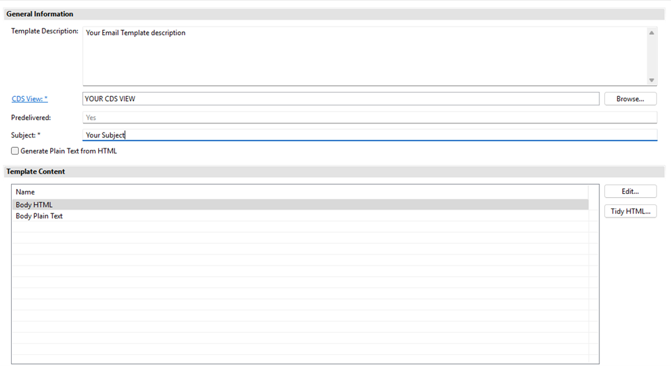
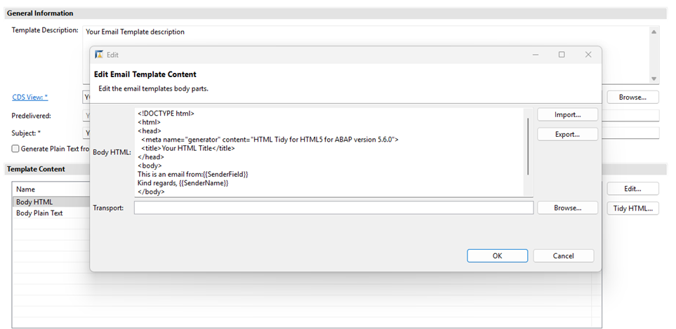
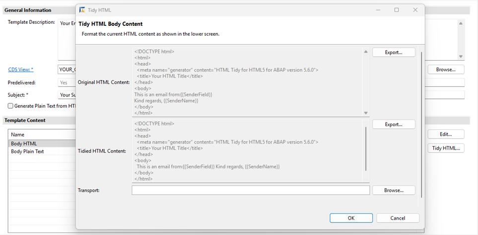

<!-- loio659df8de83524516bbbd5a2a326e1028 -->

# Email Templates Editor

You would use this to standardize and automate email generation by creating reusable templates in ADT that automatically populate placeholders with data from CDS views, eliminating manual email composition and ensuring consistency.

You can create pre-delivered email templates for use with the email API `CL_BCS_MAIL_MESSAGE` or in the Fiori app *Maintain Email Templates*.

Use the email template renderer to use the created templates for sending emails. The rendering API will select the data from the corresponding CDS view with the provided key and insert these values into the placeholders used in the template.

Create new email templates using the editor in the ABAP Development Tools \(ADT\), as shown in the screenshot below.

Each template needs a CDS view to supply data for the placeholders in the emails. The email template also needs a subject and can include a description to clarify its intended use. The CDS view serves as the data source for any email rendered from the email template. Implementation checks ensure that the email template and its CDS view meet the requirements for use.

**Implementation checks**

The CDS view must meet the following criteria:

-   It should either be released for use in cloud development or be in the same package as the calling API.
-   The CDS view must be supported and created for use in an email template. You can indicate this by adding the supported capabilities or modeling pattern annotation *OUTPUT\_EMAIL\_DATA\_PROVIDER* to the CDS view. For more details, see the section on [Supported Capabilities for CDS Views](https://help.sap.com/docs/SAP_S4HANA_ON-PREMISE/ee6ff9b281d8448f96b4fe6c89f2bdc8/6a6ff32b25dd473080e6aeddbefecfca.html?locale=en-US).

The email template must be in an active state, meaning it shouldn't be inactive, deprecated or obsolete.

**Email Template Content**

You can maintain the content of an email template using the *Edit* action for both Body HTML and Body Plain Text. This action also lets you import or export the text fields. You must add any changes to the content to a transport request. If the email template is already assigned to a transport request, the *Transport* field is filled and can't be changed. If the *Transport* field is empty, you can choose a transport or use an automatically generated transport.

**Tidy the HTML Content**

To tidy up HTML content, use the *Tidy HTML* action button. This action provides a view of both the current HTML content and a tidied version. To keep the tidied version, click the *OK* button. If the *Transport* field is empty, choose a transport or use an automatically generated one.

**Translations of template texts**

Translations for each email template can be created in the Fiori app [Maintain Translations](https://help.sap.com/docs/SAP_S4HANA_CLOUD/0f69f8fb28ac4bf48d2b57b9637e81fa/ffe289f7ac7948c4aa87e3e1c536aa48.html?locale=en-US&version=2602.500). The ADT editor will only show the email template in the original object language.

