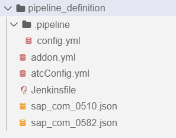

<!-- loio72b0b1130ee243179b0905ea2cd5adb1 -->

# Enabling SaaS Applications for Customers

You can provide an application to multiple customers as a SaaS solution in the ABAP environment. This process comprises the following steps: the build of an add-on version, its deployment, its ordering and provisioning with a multitenant application, and a possible updating process. The following concrete example guides you step by step through this process.

 <a name="loio73ebc486aa7f46eb9783799c924b7556"/>

<!-- loio73ebc486aa7f46eb9783799c924b7556 -->

## Build

Build a first version of your add-on. See [Build](develop-test-build-3bf575a.md#loio25049720bde447e395b3df0bc05e5a50).


<a name="loio73ebc486aa7f46eb9783799c924b7556__section_ykk_bjt_hrb"/>

## Prerequisites

-   You've set up a global ccount for development with the following subaccounts:

    -   *01 Develop* for development
    -   *02 Test* for testing
    -   *03 Build/Assemble* \(for example with the Cloud Foundry organization name *saas-build-assemble* and a development space with the name *Build/Assemble*\) for assembling the add-on product
    -   *04 Build/Test* \(for example with the Cloud Foundry organization name *saas-build-test* and a development space with the name *Build/Test*\) for installing and testing the add-on
    -    *05 Provide* \(for example with Region *cf-eu10*\) for providing the add-on to customers
    -   *06 Consume* \(for example with the subdomain *my-consumer-subdomain*\) to access the solution as a customer

    See [Set Up a Global Account for Development](develop-test-build-3bf575a.md#loio9f2150f2b15e414aacd46c1723ce48fb).

-   You've purchased entitlements that are necessary for the account setup. See [Prepare](develop-test-build-3bf575a.md#loio4338854e3133407abb47d3a281dbd1e1).
-   You've registered a namespace at SAP, for example /NAMESPC/. See [Register a Namespace](develop-test-build-3bf575a.md#loiocc5a3c6f78cf4889960c314dd09a5060).
-   You've registered your add-on at SAP, for example /NAMESPC/PRODUCTX. See [Build](https://help.sap.com/viewer/65de2977205c403bbc107264b8eccf4b/Cloud/en-US/3bf575a3dc5043f895f8bd411d2a86a1.html#loio25049720bde447e395b3df0bc05e5a50).
-   You've set up Jenkins build pipeline and have ensured that an external Git repository is available for the pipeline definition. See [ABAP Environment Pipeline](https://help.sap.com/viewer/65de2977205c403bbc107264b8eccf4b/Cloud/en-US/9482e7eef4634cb993a4ae296b2029fa.html#loio2398b874f7c5445db188b780ff0cef89).
    -   You've created a technical communication user, for example with the credentials ID `TechUserAAKaaS`.
    -   You've created a technical platform user as a space member in Cloud Foundry , for example with the credentials ID `CFPlatform`.

-   You've developed your software component /NAMESPC/COMPONENT1 in the development system DEV of your *01 Develop* subaccount.
    -   For more information on software components, see [Manage Software Components](../50-administration-and-ops/manage-software-components-3dcf76a.md).
    -   For more information on the ABAP RESTful Application Programming Model, see [ABAP RESTful Application Programming Model](abap-restful-application-programming-model-33a301e.md) or [Develop a Fiori App Using the ABAP RESTful Programming Model \(Managed Scenario\)](https://developers.sap.com/group.abap-env-restful-managed.html).
    -   For more information on how to develop a user interface for the application, see [Develop an SAP Fiori Application UI and Deploy it to ABAP Using SAP Business Application Studio](develop-an-sap-fiori-application-ui-and-deploy-it-to-abap-using-sap-business-application-eaaeba4.md).


-   You've subscribed to SAP Business Application Studio in your *01 Develop* subaccount.

-   You've tested the application in your software component in test system TST of your *02 Test* subaccount. See [Test](https://help.sap.com/viewer/65de2977205c403bbc107264b8eccf4b/Cloud/en-US/3bf575a3dc5043f895f8bd411d2a86a1.html#loio023cf9d301b1479484e70b17cd5cf587).


1.  To capture the current state of your software component, create a branch in development system DEV of your *01 Develop* subaccount. See [How to Work with Branches](../50-administration-and-ops/how-to-work-with-branches-6b2f0bf.md)

    > ### Recommendation:  
    > We recommend naming this first branch v1.0.0 and to create a new branch when updating the application with a support package \(v1.1.0\) or a new release \(v2.0.0\).

2.  Configure the Jenkins pipeline in your pipeline Git repository by creating the following files:

    -   Create a folder `.pipeline` with the following `config.yml` file:

        ```
        general:
          abapAddonAssemblyKitCredentialsId: 'TechUserAAKaaS'
          addonDescriptorFileName: 'addon.yml'
          cfApiEndpoint: 'https://api.cf.sap.hana.ondemand.com'
          cfCredentialsId: 'CFPlatform'
          cfOrg : 'saas-build-assemble'
          cfSpace: 'Build/Assemble'
          cfServiceInstance: 'BLD_BONUS'
        stages:
        Prepare System:
          abapSystemAdminEmail: 'administrator@example.com'
          abapSystemID: 'BLD'
        Clone Repositories:
          repositories: 'addon.yml'
          strategy: 'Clone'
        ATC:
          atcConfig: 'atcConfig.yml'
        Build:
        
          active: true
        
        Integration Tests:
          cfOrg: 'saas-build-test'
          cfSpace: 'Build/Test'
          cfServiceInstance: 'ATI_BONUS'
          abapSystemAdminEmail: 'administrator@example.com'
          abapSystemID: 'ATI'
        Publish:
          active: true
        Post:
          confirmDeletion: true
        ```


    Section general:

    -   Imperatively adapt the following parameters:

        -   For **abapAddonAssemblyKitCredentialsId**, enter the credentials ID of your technical communication user.

        -   For **cfCredentialsId**, enter the credentials ID of your technical platform user in Cloud Foundry.

            > ### Note:  
            > You find the credentials ID of your technical communication user and your technical platform user in your Jenkins pipeline repository under *Manage Jenkins* \> *Manage Credentials*.

        -   For **cfApiEndpoint**, enter the link to your Cloud Foundry API Endpoint.

        -   For **cfOrg**, enter the Cloud Foundry organization name.

        -   For **cfSpace**, enter the name of the development space you want to use.

            > ### Note:  
            > You find the API Endpoint, the Cloud Foundry organization name displayed as Org Name, and the name of your development space in your *03 Build/Assemble* subaccount under *Overview*.


    Section stages:

    -   Imperatively adapt the following parameters:

        -   For **abapSystemAdminEmail**, enter the e-mail address of your administrator.

        -   For **cfOrg**, enter the Cloud Foundry organization name.

        -   For **cfSpace**, enter the name of the development space you want to use.

            > ### Note:  
            > You find the Cloud Foundry organization name displayed as Org Name and the name of your development space in your *04 Build/Test* subaccount under *Overview*.


    Keep all other parameters as set in the example.

    -   Create the following `addon.yml` file:

        ```
        addonProduct: "/NAMESPC/PRODUCTX"
        addonVersion: "1.0.0"
        repositories:
           - name: "/NAMESPC/COMPONENT1"
             branch: "v1.0.0"
             version: "1.0.0"
             commitID: "abcd1234"
        ```

        -   For **addonProduct**, enter the reserved development namespace /NAMESPC/ and your product name PRODUCTX.

        -   For the name of the repository, enter the name of the respective software component /NAMESPC/COMPONENT1.

        -   Enter the required commitID of the software component state that shall be used.

            > ### Note:  
            > You find the latest **commitID** in development system DEV of your *01 Develop* subaccount in the *Manage Software Components* app. To view a history of all commits and their IDs, click the required branch.


    -   Create the following `atcConfig.yml` file in the root folder:

        ```
        checkvariant: ABAP_CLOUD_DEVELOPMENT_DEFAULT
        atcobjects:
          softwarecomponent:
            - name: "/NAMESPC/COMPONENT1"
        ```

    -   Create the following `Jenkinsfile` file in the root folder:

        ```
        @Library('piper-lib-os') _
        
        abapEnvironmentPipeline script: this
        
        ```


    The final structure should look like this:

      

3.  Start the build pipeline.
4.  Once the build was successful, publish your initial add-on version: hover over the *Publish* stage in your pipeline and click *confirm*.

 <a name="loio7e91d5f55e5e4a6aa723b8282ad804fe"/>

<!-- loio7e91d5f55e5e4a6aa723b8282ad804fe -->

## Deploy

To provision multitenant-enabled systems in the ABAP environment, a multitenant application is implemented as multitarget application and deployed to Cloud Foundry.


1.  To prepare the creation of your multitenant application, navigate to your dev space in SAP Business Application Studio. Select *Start from Template* \> *Basic Multitarget Application*.

    -   In the automatically created descriptor file `mta.yaml`, enter the following content:

        ```
        _schema-version: "3.1"
        ID: product1-saas-solution
        version: 1.0.0
        
        parameters:
          app-domain: ${default-domain}
          route-prefix: -${appname}
          appname: 
          addon-product-name:
          provider-admin-email: 
          saas-display-name: 
          saas-description: 
          tenant-mode: 
          enable-parallel-deployments: true
        
        modules:
          - name: approuter
            type: javascript.nodejs
            path: approuter
            parameters:
              keep-existing-routes: true
              routes:
                - route: cis${route-prefix}.${app-domain}
              app-name: ${appname}
              memory: 1024MB
            properties:
              TENANT_HOST_PATTERN: (.*)${route-prefix}.${app-domain}
              XS_APP_LOG_LEVEL: error
              SAP_JWT_TRUST_ACL:
                - clientid: "*"
                  identityzone: sap-provisioning
            requires:
              - name: xsuaa
              - name: saas-registry
              - name: abap-solution
              - name: application-log
        
        resources:
          - name: xsuaa
            type: com.sap.xs.uaa
            requires:
              - name: abap-solution
            parameters:
              service-plan: application
              service-name: xsuaa
              config:
                xsappname: ${appname}
                tenant-mode: shared
                scopes:
                  - name: $XSAPPNAME.Callback
                    description: With this scope set, the callbacks for tenant onboarding, offboarding and getDependencies can be called.
                    grant-as-authority-to-apps:
                      - $XSAPPNAME(application,sap-provisioning,tenant-onboarding)
                foreign-scope-references:
                  - uaa.user
                role-collections:
                  - name: ${appname}-admin
                    role-template-references:
                      - $XSSERVICENAME(abap-solution).SolutionAdmin
        
          - name: saas-registry
            type: org.cloudfoundry.managed-service
            parameters:
              service: saas-registry
              service-plan: application 
              service-name: saas-registry
              config:
                xsappname: ${appname}
                appName: ${appname}
                appUrls:
                  getDependencies: https://cis${route-prefix}.${app-domain}/callback/v1.0/dependencies
                  onSubscription: https://cis${route-prefix}.${app-domain}/callback/v1.0/tenants/{tenantId}
                displayName: ${saas-display-name}
                description: ${saas-description}
        
          - name: abap-solution
            type: org.cloudfoundry.managed-service
            parameters: 
              service: abap-solution
              service-plan: standard
              service-name: abap-solution
              config:
                name: ${appname}
                addon_product_name: ${addon-product-name}
                size_of_runtime: 1
                size_of_persistence: 4
                tenant_mode: ${tenant-mode}
                consumer_id_pattern: ([^-]*).*
                provider_admin_email: ${provider-admin-email}
                usage: prod
                xs-security:
                  xsappname: ${appname}
        
          - name: application-log
            type: org.cloudfoundry.managed-service
            parameters:
              service: application-logs
              service-plan: lite
              service-name: application-log
        
        ```

    -   To define the open parameters of the `mta.yaml` file, create a new folder `extensions` that contains the following `dev.mtaext` file:

        ```
        ID: product1-saas-solution-dev
        _schema-version: "3.1"
        extends: product1-saas-solution
        
        modules:  
          - name: approuter
            properties: 
              XS_APP_LOG_LEVEL: debug
        
        parameters:
          appname: product1-saas-solution-dev
          addon-product-name: /NAMESPC/PRODUCTX
          provider-admin-email: administrator@example.com
          saas-display-name: "SaaS Solution (Multitenancy)"
          saas-description: "ABAP based SaaS solution with an ABAP tenant per subscription"
          tenant-mode: multi
        
        ```

        -   The **appname** is a technical name that defines the SaaS solution, and is displayed, for example, as a prefix in the title of your service instances of your *05 Provide* subaccount in the global account for development.

            > ### Note:  
            > You can only use ASCII letters and digits. Do not use a hyphen in the beginning or end of the appname.

        -   For **addon-product-name**, enter the registered name of the addon product.

            > ### Note:  
            > This must be the same name as defined in the `addon.yml` file in step 1b.

        -   For **provider-admin-email**, enter the e-mail address of the initial provider user.
        -   The **saas-display-name** defines the name of the tile in the cloud.
        -   The **saas-description** is displayed as a short description of the application in the cloud.

        -   The **tenant-mode** defines the tenant mode \(multi or single\).

        > ### Note:  
        > Once you switch the approuter to the production phase, create and use a new extension file \(see [Production Descriptor](production-descriptor-38ff6d0.md).\)

    -   Create a folder `approuter` with the following files \(see also [Develop the Approuter Application](develop-the-approuter-application-44dbd0a.md)\):

        -   a `package.json` file with the following content:

            ```
            {
              "name": "saas-ar",
              "version": "1.0.0",
              "description": "This component provides dependency management for ABAP based SaaS Solutions",
              "dependencies": {
                "@sap/approuter": "^8.3.1",
                "@sap/asp-middleware": "^1.0.6",
                "@sap/xsenv": "^3.0.0"
              },
              "scripts": {
                "start": "node --inspect start.js"
              }
            }
            ```

        -   a `start.js file` with the following content:

            ```
            const approuter = require('@sap/approuter');
            const ar = approuter();
            
            ar.start({
                extensions: [
                    require('@sap/asp-middleware')
                ]
            });
            
            ```

        -   an `xs-app.json` file with the following content:

            ```
            {
            	"authenticationMethod": "route",
            	"welcomeFile": "/ui",
            	"logout": {
            		"logoutEndpoint": "/sap/public/bc/icf/logoff",
                		"logoutPage": "/ui"
            	},
              	"routes": [
            		{
            			"source": "^/sap/(.*)$",
            			"target": "/sap/$1",
            			"authenticationType": "xsuaa",
            			"service": "com.sap.cloud.abap.solution",
            			"csrfProtection": false
            		},
            		{
            			"source": "^/ui(.*)$",
            			"target": "/ui$1",
            			"authenticationType": "xsuaa",
            			"service": "com.sap.cloud.abap.solution",
            			"csrfProtection": false
            		}
            	]
            }
            ```


    The final structure looks like this:

      

    > ### Note:  
    > Depending on the setup of your development environment, you need to run command `npm install` within the approuter folder to install the dependencies in the local `node_modules` folder.

2.  To build the multitarget application, right-click the folder `mta.yaml` and select *Build MTA Project*.
3.  To deploy the multitarget application with extensions to the *05 Provide* subaccount in your global account for development, open a new terminal for the project, and enter:

    ```
    cf deploy mta_archives/product1-saas-solution_1.0.0.mtar -e extensions/dev.mtaext
    ```


> ### Note:  
> During the MTA build, an MTA archive file is automatically created with the MTA ID acting as the file name. For example, `product1-saas-solution_1.0.0.mtar` is created for MTA ID `product1-saas-solution`.

 <a name="loio1d90459d98ca4ba0bc8857c24e328c03"/>

<!-- loio1d90459d98ca4ba0bc8857c24e328c03 -->

## Order and Provide

Order and provide your solution. See [Order and Provide](order-and-provide-975bd3e.md#loio975bd3e54cbe4e52af346740658d1a4a).


<a name="loio1d90459d98ca4ba0bc8857c24e328c03__section_i4v_pzl_4rb"/>

## Prerequisites

-   You've assigned a technical Cloud Foundry platform user as space developer in the *Provide* space of the *05 Provide* subaccount in the global account for development. See [Creating New Space Members and Assigning Space Developer Roles to Them](../20-getting-started/creating-new-space-members-and-assigning-space-developer-roles-to-them-967fc4e.md).
-   You've configured an ASP\_CC destination for cloud controller access in the *05 Provide* subaccount in the global account for development based on the credentials of the technical Cloud Foundry platform user. See [Create a Destination for the Cloud Foundry Cloud Controller Access](create-a-destination-for-the-cloud-foundry-cloud-controller-access-35b5acb.md).


1.  To define a new route to the solution, open your *05 Provide* subaccount in the global account for development and navigate to *Cloud Foundry* \> *Spaces*. Select your space and navigate to *Routes*. Select *New Route* and enter the following information in the dialogue:

    For *Domain*, enter the appropriate domain by changing the default domain ***cfapps.<region\>.hana.ondemand.com*** according to the region of your *05 Provide* subaccount in the global account for development.

    For *Hostname*, enter the subdomain as displayed in your *06 Consume* subaccount under *Overview* and the appname as defined in your `dev.mtaext` file.

    ```
    Domain: cfapps.eu10.hana.ondemand.com
    Hostname: my-consumer-subdomain-product1-saas-solution-dev
    ```

    > ### Note:  
    > For a consumer to be able to access the SaaS solution after subscription, a consumer-specific route pointing to the approuter application needs to be created. See [Create Routes](https://help.sap.com/viewer/65de2977205c403bbc107264b8eccf4b/Cloud/en-US/9fddeea396b34b528bc8d286f3d5d9cf.html).
    > 
    > This route needs to match the property `TENANT_HOST_PATTERN` defined in the `mta.yaml` file.
    > 
    > **`TENANT_HOST_PATTERN: (.*)${route-prefix}.${app-domain}`**
    > 
    > The pattern includes a placeholder for the subdomain of a consumer subaccount and a route prefix. The route prefix consists of a separator ***-***, and the defined appname.
    > 
    > The subdomain can only contain letters, digits, and hyphens, see [Create Subaccount](https://help.sap.com/viewer/65de2977205c403bbc107264b8eccf4b/Cloud/en-US/05280a123d3044ae97457a25b3013918.html).
    > 
    > When you create the route, you have to provide a hostname and domain.
    > 
    > The hostname can include no more than 63 characters.
    > 
    > In this example, the consumer subaccount is created with subdomain ***my-consumer-subdomain***. The defined appname is ***product1-saas-solution-dev***, resulting in the hostname ***my-consumer-subdomain-product1-saas-solution-dev*** of the route. The domain `cfapps.eu10.hana.ondemand.com` is set as parameter `app-domain` in the `mta.yaml` file.
    > 
    > Once you switch to the production phase of the approuter configuration and define a route with wildcard hostname. this sub-step is no longer required . See [Configure the Approuter Application](configure-the-approuter-application-3725815.md).

2.  Assign the route to the deployed approuter application.
3.  Subscribe to the solution: Navigate to *Service Marketplace* in your *06 Consume* subaccount and search for your service. Click *create* \> *Create*.
4.  To enable the creation of the initial administrator user in the consumer tenant, in the *06 Consume* subaccount under *Security* \> *Role Collections*, assign the role colletion <app name\>-admin with the role `SolutionAdmin` to your user.
5.  Open the application URL provided by the subscription with the user that shall be onboarded as initial administrator user. This is the same user that was assigned to the `<app name>-admin` role collection.

    After triggering initial user onboarding, you are redirected to the SAP Fiori launchpad of the SaaS solution.


 <a name="loio874dd6060ac64c56a1741d3b6401cf1e"/>

<!-- loio874dd6060ac64c56a1741d3b6401cf1e -->

## Maintain

**Maintain your solution**. See [Create Add-On Update](maintain-9721f0f.md#loioa35582346bff4914a5b4b0bcb776668c).

> ### Note:  
> You can update your solution with patches, support packages, or new releases. Create a new branch from the main branch in test system TST in your *01 Develop* subaccount for every support package or new release. For minor changes, continue developing in the respective active branch.
> 
> The following example shows how to update your solution with a support package.


<a name="loio874dd6060ac64c56a1741d3b6401cf1e__section_gps_fzl_4rb"/>

## Prerequisites

-   You've assigned the `LandscapePortalAdminRoleCollection` in your *05 Provide* subaccount in the global account for development. See [Access to Landscape Portal](order-and-provide-975bd3e.md#loio195a685a71f84953813e7b3bd255e849).
-   You’ve set up the maintenance system landscape. See [Set Up Maintenance System Landscape](maintain-9721f0f.md#loio44035458f01e4142a18d44f9c0301e62).


**Create new patch version**

Patch versions are used to deliver unplanned and urgent corrections that are required to keep the application up and running.

1.  Import maintenance branch v1.0.0 in ABAP correction system COR.
2.  Implement the bug fix in the ABAP correction system.
3.  Import maintenance branch v1.0.0 in ABAP quality assurance system QAS.
4.  Test the bugfix in ABAP quality assurance system QAS.
5.  Maintain the corrections that have been developed and tested in ABAP correction system COR and quality assurance system QAS in the development system DEV \(so called double-maintenance\). See [Double Maintenance of Corrections into Development](double-maintenance-of-corrections-into-development-1241b14.md).
6.  Configure the `addon.yml` file.

    ```
    addonProduct: "/NAMESPC/PRODUCTX"
    addonVersion: "1.0.1"
    repositories:
       - name: "/NAMESPC/COMPONENT1"
         branch: "v1.0.0"
         version: "1.0.1"
         commitID: "abcd1234"
    
    ```

7.  Select *Commit Changes* and start the build pipeline.
8.  To provide the new version 1.0.1 to customers, open the *Landscape Portal* in your *05 Provide* subaccount in the global account for development. Select the desired system and choose *Add-On Update*.


**Create new support package version**

Support package versions are used to deliver planned functional enhancements outside of new major releases. They are often used to bundle multiple patch versions to a hotfix collection.

1.  Implement the new feature in the main branch in ABAP development system DEV.
2.  Import the main branch into ABAP test system TST.
3.  Test new feature in ABAP test system TST.
4.   *In the Manage Software Components* app, create a new maintenance branch v1.1.0 that is based on the main branch.
5.  Configure the `addon.yml` file.

    ```
    addonProduct: "/NAMESPC/PRODUCTX"
    addonVersion: "1.1.0"
    repositories:
       - name: "/NAMESPC/COMPONENT1"
         branch: "v1.1.0"
         version: "1.1.0"
         commitID: "abcd1234"
    
    ```

6.  Select *Commit Changes* and start the build pipeline.
7.  To provide the new version 1.1.0 to customers, open the *Landscape Portal* in your *05 Provide* subaccount in the global account for development. Select the desired system and choose *Add-On Update*.


**Create new release version**

Release versions are used to deliver new major, planned functional enhancements. Typically, they include multiple new implemented features. For example, multiple new apps could be introduced with such a major release.

1.  Implement the new feature in the main branch in ABAP development system DEV.
2.  Import the main branch into ABAP test system TST.
3.  Test new feature in ABAP test system TST.
4.   *In the Manage Software Components* app, create a new maintenance branch v2.0.0 that is based on the main branch.
5.  Configure the `addon.yml` file.

    ```
    addonProduct: "/NAMESPC/PRODUCTX"
    addonVersion: "2.0.0"
    repositories:
       - name: "/NAMESPC/COMPONENT1"
         branch: "v2.0.0"
         version: "2.0.0"
         commitID: "abcd1234"
    
    ```

6.  Select *Commit Changes* and start the build pipeline.
7.  To provide the new version 2.0.0 to customers, open the *Landscape Portal* in your *05 Provide* subaccount in the global account for development. Select the desired system and choose *Add-On Update*.

**Related Information**  


[Developing and Operating SaaS Applications](developing-and-operating-saas-applications-e3c38eb.md "Learn how to develop and operate SaaS applications by using add-ons in the ABAP environment.")

[Overview](overview-9640543.md "")

