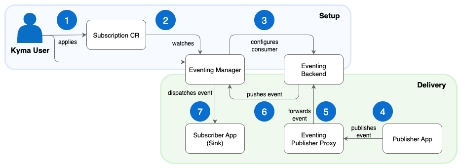

<!-- loio07b2d1db518b441780d1ea981eb77bb9 -->

# Eventing Module

Use the Eventing module to set up event-driven communication between applications in your Kyma cluster using a publish-subscribe model.

## What is Eventing?

The Eventing module enables event-driven communication between applications in your Kyma cluster. One application publishes an event \(the publisher\), and other applications \(subscribers\) subscribe to receive it.

This decouples your services, as publishers and subscribers don't need to know about each other. They can communicate asynchronously and evolve independently.

## Features

The Eventing module provides the following features:

-   Publish-subscribe \(pub/sub\) messaging: Decouples applications so you can build resilient and scalable event-driven systems.
-   Flexible backend support: Use the in-cluster NATS backend \(see [NATS Module](nats-module-2c504f5.md)\) or configure SAP Event Mesh \(see [SAP Event Mesh](https://help.sap.com/docs/SAP_EM/bf82e6b26456494cbdd197057c09979f/df532e8735eb4322b00bfc7e42f84e8d.html?version=LATEST&locale=en-US)\) for enterprise messaging.
-   Standardized event format: All events follow the [CloudEvents](https://cloudevents.io/) specification, ensuring a consistent and portable format.
-   Automatic legacy event conversion: Converts older, non-standard Kyma event formats into valid CloudEvents automatically. For details, see [Event Name Cleanup](event-naming-and-cleanup-97f5d77.md#loio97f5d77d27af4f5a91c98a5502975de6__section_event_name_cleanup).
-   At-least-once delivery: Ensures that each event is delivered at least one time when you use the NATS backend, preventing message loss during temporary failures.
-   Declarative subscriptions: Manage event subscriptions with a simple [Subscription](https://kyma-project.io/#/eventing-manager/user/resources/subscription-cr) custom resource \(CR\).
-   Built-in observability: Exposes key health and performance metrics in Prometheus format \(see [Eventing Metrics](https://kyma-project.io/#/eventing-manager/user/evnt-eventing-metrics)\). Use the Telemetry module to collect, process, and forward these metrics to your observability backend.

## Scope

The Eventing module focuses on in-cluster, asynchronous communication using the CloudEvents standard. It uses only one stream, with `file` storage, for all the events.

For cross-cluster or hybrid scenarios, configure SAP Event Mesh as the backend.

## Architecture

The Eventing module uses the Eventing Manager, a [Kubernetes operator](https://kubernetes.io/docs/concepts/extend-kubernetes/operator/), to manage the components that process and deliver events within your cluster.

The architecture involves the following flows:

-   Subscription: The Eventing Manager watches for Subscription custom resources and configures the eventing infrastructure.
-   Delivery: The Eventing Publisher Proxy receives events, and the configured backend \(NATS or SAP Event Mesh\) delivers them.

1.  You create a Subscription CR. In the resource manifest, you specify the type of event you want to receive and the sink where to send it.
2.  The Eventing Manager, continuously watching for Subscription resources, detects your Subscription CR.
3.  Based on the backend configured in the Eventing CR, the Eventing Manager connects to the backend \(NATS or SAP Event Mesh\) and creates a subscription mechanism \(a consumer or webhook\).
4.  A publisher app sends an event to the Eventing Publisher Proxy.
5.  The Eventing Publisher Proxy forwards the event in CloudEvents format to your eventing backend.
6.  The eventing backend processes the event and pushes it to the Eventing Manager.
7.  The Eventing Manager receives the event, looks up the sink from the Subscription CR, and sends the event to your subscriber app. Your application can now process the event payload.

### Eventing Manager

The Eventing Manager is the module's controller. It watches for Subscription custom resources and configures the underlying eventing infrastructure.

When you create or update a Subscription, the Eventing Manager performs the following tasks:

-   Configures the selected eventing backend to manage event streams and consumers for subscriptions.
-   Ensures that events are routed from the correct publisher to the specified subscriber \(the sink\).
-   Creates and manages Kubernetes resources, such as `ConfigMap`, `Services`, and `DestinationRules`, adapting them to the desired state.

### Eventing Publisher Proxy

The [Eventing Publisher Proxy](https://github.com/kyma-project/eventing-publisher-proxy) provides a single, stable endpoint for your applications to publish events using a standard HTTP POST request \(endpoint: `/publish` for CloudEvents and `<application_name>/v1/events` for legacy events\). This simplifies integration, as you can use common tools like curl or any standard HTTP client.

The proxy performs the following tasks:

-   Receives inbound events from your applications.
-   Converts events from legacy formats into the standard CloudEvents format.
-   Forwards validated CloudEvents to the configured eventing backend for delivery.

## API/Custom Resource Definitions

You configure the Eventing module by creating and applying Kubernetes Custom Resource Definitions \(CRD\), which extend the Kubernetes API with custom additions:

-   To understand and configure the module's global settings, see the [Eventing CRD](https://kyma-project.io/#/eventing-manager/user/resources/eventing-cr).
-   To create a subscriber, define a [Subscription CRD](https://kyma-project.io/#/eventing-manager/user/resources/subscription-cr). You cannot delete the Eventing module as long as Subscription CRs exist.

## Resource Consumption

To learn more about the resources used by the Eventing module, see [Kyma Modules' Sizing](../50-administration-and-ops/kyma-modules-sizing-3a92490.md).

