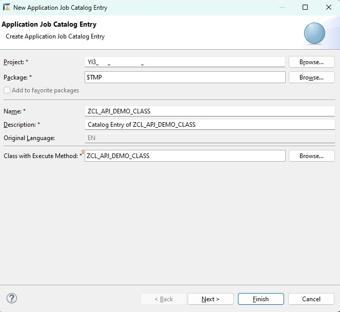
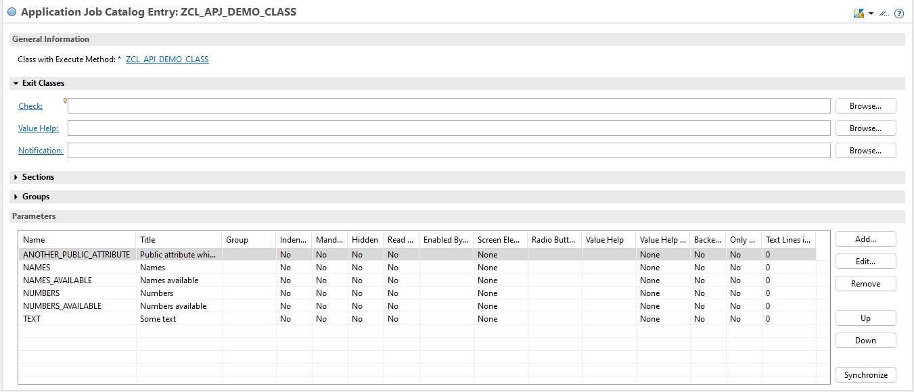
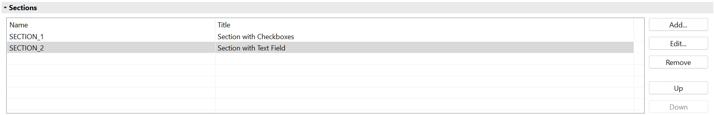
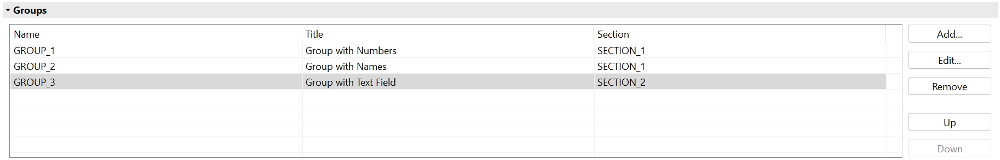
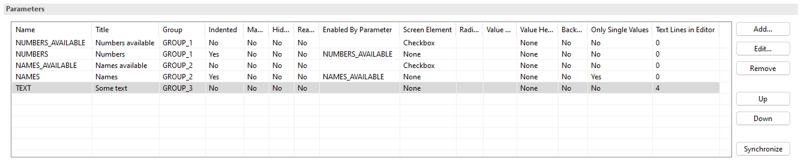
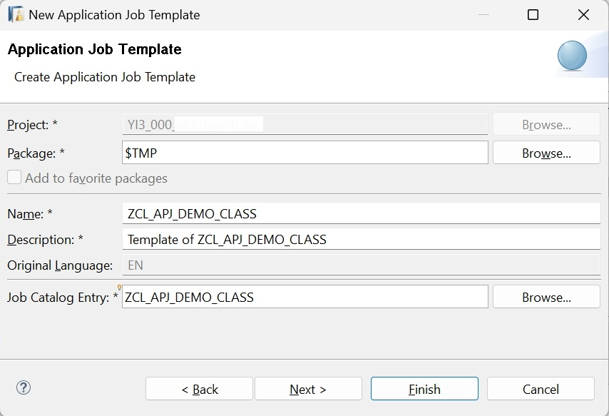
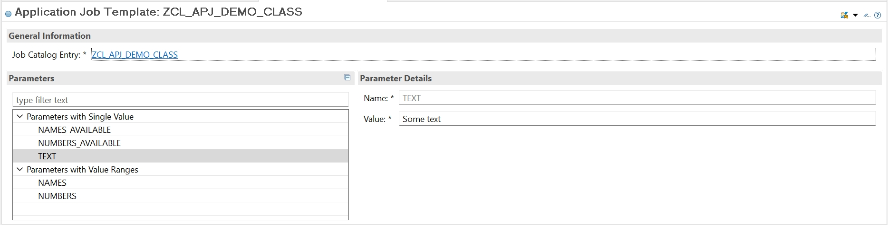
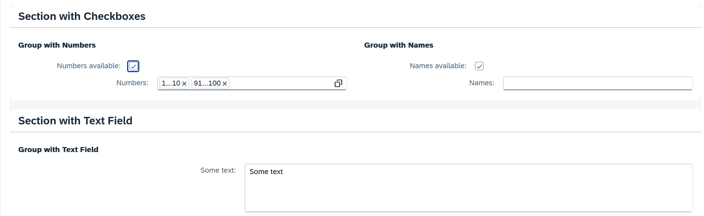

<!-- loio3198dd068cde4b7596cce4c5f181f195 -->

# Example Implementation Using Interface IF\_APJ\_RT\_RUN

This example demonstrates the implementation of the concept of application jobs based on a class with interface `IF_APJ_RT_RUN`.

To implement the business logic, the ABAP class will contain the following attributes that will also be visible on the selection screen when the application job is scheduled:

-   The attribute `NUMBERS` which may contain value ranges

-   The attribute `NAMES` which may contain multiple single values

-   The attribute `TEXT` which may contain a single value only

-   The boolean attributes `NUMBERS_AVAILABLE` and `NAMES_AVAILABLE`. The attribute `NUMBERS` will only be used if `NUMBERS_AVAILABLE` is set, while the attribute `NAMES` will only be used if `NAMES_AVAILABLE` is set.

-   In addition, the class will contain the attribute `ANOTHER_PUBLIC_ATTRIBUTE` which will not be visible on the selection screen and is not filled by the application job framework


To implement these requirements, the ABAP class is created with the following definition part:

> ### Sample Code:  
> ```abap
> CLASS zcl_apj_demo_class DEFINITION PUBLIC FINAL CREATE PUBLIC .
> 
>   PUBLIC SECTION.
>     INTERFACES if_apj_rt_run.
>     INTERFACES if_apj_dt_defaults.
> 
>     TYPES:
>       BEGIN OF ty_name_range,
>         sign   TYPE c LENGTH 1,
>         option TYPE c LENGTH 2,
>         low    TYPE c LENGTH 50,
>         high   TYPE c LENGTH 50,
>       END OF ty_name_range.
>     TYPES: ty_name_ranges TYPE STANDARD TABLE OF ty_name_range WITH EMPTY KEY.
> 
>     "! <p class="shorttext synchronized" lang="en">Numbers available</p>
>     DATA numbers_available TYPE abap_bool VALUE abap_true.
>     "! <p class="shorttext synchronized" lang="en">Numbers</p>
>     DATA numbers TYPE RANGE OF i.
>     "! <p class="shorttext synchronized" lang="en">Names available</p>
>     DATA names_available TYPE abap_bool VALUE abap_true.
>     "! <p class="shorttext synchronized" lang="en">Names</p>
>     DATA names TYPE ty_name_ranges.
>     "! <p class="shorttext synchronized" lang="en">Some text</p>
>     DATA text TYPE c LENGTH 255.
>     "! <p class="shorttext synchronized" lang="en">Public attribute which is not used on the selection screen</p>
>     DATA another_public_attribute TYPE c LENGTH 10.
> ENDCLASS.
> ```

The class definition contains the following parts:

-   The class implements the interface `IF_APJ_RT_RUN`. This is necessary so the class can be used in an application job. In addition, it implements the interface `IF_APJ_DT_DEFAULTS` to set default values of new templates, which is optional

-   It contains the following public attributes:

    -   `NUMBERS` and `NAMES` are defined as ranges tables, because they may contain more than one value on the selection screen. The example implementation shows two possible ways how the ranges tables can be defined in the class

    -   Because field `TEXT` should only contain a single value on the selection screen, it's defined with an elementary datatype in the class

    -   The attributes `NUMBERS_AVAILABLE` and `NAMES_AVAILABLE` are defined as boolean type

    -   Finally, there is attribute `ANOTHER_PUBLIC_ATTRIBUTE` which may have any data type because it will not be visible on the selection screen


-   All attributes have description texts which are defined via ABAP Doc comments


In the implementation part of the class, the method `IF_APJ_RT_RUN~EXECUTE` must be implemented. This method is called by the application job framework when the application job is started. The method should contain the business logic that should be run by the application job.

> ### Sample Code:  
> ```abap
> METHOD if_apj_rt_run~execute.
>     TRY.
>         DATA(l_log) = cl_bali_log=>create_with_header(
>                         header = cl_bali_header_setter=>create( object = 'ZOBJECT'
>                                                                 subobject = 'ZSUBOBJECT' ) ).
> 
>         IF numbers_available = abap_true AND '42' IN numbers.
>           l_log->add_item( item = cl_bali_free_text_setter=>create( severity = if_bali_constants=>c_severity_information
>                                                                     text = '42 is in the number ranges' ) ).
>         ENDIF.
> 
>         IF names_available = abap_true AND names IS NOT INITIAL.
>           l_log->add_item( item = cl_bali_free_text_setter=>create( severity = if_bali_constants=>c_severity_status
>                                                                     text = 'Some names are available' ) ).
>         ENDIF.
> 
>         l_log->add_item( item = cl_bali_free_text_setter=>create( severity = if_bali_constants=>c_severity_status
>                                                                   text = CONV #( text ) ) ).
> 
>         cl_bali_log_db=>get_instance( )->save_log_2nd_db_connection( log = l_log
>                                                                      assign_to_current_appl_job = abap_true ).
>       CATCH cx_bali_runtime INTO DATA(l_runtime_exception).
>         " some error handling
>     ENDTRY.
>   ENDMETHOD.
> ```

In this example, the `EXECUTE` method creates an application log and assigns it to the current application job when the job is run. If the number 42 is in the ranges of field `NUMBERS`, a message is written into the log. Another message is written if field `NAMES` contains any entry. Finally, the content of field `TEXT` is put into the log. Attributes like `NUMBERS`, `NAMES` and `TEXT` can be used without any preparation, because they are automatically filled by the application job framework before the `EXECUTE` method is started.

After the class was implemented, a new catalog entry should be created for this class so that it can be used in an application job. Besides other settings, the catalog entry defines which parameters will be visible on the selection screen \(which is visible when you schedule the job\) and where and how these parameters are displayed.

A new catalog entry can be created in the ABAP development tools for Eclipse. It can be found under *Other ABAP Repository Object → Application Jobs → Application Job Catalog Entry*.



On the first screen, you select the name and a description text of the new application job catalog entry and the name of the class which is run within the job. It's the class which you just defined.

After you have created the application job catalog entry, you can start editing it:



In this demo implementation, the table with the parameters was automatically prefilled with all public attributes of the ABAP class which fulfil the requirements to be used in a catalog entry. The titles of the parameters were automatically filled with the description texts of the class attributes \(which were defined via the ABAP Doc comments in the definition part of the class\).

As a next step, you can change the properties of each parameter and define what the selection screen should look like. In this example, we will meet the following requirements:

-   The parameters `NUMBERS_AVAILABLE` and `NUMBERS` will be grouped. The group will get a header text. `NUMBERS_AVAILABLE` will be a checkbox, and it will only be possible to enter values into `NUMBERS` if `NUMBERS_AVAILABLE` is set.

-   The parameters `NAMES_AVAILABLE` and `NAMES` will be grouped. The group will get a header text. `NAMES_AVAILABLE` will be a checkbox, and it will only be possible to enter values into `NAMES` if `NAMES_AVAILABLE` is set.

-   Both groups will be displayed side by side in the same section of the screen \(`NUMBERS` on the left side and `NAMES` on the right side\). This section will get a header text, too.

-   The parameter `TEXT` will get its own group \(with group header\) which is part of its own section \(with section header\).

-   The parameter `ANOTHER_PUBLIC_ATTRIBUTE` is not relevant here and will not be displayed.


To implement these settings, you first define the sections of the selection screen:



There are two sections carrying the section header texts *Section with Checkboxes* and *Section with Text Field*. Because section `SECTION_1` is above section `SECTION_2` in this table, section `SECTION_1` is displayed above section `SECTION_2` on the selection screen.

Next, you define the groups:



Three groups were defined: The groups with title texts *Group with Numbers* and *Group with Names* were assigned to the first section, while the group with title text *Group with Text Field* was assigned to the second section. Because group `GROUP_1` is above group `GROUP_2` in this table, group `GROUP_1` is on the left side of the selection screen, while group `GROUP_2` is on the right side.

Finally, you can adapt the properties of the parameters according to the requirements:



The following parameter properties were changed in this example:

-   The parameters `NUMBERS_AVAILABLE` and `NUMBERS` were put into the first group of the first section \(`Group = GROUP_1`\). Because parameter `NUMBERS_AVAILABLE` is above parameter `NUMBERS` in this table, it's displayed above parameter `NUMBERS` on the selection screen. Parameter `NUMBERS` is output-indented on the selection screen \(`Indented = Yes`\). In addition, it's only active on the screen if the parameter `NUMBERS_AVAILABLE` is set \( `Enabled By Parameter = NUMBERS_AVAILABLE`\). Parameter `NUMBERS_AVAILABLE` is displayed as checkbox on the selection screen \(`Screen Element = Checkbox`\).

-   The parameters `NAMES_AVAILABLE` and `NAMES` were put into another group \(`Group = GROUP_2`\). The parameter `NAMES` is also output-indented \(`Indented = yes`\). In addition, it's only active on the selection screen if the parameter `NAMES_AVAILABLE` is set \(`Enabled By Parameter = NAMES_AVAILABLE`\). Parameter `NAMES_AVAILABLE` is displayed as checkbox on the selection screen \(`Screen Element = Checkbox`\). Parameter `NAMES` only allows to enter multiple single values, but no value ranges \(`Only Single Values = Yes`\).

-   The parameter `TEXT` is displayed in its own group \(`Group = GROUP_3`\). It's displayed as text editor with four lines \(`Text Lines in Editor = 4`\).

-   The parameter `ANOTHER_PUBLIC_ATTRIBUTE` is not relevant for the selection screen. Therefore, it was removed from the parameter list.


After you finished working on the catalog entry, don't forget to activate it.

After the application job catalog entry has been defined, you need to create an application job template. The template contains the parameter values that are displayed as default values on the selection screen. You can change these values before you schedule an application job. If you create a new template for your ABAP class, you may want that the parameters of the new template are already prefilled with default values. To determine these default values, the application job framework instantiates your class and calls the method `IF_APJ_DT_DEFAULTS~FILL_ATTRIBUTE_DEFAULTS`. It then reads the values of the class attributes and uses them as default values of the template parameters. These default values can either be set via the default values of the class attributes, via the `CONSTRUCTOR` of the class, or, if a more complex coding is required to determine these default values, you can also set them via the method `IF_APJ_DT_DEFAULTS~FILL_ATTRIBUTE_DEFAULTS`:

> ### Sample Code:  
> ```abap
> METHOD if_apj_dt_defaults~fill_attribute_defaults.
> 
>     numbers = VALUE #( ( sign = 'I' option = 'BT' low = '1' high = '10' )
>                        ( sign = 'I' option = 'BT' low = '91' high = '100' ) ).
>     text = 'Some text'.
>   ENDMETHOD.
> ```

Here, the default values of the attributes `NUMBERS` \(which is a ranges table\) and `TEXT` are set.

To create the new application job template, you can use the ABAP development tools for Eclipse. The template can be found under *Other ABAP Repository Object → Application Jobs → Application Job Template*.



On the first screen, you select the name and a description text of the new template and the name of the catalog entry on which the template is based. It's the catalog entry which you just created.



After you've created the application job template, the parameters of the template are prefilled with the values which you set in the ABAP class. In this example, the following parameters got a default value:

-   `NUMBERS_AVAILABLE` and `NAMES_AVAILABLE` are both set to `X` because these default values are set in the definition part of the class.

-   `NUMBERS` is set to the ranges 1 - 10 and 91 - 100 and `TEXT` is set to the text `Some text` because of the implementation of method `FILL_ATTRIBUTE_DEFAULTS`.


Now, you can change the parameter values if you want. After you've finished this, don't forget to activate the template. With the new template, you can start to schedule an application job. If you do this, you get the following selection screen which meets the requirements set before:



