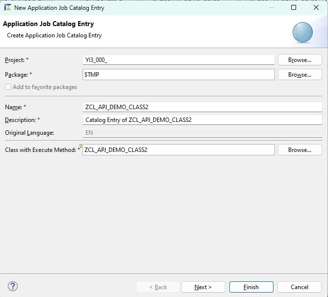
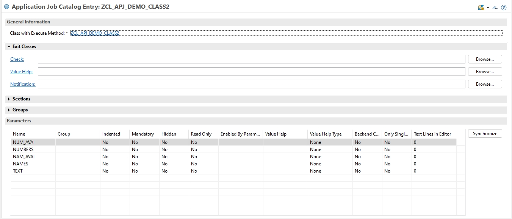
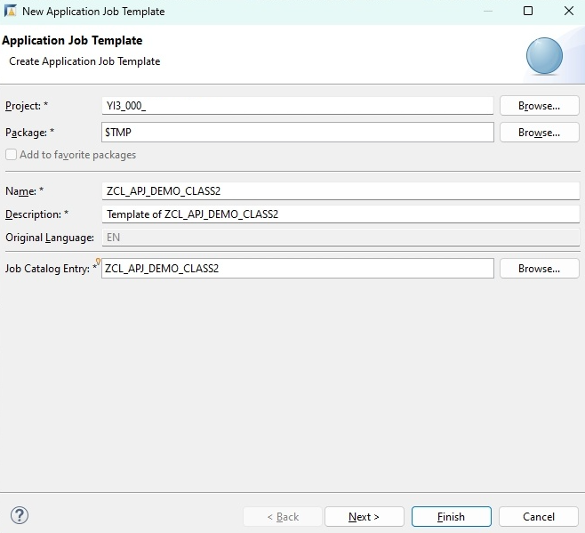
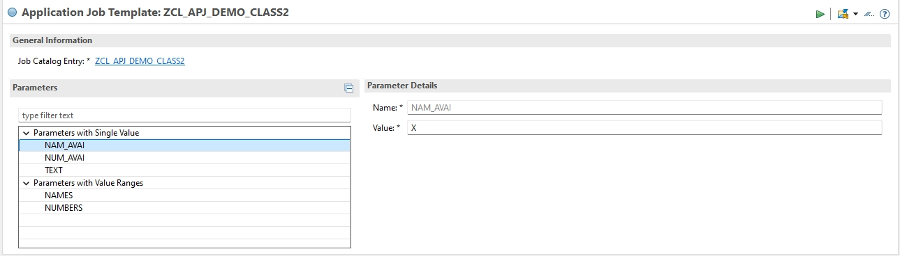
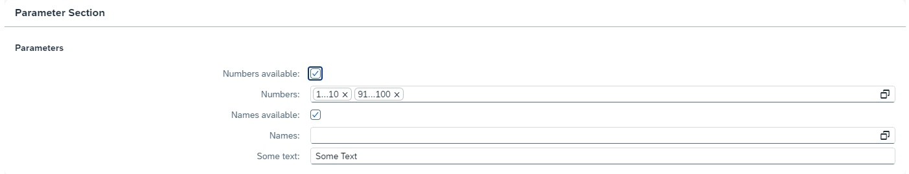

<!-- loio0abb3f205d4645ac82ef03bbf47b3427 -->

# Example Implementation Using Interfaces IF\_APJ\_DT\_EXEC\_OBJECT and IF\_APJ\_RT\_EXEC\_OBJECT

This example demonstrates the implementation of the concept of application jobs based on a class with the legacy interfaces `IF_APJ_DT_EXEC_OBJECT` and `IF_APJ_RT_EXEC_OBJECT`.

> ### Note:  
> Note that these are legacy interfaces. If you use these interfaces, you only have limited options during the editing of the job catalog entry. Don't use these interfaces for new developments, but use the interface `IF_APJ_RT_RUN` instead. For more information, see [Example Implementation Using Interface IF\_APJ\_RT\_RUN](example-implementation-using-interface-if-apj-rt-run-3198dd0.md).

To implement the concept of application jobs, the ABAP class will contain the following attributes that will also be visible on the selection screen when the application job is scheduled:

-   The attributes `NUMBERS` and `NAMES` which may contain value ranges

-   The attribute `TEXT` which may contain a single value only

-   The boolean attributes `NUMBERS_AVAILABLE` and `NAMES_AVAILABLE`. Attribute `NUMBERS` will only be used if `NUMBERS_AVAILABLE` is set, while attribute `NAMES` will only be used if `NAMES_AVAILABLE` is set.

-   The parameter which belongs to `NUMBERS_AVAILABLE` will be a checkbox.

-   The parameter which belongs to `NAMES_AVAILABLE` will be a checkbox.

Only limited options are available when interfaces `IF_APJ_DT_EXEC_OBJECT` and `IF_APJ_RT_EXEC_OBJECT` are used. For example, it is not possible to use the following features:

-   Grouping of parameters on the selection screen, or putting them into sections.

-   Controling the enabled/disabled status of a parameter on the selection screen with another parameter.

-   Restricting a field with value ranges to multiple single value, or setting the size of the text editor.


To implement these requirements, the ABAP class is created with the following definition part:

> ### Sample Code:  
> ```abap
>  CLASS zcl_apj_demo_class2 DEFINITION PUBLIC FINAL CREATE PUBLIC.
> 
>   PUBLIC SECTION.
>     INTERFACES if_apj_rt_exec_object.
>     INTERFACES if_apj_dt_exec_object.
>  
>     TYPES:
>       BEGIN OF ty_name_range,
>         sign   TYPE c LENGTH 1,
>         option TYPE c LENGTH 2,
>         low    TYPE c LENGTH 50,
>         high   TYPE c LENGTH 50,
>       END OF ty_name_range.
>     TYPES: ty_name_ranges TYPE STANDARD TABLE OF ty_name_range WITH EMPTY KEY.
> 
>     "! <p class="shorttext synchronized" lang="en">Numbers available</p>
>     DATA numbers_available TYPE abap_bool VALUE abap_true.
>     "! <p class="shorttext synchronized" lang="en">Numbers</p>
>     DATA numbers TYPE RANGE OF i.
>     "! <p class="shorttext synchronized" lang="en">Names available</p>
>     DATA names_available TYPE abap_bool VALUE abap_true.
>     "! <p class="shorttext synchronized" lang="en">Names</p>
>     DATA names TYPE ty_name_ranges.
>     "! <p class="shorttext synchronized" lang="en">Some text</p>
>     DATA text TYPE c LENGTH 255.
>     "! <p class="shorttext synchronized" lang="en">Public attribute which is not used on the selection screen</p>
>     DATA another_public_attribute TYPE c LENGTH 10.
> ENDCLASS.
> ```

The class definition contains the following parts:

-   The class implements the interface `IF_APJ_RT_EXEC_OBJECT` and `IF_APJ_DT_EXEC_OBJECT`. This is necessary so that the class can be used in an application job.

-   The class definition defines specific public attributes according to the requirements that will be set, these attributes are used by the logic of the class \(or coding\).


In the next step it is necessary to define the technical names and properties of all parameters that are used by all catalog entries and templates which are based on this class. To do this, the method `GET_PARAMETERS` of interface `IF_APJ_DT_EXEC_OBJECT` must be implemented in the implementation part of the class:

> ### Sample Code:  
> ```abap
> METHOD if_apj_dt_exec_object~get_parameters.
> 
>     et_parameter_def = VALUE #(
>       ( selname = 'NUM_AVAI' kind = if_apj_dt_exec_object=>parameter     datatype = 'C' length = 1   param_text = 'Numbers available' changeable_ind = abap_true checkbox_ind = abap_true ) 
>       ( selname = 'NUMBERS'  kind = if_apj_dt_exec_object=>select_option datatype = 'I'              param_text = 'Numbers'           changeable_ind = abap_true ) 
>       ( selname = 'NAM_AVAI' kind = if_apj_dt_exec_object=>parameter     datatype = 'C' length = 1   param_text = 'Names available'   changeable_ind = abap_true checkbox_ind = abap_true ) 
>       ( selname = 'NAMES'    kind = if_apj_dt_exec_object=>select_option datatype = 'C' length = 50  param_text = 'Names'             changeable_ind = abap_true ) 
>       ( selname = 'TEXT'     kind = if_apj_dt_exec_object=>parameter     datatype = 'C' length = 255 param_text = 'Some text'         changeable_ind = abap_true ) 
>     ).
>   ENDMETHOD. 
> ```

In the method, you need to fill out an internal table with the list of all parameters to be used by the application job framework. The technical name of the parameters is `SELNAME`. Please notice:

-   The length of the technical name is limited to 8 characters.

-   The properties `KIND`, `DATATYPE`, and `LENGTH` should be defined according to the data type of the class attribute to which the parameter belongs.


The following parameter properties were set in this example:

-   The titles of the parameters on the selection screen were set by property `PARAM_TEXT`.

-   The parameters `NUM_AVAI` and `NAM_AVAI` are displayed as a checkbox on the selection screen \(`checkbox_ind = abap_true`\).

-   If any of the parameters are added to a catalog entry, the read-only property is set to false \(`changeable_ind = abap_true`\).

-   The sequence of the parameters in table `ET_PARAMETER_DEF` defines the sequence of the parameters on the selection screen. For example, the parameter `NUM_AVAI` is displayed above parameter `NUMBERS`.


In addition, in the implementation part of the class the method `IF_APJ_RT_EXEC_OBJECT~EXECUTE` must be implemented. This method is called by the application log framework when the application job is started. So, it should contain the business coding which will be run by the application job.

> ### Sample Code:  
> ```abap
> METHOD if_apj_rt_exec_object~execute.
> 
>     LOOP AT it_parameters INTO DATA(l_parameter).
>       CASE l_parameter-selname.
>         WHEN 'NUM_AVAI'. numbers_available = l_parameter-low.
>         WHEN 'NUMBERS'.
>           APPEND VALUE #( sign   = l_parameter-sign
>                           option = l_parameter-option
>                           low    = l_parameter-low
>                           high   = l_parameter-high ) TO numbers.
>         WHEN 'NAM_AVAI'. names_available = l_parameter-low.
>         WHEN 'NAMES'.
>           APPEND VALUE #( sign   = l_parameter-sign
>                           option = l_parameter-option
>                           low    = l_parameter-low
>                           high   = l_parameter-high ) TO names.
>         WHEN 'TEXT'. text = l_parameter-low.
>       ENDCASE.
>     ENDLOOP.
> 
>     TRY.
>         DATA(l_log) = cl_bali_log=>create_with_header(
>                         header = cl_bali_header_setter=>create( object = 'ZOBJECT'
>                                                                 subobject = 'ZSUBOBJECT' ) ).
> 
>         IF numbers_available = abap_true AND '42' IN numbers.
>           l_log->add_item( item = cl_bali_free_text_setter=>create( severity = if_bali_constants=>c_severity_information
>                                                                     text = '42 is in the number ranges' ) ).
>         ENDIF.
> 
>         IF names_available = abap_true AND names IS NOT INITIAL.
>           l_log->add_item( item = cl_bali_free_text_setter=>create( severity = if_bali_constants=>c_severity_status
>                                                                     text = 'Some names are available' ) ).
>         ENDIF.
> 
>         l_log->add_item( item = cl_bali_free_text_setter=>create( severity = if_bali_constants=>c_severity_status
>                                                                   text = CONV #( text ) ) ).
> 
>         cl_bali_log_db=>get_instance( )->save_log_2nd_db_connection( log = l_log
>                                                                      assign_to_current_appl_job = abap_true ).
>       CATCH cx_bali_runtime INTO DATA(l_runtime_exception).
>         " some error handling
>     ENDTRY.
>   ENDMETHOD. 
> ```

The values of the parameters that were set on the selection screen are available in the internal table `IT_PARAMETERS`. First, the table entries are read and the attributes of the class are filled in with the values. In this example, the global attributes of the class are filled in, you may also use local attributes of method `EXECUTE` to store the values. The field `SELNAME` of table `IT_PARAMETERS` contains the same technical names that you set in method `GET_PARAMETERS`.

In this simple example, the method `EXECUTE`creates an application log and assigns it to the current application job when the job is run. If the number 42 is in the ranges of field `NUMBERS`, a message is written into the log. Another message is written, if the field `NAMES` contains any entries. Finally, the content of the field `TEXT` is put into the log.

After you implemented the class, you should create a new catalog entry with ABAP development tools for Eclipse for this class so it can be used in an application job.

To do this, go to *Other ABAP Repository Object → Application Jobs → Application Job Template*.



On the first screen you select the name and a description text of the new catalog entry and the name of the class which is run within the job. It shows the class that you just previously implemented.

After you have created the catalog entry, you can start to change it:



Here, you can see that the parameter table was filled with all parameters which were defined in method `GET_PARAMETERS` automatically. Please note that it is not possible to change the parameter properties here if the parameter properties were defined in the class via interface `IF_APJ_DT_EXEC_OBJECT`.

In the next step, you can optionally set `Exit` classes. After finishing your changes of the catalog entry, don't forget to activate it.

After the catalog entry has been defined, the next step is the creation of a template. The template contains the parameter values which are displayed as default values on the selection screen. As a user you may change these values before scheduling the application job. If you create a new template for your ABAP class, you might want the parameters of it to be pre-filled with default values already. You can set these default values in your ABAP class by filling out the internal table `ET_PARAMETER_VAL` in method `GET_PARAMETERS`:

> ### Sample Code:  
> ```abap
> METHOD if_apj_dt_exec_object~get_parameters.
>  ...
>     et_parameter_val = VALUE #(
>       ( selname = 'NUM_AVAI' kind = if_apj_dt_exec_object=>parameter     sign = 'I' option = 'EQ' low = 'X' )
>       ( selname = 'NUMBERS'  kind = if_apj_dt_exec_object=>select_option sign = 'I' option = 'BT' low = '1' high = '10' )
>       ( selname = 'NUMBERS'  kind = if_apj_dt_exec_object=>select_option sign = 'I' option = 'BT' low = '91' high = '100' )
>       ( selname = 'NAM_AVAI' kind = if_apj_dt_exec_object=>parameter     sign = 'I' option = 'EQ' low = 'X' )
>       ( selname = 'TEXT'     kind = if_apj_dt_exec_object=>parameter     sign = 'I' option = 'EQ' low = 'Some Text' )
>     ).
>   ENDMETHOD.  
> ```

Here, the default values of the attributes `NUMBERS` \(which is a ranges table\) and `TEXT` are set.

To create the new application job template, you can use the ABAP development tools for Eclipse. The template can be found under *Other ABAP Repository Object → Application Jobs → Application Job Template*.



On the first screen, you select the name and a description text of the new template and the name of the catalog entry on which the template is based. It's the catalog entry which you just created.



After you've created the application job template, the parameters of the template are prefilled with the values which you set in method `GET_PARAMETERS` of the ABAP class.

Now, you can change the parameter values if you want. After you've finished this, don't forget to activate the template. With the new template, you can start to schedule an application job. If you do this, you get the following selection screen which meets the requirements set before:



