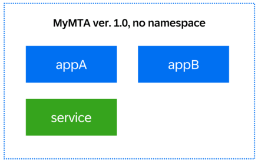
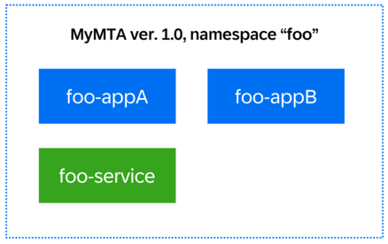

<!-- loiob28fd77836d44bde8c404618bf0f1228 -->

# \(Experimental\) Namespaces

Use this feature to prevent conflicts for applications deriving from the same MTA, but with different version, features, and configuration.

> ### Restriction:  
> -   This feature is experimental. We advise you first try it out in a non-productive environment.
> -   The namespace can only be passed as an argument to the deployment call, and cannot be modelled directly in the descriptor.
> -   The namespace cannot be longer than 36 characters.


<a name="loiob28fd77836d44bde8c404618bf0f1228__section_myh_r5w_qmb"/>

## Prerequisites

-   Make sure the version of your MultiApps Plug-in is 2.5.0 or higher. If required, use the procedure described in [Install the MultiApps CLI Plugin in the Cloud Foundry Environment](../50-administration-and-ops/install-the-multiapps-cli-plugin-in-the-cloud-foundry-environment-27f3af3.md) to update it.


<a name="loiob28fd77836d44bde8c404618bf0f1228__section_env_jvw_qmb"/>

## Feature Description

By using the namespaces feature, you can deploy and operate a single multitarget applicaton multiple times within a single space. This is useful when you have to avoid conflicts among applications or entities. It modifies the modules and resources by adding a namespace at the beginning of the application names, service names, and routes.

The feature is employed by adding the parameter `--namespace`, when you input the deployment command in the Cloud Foundry Command Line Interface \(CF CLI\), and by modifying the deployment descriptor as described below. Using a more detailed configuration, you can include or exclude specific resources from having the namespace feature applied to them, namely:

-   resources
-   modules
-   routes.

When set so, the excluded resources are shared among all namespaces of this MTA archive.


<a name="loiob28fd77836d44bde8c404618bf0f1228__section_hmf_khn_xcc"/>

## Fine-Grained Configuration

You can configure the application of namespaces at different levels according to your needs. When the same `apply-namespace` parameter is configured in several places for one MTA deployment, a certain order of priority applies. This order provides flexibility if you want to set a namespace for all applications, application routes, and services that are part of the MTA, but at the same time, you need to define a specific namespace for a particular application, application route, or service.

The priority for `apply-namespace` parameters in descending order is the following:

1.  **Operation parameters / Command-Line Options \(Highest Priority\)**

    Operation parameters passed during the MTA deployment have the highest priority. If you provide an `apply-namespace` parameter as a command-line option, it overrides any other parameters defined in the MTA descriptor. Operation parameters apply to all applications.

    There are four available options for applying a namespace:

    -   `--apply-namespace-app-names true/false`: Applies namespace to application names.
    -   `--apply-namespace-service-names true/false`: Applies namespace to service names.
    -   `--apply-namespace-app-routes true/false`: Applies namespace to application routes.
    -   `--apply-namespace-as-suffix true/false`: Applies namespace either as prefix or suffix.

    **Example:**

    When you deploy using the command `cf deploy … --namespace test --apply-namespace-app-names true --apply-namespace-service-names false --apply-namespace-app-routes true`, all application names and application routes will have the prefix '`test-`'. Service names will remain unchanged, as specified by the `--apply-namespace-service-names false` option. Other `apply-namespace` parameters will not affect this configuration.

    If you use the command `cf deploy … --apply-namespace-app-names true --apply-namespace-service-names false --apply-namespace-app-routes true` without the '`--namespace`' option, the `apply-namespace` options will be ignored.

    For more information about `apply-namespace` options, refer to the **Command Options Overview** table in [deploy](https://help.sap.com/docs/btp/sap-business-technology-platform/multitarget-application-commands-for-cloud-foundry-environment?version=Cloud#deploy).

2.  **Module-Level and Resource-Level Parameters**

    If no command-line argument is provided, the module-level and resource-level parameters are considered next.

    **Example**:

    > ### Sample Code:  
    > ```
    > 
    > modules: 
    >   - name: java
    >     ...........
    >     parameters: 
    >       apply-namespace: true
    >       routes:
    >      	- route: host.some-domain.com
    >      	  apply-namespace: true
    > resources:
    >   - name: my-service
    >     ...........
    >     parameters:
    >       apply-namespace: false
    >         
    > ```

3.  **Global-Level Parameters**

    If neither command-line options nor module-level parameter are provided, the global parameters are used. Global parameters are applicable for all applications.

    > ### Sample Code:  
    > ```
    > 
    > parameters: 
    >   apply-namespace:
    >     app-names: true
    >     service-names: false
    >     app-route: true
    >         
    > ```

4.  **Default Values**

    If you don't provide any of the above mentioned parameters, the application will use the predefined default values. When you set the '`--namespace`' option, the default value is `true`, otherwise, it's `false`.


<a name="loiob28fd77836d44bde8c404618bf0f1228__section_nln_mdd_4nb"/>

## Examples

To deploy several entities of a multitarget application using namespaces, follow these steps:

1.  Using the CF CLI, deploy the initial MTA archive by using the command **`cf deploy ./MyMTA.mtar`** with the descriptor given below:

    > ### Sample Code:  
    > ```
    > 
    > modules:							
    >   - name: appA
    >     type: java.tomee
    >     path: application.war
    >     requires:
    >       - name: service
    >     parameters:
    >       routes:
    >       - route: appA.${default-domain}
    >       - route: route-without-namespace.${default-domain}
    >   - name: appB
    >     type: java.tomee
    >     path: application.war
    > resources:
    >   - name: service
    > ```

    The result should match the image below:

    

2.  Deploy again the MTA archive by using the command **`cf deploy ./MyMTA.mtar --namespace foo`** with the same descriptor. The result should match the image shown below:

    

    If you bind 'appA' to 'appA.my-domain.com', the system automatically binds 'foo-appA' to 'foo-appA.my-domain.com' upon deployment. If 'appA' requires a service instance called 'service', 'foo-appA' binds to a different service instance named 'foo-service'.

    There are also other ways to achieve this result, for example:

    -   Deploy using the `cf deploy` command with the following options:

        ```
        cf deploy ./MyMTA.mtar --namespace foo --apply-namespace-app-names true --apply-namespace-service-names true --apply-namespace-app-routes true
        ```

        This command deploys the MTA archive 'MyMTA.mtar' and applies the namespace 'foo' to the application names, service names, and application routes.

    -   Set global parameters in the deployment descriptor:

        If you don't have operation parameters or module-level and resource-level parameters, you can set the global parameters in the deployment descriptor to `true`. This approach produces the same result as using the `cf deploy` command with the namespace options.


    Both methods ensure that the namespace is applied consistently across application names, service names, and application routes during the deployment process.

3.  Deploy again the MTA archive by using the command **`cf deploy ./MyMTA.mtar --namespace foo`** with the given descriptor below:

    > ### Sample Code:  
    > ```
    > 
    > modules:							
    >   - name: appA
    >     type: java.tomee
    >     path: application.war
    >     requires:
    >       - name: service
    >     parameters:
    >       routes:
    >       - route: appA.${default-domain}
    >         apply-namespace: true
    >   - name: appB
    >     type: java.tomee
    >     path: application.war
    >     parameters:
    >       apply-namespace: false
    > resources:
    >   - name: service
    >     parameters:
    >       apply-namespace: true
    > ```

    The result matches the image below:

    

    The deployment automatically binds 'foo-appA' to 'foo-appA.my-domain.com'.

    If the descriptor contains:

    ```
    
    routes:
      - route: appA.${default-domain}
        apply-namespace: false
    ```

    then 'foo-appA' automatically binds to 'appA.my-domain.com' upon deployment instead.


<a name="loiob28fd77836d44bde8c404618bf0f1228__section_x22_m3d_4nb"/>

## Special Use: Sharing One Resource Among Several MTAs Using Namespaces

You can use deployment with namespaces in a way that only one of the resources receives a namespace. To do so, you use the parameter `apply-namespace` in the MTA deployment descriptor follows, and then deploy by using the procedure above. The deployment result should be as follows:

For the example below we use a service, but this special use can be applied to any module or resource in the descriptor.

> ### Sample Code:  
> ```
> ...
>   - name: serviceA
>     type: auditlog
>     parameters:
>       apply-namespace: false 
> ...
> ```

In the snippet above, the `apply-namespace: false` overrides the default value `true`, thus prohibiting the creation of additional instances of the service. This means that the service is unique in the space across all deployments of the MTA, and shared among them.

To see a practical example of the implementation above, go to [Deploying MTA in a Namespace](https://github.com/SAP-samples/cf-mta-examples/tree/master/namespace).

