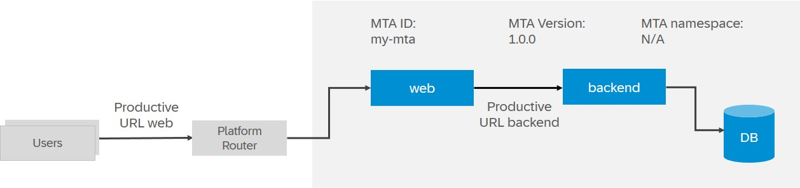
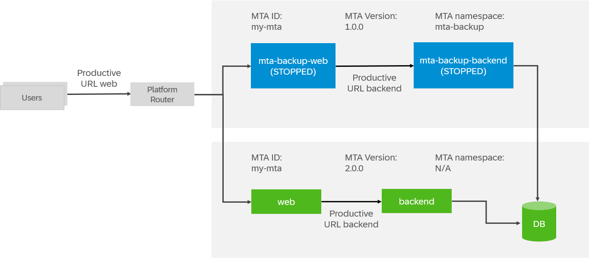
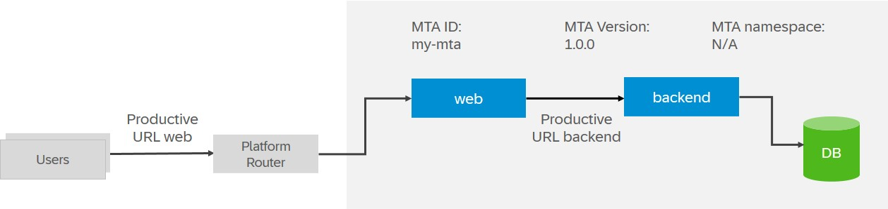

<!-- loiod612be9bed6544b388b2c4cd3799395e -->

# \(Experimental\) Rollback of Multitarget Applications

Use the rollback feature if you need to switch the productive traffic to a previously deployed backed-up version of your multitarget application.

> ### Note:  
> This is an experimental feature. Experimental features aren't part of the officially delivered scope that SAP guarantees for future releases. For more information, see [Important Disclaimers and Legal Information](https://help.sap.com/viewer/disclaimer).
> 
> Please use the *Feedback* button in this topic to let us know what you like and don't, and how we can improve it to make the experience more enjoyable for you.


<a name="loiod612be9bed6544b388b2c4cd3799395e__section_rbj_cdt_ydc"/>

## General Information

The rollback feature is Cloud Foundry application-centric, and it aims to ensure smooth transition of all productive traffic from the currently deployed version to the previously deployed version of the MTA. To achieve this with reduced risk and without downtime, the rollback represents a simplified blue-green deployment based on:

-   the MTA descriptors used in the deployment of the previous MTA version.
-   the backed-up Cloud Foundry applications from the previously deployed MTA version.

> ### Restriction:  
> -   Rollback is supported only for Cloud Foundry applications and bound user-provided services. It is not supported for managed service instances and their configuration, workflow content, and HTML5 repository content, among others.
> -   Rollback \(and consequently, backup\) is supported only when an MTA is updated with blue-green deployment \([Legacy Blue-Green Deployment](legacy-blue-green-deployment-764308c.md) or [Blue-Green Deployment Strategy](blue-green-deployment-strategy-7c83810.md)\). It is not supported when the update is done with standard deployment where downtime is expected anyway.


<a name="loiod612be9bed6544b388b2c4cd3799395e__section_zgx_c2t_ydc"/>

## Backup of Multitarget Applications

To be able to perform a rollback to a previously deployed version of your MTA, this version needs to be backed up beforehand during the blue-green deployment.

The backup is based on the namespaces feature \(see [Namespaces](namespaces-b28fd77.md)\). The backed-up MTA is put in a dedicated namespace with the default name “`mta-backup`”, which means that your MTA will receive the prefix “`mta-backup`”. The Cloud Foundry applications and service instances in your MTA will also receive the “`mta-backup`” prefix. However, if you use a namespace “`<your-namespace>`” to deploy your productive apps, the backup namespace will be “`mta-backup-<your-namespace>`”, and accordingly, this will be the prefix.

> ### Note:  
> It is important that you are aware of the following notes and restrictions:
> 
> -   The data needed to perform a rollback is backed up for 3 days.
> -   The backup is based on the MTA version. It is done only if the version is changed, so make sure you use a new version for every release of the MTA.
> -   There might be only one backup per MTA which corresponds to its previously deployed MTA version. If the same MTA version is being re-deployed, the preserved backup will not be overwritten. This ensures that triggering a rollback will revert the traffic to a different previous version and not to the same one.


### Procedure

This is the initial state of your previously deployed MTA with productive applications and routes before the backup:



To back up your MTA, you have to add the command-line option `--backup-previous-version` when initiating the blue-green deployment:

```
cf deploy <your-mta-archive-v2> --strategy blue-green --backup-previous-version
```

The result of the operation includes all steps of blue-green deployment and the following additional ones:

-   The previously deployed MTA version is moved to the dedicated namespace with name “mta-backup” and the “mta-backup” prefix is added to the names of all Cloud Foundry applications.
-   The Cloud Foundry applications remain in STOPPED state. In this way, they are ready to be reused in an eventual rollback but will not inquire any additional costs in the meantime.

This is the state of the MTA after the backup:




<a name="loiod612be9bed6544b388b2c4cd3799395e__section_jtk_cft_ydc"/>

## Rollback of Multitarget Applications

The MTA rollback mechanism switches the productive traffic back to the previously deployed MTA. The rollback processes the combination of the MTA descriptors which were used for deployment of the previous MTA version. This results in processing the different MTA modules and resources in the order defined in the previous descriptors. However, the rollback does not include any application-specific or service-specific processing, such as reverting of a database schema.

> ### Remember:  
> You can perform a rollback 3 days after backing up and deploying your MTA. If you try to perform a rollback after this period, the operation will fail. However, the backed-up applications will still be available in your space.


### Procedure

To initiate the rollback, you need to execute the command:

```
cf rollback-mta <MTA_ID>
```

> ### Note:  
> To process user-provided services as well, pass the command-line option `--process-user-provided-services`. For more information about the available command-line options, see [rollback-mta](../50-administration-and-ops/multitarget-application-commands-for-the-cloud-foundry-environment-65ddb1b.md#loio65ddb1b51a0642148c6b468a759a8a2e__section_ff3_hl1_zdc).

The results of this operation are:

-   The previously deployed MTA version is moved out of dedicated namespace “`mta-backup`”.
-   The applications are rebound to the service instances.
-   The MTA modules and resources are processed in the order defined in the previous version of the MTA descriptors
-   The newly deployed MTA version is removed, including the Cloud Foundry applications
-   \(Optional\) User-provided services are processed.

This is the state of the MTA after the rollback:



**Related Information**  


[Namespaces](namespaces-b28fd77.md "Use this feature to prevent conflicts for applications deriving from the same MTA, but with different version, features, and configuration.")

[Blue-Green Deployment of Multitarget Applications](blue-green-deployment-of-multitarget-applications-772ab72.md "Use the blue-green deployment technique by running two identical production environments, allowing seamless updates without downtime for Cloud Foundry multitarget applications.")

[Multitarget Application Commands for the Cloud Foundry Environment](../50-administration-and-ops/multitarget-application-commands-for-the-cloud-foundry-environment-65ddb1b.md "A list of additional commands to deploy multitarget applications (MTA) to the Cloud Foundry environment.")

