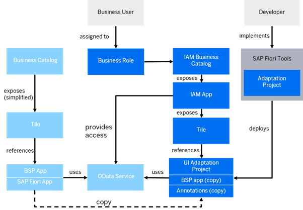
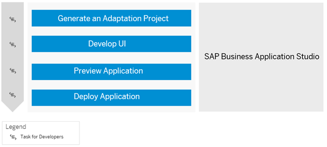
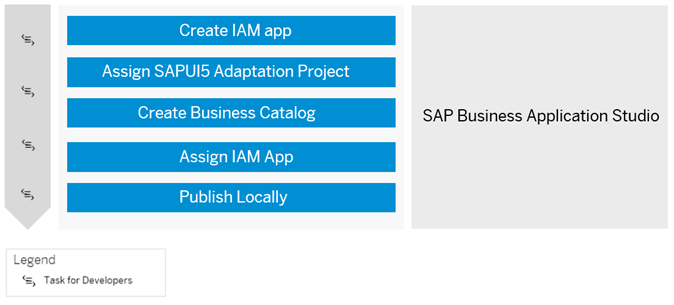

<!-- loio331d177c79fe46ec8824ec99092716a9 -->

# Extend an SAP Fiori App and Deploy it to ABAP Using SAP BAS

Learn how to extend an SAP Fiori application with an application variant by creating an SAPUI5 adaptation project and deploying it to ABAP using SAP Business Application Studio.

<a name="loio331d177c79fe46ec8824ec99092716a9__section_fzy_zl5_1bc"/>

## Overview

If an SAP Fiori application doesn\`t fully support your business process or the specific needs of some of your business users, and if the SAP Fiori application is released for extensibility, you can extend the SAP Fiori application with an applicaion variant while the original SAP Fiori application remains available and unchanged. In an application variant, you can extend the original code to define changes that fulfil the specific business requirements of different business roles, user groups, organizational units, and countries. For example, you might want to create an application variant to simplify and streamline a specific process by hiding fields not required by casual users, visualizing data as a chart, or changing a responsive table to a grid table to make information easier to process.

As a developer, you can use SAPUI5 adaptaion projects in [SAP Business Application Studio](https://help.sap.com/docs/bas/developing-sap-fiori-app-in-sap-business-application-studio/extending-sap-fiori-application) to create applications variants.You can efficiently reuse the original SAP Fiori application together with its OData service and application logic to define changes that are specific to the application variant only.

After deployment, both the base application and the newly created application variant exist and can be made available to the relevant business users through corresponding tiles in the SAP Fiori launchpad. If the base application is changed by a new version, it does not affect the deployed application variant. You can test the application variant with the latest enhancements of the base application in SAP Business Application Studio and deploy it again to benefit from the latest enhancements. For further information, see [Check Whether Your Adaptaion Project Is Up-To-Date with Base App Upgrades](https://help.sap.com/docs/bas/developing-sap-fiori-app-in-sap-business-application-studio/check-whether-your-adaptation-project-is-up-to-date-with-base-app-upgrades).

The following diagram shows the relationship between the source application \(shown in blue\) and the application variant created by an adaptation project \(shown in dark blue\).

Prerequisites

You have set up and integrated SAP Business Application Studio. See [Setup of UI Development in SAP Business Application Studio](https://help.sap.com/docs/btp/sap-business-technology-platform/setup-of-ui-development-in-sap-business-application-studio-optional?version=Cloud).

<a name="loio331d177c79fe46ec8824ec99092716a9__section_zv4_mgv_1bc"/>

## Generating and Deploying Your Adaptation Project

*Prerequisites*

-   The following business catalogs are assigned to your user:

    -   Business catalog `SAP_A4C_BC_DEV_OBJ_DIS_PC` \(or other business catalog for development tasks\), which allows you to retrieve the list of extensible base applications.

    -   A business catalog that grants access to the base application, which allows you to execute the corresponding OData service.

    -   Business catalog `SAP_A4C_BC_DEV_UID_PC`, which allows you to deploy the adaptation project.

-   You have an open transport request.

1.  As a developer user in SAP Business Application Studio, generate an SAPUI5 adaptation project. See [Create the Adaptation Project](https://help.sap.com/docs/bas/developing-sap-fiori-app-in-sap-business-application-studio/create-project).

2.  Make adaptations to the UI, for example, change control properties, add own sections to the object page, add controller extensions, etc.. See [Make Adaptations](https://help.sap.com/docs/bas/developing-sap-fiori-app-in-sap-business-application-studio/make-adaptations-9486af5a8f6f440ab4f6d924bafc90d4).

3.  Now you can preview the generated SAP Fiori application. See [Preview the Adaptation Project](https://help.sap.com/docs/bas/developing-sap-fiori-app-in-sap-business-application-studio/preview-adaptation-project-a8038817f4ee43508f8c5fab254783b8).

4.  Deploy the SAP Fiori UI by executing command `npm run deploy` in the terminal of your project. See [Deploy or Update the Adaptation Project to the ABAP Repository](https://help.sap.com/docs/bas/developing-sap-fiori-app-in-sap-business-application-studio/deploy-or-update-adaptation-project-to-abap-repository) .

<a name="loio331d177c79fe46ec8824ec99092716a9__section_lq2_s3v_1bc"/>

## Creating and Publishing Your Identity and Access Management \(IAM\) App

1.  To manage access to your SAP Fiori application, you need to log on to the development tenant in ABAP Development Tools for Eclipse as a developer to create an Identity and Access Management \(IAM\) application. Moreover, you need to assign an SAPUI5 adaptation project and maintain authorizations, as shown in steps one and two in the figure above. See [Creating an IAM App for the Business Service \(Developer\)](https://help.sap.com/docs/btp/sap-business-technology-platform/creating-iam-app-for-business-service?version=Cloud).

    1.  Open and log onto ABAP Development Tools \(ADT\).

    2.  In the Project Explorer, open your package and expand the BSP Library folder and then the BSP Applications folder to view the application variant you deployed in SAP Business Application Studio.

    3.  In the same package, you will find the folder Fiori User Interface containing the FLP App Descriptor Items folder. An FLP app descriptor item with the name `<BSP application name>_UI5R` was generated automatically when you deployed the application variant in SAP Business Application Studio.

    4.  Right-click on your package and choose New –\> Other ABAP Repository Object

    5.  In the ABAP Repository Object dialog box, open theCloud Identity and Access Management folder and select IAM App.

    6.  Choose *Next*.

    7.  In the New IAM App dialog box, enter a unique name and description for your IAM app.

    8.  In the Application Type field, select UI5A – UI Adaptation App. The application ID suffix \_UI5A is set automatically.

    9.  Choose *Next*

    10. In the *Select Transport Request* dialog box, choose the transport request you want to use and choose *Finish*.
    11. In your package, expand the folder *Cloud Identity and Access Management –\> IAM Apps* and you will see your newly created IAM app with the application name you specified in step g\) and the suffix UI5A.
    12. Open your newly created IAM App in the *IAM Apps* folder. In the *Overview* tab, enter the *Fiori Launchpad App Description Item ID* that was generated automatically in your *Fiori User Interface folder –\> FLP Descriptor Items* called `<BSP application name>_UI5R`.

    13. Open your newly created IAM App in the *IAM Apps* folder. On the *Overview* tab, enter the *Fiori Launchpad App Description Item ID* that was generated automatically in your *Fiori User Interface folder –\> FLP Descriptor Items* called `<BSP application name>_UI5R`.

    14. Open the *Services* tab, which will now list the services used by your application variant. Choose *Synchronize*.

    15. Open the *Authorizations* tab and maintain authorizations for your application variant and choose *Save*.

    16. You need to publish your IAM app locally, to do this choose the *Publish Locally* button on the top right of the screen.

2.  Once you have created your IAM app, you have to create a business catalog. See [Creating a Business Catalog \(Developer\)](https://help.sap.com/docs/btp/sap-business-technology-platform/iam-creating-business-catalog?version=Cloud).

3.  Assign your IAM app to the catalog.

4.  Publish the IAM app and business catalog locally.

<a name="loio331d177c79fe46ec8824ec99092716a9__section_v54_hrv_1bc"/>

## Next Steps

[Add Your App to SAP Fiori Launchpad](https://help.sap.com/docs/sap-btp-abap-environment/abap-environment/add-your-app-to-sap-fiori-launchpad?version=Cloud)

**Related Information**  

[Extending an SAP Fiori Application for S/4HANA Cloud public Edition and SAP BTP, ABAP Environment](https://help.sap.com/docs/bas/developing-sap-fiori-app-in-sap-business-application-studio/extending-sap-fiori-application-for-s-4hana-cloud)

[SAP Business Application Studio](https://help.sap.com/docs/bas)

[SAP Fiori tools](https://help.sap.com/docs/SAP_FIORI_tools)

[SAP Fiori Overview](https://help.sap.com/docs/SAP_FIORI_tools)

