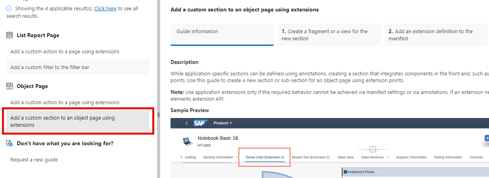
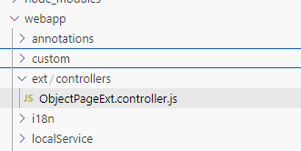

<!-- loio08b3a2fdda8148768fbf1311ab7d0764 -->

# Fiori Elements Integration OData V4

You can implement the reusable component from the *Reuse Library* in a `Fiori Elements` app in order to display an application log.


## Context

To implement the reusable component in a Fiori Elements app, you first have to add the application log reuse component to your manifest.


## Procedure

1.  Open the `manifest.json` file of the application and locate the `sap.ui5` section.

2.  Add the `sap.nw.core.applogs.lib.reuse` library under dependencies:

    > ### Sample Code:  
    > ```
    > "sap.ui5": {
    >     "dependencies": {
    >       "libs": {
    >         "sap.nw.core.applogs.lib.reuse": {
    >         "lazy": true
    >         }
    >     }
    >   }
    > }
    > ```

3.  Next, **create a view extension** by adding a custom section to your object page using the *Guided Development* tool or by manually adjusting the `manifest.json` file:

    -   Right-click on your projects root folder and click *Open Guided Development*

    -   Choose the guide *Add a custom section to an object page using extensions*


    

    -   In your `manifest.json` file, you should now be able to see something similar to the following:

        > ### Sample Code:  
        > ```
        > "targets": {
        >     "ZTS_APL_C_APPL_LOG_OVERVIEWObjectPage": {
        >         "type": "Component",
        >         "id": "ZTS_APL_C_APPL_LOG_OVERVIEWObjectPage",
        >         "name": "sap.fe.templates.ObjectPage",
        >         "options": {
        >             "settings": {
        >                 "editableHeaderContent": false,
        >                 "contextPath": "/ZTS_APL_C_APPL_LOG_OVERVIEW",
        >                 "content": {
        >                     "body": {
        >                         "sections": {
        >                             "myCustomSection": {
        >                                 "template": "ztsaplreusev4.custom.fragment.ApplicationLogContainer",
        >                                 "title": "Application Log Reuse Component"
        >                             }
        >                         }
        >                     }
        >                 }
        >             }
        >         },
        >         "controlAggregation": "midColumnPages",
        >         "contextPattern": "/ZTS_APL_C_APPL_LOG_OVERVIEW({key})"
        >     }
        > }
        > ```


4.  Open the fragment that was created from the *Guided Development* tool and add a component container:

    > ### Sample Code:  
    > ```
    > 
    > <core:FragmentDefinition xmlns:core="sap.ui.core" xmlns="sap.m" >
    >     <core:ComponentContainer id="LogContainer"/>
    > </core:FragmentDefinition>
    > ```

5.  As a next step, **create a controller extension**. First, open the `manifest.json` file of the application and locate the `sap.ui5` section. Then, add an object page controller extension:

    > ### Sample Code:  
    > ```
    >   "extends": {
    >     "extensions": {
    >         "sap.ui.controllerExtensions": {
    >             "sap.fe.templates.ObjectPage.ObjectPageController": {
    >                 "controllerName": "ztsaplreusev4.ext.controllers.ObjectPageExt"
    >             }
    >         }
    >     }
    > }
    > ```

6.  Create the controller extension file with the specified name and path from the `manifest.json` file:

    

7.  Adjust the controller extension coding by opening the `ObjectPageExt.controller.js` file you've created and adjust the coding like this:

    > ### Note:  
    > Make sure to adjust the names and paths accordingly.

    > ### Sample Code:  
    > ```
    > sap.ui.define([
    >     "sap/ui/core/mvc/ControllerExtension",
    >     "sap/ui/core/Core"
    > ],
    >     function(ControllerExtension, Core) {
    >         "use strict";
    >          
    >         return ControllerExtension.extend("ztsaplreusev4.ext.controllers.ObjectPageExt", {
    >             _logContainer: "ztsaplreusev4::ZTS_APL_C_APPL_LOG_OVERVIEWObjectPage--fe::CustomSubSection::myCustomSection--LogContainer",
    >             override: {
    >                 onInit: function(oEvent) {
    >                     var that = this;
    >                     if (this.getView().getId() === "ztsaplreusev4::ZTS_APL_C_APPL_LOG_OVERVIEWObjectPage") {
    >                         this._oComp = Core.createComponent({
    >                             name: "sap.nw.core.applogs.lib.reuse.applogs",
    >                             id: "LogMessagesControlComponent",
    >                             settings: {
    >                                 "persistencyKey": "ReuseApplicationLog"
    >                             }
    >                         });
    >                         var oLogContainer = Core.byId(this._logContainer);
    >                         if (oLogContainer !== undefined) {
    >                             oLogContainer.setComponent(this._oComp);
    >                         }
    >                         if (this._oComp.getLogHandle()!=="") {
    >                             this._oComp.setLogHandle("");
    >                         }
    >                         this._oComp.refresh();
    >                     }
    >                 },
    >                 routing: {
    >                     onAfterBinding: function (oBindingContext) {
    >                         var that = this;
    >                         oBindingContext.requestProperty("log_handle").then(function (sLogHandle) {
    >                             if (sLogHandle !== undefined) {
    >                                 that._oComp.setLogHandle(sLogHandle);
    >                             }
    >                             that._oComp.refresh();
    >                         });
    >                     }
    >                 }
    >             }
    >     });
    > });
    > ```

8.  **Settings**:

    -   **persistencyKey**: The component you embed uses the *SmartFilter* and *SmartTable* control. Both controls allow you to configure them interactively. You can also store a current set of configuration settings as a named variant. By providing a value for the `persistencyKey` parameter, you make sure that the variants that get created in your application become visible only to the users of your application, and not to all users of the component in all applications.
    -   **showHeader**: Display or hide the header with information about the log object, the log subobject, the creator, and the creation date.
    -   **showFilterBar**: Display or hide the *SmartFilter* bar.
    -   **showAsTree**: Display log messages as a tree. Make sure the *Level of Detail* is maintained for all log messages. The table supports up to 9 expandable levels.
    -   **detailLevel**: Filter out less relevant log messages. If set, only log messages of the log levels you've specified are displayed. An example: if you've specified the `detailLevel: "1,2,3"`, then only log messages with detail level 1, 2, or 3 are displayed.
    -   **showContextFields**: By default, the dynamic context fields of a log are not visible in the reuse component. If this parameter is set to `true`, the context fields will also be displayed. Be aware, however, that an additional second round trip is needed to fetch the metadata of the context fields. This could lead to a round trips violation for your application.
    -   **sortOrder**: Possible values of the sort order are: *ASC* \(Ascending. The oldest log is shown first. This is the default\) and *DESC* \(Descending. The newest log is shown first\)

9.  To **refresh the logs**, you can use the edit flow hooks offered by the controller extension. See also [UI5 Demo Kit: Edit Flow Overview](https://sapui5.hana.ondemand.com/#/api/sap.fe.core.controllerextensions.EditFlow%23overview). An example:

    > ### Sample Code:  
    > Refresh the log after an action was run:
    > 
    > ```
    >        return ControllerExtension.extend("ztsaplreusev4.ext.controllers.ObjectPageExt", {
    >            override: {
    >                editFlow: {
    >                    onAfterActionExecution: function (sAction) {
    >                        var that = this;
    >                        this._oComp.setLogHandle("");
    >                        this._oComp.refresh();
    >                        var oBindingContext = that.getView().getBindingContext();
    >                        oBindingContext.requestProperty("log_handle").then(function (sLogHandler) {
    >                            if (sLogHandler !== undefined) {
    >                                that._oComp.setLogHandle(sLogHandler);
    >                                that._oComp.refresh();
    >                            }
    >                        });
    >                    }
    >                }
    >            }
    >        });
    > ```


