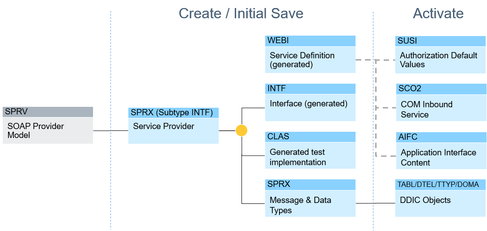

<!-- loio98433757d0f44d6e8d38ead303a9d787 -->

# Generate Provider Proxies From WSDL Files

SOAP-based provider proxies are generated using a so-called SOAP Provider Model \(SPRV\).

<a name="loio98433757d0f44d6e8d38ead303a9d787__prereq_ygc_pwg_hzb"/>

## Prerequisites

You have created a communication scenario as described in [Defining a Communication Scenario Including Authorization Values](defining-a-communication-scenario-including-authorization-values-bba0fd2.md).

## Context

With the SOAP Provider Model \(SPRV\), you can generate the proxy objects that are required for providing SOAP services, based on a WSDL file that describe your service. The SPRV is mainly used to provide a corresponding inbound service for an exposed outbound service.

> ### Example:  
> An external system triggers a confirmation in your system to inform the external system about the creation of an appointment activity. To receive this information, a provider proxy for this service must be implemented in your system. This provider proxy is generated by the SPRV.

During and after activation, the following objects are generated:

-   Proxy objects
-   DDIC-objects, e.g. the required data elements
-   The service definition
-   Application Interface Framework objects for monitoring
-   The required inbound services for the communication scenario
-   The authorization default values

> ### Restriction:  
> It is not possible to model web services in ABAP development tools for Eclipse. To use the SPRV, you must use a WSDL file that describes the service interface.

## Procedure

1.  Based on the WSDL file of the service you want to provide, create an SPRV as described in [Creating SOAP Service Providers](https://help.sap.com/docs/abap-cloud/abap-development-tools-user-guide/creating-soap-service-providers?version=sap_btp).

2.  Activate the SPRV.

3.  Add the generated inbound service to the relevant communication scenario.

4.  Publish the communication scenario locally to make it available for the administrator in SAP Fiori launchpad.

<a name="loio98433757d0f44d6e8d38ead303a9d787__postreq_pgx_2xg_hzb"/>

## Next Steps

The SPRV generates an implementing class of the service you want to provide. To provide the functionality of your service, add the required application logic to the generated implementing class. Afterwards, activate the implementing class.

> ### Note:  
> When deleting the SPRV, the implementing class is not deleted to avoid data loss. All other generated objects that depend on the SPRV are deleted with the SPRV.

Based on the communication scenario, the administrator can create a communication system, inbound user, and communication arrangement, to make the service available for consumption. For more information, see [Communication Management](communication-management-5b8ff39.md#loio5b8ff39ddb6741a29ddfcf587939e8f4), and [SOAP Outbound Communication](soap-outbound-communication-ff6e400.md) 

