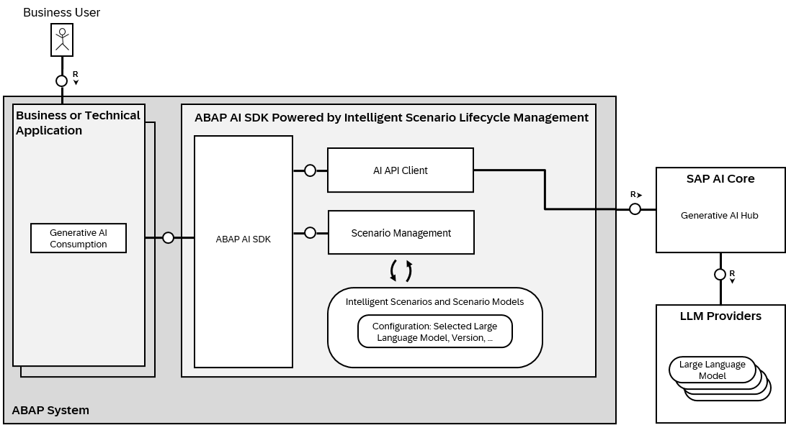

<!-- loiofd682bfef603494b9023b1f1b93f27e0 -->

# Generative AI for ISLM

Intelligent Scenario Lifecycle Management \(ISLM\) is a standardized framework that facilitates end-to-end lifecycle operations and the consumption of business AI scenarios.

You can use ISLM to seamlessly adopt a Generative AI scenario into your business application by creating a Gen AI Intelligent Scenario. The framework also offers additional features like automatic enablement \(Turnkey\) and Usage Types for faster integration to Business Apps.

ISLM integrates with the Generative AI Hub in SAP AI Core that offers easy access to LLM models hosted by hyperscalers. This integration is made possible via a communication scenario SAP\_COM\_0A69, which is a Customer Outbound Integration. This is a customer-managed communication scenario, which requires manual connection setup.

With the connection to Gen AI Hub established, ISLM can be used to create and activate deployments – Turnkey or Manually. You can then use the ABAP AI SDK APIs for prompt execution. The ABAP AI SDK is a reuse library in an ABAP system that provides access to generative AI functionality via Intelligent Scenario Lifecycle Management \(ISLM\). 

The intelligent scenario are development object that can be created using the ABAP development tools for Eclipse in ABAP systems.

The [Intelligent Scenario Management](https://help.sap.com/docs/SAP_S4HANA_CLOUD/6aa39f1ac05441e5a23f484f31e477e7/4e67f075b34c4044802d0418efdef3b3.html) app should be used for operating intelligent scenarios, for example activation and deployments.

For SAP delivered Gen AI intelligent scenarios that support turnkey, the creation and activation of deployments can be automated using the [Turnkey](https://help.sap.com/docs/SAP_S4HANA_CLOUD/6aa39f1ac05441e5a23f484f31e477e7/5c40d9d7707346ea89fdc335f3a703f2.html) feature.

Following is the architectural representation of ISLM integration with ABAP AI SDK.

The following sections shows get step-by-step instructions on how to set up the integration of ISLM with the generative AI hub in SAP AI Core:

-   [Download Certificate](download-certificate-5432f7c.md)
-   [Create SAP BTP Cockpit Service Instance and Key](create-sap-btp-cockpit-service-instance-and-key-9cd0445.md)
-   [How to Configure the Communication System for SAP\_COM\_0A69](how-to-configure-the-communication-system-for-sap-com-0a69-0d8de81.md)
-   [How to Create the Communication Arrangement for SAP\_COM\_0A69](how-to-create-the-communication-arrangement-for-sap-com-0a69-16d3b0e.md)
-   [Manage Gen AI Scenarios](manage-gen-ai-scenarios-6107dd0.md)

