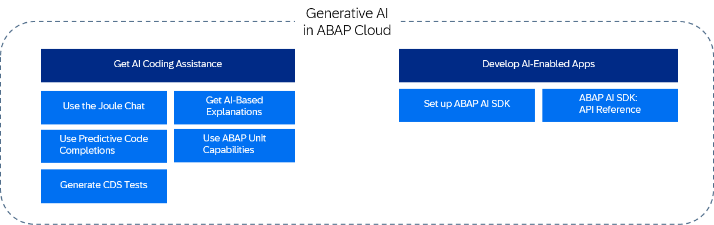

<!-- loioe74233d84b9740099c822790deff96cb -->

# Generative AI in ABAP Cloud

The Generative AI in ABAP Cloud guide provides information on various AI use cases for ABAP Cloud.

<a name="loioe74233d84b9740099c822790deff96cb__section_ojs_jld_52c"/>

## Use Cases

Generative AI in ABAP Cloud is designed to support you with the following use cases:

-   Support you with your day-to-day tasks when working with ABAP code, to increase your efficiency and to lower total cost of development

-   Include generative AI in your custom business applications

    The [Generative AI in ABAP Cloud](https://help.sap.com/docs/abap-ai/generative-ai-in-abap-cloud/generative-ai-in-abap-cloud) guide provides information on the different use cases for generative AI in ABAP Cloud.

    > ### Note:  
    > To leverage Joule's capabilities, you need to purchase an additional license: For SAP BTP ABAP environment and SAP S/4HANA Cloud Public Edition, see SAP Note [3571857](https://me.sap.com/notes/3571857) .

<a name="loioe74233d84b9740099c822790deff96cb__section_gbq_xcx_t2c"/>

## Generative AI in ABAP - The Big Picture

