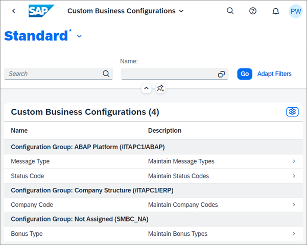
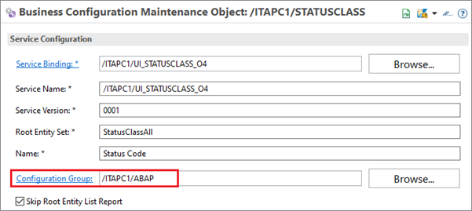

<!-- loio9ae79238419e4be2aba39170ba9e616e -->

# Grouping

The standard variant of the *Custom Business Configurations* app shows you the list of business configuration maintenance objects.

If the list needs to be structured in a simple hierarchical manner, you have the option to group the business configuration maintenance objects semantically.

  

As the developer of the business configuration maintenance object, you specify a data element of the same software component as configuration group.

  

The name of the data element can then be used by the custom business configurations app user as the *Group By* element in the table settings.

By clicking on settings you can navigate to the *View Settings* window.

The description of the configuration group data element is shown as the group label. Other attributes of the data element are not relevant. If the configuration group of a business configuration maintenance object is not maintained, the object is assigned to the generic group *Not Assigned*.

The *Custom Business Configurations* app user can save and share the variant with grouping in the [My Views](https://experience.sap.com/fiori-design-web/variant-management/#components) Dialog.

