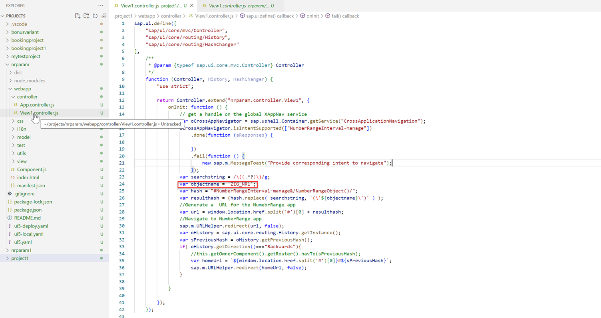
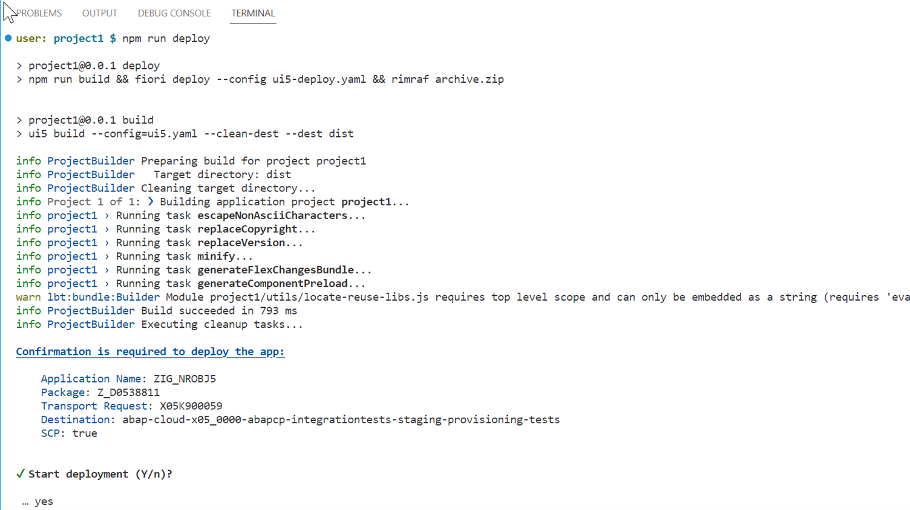

<!-- loioc57cae7f62d84107aa6ccbab36663535 -->

# How to Create a Fiori App for a Single Number Range Object

You can maintain files in the SAP Fiori launchpad to launch the *Number Range* app with the help of a custom app.


<a name="loioc57cae7f62d84107aa6ccbab36663535__section_zk4_lbh_fxb"/>

## Prerequisites

The business user will need to be assigned with suitable authorization in the SAP BTP ABAP environment:

-   the `SAP_CA_BC_IC_LND_NUM_PC` catalog is needed, as it grants access to the *Maintain Number Ranges* app
-   the `SAP_CA_BC_IC_LND_PC` catalog is needed, as it grants access to the customizing changes
-   if the targeted business configuration instance is protected, the relevant custom business catalog must also be assigned to the business user


<a name="loioc57cae7f62d84107aa6ccbab36663535__section_h3p_sbh_fxb"/>

## Procedure

A custom tile that navigates directly to the *Number Range Object* app has been created. This is done by using the parameter `Technical Identifier` in the intent-based navigation .

The implementation contains a creation and deployment of an empty freestyle UI5 app that redirects to the `NumberRangeInterval-manage` \(manage number range intervals\) with the required parameter. When clicking the tile, the launchpad will first navigate to the intent of the custom app \(which is maintained in the app descriptor\) and will then automatically be rerouted to the intent of the *Maintain Business Configurations* app. This rerouting is quite simple to implement after generating an empty app in Business Application Studio \(BAS\).

In terms of authorization control, a custom business catalog and business role needs to be created in the SAP BTP ABAP environment and assigned to the business user.


<a name="loioc57cae7f62d84107aa6ccbab36663535__section_qg3_5bh_fxb"/>

## Reproduce

A development package and a transport request are needed to implement the solution.


### Create a new SAP Fiori application in BAS

1.  Log on to the Business Application Studio \(BAS\) Development Space to create a new *SAP Fiori application* in BAS and press *Start*.

2.  Choose SAPUI5 freestyle from the drop-down menu *Application Type* and press *Next*.

    

3.  For *Data source* choose *None* out of the drop-down menu and press *Next*. You can use the proposed view name in the next step or rename it. Press *Next*.

    

4.  After filling in the mandatory fields of the project attributes, add your deployment configuration as well as your Fiori configuration by choosing *Yes*.

    > ### Note:  
    > This configuration can also be added later via the terminal by running the command
    > 
    > `npx fiori add flp-config`

    Press *Next*.

5.  1.  Add a target repository name and a target package, then create a workbench transport request or choose an already existing one. Press *Next*.

6.  Finally, adjust the Fiori Configuration information:

    -   Choose a semantic object that represents a business entity such as a customer, a sales order or a product.

    -   Choose an action that describes which operation \(such as `display` or `manage`\) is intended to be performed on a semantic object.

    -   Choose a title that will represent the tile name.


    Press *Finish*.


After creating a new SAP Fiori application in BAS, you can deploy it.


### Deploy your SAP Fiori application

1.  In the project folder open the created project in the integrated terminal.

2.  Go to the *controller*folder which you will find in the folder *webapps* of the project. Open `View1.controller.js`. Insert the code snippet into the view. Adopt the value of the `objectname` variable to the object which you would like to call in Fiori.

3.  Deploy your application by means of running the terminal command: `npm run deploy`.

4.  After successful deployment a note will appear that is required for the identity application manager.

    > ### Sample Code:  
    > ```
    > info builder:custom deploy-to-abap Fiori launchpad App Descr Item ZIG_NROBJ5_UI5R was created
    > ```

5.  Now, a successfully deployed application will appear in ABAP development tools for Eclipse in the BSP library folder of the deployment package.


To publish the business catalog to the system and pin your final product to the home screen of your Fiori launchpad, continue reading the next topic called *IAM App Creation and Settings*.

