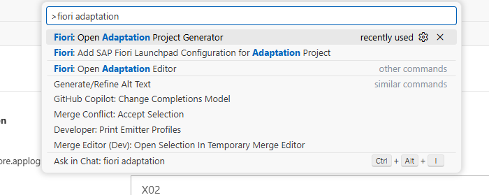
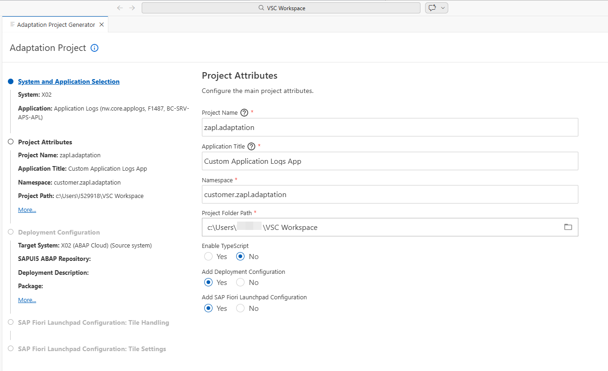
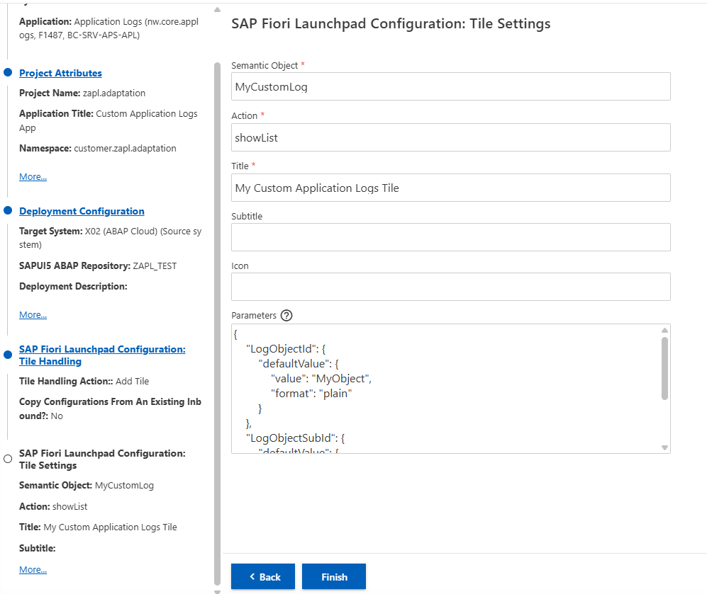
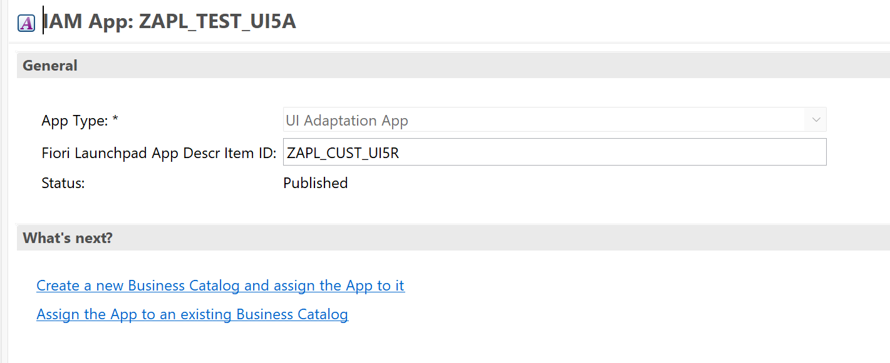

<!-- loio258955b4c3d3404f9964aed173c82dde -->

# How to Create a Standalone Application Logs Tile

Learn how to provide a standalone Fiori application tile to business users to display the application logs of your application-specific business application log.


## Context

As an application developer, you want to provide a standalone Fiori application tile to business users so that they can display the application logs of your application-specific business application log. In addition, you may want to offer cross-app navigation from arbitrary business applications to this particular standalone application log tile.


## Procedure

To create a standalone application tile, you can use the *Fiori Adaptation Project* mechanism that has been enabled for the *Application Logs* app \(`nw.core.applogs`\). You can find more information on how to work with adaptation projects here: [Working with an Adaptation Project](https://help.sap.com/docs/bas/developing-sap-fiori-app-in-sap-business-application-studio/working-with-adaptation-project).


### Create a Fiori Adaptation Project

Create a Fiori adaptation project in SAP Business Application Studio or Visual Studio Code by using the *Adaptation Project Generator*.



Select the target system and the app *Application Logs* \(**`nw.core.applogs`**, **`F1487`**, **`BC-SRV-APS-APL`**\).

**Project Attributes**

Fill out the project attributes. At the options for adding deployment information and a SAP Fiori launchpad configuration, select *Yes*.



**Deployment Information**

Give a repository name, a package, and a transport request.

**SAP Fiori Launchpad Configuration**

Select *Add Tile* and *NO* for *Copy configuration from an existing tile*.

> ### Caution:  
> Do **not** use *Replace Tile*, as it would overwrite all specialized *Application Logs* tiles in the system.

In the next dialog, fill out the tile settings as needed. Since you're creating a specialized *Application Logs* tile, you must restrict the displayed logs. Therefore, it's necessary to maintain the *Log Object* and *Log Subobject* accordingly in the *Parameters* section.



The following parameters could be used:

> ### Sample Code:  
> ```
> {
>     "LogObjectId": {
>         "defaultValue": {
>             "value": "MyObject",
>             "format": "plain"
>         }
>     },
>     "LogObjectSubId": {
>         "defaultValue": {
>             "value": "MySubObject",
>             "format": "plain"
>         }
>     }
> }
> ```

-   **LogObjectId**: filters the list of logs by a log object ID \(**mandatory**\)
    -   The parameter can contain one or more log object IDs separated by comma \(without a space\)
    -   You can use an asterisk \(like `ABAP*`\)

-   **LogObjectSubId**: filters the list of logs by a suboject ID
    -   The parameter can contain one or more subobject IDs separated by comma \(without a space\)
    -   You can use an asterisk \(like `ABAP*`\)


> ### Note:  
> Maintaining the *LogObjectId* and *LogObjectSubId* parameters in the tile settings does **not** automatically grant authorization to access those logs. You can maintain your authorizations via an IAM app \(described in the next section\).

After the adaptation project is generated, verify that the parameters were actually applied. In some cases, the generator doesn't write them to the manifest file. To verify,

-   Open the `manifest.appdescr_variant` that is located within the webapp folder of your project.

-   Search for *content* \> *inbound* \> *signatures* \> *parameters* and verify that the entered parameters appear there. If they're missing, add them manually using the `JSON` structure above.

-   Example:

    > ### Sample Code:  
    > <code><b>zapl.adaptation\webapp\manifest.appdescr_variant</b></code>
    > 
    > ```
    > {
    >   "fileName": "manifest",
    >   "layer": "CUSTOMER_BASE",
    >   "fileType": "appdescr_variant",
    >   "reference": "nw.core.applogs",
    >   "id": "customer.zapl.adaptation",
    >   "namespace": "apps/nw.core.applogs/appVariants/customer.zapl.adaptation/",
    >   "version": "0.1.0",
    >   "content": [
    >     {
    >       "changeType": "appdescr_ui5_addNewModelEnhanceWith",
    >       "content": {
    >         "modelId": "i18n",
    >         "bundleUrl": "i18n/i18n.properties",
    >         "supportedLocales": [
    >           ""
    >         ],
    >         "fallbackLocale": ""
    >       }
    >     },
    >     {
    >       "changeType": "appdescr_ui5_setMinUI5Version",
    >       "content": {
    >         "minUI5Version": "1.142.7"
    >       }
    >     },
    >     {
    >       "changeType": "appdescr_app_setTitle",
    >       "content": {},
    >       "texts": {
    >         "i18n": "i18n/i18n.properties"
    >       }
    >     },
    >     {
    >       "changeType": "appdescr_app_addNewInbound",
    >       "content": {
    >         "inbound": {
    >           "customer.MyCustomLog-showList": {
    >             "action": "showList",
    >             "semanticObject": "MyCustomLog",
    >             "icon": "",
    >             "title": "{{customer.zapl.adaptation_sap.app.crossNavigation.inbounds.customer.MyCustomLog-showList.title}}",
    >             "signature": {
    >               "additionalParameters": "allowed",
    >               "parameters": {
    >                 "LogObjectId": {
    >                     "defaultValue": {
    >                         "value": "MyObject",
    >                         "format": "plain"
    >                     }
    >                 },
    >                 "LogObjectSubId": {
    >                     "defaultValue": {
    >                         "value": "MySubObject",
    >                         "format": "plain"
    >                     }
    >                   }
    >               }
    >             }
    >           }
    >         }
    >       },
    >       "texts": {
    >         "i18n": "i18n/i18n.properties"
    >       }
    >     },
    >     {
    >       "changeType": "appdescr_app_removeAllInboundsExceptOne",
    >       "content": {
    >         "inboundId": "customer.MyCustomLog-showList"
    >       },
    >       "texts": {}
    >     }
    >   ]
    > }
    > 
    > 
    > ```


### Deploy the App

**Create an IAM App**

After your app was deployed successfully to an SAP BTP ABAP environment system, you should see the BSP application and the SAP Fiori launchpad app descriptor item under your package.

Now, you need to create a new IAM app by selecting *New* \> *Other Repository Object* \> *IAM App*.

Select *UI Adaptation App* as *App Type* and insert the Fiori launchpad app descriptor item of your app under *UI5 Application ID*.



Go to the *Authorization* tab and maintain your log objects or subobjects for the authorization object `S_APPL_LOG`.

**Create a Business Catalog**

Create a new business catalog by selecting *New* \> *Other Repository Object* \> *Business Catalog*.

Go to the *Apps* tab and add your *IAM App*.

Click *Publish Locally* to publish your business catalog.

You should now see your business catalog in the *Business Catalogs* Fiori app and you can assign it to a role.

