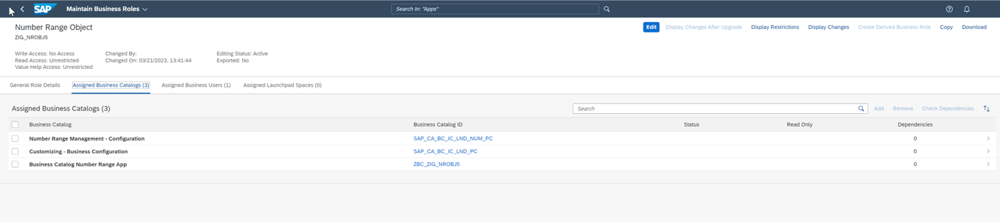

<!-- loio990311976954492c962acf857d74dc45 -->

# IAM App Creation and Settings

To publish a business catalog, you need to create a new IAM app first in case you do not use an already existing one.

1.  Create a new IAM app under the Cloud Identity and Access Management folder.

2.  Add an IAM app name as well as a description and press *Next*.

3.  Choose a corresponding transport request and press *Finish*.

4.  Open the created IAM app and add the previously deployed Business Application Studio app as *Fiori Launchpad Descr Item ID*. Finally, press *Publish Locally*.

5.  Now assign the IAM app to a new or already existing business catalog and an according description. Press *Finish*.

6.  Complete the process by publishing the business catalog to the system. Press *Publish Locally*.

### Business Role Settings

1.  Log onto the staging landscape of the Steampunk system and create a new business role or use an existing one.

2.  Assign the previously published business catalog to the business role and press *Save*.
3.  In order to run your application properly, your business role should contain the following business catalogs:

      

4.  Go back to the Fiori Launchpad Home view and find your application by searching via App Finder in the drop-down menu of your account icon on the upper right corner of the screen. Now you can also pin the app on your home screen.

