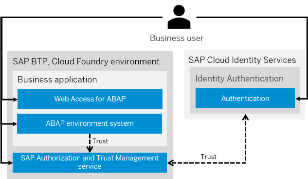
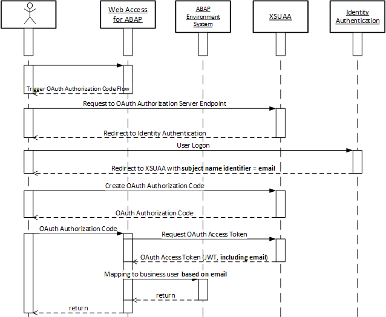

<!-- loio2abdc1d4373648799a8b1275084b7975 -->

# Identity Federation

Identity federation is the process of sharing identity information between two parties by delegating the authentication responsibility to a trusted external party through the use of a common token.

In the ABAP environment, the authentication of business users is based on OAuth 2.0 authorization code flow, using either the [SAML 2.0](https://help.sap.com/docs/IDENTITY_AUTHENTICATION/6d6d63354d1242d185ab4830fc04feb1/07088333b37e450db0c7a06d2cfec620.html?version=Cloud) or [OpenID Connect](https://help.sap.com/docs/IDENTITY_AUTHENTICATION/6d6d63354d1242d185ab4830fc04feb1/a789c9c8c0f5439da8c30b5d9e43bece.html?version=Cloud) protocol and [JSON web token \(JWT\)](https://help.sap.com/docs/CP_AUTHORIZ_TRUST_MNG/ae8e8427ecdf407790d96dad93b5f723/8eb23a1130e24ef49fa689bf7aab781e.html?version=Cloud) as a common access token.

The business application \(OAuth 2.0 client\) is on one hand represented by the Web Access for ABAP as the gateway component or a standalone approuter application deployed to the SAP BTP, Cloud Foundry environment. See [Subscribing to the Web Access for ABAP](https://help.sap.com/docs/BTP/65de2977205c403bbc107264b8eccf4b/98928b0941294c74b946cdcefca9b047.html?version=Cloud) and [Application Router](https://help.sap.com/docs/BTP/65de2977205c403bbc107264b8eccf4b/01c5f9ba7d6847aaaf069d153b981b51.html?version=Cloud).

On the other hand, an ABAP environment system is serving the business application resources \(OAuth 2.0 resource server\). See [Creating an ABAP System](https://help.sap.com/docs/BTP/65de2977205c403bbc107264b8eccf4b/50b32f144e184154987a06e4b55ce447.html?version=Cloud).

The SAP Authorization and Trust Management service in the SAP BTP, Cloud Foundry environment is providing endpoints to retrieve and exchange the authorization code for an access token \(OAuth 2.0 authorization/authentication server\). See [SAP Authorization and Trust Management Service](https://help.sap.com/docs/CP_AUTHORIZ_TRUST_MNG/ae8e8427ecdf407790d96dad93b5f723/6373bb7a96114d619bfdfdc6f505d1b9.html?version=Cloud).

The service is configured as an identity provider in the SAP BTP subaccount where the ABAP environment system has been created. The same subaccount is created as an application in the Identity Authentication service. See [Configuring Applications](https://help.sap.com/docs/IDENTITY_AUTHENTICATION/6d6d63354d1242d185ab4830fc04feb1/61ad3b0796ca4f5bae706632a29b1418.html?version=Cloud).

This configuration establishes a mutual trust relationship between SAP Authorization and Trust Management service \(XSUAA\) and the service as identity provider. See [Trust and Federation with Identity Providers](https://help.sap.com/docs/CP_AUTHORIZ_TRUST_MNG/ae8e8427ecdf407790d96dad93b5f723/cb1bc8f1bd5c482e891063960d7acd78.html?version=Cloud).

The ABAP environmentsystem in turn trusts SAP Authorization and Trust Management service.

The business user is federated based on its e-mail address. The e-mail address is set once the employee record of the business user is created.

For this purpose, the service being the trusted identity provider sends the e-mail address as a subject name identifier. See [Configure the Subject Name Identifier Sent to the Application](https://help.sap.com/docs/IDENTITY_AUTHENTICATION/6d6d63354d1242d185ab4830fc04feb1/1d020e3a3ba34c43a71fde70bfa6419a.html?version=Cloud).

SAP Authorization and Trust Management service transforms the incoming request to JSON web tokens, once again including the e-mail. The ABAP environment system then maps the e-mail address of the JSON web token to the business user.

> ### Note:  
> Only the e-mail address in the profile of a business user can be used for identity federation in the ABAP environment. Other profile attributes, such as the login name, can't be used.

If a resource in the ABAP environment system is requested to be accessed by a business user, the steps to acquire the required access token are as follows:

1.  The business user accesses the ABAP environment system through the Web Access for ABAP or a standalone approuter application. If no access token is available, the OAuth 2.0 authorization code flow is triggered.
2.  A request to the authorization server endpoint in the SAP Authorization and Trust Management service \(XSUAA\) checks if the business user is already logged on. If the business user is not logged on, the business user is redirected to the service as the identity provider used for logon.
3.  After logging on, the response of the service, including the e-mail address of the business user as the subject name identifier, is redirected to the authorization server endpoint of SAP Authorization and Trust Management service \(XSUAA\) to retrieve the authorization code.

    The authorization code is necessary to retrieve the access token in the following steps. Finally, the authorization code is redirected again to the Web Access.

4.  Based on the authorization code, a JSON web token \(JWT\) is retrieved from the access token endpoint in SAP Authorization and Trust Management service \(XSUAA\). This OAuth access token includes the e-mail address of the business user that serves as a subject name identifier.
5.  To consume resources, such as business services in the ABAP environment system, the JSON web token is forwarded as part of such requests and mapped internally to the business user based on the e-mail address.

> ### Note:  
> Authentication of users other than communication users does not require identity federation as these technical users are authenticated locally in the ABAP environment system.

