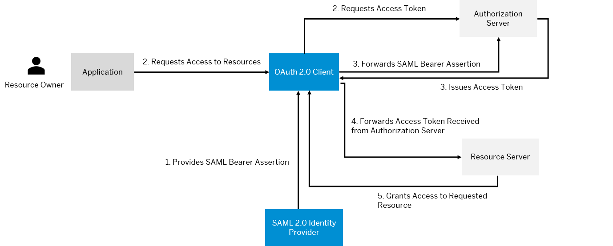

<!-- loio2abdc1d4373648799a8b1275084b7975 -->

# Identity Federation

Identity federation is the process of sharing identity information between two parties by delegating the authentication responsibility to a trusted external party through the use of a common token.

In the ABAP environment, the Identity Authentication service forwards the subject name identifier, which is by default an email address, to the system. The ABAP environment system then maps the subject name identifier to a business user, which allows the user to authenticate. This authentication process is based on OAuth 2.0 SAML bearer assertion.

The OAuth 2.0 SAML bearer assertion flow contains the following steps:

1.  The OAuth 2.0 client receives a SAML 2.0 bearer assertion from the SAML 2.0 identity provider. The assertion contains the user information of the resource owner and has a digital signature provided by the identity provider.
2.  The application requests access to the resource by requesting an access token from the authorization server.
3.  In exchange for the SAML 2.0 bearer assertion, the authorization server issues an OAuth 2.0 access token.
4.  To access the requested resource, the OAuth 2.0 client forwards the access token with the resource request to the resource server.
5.  The resource server grants access to the requested resource.

