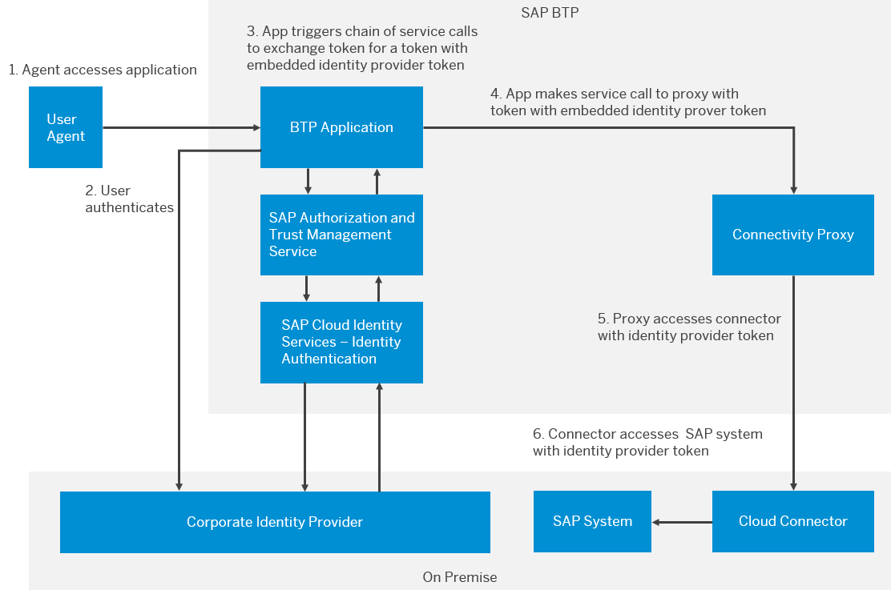

<!-- loio8dc480a09e77437580cf0d85b82dbe8e -->

# Include Tokens from Corporate Identity Providers or SAP Cloud Identity Services in Tokens of the SAP Authorization and Trust Management Service

In scenarios where your SAP BTP application interacts with applications that don't support tokens issued by the SAP Authorization and Trust Management service, but require a token from a corporate identity provider or SAP Cloud Identity Services, you can configure SAP Authorization and Trust Management service to include this token.

<a name="loio8dc480a09e77437580cf0d85b82dbe8e__prereq_rn1_zzp_nwb"/>

## Prerequisites

-   Trust with an SAP Cloud Identity Services tenant is configured with OpenID Connect \(OIDC\).

    For more information, see [Establish Trust and Federation Between SAP Authorization and Trust Management Service and SAP Cloud Identity Services](../50-administration-and-ops/establish-trust-and-federation-between-sap-authorization-and-trust-management-service-a-161f8f0.md).

-   Trust with a corporate identity provider by your SAP Cloud Identity Services is configured with OIDC.

    For more information, see [Configure Trust with OpenID Connect Corporate Identity Provider](https://help.sap.com/docs/IDENTITY_AUTHENTICATION/6d6d63354d1242d185ab4830fc04feb1/8ff83a12bbb8491c9558d635d6bbb287.html) in the SAP Cloud Identity Services documentation.

-   The initial logon of your application uses the authorization code flow.

<a name="loio8dc480a09e77437580cf0d85b82dbe8e__context_emz_zzp_nwb"/>

## Context

Imagine you have an on-premise SAP system that trusts your corporate provider. You want to access data in that system from an application on SAP BTP. Your application can get a token from the SAP Authorization and Trust Management service, but you don't want to or can't configure your SAP system to trust that token.

In this scenario, configure the SAP Authorization and Trust Management service to embed the token of a corporate identity provider trusted by the trusted SAP Cloud Identity Services tenant. In this example, before the SAP BTP application makes a service call to the Cloud Connector proxy, the application calls the SAP Authorization and Trust Management service to exchange its current token for a new token that embeds a token from the identity provider. Cloud Connector presents the identity provider token to the on-premise SAP system.

The following figure illustrates this scenario.

  
  
**Cloud Connector Using Embedded Tokens**

> ### Caution:  
> Token embedding is provided as a best-effort solution. The BTP application must be designed to fail gracefully when the SAP Authorization and Trust Management service is unable to embed tokens from SAP Cloud Identity Services or the corporate identity provider. SAP Authorization and Trust Management service records such events in the audit log.

<a name="loio8dc480a09e77437580cf0d85b82dbe8e__steps_xcn_b1q_nwb"/>

## Procedure

1.  When deploying your application, ensure that the application security descriptor \(`xs-security.json`\) sets the `system-attributes` with one of the following options:

    <table>
    <tr>
    <th valign="top">

    Value
    
    </th>
    <th valign="top">

    Description
    
    </th>
    </tr>
    <tr>
    <td valign="top">
    
    `ias-corporate-idp-token`
    
    </td>
    <td valign="top">
    
    Embeds the token of the corporate identity provider trusted by your SAP Cloud Identity Services tenant in the token issued by the service.
    
    </td>
    </tr>
    <tr>
    <td valign="top">
    
    `ias-token`
    
    </td>
    <td valign="top">
    
    Embeds the token of your trusted SAP Cloud Identity Services tenant in the token issued by the service.
    
    </td>
    </tr>
    </table>
    
    For more information about the application security descriptor, see [Application Security Descriptor Configuration Syntax](application-security-descriptor-configuration-syntax-517895a.md).

2.  In the SAP Cloud Identity Services application that represents your SAP BTP application, add the self-defined attribute `xsuaa-persist-corporate-idp-token` with the `Expression` source and `true` value.

    This attribute ensures that the service knows to embed the tokens.

    For more information, see [Configuring Attributes Based on Flexible Expressions](https://help.sap.com/docs/IDENTITY_AUTHENTICATION/6d6d63354d1242d185ab4830fc04feb1/a2f1e4692e7d4379ab82144ab309e7b3.html) in the SAP Cloud Identity Services documentation.

<a name="loio8dc480a09e77437580cf0d85b82dbe8e__result_cgh_t4q_nwb"/>

## Results

The service can embed tokens of trusted identity providers in its tokens.

> ### Caution:  
> Your deployed application might not receive a token from the corporate identity provider even if it is configured to recognize the token from the corporate identity provider.
> 
> We recommend that applications implement one retry for the token retrieval if the received token does not contain the corporate identity provider token. Additionally, applications should react appropriately if the corporate identity provider token is still missing after the retry.
> 
> To analyze the issue, refer to the auditing and logging information. See [Auditing and Logging Information for SAP Authorization and Trust Management Service](../60-security/auditing-and-logging-information-for-sap-authorization-and-trust-management-service-d8f4b7c.md).

<a name="loio8dc480a09e77437580cf0d85b82dbe8e__postreq_gln_t4q_nwb"/>

## Next Steps

If you use Cloud Connector, ensure that the service doesn't trust the SAP Authorization and Trust Management service. To use the token of the corporate identity provider, ensure that the service doesn't trust the SAP Cloud Identity Services tenant, too.

For more information, see [Configure Trusted Entities in the Cloud Connector](https://help.sap.com/docs/CP_CONNECTIVITY/cca91383641e40ffbe03bdc78f00f681/a4ee70f0274248f8bbc7594179ef948d.html#configure-trusted-entities-in-the-cloud-connector) in the documentation of SAP BTP Connectivity.

