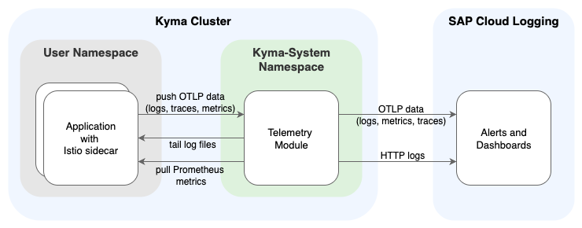

<!-- loioeac5771068bb4c25afc9ae63cd2b5ef8 -->

# Integrate With SAP Cloud Logging

Configure the Telemetry module to send logs, metrics, and traces from your cluster to an SAP Cloud Logging instance. By centralizing this data in your SAP Cloud Logging instance, you can store, visualize, and analyze the observability of your applications.


<a name="loioeac5771068bb4c25afc9ae63cd2b5ef8__prereq_esy_hvv_xbc"/>

## Prerequisites

-   Kyma as the target deployment environment, with the following modules added \(see [Adding and Deleting a Kyma Module](../50-administration-and-ops/adding-and-deleting-a-kyma-module-1b548e9.md#loio1b548e9ad4744b978b8b595288b0cb5c)\):

    -   Telemetry module

    -   To collect data from your Istio service mesh: Istio module \(default module\)

    -   SAP BTP Operator module \(default module\)


-   An instance of [SAP Cloud Logging](https://help.sap.com/docs/cloud-logging?locale=en-US&version=Cloud) with OpenTelemetry ingestion enabled. For details, see [Ingest via OpenTelemetry API Endpoint](https://help.sap.com/docs/SAP_CLOUD_LOGGING/d82d23dc499c44079e1e779c1d3a5191/fdc78af7c69246bc87315d90a061b321.html?locale=en-US).

    > ### Tip:  
    > Create the SAP Cloud Logging instance with the SAP BTP service operator \(see [Create an SAP Cloud Logging Instance through SAP BTP Service Operator](https://help.sap.com/docs/cloud-logging/cloud-logging/create-sap-cloud-logging-instance-through-sap-btp-service-operator?locale=en-US&version=Cloud)\), because it takes care of creation and rotation of the required Secret. However, you can choose any other method of creating the instance and the Secret, as long as the parameter for OTLP ingestion is enabled in the instance. For details, see [Configuration Parameters](https://help.sap.com/docs/cloud-logging/cloud-logging/configuration-parameters?locale=en-US&version=Cloud).

-   A Secret in the respective namespace in your Kyma cluster, holding the credentials and endpoints for the instance. It’s recommended that you rotate your Secret \(see [SAP BTP Security Recommendation BTP-CLS-0003](https://help.sap.com/docs/btp/sap-btp-security-recommendations-c8a9bb59fe624f0981efa0eff2497d7d/sap-btp-security-recommendations?seclist-index=BTP-CLS-0003&version=Cloud)\). In the following example, the Secret is named “sap-cloud-logging” and the namespace “sap-cloud-logging-integration”, as illustrated in the [secret-example.yaml](https://github.com/kyma-project/telemetry-manager/blob/main/docs/user/integration/sap-cloud-logging/secret-example.yaml).

-   Kubernetes CLI \(kubectl\) \(see [Install the Kubernetes Command Line Tool](https://developers.sap.com/tutorials/cp-kyma-download-cli.html)\).

-   UNIX shell or Windows Subsystem for Linux \(WSL\) to execute commands.


## Context

The Telemetry module supports shipping logs and ingesting distributed traces as well as metrics from applications and the Istio service mesh to SAP Cloud Logging.

First, set up the Telemetry module to ship the logs, traces, and metrics to your backend by deploying the pipelines and other required resources. Then, you configure Kyma dashboard integration. Finally, set up SAP Cloud Logging alerts and dashboards.

SAP Cloud Logging is an instance-based and environment-agnostic observability service to store, visualize, and analyze logs, metrics, and traces.



<a name="task_ship_logs_to_CLS"/>

<!-- task\_ship\_logs\_to\_CLS -->

## Ship Logs To SAP Cloud Logging

The Telemetry module supports two protocols for shipping logs to your backend. The method you choose determines how you configure your `LogPipeline` and which SAP Cloud Logging dashboards you can use.


<a name="task_ship_logs_to_CLS__context_sbr_b1t_pgc"/>

## Context

Choose one of the following methods to configure shipping for application and access logs

-   OpenTelemetry \(recommended\): Use the OTLP-native method for all new configurations. It provides a unified way to send logs, metrics, and traces.

-   Fluent Bit \(legacy\): Use this method only if you depend on the preconfigured `Kyma_*` dashboards in SAP Cloud Logging. These dashboards were designed for the HTTP and are not compatible with the OTLP logging output.


<a name="task_ship_logs_to_CLS__steps_drj_4xv_xbc"/>

## Procedure

**Set Up Application Logs**

1.  Deploy a `LogPipeline` for application logs:

    -   For OTLP, run:

        ```
        kubectl apply -f - <<EOF
        apiVersion: telemetry.kyma-project.io/v1alpha1
        kind: LogPipeline
        metadata:
          name: sap-cloud-logging
        spec:
          input:
            application:
              enabled: true
          output:
            otlp:
              endpoint:
                valueFrom:
                  secretKeyRef:
                    name: sap-cloud-logging
                    namespace: sap-cloud-logging-integration
                    key: ingest-otlp-endpoint
              tls:
                cert:
                  valueFrom:
                    secretKeyRef:
                      name: sap-cloud-logging
                      namespace: sap-cloud-logging-integration
                      key: ingest-otlp-cert
                key:
                  valueFrom:
                    secretKeyRef:
                      name: sap-cloud-logging
                      namespace: sap-cloud-logging-integration
                      key: ingest-otlp-key
        EOF
        ```

    -   For HTTP, run:

        ```
        kubectl apply -f - <<EOF
        apiVersion: telemetry.kyma-project.io/v1alpha1
        kind: LogPipeline
        metadata:
          name: sap-cloud-logging-application-logs
        spec:
          input:
            application:
              containers:
                exclude:
                  - istio-proxy
          output:
            http:
              dedot: true
              host:
                valueFrom:
                  secretKeyRef:
                    name: sap-cloud-logging
                    namespace: sap-cloud-logging-integration
                    key: ingest-mtls-endpoint
              tls:
                cert:
                  valueFrom:
                    secretKeyRef:
                      name: sap-cloud-logging
                      namespace: sap-cloud-logging-integration
                      key: ingest-mtls-cert
                key:
                  valueFrom:
                    secretKeyRef:
                      name: sap-cloud-logging
                      namespace: sap-cloud-logging-integration
                      key: ingest-mtls-key
              uri: /customindex/kyma
        EOF
        ```


2.  Verify that the `LogPipeline` is running:

    ```
    kubectl get logpipelines
    ```


**Set Up Istio Access Logs**

By default, Istio sidecar injection and Istio access logs are disabled in Kyma. To analyze them, you must enable them:

3.  Enable Istio sidecar injection for your workload \(see [Enabling Istio Sidecar Proxy Injection](enabling-istio-sidecar-proxy-injection-b3c6f1d.md)\).

4.  Depending on your log shipment protocol, configure the [Istio](https://istio.io/latest/docs/reference/config/telemetry/) `Telemetry` resource \(see [Configure Istio Access Logs](configure-istio-access-logs-808c167.md)\):

    -   For OTLP, set up the Istio `Telemetry` resource with the OTLP-based `kyma-logs` extension provider.

    -   For HTTP:

        1.  Set up the Istio `Telemetry` resource with the `stdout-json` extension provider.

        2.  Deploy a `LogPipeline` for Istio access logs:

            ```
            kubectl apply -f - <<EOF
            apiVersion: telemetry.kyma-project.io/v1alpha1
            kind: LogPipeline
            metadata:
              name: sap-cloud-logging-access-logs
            spec:
              input:
                application:
                  containers:
                    include:
                      - istio-proxy
              output:
                http:
                  dedot: true
                  host:
                    valueFrom:
                      secretKeyRef:
                        name: sap-cloud-logging
                        namespace: sap-cloud-logging-integration
                        key: ingest-mtls-endpoint
                  tls:
                    cert:
                      valueFrom:
                        secretKeyRef:
                          name: sap-cloud-logging
                          namespace: sap-cloud-logging-integration
                          key: ingest-mtls-cert
                    key:
                      valueFrom:
                        secretKeyRef:
                          name: sap-cloud-logging
                          namespace: sap-cloud-logging-integration
                          key: ingest-mtls-key
                  uri: /customindex/istio-envoy-kyma
            EOF
            ```

        3.  Verify that the `LogPipeline` for Istio access logs is running:

            ```
            kubectl get logpipelines
            ```


<a name="task_ship_traces_to_CLS"/>

<!-- task\_ship\_traces\_to\_CLS -->

## Ship Traces To SAP Cloud Logging

You can set up ingestion of distributed traces from applications and the Istio service mesh to the OTLP endpoint of the SAP Cloud Logging service instance.


<a name="task_ship_traces_to_CLS__steps_x1d_szv_xbc"/>

## Procedure

**Set Up Traces**

1.  Deploy a `TracePipeline`:

    ```
    kubectl apply -f - <<EOF
    apiVersion: telemetry.kyma-project.io/v1alpha1
    kind: TracePipeline
    metadata:
      name: sap-cloud-logging
    spec:
      output:
        otlp:
          endpoint:
            valueFrom:
              secretKeyRef:
                name: sap-cloud-logging
                namespace: sap-cloud-logging-integration
                key: ingest-otlp-endpoint
          tls:
            cert:
              valueFrom:
                secretKeyRef:
                  name: sap-cloud-logging
                  namespace: sap-cloud-logging-integration
                  key: ingest-otlp-cert
            key:
              valueFrom:
                secretKeyRef:
                  name: sap-cloud-logging
                  namespace: sap-cloud-logging-integration
                  key: ingest-otlp-key
    EOF
    ```

2.  Verify that the `TracePipeline` is running:

    ```
    kubectl get tracepipelines
    ```


**Set Up Istio Tracing**

By default, Istio sidecar injection and Istio tracing are disabled in Kyma. To analyze them, you must enable them:

3.  Enable Istio sidecar injection for your workload \(see [Enabling Istio Sidecar Proxy Injection](enabling-istio-sidecar-proxy-injection-b3c6f1d.md)\).

4.  Configure the [Istio](https://istio.io/latest/docs/reference/config/telemetry/) `Telemetry` resource to use the `kyma-traces` extension provider based on OTLP \(see [Configure Istio Tracing](configure-istio-tracing-3f504d8.md)\).


<a name="task_ship_metrics_to_CLS"/>

<!-- task\_ship\_metrics\_to\_CLS -->

## Ship Metrics To SAP Cloud Logging

You can set up ingestion of metrics from applications and the Istio service mesh to the OTLP endpoint of the SAP Cloud Logging service instance.


<a name="task_ship_metrics_to_CLS__steps_ylh_m1w_xbc"/>

## Procedure

1.  Deploy a `MetricPipeline`:

    ```
    kubectl apply -f - <<EOF
    apiVersion: telemetry.kyma-project.io/v1alpha1
    kind: MetricPipeline
    metadata:
      name: sap-cloud-logging
    spec:
      input:
        prometheus:
          enabled: false
        istio:
          enabled: false
        runtime:
          enabled: false
      output:
        otlp:
          endpoint:
            valueFrom:
              secretKeyRef:
                name: sap-cloud-logging
                namespace: sap-cloud-logging-integration
                key: ingest-otlp-endpoint
          tls:
            cert:
              valueFrom:
                secretKeyRef:
                  name: sap-cloud-logging
                  namespace: sap-cloud-logging-integration
                  key: ingest-otlp-cert
            key:
              valueFrom:
                secretKeyRef:
                  name: sap-cloud-logging
                  namespace: sap-cloud-logging-integration
                  key: ingest-otlp-key
    EOF
    ```

    The default configuration creates a gateway to receive OTLP metrics from your applications.

2.  **Optional:** To collect additional metrics, such as those from the runtime or Istio, configure the presets in the `input` section of the `MetricPipeline`. For the available options, see [Collecting Metrics](collecting-metrics-44ac6c5.md).

3.  Verify that the `MetricPipeline` is running:

    ```
    kubectl get metricpipelines
    ```


<a name="task_set_up_kyma_dashboard_integration"/>

<!-- task\_set\_up\_kyma\_dashboard\_integration -->

## Set Up Kyma Dashboard Integration

To add direct links from Kyma dashboard to *SAP Cloud Logging*, apply the `ConfigMap` that corresponds to your chosen log shipping method.


<a name="task_set_up_kyma_dashboard_integration__context_a1p_htz_3gc"/>

## Context

Depending on the output you use in your `LogPipeline`, apply the `ConfigMap`. If your Secret has a different name or namespace, then download the file first and adjust the namespace and name accordingly in the `dataSources` section of the file.


<a name="task_set_up_kyma_dashboard_integration__steps_jw2_hbw_xbc"/>

## Procedure

1.  If your Secret has a name or namespace different from the example, download the file and edit the `dataSources` section before you apply it.

2.  Apply the `ConfigMap`:

    -   For OTLP, run:

        ```
        kubectl apply -f https://raw.githubusercontent.com/kyma-project/telemetry-manager/main/docs/user/integration/sap-cloud-logging/kyma-dashboard-configmap.yaml
        
        ```

    -   For HTTP, run:

        ```
        kubectl apply -f https://raw.githubusercontent.com/kyma-project/telemetry-manager/main/docs/user/integration/sap-cloud-logging/kyma-dashboard-http-configmap.yaml
        
        ```


<a name="task_use_CLS_alerts"/>

<!-- task\_use\_CLS\_alerts -->

## Use SAP Cloud Logging Alerts

You can import predefined alerts for SAP Cloud Logging to monitor the health of your telemetry integration.


<a name="task_use_CLS_alerts__steps_wfs_1cw_xbc"/>

## Procedure

1.  In the SAP Cloud Logging dashboard, define a “notification channel” to receive alert notifications.

2.  To import a monitor, use the development tools of the SAP Cloud Logging dashboard.

3.  Execute `POST _plugins/_alerting/monitors`, followed by the contents of the respective JSON file.

4.  Depending on the pipelines you are using, enable some or all of the following alerts:

    The alerts are based on JSON documents defining a `Monitor` for the alerting plugin.


    <table>
    <tr>
    <th valign="top">

    Monitored Component
    
    </th>
    <th valign="top">

    File
    
    </th>
    <th valign="top">

    Description
    
    </th>
    </tr>
    <tr>
    <td valign="top">
    
    SAP Cloud Logging
    
    </td>
    <td valign="top">
    
    [alert-health.json](https://raw.githubusercontent.com/kyma-project/telemetry-manager/main/docs/user/integration/sap-cloud-logging/alert-health.json)
    
    </td>
    <td valign="top">
    
    Monitors the health of the underlying OpenSearch cluster in SAP Cloud Logging using the [cluster health API](https://opensearch.org/docs/1.3/api-reference/cluster-api/cluster-health). Triggers if the cluster status becomes **red**.
    
    </td>
    </tr>
    <tr>
    <td valign="top">
    
    SAP Cloud Logging
    
    </td>
    <td valign="top">
    
    [alert-rejection-in-progress.json](https://raw.githubusercontent.com/kyma-project/telemetry-manager/main/docs/user/integration/sap-cloud-logging/alert-rejection-in-progress.json)
    
    </td>
    <td valign="top">
    
    Monitors the `cls-rejected-*` index for new data. Triggers if new rejected data is observed.
    
    </td>
    </tr>
    <tr>
    <td valign="top">
    
    Kyma Telemetry Integration
    
    </td>
    <td valign="top">
    
    [alert-telemetry-status.json](https://raw.githubusercontent.com/kyma-project/telemetry-manager/main/docs/user/integration/sap-cloud-logging/alert-telemetry-status.json)
    
    </td>
    <td valign="top">
    
    Monitors the status of the Telemetry module. Triggers if the module reports a non-ready state.
    
    </td>
    </tr>
    <tr>
    <td valign="top">
    
    Kyma Telemetry Integration
    
    </td>
    <td valign="top">
    
    [alert-log-ingestion.json](https://raw.githubusercontent.com/kyma-project/telemetry-manager/main/docs/user/integration/sap-cloud-logging/alert-log-ingestion.json)
    
    </td>
    <td valign="top">
    
    For OTLP: Monitors the single `LogPipeline` used in the OTLP method. Triggers if log data stops flowing.
    
    </td>
    </tr>
    <tr>
    <td valign="top">
    
    Kyma Telemetry Integration
    
    </td>
    <td valign="top">
    
    [alert-app-log-ingestion.json](https://raw.githubusercontent.com/kyma-project/telemetry-manager/main/docs/user/integration/sap-cloud-logging/alert-app-log-ingestion.json)
    
    </td>
    <td valign="top">
    
    For HTTP \(legacy\): Monitors the application log `LogPipeline`. Triggers if log data stops flowing.
    
    </td>
    </tr>
    <tr>
    <td valign="top">
    
    Kyma Telemetry Integration
    
    </td>
    <td valign="top">
    
    [alert-access-log-ingestion.json](https://raw.githubusercontent.com/kyma-project/telemetry-manager/main/docs/user/integration/sap-cloud-logging/alert-access-log-ingestion.json)
    
    </td>
    <td valign="top">
    
    For HTTP \(legacy\): Monitors the Istio access log `LogPipeline`. Triggers if log data stops flowing.
    
    </td>
    </tr>
    <tr>
    <td valign="top">
    
    Kyma Telemetry Integration
    
    </td>
    <td valign="top">
    
    [alert-trace-ingestion.json](https://raw.githubusercontent.com/kyma-project/telemetry-manager/main/docs/user/integration/sap-cloud-logging/alert-trace-ingestion.json)
    
    </td>
    <td valign="top">
    
    Monitors the `TracePipeline`. Triggers if trace data stops flowing to SAP Cloud Logging.
    
    </td>
    </tr>
    <tr>
    <td valign="top">
    
    Kyma Telemetry Integration
    
    </td>
    <td valign="top">
    
    [alert-metric-ingestion.json](https://raw.githubusercontent.com/kyma-project/telemetry-manager/main/docs/user/integration/sap-cloud-logging/alert-metric-ingestion.json)
    
    </td>
    <td valign="top">
    
    Monitors the `MetricPipeline`. Triggers if metric data stops flowing to SAP Cloud Logging.
    
    </td>
    </tr>
    </table>
    
5.  After importing, edit the monitor to attach your notification channel or destination and adjust thresholds as needed.

6.  Verify that the new monitor definition is listed among the SAP Cloud Logging alerts.


<a name="task_use_CLS_dashboards"/>

<!-- task\_use\_CLS\_dashboards -->

## Use SAP Cloud Logging Dashboards

You can view logs, traces, and metrics in SAP Cloud Logging dashboards. Several dashboards come with SAP Cloud Logging, and you can import additional dashboards as needed.


<a name="task_use_CLS_dashboards__context_dzs_nmt_pgc"/>

## Context

The preconfigured `Kyma_*` dashboards in SAP Cloud Logging are compatible only with the legacy \(HTTP\) logging method.


<a name="task_use_CLS_dashboards__steps-unordered_t2w_ffw_xbc"/>

## Procedure

-   For the status of the SAP Cloud Logging integration with the Telemetry module, import the file [dashboard-status.ndjson](https://raw.githubusercontent.com/kyma-project/telemetry-manager/main/docs/user/integration/sap-cloud-logging/dashboard-status.ndjson).

-   For application logs and Istio access logs using the `http` output: Use the preconfigured dashboards prefixed with `Kyma_*`.

-   For traces, use the OpenSearch plugin “Observability”.

-   For runtime metrics, import the file [dashboard-runtime.ndjson](https://raw.githubusercontent.com/kyma-project/telemetry-manager/main/docs/user/integration/sap-cloud-logging/dashboard-runtime.ndjson).

-   For Istio Pod metrics, import the file [dashboard-istio.ndjson](https://raw.githubusercontent.com/kyma-project/telemetry-manager/main/docs/user/integration/sap-cloud-logging/dashboard-istio.ndjson).


