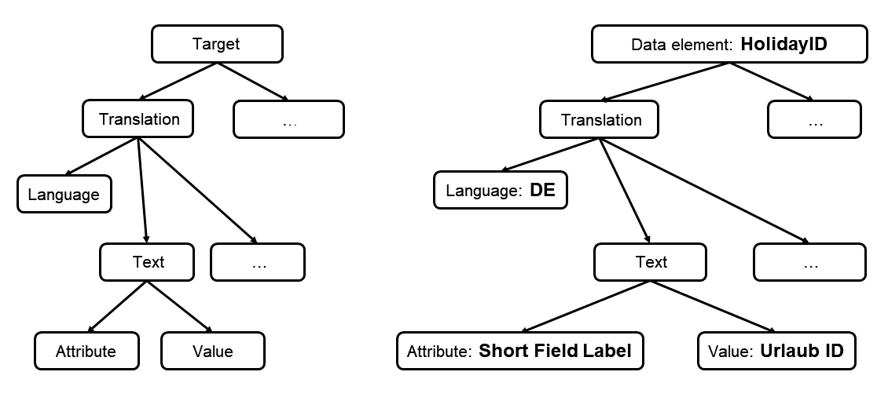

<!-- loiof22992e198f04e559c468e81e3f7a55e -->

# Internationalization

The XCO I18N APIs allow the programmatic maintenance of translations for language-dependent texts. The I18N module consists of high-level and strongly typed APIs and provides support for the following targets:

-   Domains

-   Data elements

-   Data definitions

-   Metadata extensions

-   Message classes

-   Application log objects

-   Business configuration objects

-   IAM business catalogs

-   Text pools

-   Text tables


<a name="loiof22992e198f04e559c468e81e3f7a55e__section_yph_3ky_jnb"/>

## Design of the XCO I18N APIs

The goal of the XCO I18N architecture is to provide a homogenous way to programmatically maintain and access translations for different kinds of language-dependent texts with a public API that is independent of the underlying concrete object type. The overall structure is illustrated in the following diagram:The left side of the diagram shows the general abstractions while the right side shows what the general abstractions would correspond to in the case of the short field label of a given data element. The following terminology is used:

-   Target: A collection of translations

-   Translation: A tuple consisting of a language and a collection of texts

-   Language: A language that is installed in the system and is identified by an SPRAS value

-   Text: A tuple consisting of an attribute and a value


The following sections will describe and illustrate the available targets and text attributes in more detail:


<a name="loiof22992e198f04e559c468e81e3f7a55e__section_pdb_2ly_jnb"/>

## Domains

For a given domain a single fixed value \(identified by its lower limit\) defines a target. The only available text attribute is the description of a fixed value. Here’s how the translation for language German could be maintained for the fixed value DE of domain ZCOUNTRY:

> ### Sample Code:  
> ```abap
> DATA(lo_text_attribute) = xco_cp_domain=>text_attribute->fixed_value_description.
> 
> DATA(lo_language) = xco_cp=>language( 'D' ).
> DATA(lo_text) = lo_text_attribute->create_text( xco_cp=>string( 'Deutschland' ) ).
> 
> DATA(lo_target) = xco_cp_i18n=>target->domain->fixed_value(
>   iv_domain_name = 'ZCOUNTRY'
>   iv_lower_limit = 'DE'
> ).
> 
> " Set the translation.
> lo_target->set_translation(
>   it_texts           = VALUE #( ( lo_text ) )
>   io_language        = lo_language
>   io_change_scenario = lo_transport_request
> ).
> 
> " Read the translation.
> DATA(lo_translation) = lo_target->get_translation(
>   io_language        = lo_language
>   it_text_attributes = VALUE #( ( lo_text_attribute ) )
> ).
> 
> LOOP AT lo_translation->texts INTO DATA(lo_german_text).
>   " LV_VALUE is of type STRING and contains `Deutschland`.
>   DATA(lv_value) = lo_text_attribute->if_xco_i18n_text_attribute~get_string_for_text( lo_german_text->value ).
> ENDLOOP.
> ```


<a name="loiof22992e198f04e559c468e81e3f7a55e__section_qkz_2ly_jnb"/>

## Data elements

Unlike domains, once a data element is fixed there are no more degrees of freedom for language-dependent texts as all the different field labels are directly defined on the level of the data element itself. The following example illustrates how the short field label of data element ZFIRST\_NAME can be translated to German \(first name = Vorname\) and how the translated value can be read back again:

> ### Sample Code:  
> ```abap
> DATA(lo_text_attribute) = xco_cp_data_element=>text_attribute->short_field_label.
> 
> DATA(lo_language) = xco_cp=>language( 'D' ).
> DATA(lo_text) = lo_text_attribute->create_text( xco_cp=>string( 'Vorname' ) ).
> 
> DATA(lo_target) = xco_cp_i18n=>target->data_element->object( 'ZFIRST_NAME' ).
> 
> " Set the translation.
> lo_target->set_translation(
>   it_texts           = VALUE #( ( lo_text ) )
>   io_language        = lo_language
>   io_change_scenario = lo_transport_request
> ).
> 
> " Read the translation.
> DATA(lo_translation) = lo_target->get_translation(
>   io_language        = lo_language
>   it_text_attributes = VALUE #( ( lo_text_attribute ) )
> ).
> 
> LOOP AT lo_translation->texts INTO DATA(lo_german_text).
>   " LV_VALUE is of type STRING and contains `Vorname`.
>   DATA(lv_value) = lo_text_attribute->if_xco_i18n_text_attribute~get_string_for_text( lo_german_text->value ).
> ENDLOOP.
> ```


<a name="loiof22992e198f04e559c468e81e3f7a55e__section_hg1_fly_jnb"/>

## Data definitions

For data definitions all language-dependent texts are supplied via annotations provided directly in the source of the data definition. A data definition defines the following targets:

-   Entity

-   A parameter identified by its name

-   A field identified by its name


Depending on the annotation it may be necessary to specify an array index \(e.g. UI.lineItem.label\) to fully specify a text attribute. The APIs in XCO\_CP\_DATA\_DEFINITION=\>TEXT\_ATTRIBUTE provide an easy overview of maintainable text attributes for the three different kinds of data definition targets.

The code sample below illustrates how the EndUserText.label annotation value can be translated to German for the field startDate of the CDS view entity ZVACATION\_REQUEST \(start date = Startdatum\):

> ### Sample Code:  
> ```abap
> DATA(lo_text_attribute) = xco_cp_data_definition=>text_attribute->field->endusertext_label.
> 
> DATA(lo_language) = xco_cp=>language( 'D' ).
> DATA(lo_text) = lo_text_attribute->create_text( xco_cp=>string( 'Startdatum' ) ).
> 
> DATA(lo_target) = xco_cp_i18n=>target->data_definition->field(
>   iv_entity_name = 'ZVACATION_REQUEST'
>   iv_field_name  = 'startDate'
> ).
> 
> " Set the translation.
> lo_target->set_translation(
>   it_texts           = VALUE #( ( lo_text ) )
>   io_language        = lo_language
>   io_change_scenario = lo_transport_request
> ).
> 
> " Read the translation.
> DATA(lo_translation) = lo_target->get_translation(
>   io_language        = lo_language
>   it_text_attributes = VALUE #( ( lo_text_attribute ) )
> ).
> 
> LOOP AT lo_translation->texts INTO DATA(lo_german_text).
>   " LV_VALUE is of type STRING and contains `Startdatum`.
>   DATA(lv_value) = lo_text_attribute->if_xco_i18n_text_attribute~get_string_for_text( lo_german_text->value ).
> ENDLOOP.
> ```


<a name="loiof22992e198f04e559c468e81e3f7a55e__section_t2b_dkh_n4b"/>

## Metadata extensions

Metadata extensions are structurally equivalent to data definitions in that all language-dependent texts are supplied via annotations provided directly in the source of the metadata extension and the available targets are

-   Entity

-   A parameter identified by its name

-   A field identified by its name


The maintainable text attributes are available via the XCO\_CP\_METADATA\_EXTENSION=\>TEXT\_ATTRIBUTE API.

The code sample below illustrates how the UI.lineItem.label annotation value can be translated to German for the field endDate of the metadata extension ZVACATION\_REQUEST\_EXT \(end date = Enddatum\):

> ### Sample Code:  
> ```abap
> DATA(lo_text_attribute) = xco_cp_metadata_extension=>text_attribute->field->ui_lineitem_label( 1 ).
> 
> DATA(lo_language) = xco_cp=>language( 'D' ).
> DATA(lo_text) = lo_text_attribute->create_text( xco_cp=>string( 'Enddatum' ) ).
> 
> DATA(lo_target) = xco_cp_i18n=>target->metadata_extension->field(
>   iv_metadata_extension_name  = 'ZVACATION_REQUEST_EXT'
>   iv_field_name               = 'endDate'
> ).
> 
> " Set the translation.
> lo_target->set_translation(
>   it_texts           = VALUE #( ( lo_text ) )
>   io_language        = lo_language
>   io_change_scenario = lo_transport_request
> ).
> 
> " Read the translation.
> DATA(lo_translation) = lo_target->get_translation(
>   io_language        = lo_language
>   it_text_attributes = VALUE #( ( lo_text_attribute ) )
> ).
> 
> LOOP AT lo_translation->texts INTO DATA(lo_german_text).
>   " LV_VALUE is of type STRING and contains `Enddatum`.
>   DATA(lv_value) = lo_text_attribute->if_xco_i18n_text_attribute~get_string_for_text( lo_german_text->value ).
> ENDLOOP.
> ```


<a name="loiof22992e198f04e559c468e81e3f7a55e__section_ibb_fly_jnb"/>

## Message class

Messages classes follow a structure similar to that of domains: A single message of a message class \(identified by its number\) defines a target and the only available text attribute is the short text of a message.

In the code sample below message 005 of message class ZMESSAGES \(“Record created.” = “Eintrag angelegt.”\) is translated to German:

> ### Sample Code:  
> ```abap
> DATA(lo_text_attribute) = xco_cp_message_class=>text_attribute->message_short_text.
> 
>     DATA(lo_language) = xco_cp=>language( 'D' ).
>     DATA(lo_text) = lo_text_attribute->create_text( xco_cp=>string( 'Eintrag angelegt.' ) ).
> 
>     DATA(lo_target) = xco_cp_i18n=>target->message_class->message(
>       iv_message_class_name = 'ZMESSAGES'
>       iv_message_number     = '005'
>     ).
> 
>     " Set the translation.
>     lo_target->set_translation(
>       it_texts           = VALUE #( ( lo_text ) )
>       io_language        = lo_language
>       io_change_scenario = lo_transport_request
>     ).
> 
>     " Read the translation.
>     DATA(lo_translation) = lo_target->get_translation(
>       io_language        = lo_language
>       it_text_attributes = VALUE #( ( lo_text_attribute ) )
>     ).
> 
>     LOOP AT lo_translation->texts INTO DATA(lo_german_text).
>       " LV_VALUE is of type STRING and contains `Eintrag angelegt.`.
>       DATA(lv_value) = lo_text_attribute->if_xco_i18n_text_attribute~get_string_for_text( lo_german_text->value ).
>     ENDLOOP.
> ```


<a name="loiof22992e198f04e559c468e81e3f7a55e__section_dbk_2mg_gqb"/>

## Application log objects

For a given application log object both the object itself as well as each of its subobjects act as targets. The only available text attribute is the short description. The following code sample illustrates how the German translation for the short description of the application log object Z\_PROGRESS\_RECORDING can be set and read:

> ### Sample Code:  
> ```abap
> DATA(lo_text_attribute) = xco_cp_application_log_object=>text_attribute->object->short_description.
>  
> DATA(lo_language) = xco_cp=>language( 'D' ).
> DATA(lo_text) = lo_text_attribute->create_text( xco_cp=>string( 'Fortschrittsaufzeichnung' ) ).
>  
> DATA(lo_target) = xco_cp_i18n=>target->application_log_object->object( 'Z_PROGRESS_RECORDING' ).
>  
> " Set the translation.
> lo_target->set_translation(
>   it_texts           = VALUE #( ( lo_text ) )
>   io_language        = lo_language
>   io_change_scenario = lo_transport_request
> ).
>  
> " Read the translation.
> DATA(lo_translation) = lo_target->get_translation(
>   io_language        = lo_language
>   it_text_attributes = VALUE #( ( lo_text_attribute ) )
> ).
>  
> LOOP AT lo_translation->texts INTO DATA(lo_german_text).
>   " LV_VALUE is of type STRING and contains `Fortschrittsaufzeichnung`.
>   DATA(lv_value) = lo_text_attribute->if_xco_i18n_text_attribute~get_string_for_text( lo_german_text->value ).
> ENDLOOP.
> ```

Setting and getting translations for subobjects works in completely analogous fashion by first obtaining the subobject target and then using text attribute XCO\_CP\_APPLICATION\_LOG\_OBJECT=\>TEXT\_ATTRIBUTE-\>SUBOBJECT-\>SHORT\_DESCRIPTION.


<a name="loiof22992e198f04e559c468e81e3f7a55e__section_kjv_hmg_gqb"/>

## Business configuration objects

Translations can also be maintained for business configuration objects which are available for maintenance via the "Maintain Business Configurations" Fiori app. Each business configuration object has a name and description which is visible in the Maintain Business Configurations app. The code sample below illustrates how the description of a business configuration object can be translated \(and read out\).

> ### Sample Code:  
> ```abap
> DATA(lo_text_attribute) = xco_cp_business_cnfgrtn_object=>text_attribute->description.
>  
> DATA(lo_language) = xco_cp=>language( 'D' ).
> DATA(lo_text) = lo_text_attribute->create_text( xco_cp=>string( 'Urlaubskalender' ) ).
>  
> DATA(lo_target) = xco_cp_i18n=>target->business_configuration_object->object( 'Z_HOLIDAY_CALENDAR' ).
>  
> " Set the translation.
> lo_target->set_translation(
>   it_texts           = VALUE #( ( lo_text ) )
>   io_language        = lo_language
>   io_change_scenario = lo_transport_request
> ).
>  
> " Read the translation.
> DATA(lo_translation) = lo_target->get_translation(
>   io_language        = lo_language
>   it_text_attributes = VALUE #( ( lo_text_attribute ) )
> ).
>  
> LOOP AT lo_translation->texts INTO DATA(lo_german_text).
>   " LV_VALUE is of type STRING and contains `Urlaubskalender`.
>   DATA(lv_value) = lo_text_attribute->if_xco_i18n_text_attribute~get_string_for_text( lo_german_text->value ).
> ENDLOOP.
> ```


<a name="loiof22992e198f04e559c468e81e3f7a55e__section_zt1_tw3_wrb"/>

## IAM business catalogs

Translations can also be maintained for IAM business catalogs. The only text attribute of an IAM business catalog is its description. The code sample below illustrates how the description of an IAM business catalog can be translated \(and read out\).

> ### Sample Code:  
> ```abap
> DATA(lo_text_attribute) = xco_cp_iam_business_catalog=>text_attribute->description.
> 
> DATA(lo_language) = xco_cp=>language( 'D' ).
> DATA(lo_text) = lo_text_attribute->create_text( xco_cp=>string( 'Buchhaltung' ) ).
> 
> DATA(lo_target) = xco_cp_iam=>business_catalog->for( 'Z_ACCOUNTING' )->i18n_target->object( ).
> 
> " Set the translation.
> lo_target->set_translation(
>   it_texts           = VALUE #( ( lo_text ) )
>   io_language        = lo_language
>   io_change_scenario = lo_transport_request
> ).
> 
> " Read the translation.
> DATA(lo_translation) = lo_target->get_translation(
>   io_language        = lo_language
>   it_text_attributes = VALUE #( ( lo_text_attribute ) )
> ).
> 
> LOOP AT lo_translation->texts INTO DATA(lo_german_text).
>   " LV_VALUE is of type STRING and contains `Buchhaltung`.
>   DATA(lv_value) = lo_text_attribute->if_xco_i18n_text_attribute~get_string_for_text( lo_german_text->value ).
> ENDLOOP.
> ```


<a name="loiof22992e198f04e559c468e81e3f7a55e__section_ltd_5w3_wrb"/>

## Text pools

Both classes and function groups allow the definition of text symbols which are stored in the text pool associated with the respective class or function group. Maintaining the translations for such text symbols can be accomplished like:

> ### Sample Code:  
> ```abap
> DATA(lo_text_attribute) = xco_cp_text_pool=>text_attribute->text_element_text.
> 
> DATA(lo_language) = xco_cp=>language( 'D' ).
> DATA(lo_text) = lo_text_attribute->create_text( xco_cp=>string( 'Auftrag abgeschickt.' ) ).
> 
> DATA(lo_target) = xco_cp_i18n=>target->text_pool->class_text_symbol(
>   iv_class_name     = 'ZCL_MY_CLASS'
>   iv_text_symbol_id = '001'
> ).
> 
> " Set the translation.
> lo_target->set_translation(
>   it_texts           = VALUE #( ( lo_text ) )
>   io_language        = lo_language
>   io_change_scenario = lo_transport_request
> ).
> 
> " Read the translation.
> DATA(lo_translation) = lo_target->get_translation(
>   io_language        = lo_language
>   it_text_attributes = VALUE #( ( lo_text_attribute ) )
> ).
> 
> LOOP AT lo_translation->texts INTO DATA(lo_german_text).
>   " LV_VALUE is of type STRING and contains `Auftrag abgeschickt.`.
>   DATA(lv_value) = lo_text_attribute->if_xco_i18n_text_attribute~get_string_for_text( lo_german_text->value ).
> ENDLOOP.
> ```

In the above example the German translation is maintained for the text of text symbol 001 \(the original text is "Request sent."\) of class `ZCL_MY_CLASS`. If the text symbol belonged to a function group instead of a class the code would look like:

> ### Sample Code:  
> ```abap
> DATA(lo_text_attribute) = xco_cp_text_pool=>text_attribute->text_element_text.
> 
> DATA(lo_language) = xco_cp=>language( 'D' ).
> DATA(lo_text) = lo_text_attribute->create_text( xco_cp=>string( 'Auftrag abgeschickt.' ) ).
> 
> DATA(lo_target) = xco_cp_i18n=>target->text_pool->function_group_text_symbol(
>   iv_function_group_name = 'ZMY_FNCTN_GRP'
>   iv_text_symbol_id		 = '001'
> ).
> 
> " Set the translation.
> lo_target->set_translation(
>   it_texts           = VALUE #( ( lo_text ) )
>   io_language        = lo_language
>   io_change_scenario = lo_transport_request
> ).
> 
> " Read the translation.
> DATA(lo_translation) = lo_target->get_translation(
>   io_language        = lo_language
>   it_text_attributes = VALUE #( ( lo_text_attribute ) )
> ).
> 
> LOOP AT lo_translation->texts INTO DATA(lo_german_text).
>   " LV_VALUE is of type STRING and contains `Auftrag abgeschickt.`.
>   DATA(lv_value) = lo_text_attribute->if_xco_i18n_text_attribute~get_string_for_text( lo_german_text->value ).
> ENDLOOP.
> ```


<a name="loiof22992e198f04e559c468e81e3f7a55e__section_x4r_lqn_gpb"/>

## Text tables

Any database table with delivery class C or S which has exactly one key field with the underlying ABAP Dictionary built-in type LANG is considered a text table and can act as a source of targets. Each key field of a text table is uniquely associated with one of the following three groups:

-   Client key field

-   Master key fields

-   Language key field


The semantics are such that a full specification of all master key fields of a text table defines a target and that each non-key field which is character-like and has at least length 2 is considered a text attribute of that target.

As an example, consider the database table ZXCO\_CAL\_HOLITXT which contains the language-dependent texts for public holidays maintained in database table ZXCO\_CAL\_HLDY:

\{ZXCO\_CAL\_HLDY\}

\{ZXCO\_CAL\_HOLITXT\}

Here CLIENT is the client key field of the text table ZXCO\_CAL\_HOLITXT, HOLIDAY\_ID is the master key field and LANGUAGE is the language key field. Fixing a value for the HOLIDAY\_ID key field \(e.g. “CHRISTMAS”\) determines a target for which the text attribute DESCRIPTION can then be read and written, as is illustrated by the code sample below:

> ### Sample Code:  
> ```abap
> DATA(lo_language) = xco_cp=>language( 'D' ).
> DATA(lo_text) = xco_cp=>string( 'Weihnachten' ).
> 
> DATA(lo_target) = xco_cp_i18n=>target->text_table->record(
>   iv_database_table_name     = 'ZCAL_XCO_HOLITXT'
>   it_master_key_fields       = VALUE #( ( name = 'HOLIDAY_ID' value = xco_cp=>data_object->for( 'CHRISTMAS' ) ) )
>   iv_language_key_field_name = 'LANGUAGE'
> ).
> 
> " Set the translation.
> lo_target->set_translation(
>   it_texts           = VALUE #( ( attribute = 'DESCRIPTION' value = lo_text ) )
>   io_language        = lo_language
>   io_change_scenario = lo_transport_request
> ).
> 
> " Read the translation.
> DATA(lo_translation) = lo_target->get_translation(
>   io_language        = lo_language
>   it_text_attributes = VALUE #( ( 'DESCRIPTION' ) )
> ).
> 
> LOOP AT lo_translation->texts INTO DATA(lo_german_text).
>   " LV_VALUE is of type STRING and contains `Weihnachten`.
>   DATA(lv_value) = lo_german_text->get_string_value( ).
> ENDLOOP.
> ```

