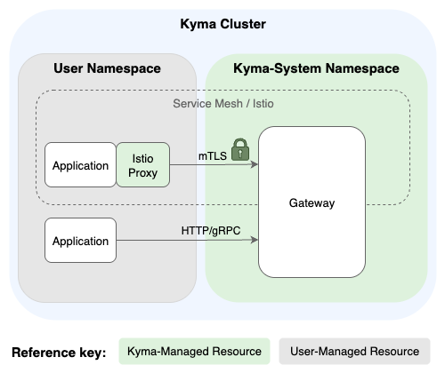
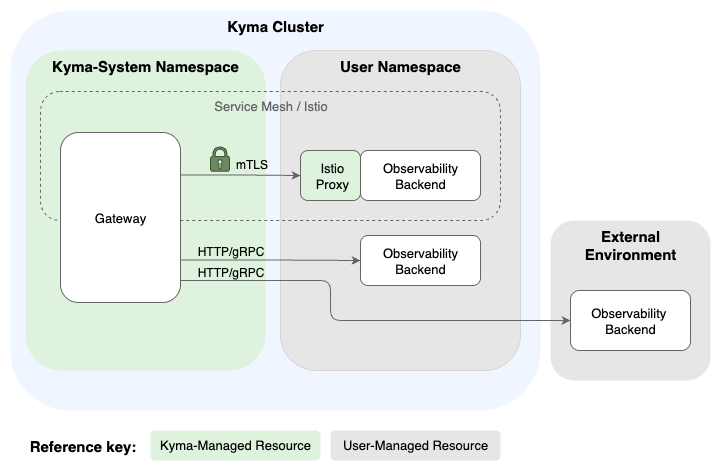

<!-- loiod31499b9af91402b8d3f99db6d2e9879 -->

# Istio Integration

When you have the Istio module in your cluster, the Telemetry module automatically integrates with it. It detects the Istio installation and injects sidecars into the Telemetry components, adding them to the service mesh. This enables secure mTLS communication for your Telemetry pipelines by default.

<a name="loiod31499b9af91402b8d3f99db6d2e9879__section_receiving_data_from_apps"/>

## Receiving Data from Your Applications

The Telemetry gateways are automatically configured to accept OTLP data from applications both inside and outside the Istio service mesh. To achieve this, the ingestion endpoints of gateways are set to Istio's permissive mode, so they accept mTLS-based communication as well as plain text.

-   Applications within the mesh automatically send data to the gateways using mTLS for a secure, encrypted connection.

-   Applications outside the mesh can send data to the gateway using a standard plain text connection.

> ### Tip:  
> Learn more about Istio-specific input configuration for logs, traces, and metrics:
> 
> -   [Configure Istio Access Logs](configure-istio-access-logs-808c167.md)
> 
> -   [Configure Istio Tracing](configure-istio-tracing-3f504d8.md)
> 
> -   [Collect Istio Metrics](collect-istio-metrics-aa786e0.md)

<a name="loiod31499b9af91402b8d3f99db6d2e9879__section_sending_data_to_incluster_backends"/>

## Sending Data to In-Cluster Backends

Telemetry gateways automatically secure the connection when sending data to your observability backends.

If you're using an in-cluster backend that is part of the Istio mesh, the Telemetry gateways automatically use mTLS to send data to the backend securely. You don't need any special configuration for this.

For sending data to backends outside the cluster, see [Integrate With Your OTLP Backend](integrate-with-your-otlp-backend-e726417.md).

