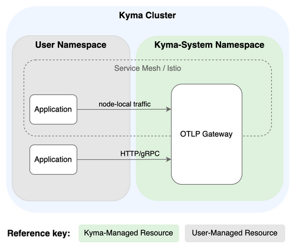
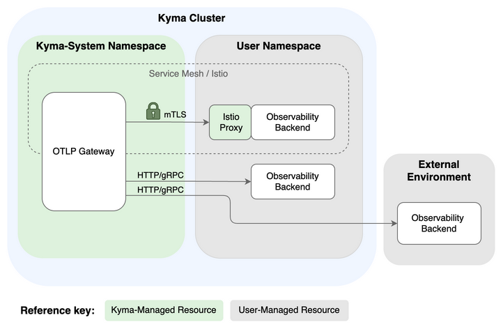

<!-- loiod31499b9af91402b8d3f99db6d2e9879 -->

# Istio Integration

When you have the Istio module in your cluster, the Telemetry module automatically integrates with it. It detects the Istio installation and configures the Telemetry components accordingly, enabling secure mTLS communication for outbound data export by default.

<a name="loiod31499b9af91402b8d3f99db6d2e9879__section_receiving_data_from_apps"/>

## Receiving Data from Your Applications

The OTLP Gateway runs as a DaemonSet, with one instance on each cluster node. To ensure that telemetry data from your applications stays on the same node, the ingestion Service uses the Kubernetes `internalTrafficPolicy` \(see [Service Internal Traffic Policy](https://kubernetes.io/docs/concepts/services-networking/service-traffic-policy/#using-service-internal-traffic-policy)\). By setting this policy to *Local*, data that your applications send is always received by the gateway instance on the same node.

Because the data path stays within a single node, Istio sidecars and mTLS are not required on the ingestion path. Applications can push data to the OTLP Gateway over a plain-text connection regardless of whether they are part of the Istio mesh.

> ### Tip:  
> Learn more about Istio-specific input configuration for logs, traces, and metrics:
> 
> -   [Configure Istio Access Logs](configure-istio-access-logs-808c167.md)
> 
> -   [Configure Istio Tracing](configure-istio-tracing-3f504d8.md)
> 
> -   [Collect Istio Metrics](collect-istio-metrics-aa786e0.md)

<a name="loiod31499b9af91402b8d3f99db6d2e9879__section_node_local_ingestion_security"/>

## Node-Local Ingestion Security

The OTLP Gateway's node-local ingestion path provides the following security properties:

-   No cross-node traffic on ingestion: The Service routes traffic only to the local node's gateway Pod. Telemetry data does not travel over the node-to-node network.

-   Kernel-level network isolation: Pod-to-pod communication on the same node uses virtual network interfaces connected through a virtual bridge in the node's root network namespace. To intercept this traffic, an attacker needs root access to the node's network namespace or a man-in-the-middle position, which means the node is already compromised.

-   No mTLS required for ingestion: Because the data path stays within a single node, mTLS encryption is not needed. This improves performance by removing the Istio sidecar from the ingestion path, without creating a security risk.

> ### Note:  
> These properties apply only to the ingestion path \(applications pushing data to the OTLP Gateway\). For the export path \(the OTLP Gateway sending data to your backend\), mTLS is still used automatically when the backend is part of the Istio mesh. See [Sending Data to In-Cluster Backends](istio-integration-d31499b.md#loiod31499b9af91402b8d3f99db6d2e9879__section_sending_data_to_incluster_backends).

<a name="loiod31499b9af91402b8d3f99db6d2e9879__section_sending_data_to_incluster_backends"/>

## Sending Data to In-Cluster Backends

The OTLP Gateway automatically secures the connection when sending data to your observability backends.

If you use an in-cluster backend that is part of the Istio mesh, the OTLP Gateway automatically uses mTLS to send data to the backend securely. You don't need any special configuration for this.

For sending data to backends outside the cluster, see [Integrate With Your OTLP Backend](integrate-with-your-otlp-backend-e726417.md).

