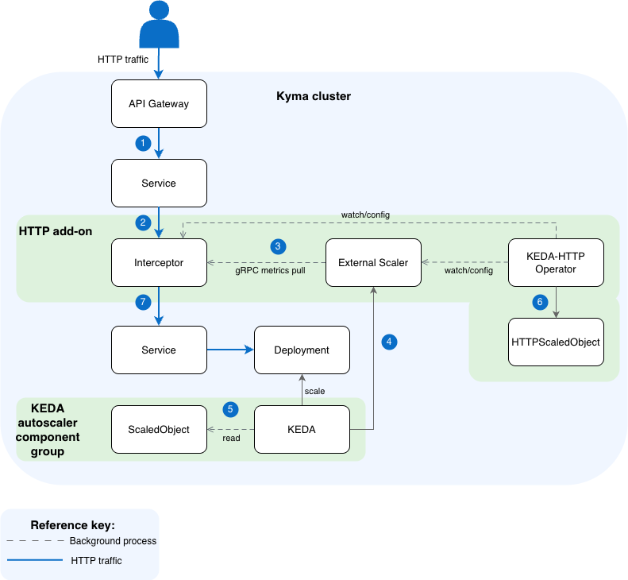

<!-- loio45cb806a9667487e95df843736828d96 -->

# KEDA HTTP Add-on

The KEDA HTTP Add-on extends KEDA with the ability to scale HTTP workloads to and from zero based on incoming request rate.


<a name="loio45cb806a9667487e95df843736828d96__section_overview_rcc"/>

## Overview

The [KEDA HTTP Add-on](https://github.com/kedacore/http-add-on) extends KEDA with the ability to scale HTTP workloads to and from zero based on incoming request rate. It works by placing an **Interceptor proxy** in front of your application that counts, queues, and forwards HTTP requests — enabling true scale-to-zero without losing any requests.


<a name="loio45cb806a9667487e95df843736828d96__section_architecture_rcc"/>

## Architecture

The HTTP Add-on consists of three components:


<table>
<tr>
<th valign="top">

Component

</th>
<th valign="top">

Role

</th>
</tr>
<tr>
<td valign="top">

`Interceptor`

</td>
<td valign="top">

A reverse proxy that sits in front of your application. It counts incoming requests, queues them when the target has 0 replicas, and forwards them once the target is ready.

</td>
</tr>
<tr>
<td valign="top">

`Scaler` \(External Scaler\)

</td>
<td valign="top">

Exposes request-rate metrics to KEDA via gRPC so KEDA can make scaling decisions.

</td>
</tr>
<tr>
<td valign="top">

`Operator`

</td>
<td valign="top">

Watches `HTTPScaledObject` resources and configures the Interceptor routing and KEDA `ScaledObject`s.

</td>
</tr>
</table>

**Request flow:**



1.  An HTTP request arrives at the API Gateway, which routes traffic to the `Interceptor`'s `Service`.
2.  The `Interceptor` receives the request, counts it, and queues it if the target workload has 0 replicas.
3.  The `External Scaler` pulls request count metrics from the `Interceptor` via gRPC.
4.  KEDA reads metrics from the `External Scaler` and scales the target `Deployment` accordingly \(including to/from zero\).
5.  KEDA reconciles the `ScaledObject` \(auto-created from `HTTPScaledObject`\) to manage the scaling behavior.
6.  The KEDA-HTTP Operator watches `HTTPScaledObject` resources and configures all add-on components \(Interceptor routing, `ScaledObject`, `External Scaler`\).
7.  Once the `Deployment` has ready replicas, the `Interceptor` forwards the queued request to the application `Service`, which routes it to the running `Pod`.


<a name="loio45cb806a9667487e95df843736828d96__section_enabling_disabling_rcc"/>

## Enabling and Disabling the HTTP Add-on

Enable the HTTP Add-on by annotating the `Keda` custom resource \(CR\):

```
kubectl annotate keda default \
  keda.kyma-project.io/addon-enabled=true \
  keda.kyma-project.io/addon-namespace=keda
```


<a name="loio45cb806a9667487e95df843736828d96__section_annotations_ref_rcc"/>

## Annotations Reference


<table>
<tr>
<th valign="top">

Annotation

</th>
<th valign="top">

Required

</th>
<th valign="top">

Description

</th>
</tr>
<tr>
<td valign="top">

`keda.kyma-project.io/addon-enabled`

</td>
<td valign="top">

Yes

</td>
<td valign="top">

Set to *true* to install, *false* to uninstall.

</td>
</tr>
<tr>
<td valign="top">

`keda.kyma-project.io/addon-namespace`

</td>
<td valign="top">

No

</td>
<td valign="top">

Namespace where the add-on is installed. Defaults to `kyma-system`.

</td>
</tr>
<tr>
<td valign="top">

`keda.kyma-project.io/addon-istio-injection`

</td>
<td valign="top">

No

</td>
<td valign="top">

Set to *true* to enable Istio sidecar injection on the add-on `Deployment`s. Defaults to *false* — the add-on `Deployment`s are annotated with `sidecar.istio.io/inject`: *"false"* unless this annotation is explicitly set to *true*. When enabled, the `Interceptor` `Deployment` also receives `traffic.sidecar.istio.io/excludeInboundPorts`: *"9090"* to prevent the sidecar from intercepting internal gRPC traffic.

</td>
</tr>
</table>


<a name="loio45cb806a9667487e95df843736828d96__section_changing_namespace_rcc"/>

## Changing the Installation Namespace

To move the HTTP Add-on to a different namespace, update the `addon-namespace` annotation:

```
kubectl annotate keda default \
  keda.kyma-project.io/addon-namespace=my-new-namespace --overwrite
```

The controller detects the namespace change, removes only the HTTP Add-on resources from the old namespace \(other `Deployments`s `Services`, and so on in that namespace are not affected\), creates the new namespace, if it doesn't exist, with `istio-injection=enabled`, and installs the HTTP Add-on in the new namespace.


<a name="loio45cb806a9667487e95df843736828d96__section_disabling_rcc"/>

## Disabling the HTTP Add-on

To disable the HTTP Add-on, run:

```
kubectl annotate keda default \
  keda.kyma-project.io/addon-enabled=false --overwrite
```

This removes all add-on resources from the cluster. Only the resources managed by the HTTP Add-on are removed. Other workloads in the namespace are not affected.


<a name="loio45cb806a9667487e95df843736828d96__section_configuring_rcc"/>

## Configuring the HTTP Add-on

The HTTP Add-on components are configured using environment variables on their `Deployments`. You can customize them by patching the respective `Deployment` after installation.


<a name="loio45cb806a9667487e95df843736828d96__section_interceptor_timeouts_rcc"/>

## Interceptor Timeouts

The most important configuration options are the `Interceptor`'s timeout settings. These control how long the `Interceptor` waits during a cold start and when to forward requests to your application.


<table>
<tr>
<th valign="top">

Environment Variable

</th>
<th valign="top">

Default

</th>
<th valign="top">

Description

</th>
</tr>
<tr>
<td valign="top">

`KEDA_HTTP_REQUEST_TIMEOUT`

</td>
<td valign="top">

*0s* \(unlimited\)

</td>
<td valign="top">

Total wall-clock deadline from request arrival to response completion. When *0*, there is no total request deadline — the request can wait indefinitely for scale-up.

</td>
</tr>
<tr>
<td valign="top">

`KEDA_HTTP_READINESS_TIMEOUT`

</td>
<td valign="top">

*0s* \(unlimited\)

</td>
<td valign="top">

How long to wait for the backing workload to have ≥1 ready replicas before giving up. When *0*, the readiness wait is bounded only by the request timeout, giving the full request budget to cold starts.

</td>
</tr>
<tr>
<td valign="top">

`KEDA_HTTP_RESPONSE_HEADER_TIMEOUT`

</td>
<td valign="top">

*300s*

</td>
<td valign="top">

How long to wait for response headers from the backend after the request is forwarded. Acts as a safety net against hung backends. Set to *0* to disable.

</td>
</tr>
<tr>
<td valign="top">

`KEDA_HTTP_CONNECT_TIMEOUT`

</td>
<td valign="top">

*500ms*

</td>
<td valign="top">

Per-attempt TCP dial timeout when connecting to the backend. Bounded by the request context deadline.

</td>
</tr>
</table>

> ### Note:  
> If `KEDA_HTTP_REQUEST_TIMEOUT` is set to *0* \(default\), the `Interceptor` waits indefinitely for the target to scale up. This is the recommended setting when using the EnvoyFilter retry policy, as the retry policy on the Ingress Gateway side handles client-facing timeouts.


<a name="loio45cb806a9667487e95df843736828d96__section_connection_pool_rcc"/>

## Interceptor Connection Pool

The following settings control the `Interceptor`'s internal HTTP connection pool to backend services:


<table>
<tr>
<th valign="top">

Environment Variable

</th>
<th valign="top">

Default

</th>
<th valign="top">

Description

</th>
</tr>
<tr>
<td valign="top">

`KEDA_HTTP_MAX_IDLE_CONNS`

</td>
<td valign="top">

*1000*

</td>
<td valign="top">

Max idle connections across all backend services. Increase if you proxy to many unique backends.

</td>
</tr>
<tr>
<td valign="top">

`KEDA_HTTP_MAX_IDLE_CONNS_PER_HOST`

</td>
<td valign="top">

*200*

</td>
<td valign="top">

Max idle connections per backend service. Increase if you observe many new connection establishments under load.

</td>
</tr>
<tr>
<td valign="top">

`KEDA_HTTP_FORCE_HTTP2`

</td>
<td valign="top">

*false*

</td>
<td valign="top">

Force HTTP/2 for all upstream connections.

</td>
</tr>
</table>


<a name="loio45cb806a9667487e95df843736828d96__section_interceptor_behavior_rcc"/>

## Interceptor Behavior


<table>
<tr>
<th valign="top">

Environment Variable

</th>
<th valign="top">

Default

</th>
<th valign="top">

Description

</th>
</tr>
<tr>
<td valign="top">

`KEDA_HTTP_ENABLE_COLD_START_HEADER`

</td>
<td valign="top">

*true*

</td>
<td valign="top">

When enabled, the `Interceptor` adds an `X-KEDA-HTTP-Cold-Start: true` response header if the request triggered a scale-from-zero. Useful for observability.

</td>
</tr>
<tr>
<td valign="top">

`KEDA_HTTP_LOG_REQUESTS`

</td>
<td valign="top">

*false*

</td>
<td valign="top">

Log every incoming request \(for debugging\).

</td>
</tr>
</table>


<a name="loio45cb806a9667487e95df843736828d96__section_scaler_config_rcc"/>

## Scaler Configuration

The `External Scaler` component has the following key settings:


<table>
<tr>
<th valign="top">

Environment Variable

</th>
<th valign="top">

Default

</th>
<th valign="top">

Description

</th>
</tr>
<tr>
<td valign="top">

`KEDA_HTTP_QUEUE_TICK_DURATION`

</td>
<td valign="top">

*500ms*

</td>
<td valign="top">

How often the scaler fetches request counts from the `Interceptor`. Lower values give faster scaling reactions but increase gRPC traffic.

</td>
</tr>
<tr>
<td valign="top">

`KEDA_HTTP_SCALER_STREAM_INTERVAL_MS`

</td>
<td valign="top">

*200*

</td>
<td valign="top">

Interval \(ms\) between metric stream updates sent to KEDA.

</td>
</tr>
</table>


<a name="loio45cb806a9667487e95df843736828d96__section_usage_rcc"/>

## Usage: HTTPScaledObject

After the add-on is installed, create an `HTTPScaledObject` to configure scaling for your workload:

```
apiVersion: http.keda.sh/v1alpha1
kind: HTTPScaledObject
metadata:
  name: my-app
  namespace: my-namespace
spec:
  hosts:
  - "my-app.example.com"
  pathPrefixes:
  - /
  scaleTargetRef:
    name: my-app
    kind: Deployment
    apiVersion: apps/v1
    service: my-app
    port: 8080
  replicas:
    min: 0
    max: 10
  scalingMetric:
    requestRate:
      targetValue: 10
      granularity: "1s"
      window: "1m"
```

Key fields:

-   `replicas.min`: *0* — enables scale-to-zero.
-   `scalingMetric.requestRate.targetValue` — number of requests per second per replica that triggers scale-out.
-   `scalingMetric.requestRate.window` — time window over which request rate is averaged.


## Limitations and Throughput Considerations


### Interceptor Is a Proxy in the Data Path

Every request to your application goes through the `Interceptor`. This adds:

-   **Latency:** Approximately 1–5ms per request in steady state \(non-cold-start\).
-   **Resource overhead:** The `Interceptor` consumes CPU and memory proportional to the request rate.


### Interceptor Queue Capacity

When the target is at 0 replicas, the `Interceptor` queues incoming requests **in memory**. Limits:

-   There is **no configurable queue size limit** — all requests are queued until the `Pod` comes up or the request times out.
-   **Memory pressure:** Under high burst traffic to a scaled-to-zero workload, the `Interceptor` may consume significant memory. If it OOMs, all queued requests are lost.
-   **Request timeout:** The `Interceptor` has a default forwarding timeout \(configurable via `KEDA_HTTP_DEFAULT_TIMEOUT`, default *3000ms* for the connect phase\). Requests exceeding this timeout after forwarding are dropped.


### Scaling Latency \(Cold Start Time\)

The time from first request to successful response depends on:

-   **KEDA polling interval:** Default 15 seconds \(configured via `pollingInterval` on the `ScaledObject`\). This is the delay before KEDA detects pending requests.
-   **Pod startup time:** Container pull, init containers, readiness probes, Istio sidecar injection \(typically 10–60 seconds\).
-   **Cooldown period:** After traffic stops, KEDA waits the `cooldownPeriod` \(default 300 seconds\) before scaling to zero.

**Total cold-start latency:** Typically 15–90 seconds depending on your `Pod`'s startup time.

In an Istio mesh, the cold-start window can also cause ***502*** or ***503*** errors returned to the client. For details and the required EnvoyFilter configuration, see [HTTP Add-on Returns 503 Errors During Cold Start](http-add-on-returns-503-errors-during-cold-start-c1834fd.md).


### No Persistent Queue

Queued requests are stored in-memory. If the `Interceptor` `Pod` restarts or is evicted:

-   All queued requests are **lost**.
-   There is no at-least-once delivery guarantee.


<a name="loio45cb806a9667487e95df843736828d96__section_summary_rcc"/>

## Summary Table


<table>
<tr>
<th valign="top">

Aspect

</th>
<th valign="top">

Value / Behavior

</th>
</tr>
<tr>
<td valign="top">

Added latency \(steady state\)

</td>
<td valign="top">

~1–5ms

</td>
</tr>
<tr>
<td valign="top">

Cold-start latency

</td>
<td valign="top">

15–90 seconds \(depends on `Pod` startup\)

</td>
</tr>
<tr>
<td valign="top">

Queue persistence

</td>
<td valign="top">

In-memory only \(lost on restart\)

</td>
</tr>
<tr>
<td valign="top">

Max queue size

</td>
<td valign="top">

Unlimited \(bounded by memory\)

</td>
</tr>
<tr>
<td valign="top">

KEDA polling interval

</td>
<td valign="top">

15s default \(configurable\)

</td>
</tr>
<tr>
<td valign="top">

Cooldown before scale-to-zero

</td>
<td valign="top">

300s default \(configurable\)

</td>
</tr>
</table>

**Related Information**  


[KEDA HTTP Add-on GitHub](https://github.com/kedacore/http-add-on)

[Scale-to-Zero Example](https://github.com/kyma-project/keda-manager/tree/main/examples/scale-to-zero-with-keda)

[HTTP Add-on Returns 503 Errors During Cold Start](http-add-on-returns-503-errors-during-cold-start-c1834fd.md)

