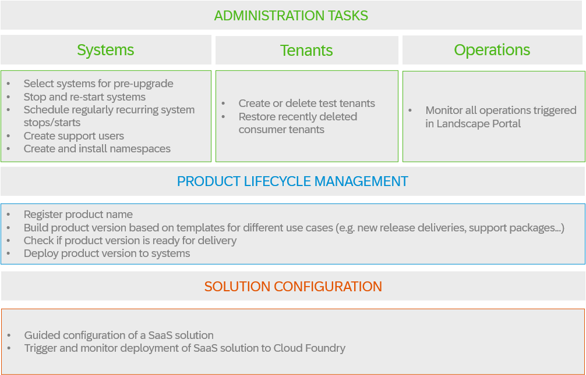

<!-- loio5eb70fb003954619b09224167a0afaa4 -->

# Landscape Portal

The [Landscape Portal](https://help.sap.com/docs/sap-btp-abap-environment/landscape-portal/landscape-portal) acts as a central tool to allow service providers to perform administration tasks such as hibernating systems, creating test tenants and support users, selecting systems for a pre-upgrade, but also lifecycle management operations such as building, deploying and updating product versions, and even guides you through the configuration and deployment of multitenant SaaS solutions.

For more information about how to access and use the Landscape Portal, see [Landscape Portal](https://help.sap.com/docs/sap-btp-abap-environment/landscape-portal/landscape-portal).

