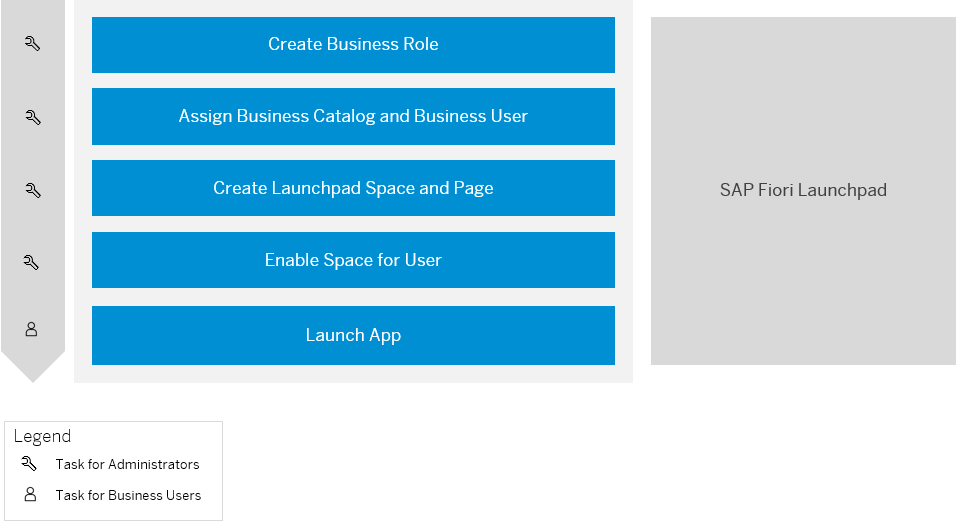

<!-- loioea41912278ea4525adc3ddd4e4f7988a -->

# Launch Your App in SAP Fiori Launchpad

<a name="loioea41912278ea4525adc3ddd4e4f7988a__section_p1q_dll_xrb"/>

## Prerequisites

You have cloned a software component of type *Business Configuration* in the *Manage Software Components* app.

1.  As an administrator in the SAP Fiori launchpad of your ABAP system, create a business role with the *Maintain Business Roles* app. See [Maintain Business Roles](../50-administration-and-ops/maintain-business-roles-8980ad0.md).
2.  Assign a business catalog and business user to the business role. See [Maintain Business Users](../50-administration-and-ops/maintain-business-users-e40e710.md).
3.  In the *Export Customizing Transports* app, create a transport request of type *Customizing Request*. See [Export Customizing Transports](../50-administration-and-ops/export-customizing-transports-fa7366c.md).

    > ### Note:  
    > Make sure that business catalog `SAP_CORE_BC_BCT_TRN_MNG_PC` and `SAP_CORE_BC_BCT_TRN_REL_PC` are assigned to your administrator user.

4.  Create a launchpad space and page. See [Managing Launchpad Spaces and Pages](https://help.sap.com/products/BTP/10fd1742ea914256abedb34bf15bd069/e55f5cc8ccec490f83a00284659bce9f.html).
    -   \(Option 1\) Use the *Manage Launchpad Spaces* and *Manage Launchpad Pages* app, assign the default transport request, and save the space and page. Then, assign the created space and page to a business role by using the *Maintain Business Roles* app. See [How to Create and Assign Spaces and Pages](https://help.sap.com/products/BTP/10fd1742ea914256abedb34bf15bd069/a2318ca9a44b474daadaad85feb2f364.html).

        > ### Note:  
        > To use the *Manage Launchpad Spaces* and *Manage Launchpad Pages* app, your user must be assigned to business catalog `SAP_CORE_BC_UI_FLD` *User Interface - Fiori Launchpad Design*. See [Manage Launchpad Spaces](https://help.sap.com/products/BTP/10fd1742ea914256abedb34bf15bd069/ad119b284f8249cfb4c3fc86c76404c5.html?version=Cloud) and [Manage Launchpad Pages](https://help.sap.com/products/BTP/10fd1742ea914256abedb34bf15bd069/8a174e235493472095c0bcec957dfee0.html?version=Cloudhttps://help.sap.com/products/BTP/10fd1742ea914256abedb34bf15bd069/8a174e235493472095c0bcec957dfee0.html?version=Cloud).

        > ### Note:  
        > The space and page name should start with ***z***.

    -   \(Option 2\) Use the *Maintain Business Roles* app. See [Step by Step: Create a New Space and Page for a Business Role](https://help.sap.com/products/BTP/10fd1742ea914256abedb34bf15bd069/ab05d9e086554a08af88d6482deb1bcb.html?version=Cloud).

5.  Enable spaces for your user. See [Enabling Spaces](https://help.sap.com/viewer/10fd1742ea914256abedb34bf15bd069/Cloud/en-US/64a5e1675ce7413791a654d2228a90be.html "There are two parameters and one user setting that influence if the launchpad uses spaces or the home page for displaying the apps.") :arrow_upper_right:. Optionally, you can personalize and adapt the user interface of your app for all users. See [Personalizing and Adapting Apps](https://help.sap.com/viewer/fd8f9fda63fa4c7a92bb1d4b4ac5582c/Cloud/en-US/e144c749695545eba5d5479a40357fa6.html "When running an app in the SAP Fiori launchpad, end users can personalize object pages and key users can adapt the user interface for all users of the app (for example, a team lead can add a field that&apos;s then available for all team members).") :arrow_upper_right:.
6.  As a business user, you can launch the app.

**Related Information**  

[Tutorial: Integrate List Report into ABAP Fiori Launchpad](https://developers.sap.com/tutorials/abap-environment-abap-flp.html)

[Tutorial: Managing Launchpad Spaces and Pages](https://education.hana.ondemand.com/education/pub/s4/index.html?library=library.txt&show=project!PR_4DFA77D97EA8389A)

