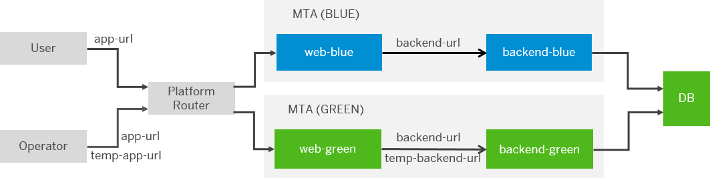
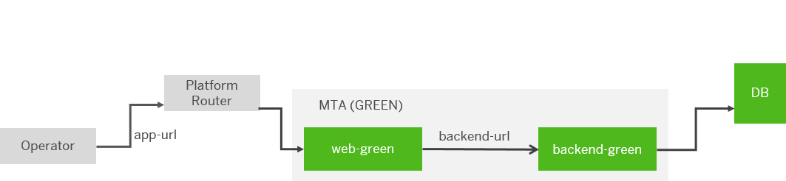

<!-- loio764308c52e68488dac848bae93e9137b -->

# Legacy Blue-Green Deployment

Use the legacy blue-green deployment strategy of Multitarget applications.


<a name="loio764308c52e68488dac848bae93e9137b__prereq_ujy_2sb_2lb"/>

## Prerequisites

> ### Restriction:  
> Blue-green deployment is supported only for Cloud Foundry applications. It is not supported for bound services, such as service instances and their configuration, workflow content, and HTML5 repository content, among others. Live and idle applications are bound to the same service instances.

-   You have a previously deployed MTA, with functional productive applications and routes:

    

-   You have ensured that the changes in the new version of the application are compatible with the old version. This includes changes in the database tables, UAA configurations, and so on.


<a name="loio764308c52e68488dac848bae93e9137b__steps_ryh_k2m_qcb"/>

## Procedure

1.  Deploy your updated MTA \(the green version\) by executing the `cf bg-deploy <your-mta-archive-v2>` command.

    The first action is that all MTA services are updated.

    This action:

    -   creates new applications adding “green” to their existing application names
    -   creates temporary routes to the “green” applications.

        

    -   interrupts the process showing a message similar to the following:

        > ### Output Code:  
        > ```
        > Process needs additional user input
        > Use "cf bg-deploy -i 469520 -a resume" to resume the process
        > Use "cf bg-deploy -i 469520 -a abort" to abort the process
        > ```


2.  Optionally, test the “green” version using the temporary routes.

    > ### Note:  
    > You can skip this step by using one of the following command line options:
    > 
    > -   `--no-confirm` - you have to use it when starting the process.
    > 
    > -   `--skip-idle-start` - this option will also skip the start of the newly deployed applications on temporary routes.

3.  If you do not want to make the “green” version available, abort the process using `cf deploy -i <operation ID> -a abort`.

    > ### Note:  
    > This action does not perform a rollback and the state of apps, routes and services remains unchaged. Depending on your needs, you might want to remove the new app versions and the temporary routes.

4.  To make the “green” version productive, choose *Resume*.

    This action:

    -   maps the productive routes to your green versions

        

    -   deletes the temporary routes
    -   restarts “green” apps with productive route configurations
    -   restarts the applications, so that the environment URLs are updated
    -   deletes the “blue” applications, which were productive before

    


<a name="loio764308c52e68488dac848bae93e9137b__result_yx4_fmd_bdc"/>

## Results

For more detailed information and example results of the legacy blue-green deployment process, see [Legacy Blue-Green Deployment](https://github.com/SAP-samples/cf-mta-examples/tree/main/blue-green-deploy-legacy#legacy-blue-green-deployment).

**Related Information**  


[Blue-Green Deployment of Multitarget Applications](blue-green-deployment-of-multitarget-applications-772ab72.md "Use the blue-green deployment technique by running two identical production environments, allowing seamless updates without downtime for Cloud Foundry Multitarget applications.")

[Blue-Green Deployment Strategy](blue-green-deployment-strategy-7c83810.md "Use the current blue-green deployment of Multitarget applications.")

[](https://help.sap.com/viewer/65de2977205c403bbc107264b8eccf4b/Cloud/en-US/2e4dfeded960446da4aa1c0b734fc81b.html "") :arrow_upper_right:

