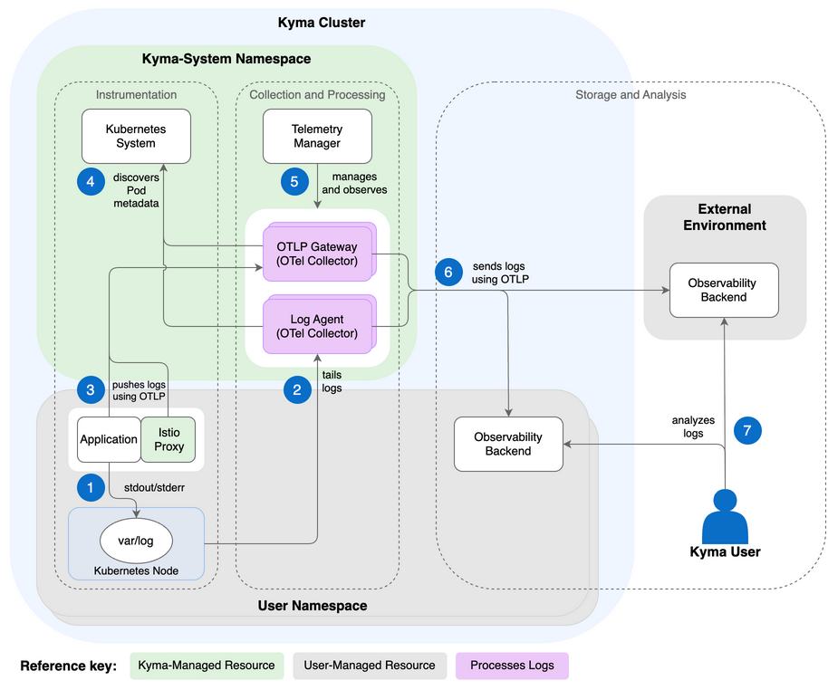
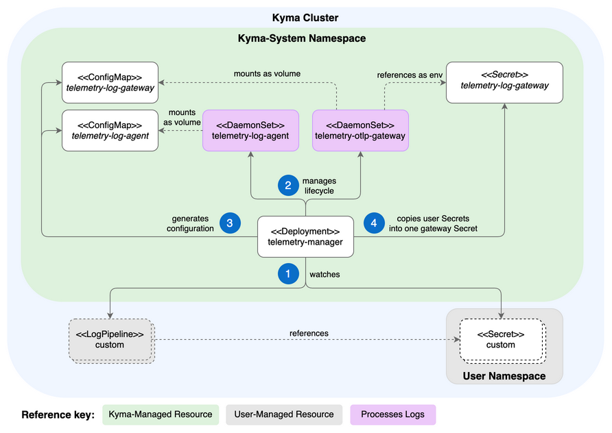

<!-- loio9124dfd06b4146abbb74aa0573a9e843 -->

# Logs Architecture

For log collection, the Telemetry module provides the OTLP Gateway and an optional Log Agent. To control their behavior and data destination, you define a `LogPipeline`. The OTLP Gateway is a DaemonSet with one instance per node that receives OTLP logs pushed from your applications. The Log Agent is a DaemonSet that pulls container logs from each node.

For details, see [OTLP Gateway](telemetry-architecture-04d79d5.md#loio04d79d5517204da68029f43b9f052396__section_otlp_gateway) and [Agents](telemetry-architecture-04d79d5.md#loio04d79d5517204da68029f43b9f052396__section_agents).

1.  Application containers print JSON logs to the `stdout/stderr` channel and are stored by the Kubernetes container runtime under the `var/log` directory and its subdirectories at the related Node. Istio is configured to write access logs to `stdout` as well.

2.  If you choose to use the agent, an OTel Collector runs as a [DaemonSet](https://kubernetes.io/docs/concepts/workloads/controllers/daemonset/) \(one instance per Node\), detects any new log files in the folder, and tails and parses them.

3.  An application \(exposing logs in [OTLP](https://opentelemetry.io/docs/specs/otlp/)\) sends logs to the OTLP Gateway using the `telemetry-otlp` service. Because the Service uses node-local routing, the OTLP Gateway instance on the same node always receives the data. Istio is configured to push access logs with OTLP as well.

4.  The OTLP Gateway and Log Agent discover the metadata and enrich all received data with metadata of the source by communicating with the Kubernetes APIServer. Furthermore, they filter data according to the pipeline configuration.

5.  Telemetry Manager configures the Log Agent and the OTLP Gateway according to the `LogPipeline` resource specification, including the target backend. Also, it observes the logs flow to the backend and reports problems in the LogPipeline status.

6.  The OTLP Gateway and Log Agent send the data to the observability backend that's specified in your `LogPipeline` resource - either within your cluster, or, if authentication is set up, to an external observability backend.

7.  You can analyze the logs data with your preferred observability backend.

<a name="loio9124dfd06b4146abbb74aa0573a9e843__section_telemetry_manager"/>

## Telemetry Manager

The `LogPipeline` resource is watched by Telemetry Manager, which is responsible for generating the configurations for the OTLP Gateway and the Log Agent.

1.  Telemetry Manager watches all `LogPipeline` resources and related Secrets.

2.  Furthermore, Telemetry Manager takes care of the full lifecycle of the OTLP Gateway DaemonSet and the Log Agent DaemonSet. Only if you defined a `LogPipeline`, the gateway and agent are deployed.

3.  Whenever the user configuration changes, Telemetry Manager validates it and generates a single configuration for the OTLP Gateway and agent.

4.  Referenced Secrets are copied into one Secret that is mounted to the OTLP Gateway as well.

<a name="loio9124dfd06b4146abbb74aa0573a9e843__section_log_gateway"/>

## OTLP Gateway

In your cluster, the OTLP Gateway is the central component to which all components can send their individual logs. The gateway collects, enriches, and dispatches the data to the configured backend. The OTLP Gateway handles all signal types \(traces, metrics, and logs\) in a single unified DaemonSet. For more information, see [Set Up the OTLP Input](set-up-the-otlp-input-61567b7.md).

<a name="loio9124dfd06b4146abbb74aa0573a9e843__section_log_agent"/>

## Log Agent

If you enable a log input in your `LogPipeline`, Telemetry Manager deploys a Log Agent. This agent is an [OTel Collector](https://opentelemetry.io/docs/collector/)-based DaemonSet that collects and converts logs from the container runtime. When your workload containers write structured logs to `stdout` or `stderr`, the agent collects, parses, and enriches them. Finally, it sends the logs in OTLP format to the backend you configured in the pipeline.

