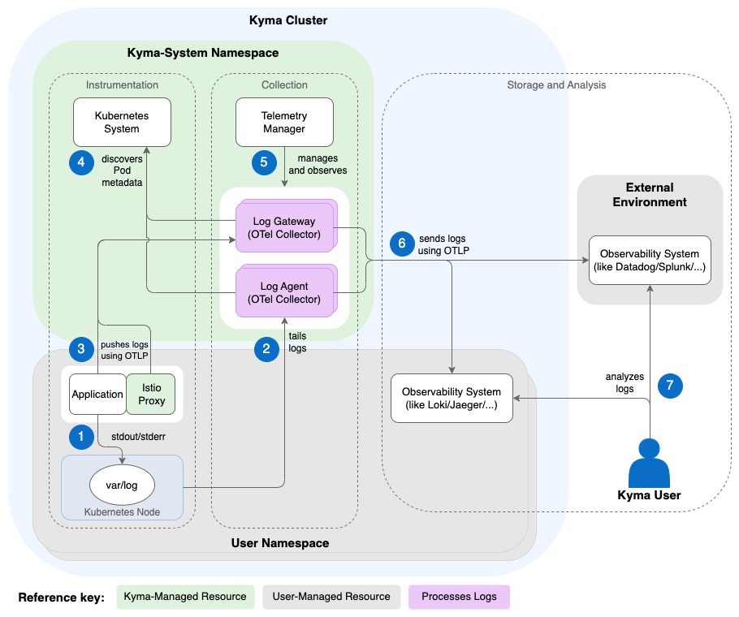

<!-- loio9124dfd06b4146abbb74aa0573a9e843 -->

# Logs Architecture

The Telemetry module provides a central Deployment of an [OTel Collector](https://opentelemetry.io/docs/collector/) acting as a gateway, and an optional DaemonSet acting as an agent. The gateway exposes endpoints that receive OTLP logs from your applications, while the agent collects container logs from each node. To control their behavior and data destination, you define a `LogPipeline`.

1.  Application containers print JSON logs to the `stdout/stderr` channel and are stored by the Kubernetes container runtime under the `var/log` directory and its subdirectories at the related Node. Istio is configured to write access logs to `stdout` as well.

2.  If you choose to use the agent, an OTel Collector runs as a [DaemonSet](https://kubernetes.io/docs/concepts/workloads/controllers/daemonset/) \(one instance per Node\), detects any new log files in the folder, and tails and parses them.

3.  An application \(exposing logs in [OTLP](https://opentelemetry.io/docs/specs/otlp/)\) sends logs to the central log gateway using the `telemetry-otlp-logs` service. Istio is configured to push access logs with OTLP as well.

4.  The gateway and agent discover the metadata and enrich all received data with metadata of the source by communicating with the Kubernetes APIServer. Furthermore, they filter data according to the pipeline configuration.

5.  Telemetry Manager configures the agent and gateway according to the `LogPipeline` resource specification, including the target backend. Also, it observes the logs flow to the backend and reports problems in the LogPipeline status.

6.  The log agent and gateway send the data to the observability backend that’s specified in your `LogPipeline` resource - either within your cluster, or, if authentication is set up, to an external observability backend.

7.  You can analyze the logs data with your preferred observability backend.

<a name="loio9124dfd06b4146abbb74aa0573a9e843__section_telemetry_manager"/>

## Telemetry Manager

The `LogPipeline` resource is watched by Telemetry Manager, which is responsible for generating the custom parts of the OTel Collector configuration.

1.  Telemetry Manager watches all `LogPipeline` resources and related Secrets.

2.  Furthermore, Telemetry Manager takes care of the full lifecycle of the gateway Deployment and the agent DaemonSet. Only if you defined a `LogPipeline`, the gateway and agent are deployed.

3.  Whenever the user configuration changes, Telemetry Manager validates it and generates a single configuration for the gateway and agent.

4.  Referenced Secrets are copied into one Secret that is mounted to the gateway as well.

<a name="loio9124dfd06b4146abbb74aa0573a9e843__section_log_gateway"/>

## Log Gateway

In your cluster, the log gateway is the central component to which all components can send their individual logs. The gateway collects, enriches, and dispatches the data to the configured backend. For more information, see [Set Up the OTLP Input](set-up-the-otlp-input-61567b7.md).

<a name="loio9124dfd06b4146abbb74aa0573a9e843__section_log_agent"/>

## Log Agent

If you configure a feature in the `input` section of your `LogPipeline`, an additional DaemonSet is deployed acting as an agent. The agent is based on an [OTel Collector](https://opentelemetry.io/docs/collector/) and encompasses the collection and conversion of logs from the container runtime. Hereby, the workload container just prints the structured log to the `stdout/stderr` channel. The agent picks them up, parses and enriches them, and sends all data in OTLP to the configured backend.

