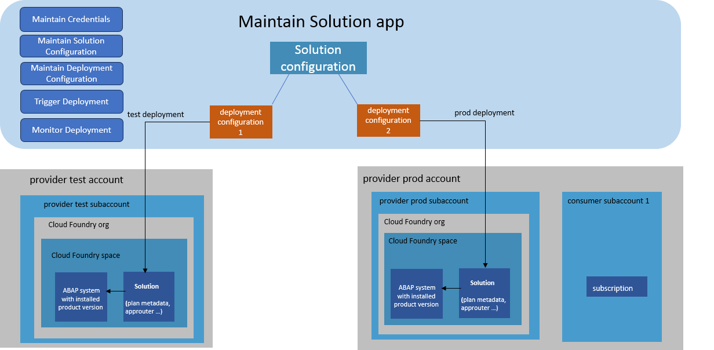

<!-- loio4985d3cf71564b908a972a5126585029 -->

# Maintain Solution

The purpose of the Maintain Solution app is to comfortably guide you, as provider, through the SaaS solution configuration process, and to enable you to trigger and monitor the deployment of your SaaS solution.

At the end of this process, your consumers will be able to subscribe to your SaaS solution.

> ### Note:  
> Specific implementations for the approuter are not supported in the Maintain Solution app. Providers that need such enhancements need to configure and deploy the solution manually. See [Approuter Application](approuter-application-44dbd0a.md).

<a name="loio4985d3cf71564b908a972a5126585029__section_vcc_xlh_fxb"/>

## Introduction

Once you have created your product and built a new product version using the *Build Product Version* app, you can use the *Maintain Solution* app to create and maintain the necessary configuration settings for your SaaS solution, its deployment and to trigger the deployment of your solution to SAP BTP Cloud Foundry so that your consumers can subscribe to it.

The app supports you in defining what your SaaS solution should technically look like. For this purpose, the app guides you through the creation and configuration of a ‚solution plan‘, which is required for the subscription in SAP BTP Cloud Foundry. A plan contains technical parameters on how the ABAP system containing your solution will be set up.

The app also lets you create different deployment configurations for the same SaaS solution. Since the settings for each subaccount vary, you may also need to create different deployment configurations \(e.g. one for a subaccount used for testing, another for the production subaccount\).

Once you have defined a deployment configuration, you can trigger your solution deployment and monitor the progress in the app.

The ABAP system with the plan \(that you specified when configuring your solution\) will be created within the CF space into which you deployed your solution and which is part of the CF organisation \(both of which you specified in the deployment configuration\) that your provider account belongs to.

When your solution has successfully been deployed, your consumers will be able to subscribe to it.

<a name="loio4985d3cf71564b908a972a5126585029__section_nsc_hvb_3yb"/>

## Process Description

After creating the credentials necessary to access the provider subaccounts where the solution ist to be deployed \(see [Maintain Credentials](maintain-credentials-6006a60.md)\), you use the step-by-step guide to create a new solution \(step 1\), configure a solution plan \(step 2\), and specify some advanced settings \(step 3\) \(see [Create Solution](create-solution-aca34fa.md)\). Then, you create a deployment configuration using another step-by-step guide \(see [Create Deployment Configuration](create-deployment-configuration-58b90ec.md)\). Afterwards, you can deploy your solution with the respective deployment configuration \(see [Deploy Solution](deploy-solution-0b7df99.md)\). You can then monitor the progress of the deployment in the app \(see [Monitor Deployment](monitor-deployment-61575d9.md)\).

<a name="loio4985d3cf71564b908a972a5126585029__section_nh1_3yb_3yb"/>

## Prerequisites

-   You have created a space in your provider subaccount. This is the space that your solution will be deployed to.

-   You have created a technical user \(email address\) that has the Space Developer role assigned to it. This technical user needs to be available in SAP ID provider. This user will be used for the deployment.

