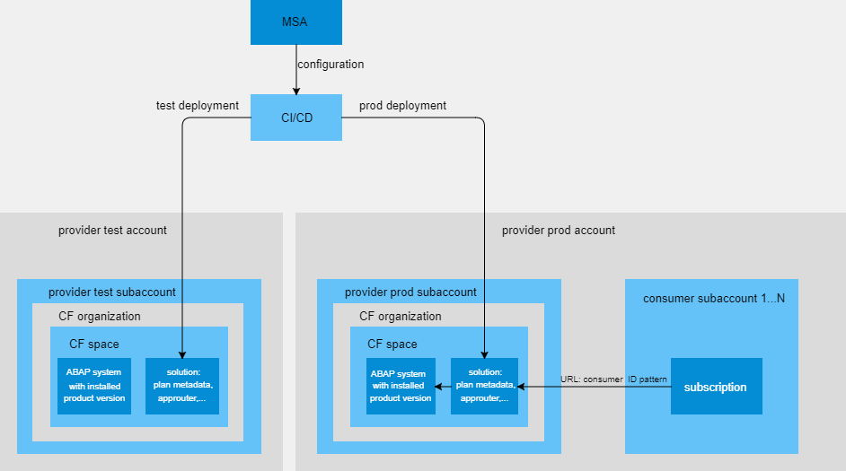
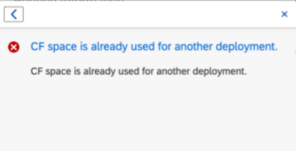

<!-- loio4985d3cf71564b908a972a5126585029 -->

# Maintain Solution

The purpose of the Maintain Solution app is to guide providers through the complex SaaS solution configuration process. In addition, the deployment can be performed and monitored.

> ### Note:  
> Specific implementations for the approuter are not supported. Providers that need such enhancements need to configure and deploy the solution manually.

  

<a name="loio4985d3cf71564b908a972a5126585029__section_vcc_xlh_fxb"/>

## Introduction

Once you have created your product and registered using the Build Product Version app, you can use the Maintain Solution app to create and maintain the deployment of your solution to the Business Technology Platform, so that your customers can subscribe to it.

On one hand, the app supports you in defining how an ABAP system should technically look like. For this purpose, the app provides a guided configuration of a plan. This plan defines which product name and version will be included in the ABAP system as well as which resources will be used to create the system.

In general, you \(as a provider\) can have multiple accounts, for example test or productive account, where it is possible to install a solution. On the other hand, the app provides the generation of several deployment configurations as the settings for each subaccount vary. The ABAP system with a specified plan \(as described above\) will be created within the given Cloud Foundry space, which is part of the CF organization, that belongs to the provider account. Not only can you define the deployment configuration, but also trigger it from the app and monitor the process.

The consumer can now subscribe to the provider’s SaaS solution.

> ### Caution:  
> It is only allowed to deploy one app per space. If you are about to reuse an ID, the following message will be shown:
> 
> 

### Process Description

After creating the credentials necessary to access the subaccounts, you can create a new solution using a step-by-step wizard. This wizard also includes the set up of a plan in step two. For the last step, you determine the deployment configurations.

To understand this better, read the first subpage called *Create Process* that will guide you through the detailed creation process of the Maintain Solution app.

