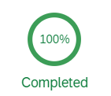

<!-- loio3aeaaa802d234e8bb91478193a95f94c -->

# Manage Test Tenant

The Manage Test Tenant app enables you to view a list of all available systems, create test tenants and manage the test tenant status.

To use the app, navigate to the Landscape Portal and scroll to a group of tiles called *Tenant Lifecycle Management*. Here, you can find the *Manage Test Tenant* app and enter it.

The screen now shows an overview of lists, including *Available Systems*, *Manage Test Tenant Status* and *Available Tenants*.

### Available Systems

To create a new tenant, click the button on the right upper corner of the list named accordingly. Right next to it, there is a settings button where you can maintain your *View Settings* for the available systems.

Each system listed contains information about their business type, lifecycle status and more.

### Manage Test Tenant Status

The *Manage Test Tenant Status* displays an overview of each test tenant, identifiable by its name on top, as well as its request ID.

A visual representation on the right side shows you the status of the test tenant in percent:

### Available Tenants

Here, you can see tenants from your chosen system and are able to filter the list to show all tenants or only test tenants.

