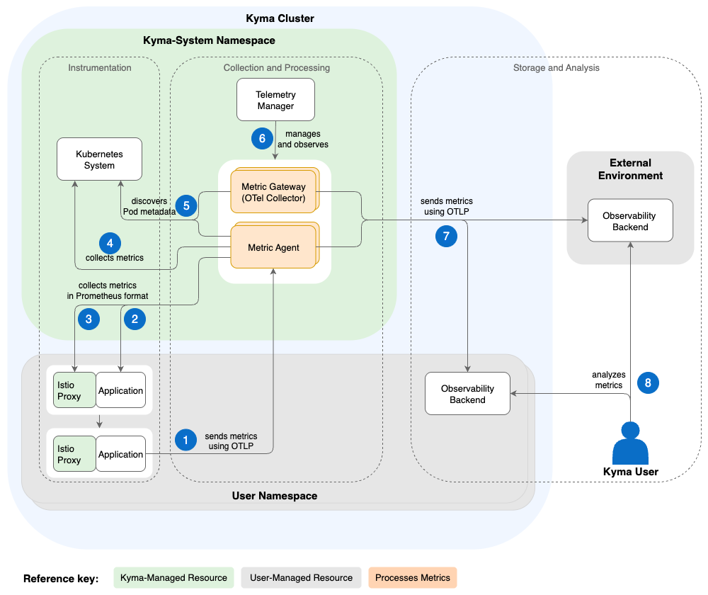

<!-- loio59d31e94852e4798ad029c46b91703be -->

# Metrics Architecture

The Telemetry module provides a central Deployment of an [OTel Collector](https://opentelemetry.io/docs/collector/) acting as a gateway, and an optional DaemonSet acting as an agent. The gateway exposes endpoints that receive OTLP metrics from your applications, while the agent pulls metrics from Prometheus-annotated endpoints. To control their behavior and data destination, you define a `MetricPipeline`.

1.  An application \(exposing metrics in [OTLP](https://opentelemetry.io/docs/specs/otlp/)\) sends metrics to the central metric gateway using the `telemetry-otlp-metrics` service.

2.  An application \(exposing metrics in [Prometheus](https://prometheus.io/docs/instrumenting/exposition_formats/) protocol\) activates the agent to scrape the metrics with an annotation-based configuration.

3.  Additionally, you can activate the agent to pull metrics of each Istio sidecar.

4.  The agent supports collecting metrics from the Kubelet and Kubernetes APIServer.

5.  The gateway and the agent discover the metadata and enrich all received data with typical metadata of the source by communicating with the Kubernetes APIServer. Furthermore, they filter data according to the pipeline configuration.

6.  Telemetry Manager configures the agent and gateway according to the `MetricPipeline` resource specification, including the target backend for the metric gateway. Also, it observes the metrics flow to the backend and reports problems in the `MetricPipeline` status.

7.  The gateway and the agent send the data to the observability backend that’s specified in your `MetricPipeline` resource - either within your cluster, or, if authentication is set up, to an external observability backend.

8.  You can analyze the metric data with your preferred observability backend.

<a name="loio59d31e94852e4798ad029c46b91703be__section_telemetry_manager"/>

## Telemetry Manager

The `MetricPipeline` resource is watched by Telemetry Manager, which is responsible for generating the custom parts of the OTel Collector configuration.

1.  Telemetry Manager watches all `MetricPipeline` resources and related Secrets.

2.  Furthermore, Telemetry Manager takes care of the full lifecycle of the gateway Deployment and the agent DaemonSet. Only if you defined a `MetricPipeline`, the gateway and agent are deployed.

3.  Whenever the user configuration changes, Telemetry Manager validates it and generates a single configuration for the gateway and agent.

4.  Referenced Secrets are copied into one Secret that is mounted to the gateway as well.

<a name="loio59d31e94852e4798ad029c46b91703be__section_metric_gateway"/>

## Metric Gateway

In your cluster, the metric gateway is the central component to which all applications can send their individual metrics. The gateway collects, enriches, and dispatches the data to the configured backend. For more information, see [Set Up the OTLP Input](set-up-the-otlp-input-61567b7.md).

<a name="loio59d31e94852e4798ad029c46b91703be__section_metric_agent"/>

## Metric Agent

If a `MetricPipeline` configures a feature in the `input` section, an additional DaemonSet is deployed acting as an agent. The agent is also based on an [OTel Collector](https://opentelemetry.io/docs/collector/) and encompasses the collection and conversion of Prometheus-based metrics. Hereby, the workload puts a `prometheus.io/scrape` annotation on the specification of the Pod or service, and the agent collects it.

