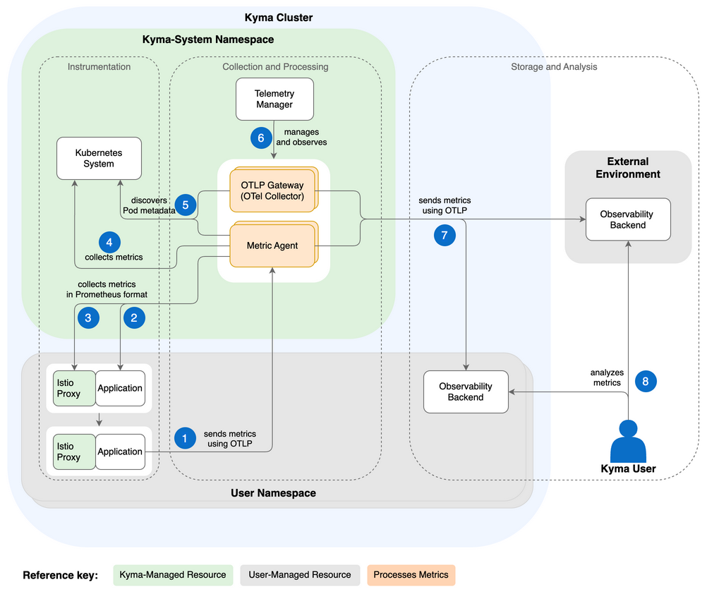
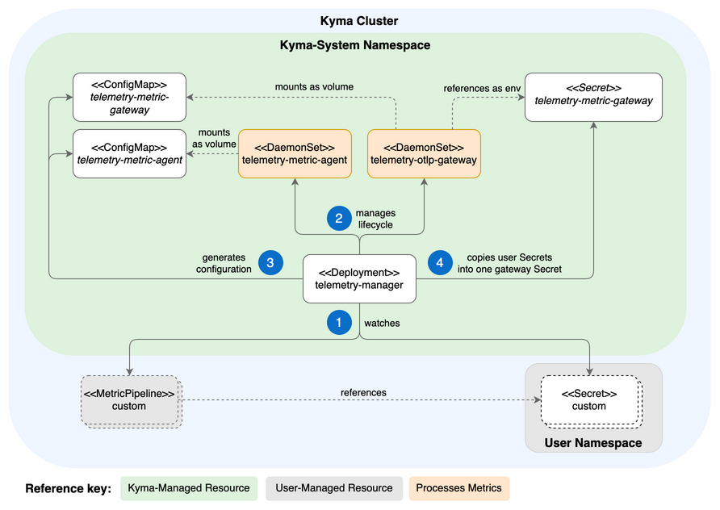

<!-- loio59d31e94852e4798ad029c46b91703be -->

# Metrics Architecture

For metrics collection, the Telemetry module provides the OTLP Gateway and an optional Metric Agent. To control their behavior and data destination, you define a `MetricPipeline`. The OTLP Gateway is a DaemonSet with one instance per node that receives OTLP metrics pushed from your applications. The Metric Agent is a DaemonSet that pulls metrics from Prometheus-annotated endpoints.

For details, see [OTLP Gateway](telemetry-architecture-04d79d5.md#loio04d79d5517204da68029f43b9f052396__section_otlp_gateway) and [Agents](telemetry-architecture-04d79d5.md#loio04d79d5517204da68029f43b9f052396__section_agents).

1.  An application \(exposing metrics in [OTLP](https://opentelemetry.io/docs/specs/otlp/)\) sends metrics to the OTLP Gateway using the `telemetry-otlp` service. Because the Service uses node-local routing, the OTLP Gateway instance on the same node always receives the data.

2.  An application \(exposing metrics in [Prometheus](https://prometheus.io/docs/instrumenting/exposition_formats/) protocol\) activates the agent to scrape the metrics with an annotation-based configuration.

3.  Additionally, you can activate the agent to pull metrics of each Istio sidecar.

4.  The agent supports collecting metrics from the Kubelet and Kubernetes APIServer.

5.  The OTLP Gateway and the Metric Agent discover the metadata and enrich all received data with typical metadata of the source by communicating with the Kubernetes APIServer. Furthermore, they filter data according to the pipeline configuration.

6.  Telemetry Manager configures the agent and the OTLP Gateway according to the `MetricPipeline` resource specification, including the target backend. Also, it observes the metrics flow to the backend and reports problems in the `MetricPipeline` status.

7.  The OTLP Gateway and the agent send the data to the observability backend that's specified in your `MetricPipeline` resource - either within your cluster, or, if authentication is set up, to an external observability backend.

8.  You can analyze the metric data with your preferred observability backend.

<a name="loio59d31e94852e4798ad029c46b91703be__section_telemetry_manager"/>

## Telemetry Manager

The `MetricPipeline` resource is watched by Telemetry Manager, which is responsible for generating the configurations for the OTLP Gateway and the Metric Agent.

1.  Telemetry Manager watches all `MetricPipeline` resources and related Secrets.

2.  Furthermore, Telemetry Manager takes care of the full lifecycle of the OTLP Gateway DaemonSet and the agent DaemonSet. Only if you defined a `MetricPipeline`, the gateway and agent are deployed.

3.  Whenever the user configuration changes, Telemetry Manager validates it and generates a single configuration for the OTLP Gateway and agent.

4.  Referenced Secrets are copied into one Secret that is mounted to the OTLP Gateway as well.

<a name="loio59d31e94852e4798ad029c46b91703be__section_metric_gateway"/>

## OTLP Gateway

In your cluster, the OTLP Gateway is the central component to which all applications can send their individual metrics. The gateway collects, enriches, and dispatches the data to the configured backend. The OTLP Gateway handles all signal types \(traces, metrics, and logs\) in a single unified DaemonSet. For more information, see [Set Up the OTLP Input](set-up-the-otlp-input-61567b7.md).

<a name="loio59d31e94852e4798ad029c46b91703be__section_metric_agent"/>

## Metric Agent

If you enable a metric input in your `MetricPipeline`, Telemetry Manager deploys a Metric Agent. This agent is an [OTel Collector](https://opentelemetry.io/docs/collector/)-based DaemonSet that collects and converts Prometheus-based metrics. To have the agent scrape your workload, you add a `prometheus.io/scrape` annotation to the Pod or Service specification. The agent then automatically discovers and collects metrics from the annotated endpoints.

