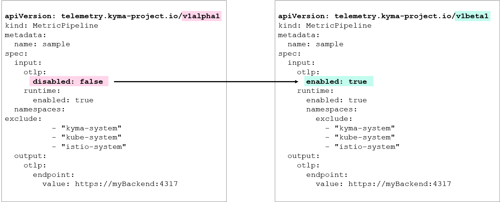
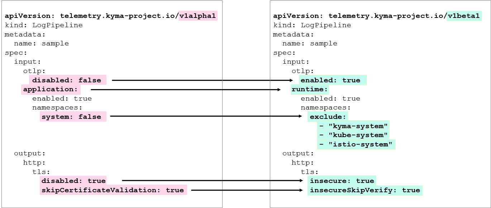

<!-- loio6ffa6c22a04b4062b098f2b2e6eaf9d9 -->

# Migrate Telemetry Pipelines to v1beta1

The Telemetry module now uses the stable *v1beta1* API for pipeline resources. In some cases, you must update your pipeline manifests to use the new API version.


## Prerequisites

-   You have the Telemetry module in your cluster.
-   One or more of your Telemetry pipelines use the *v1alpha1* API version.


## Context

> ### Note:  
> If your pipelines are already running in the cluster and you don't store their manifests, you don't have to take any action. The Telemetry module automatically migrates your existing pipeline resources to *v1beta1*.
> 
> To see what your converted pipeline looks like in *v1beta1*, fetch the resource directly from your cluster:
> 
> ```
> kubectl get logpipeline {PIPELINE_NAME} -o yaml
> kubectl get metricpipeline {PIPELINE_NAME} -o yaml
> kubectl get tracepipeline {PIPELINE_NAME} -o yaml
> ```

If you manage your Telemetry pipeline resources declaratively, you must manually adjust them; for example, in the following cases:

-   You use GitOps, CI/CD, or tools like Argo CD to deploy your pipelines.
-   You store pipeline manifests in a Git repository that you reapply.
-   You plan to create new pipelines and want to use the *v1beta1* API.

This migration involves breaking changes: To align your pipeline manifests with the new version, you must update the `apiVersion`, rename several fields, and, for `LogPipeline` resources, adjust how you configure namespace selection. The migration from v1alpha1 to v1beta1 mostly affects `LogPipeline` and `MetricPipeline` resources. For `TracePipeline` resources, only the `apiVersion` changes.

  
  
**MetricPipeline Migration to v1beta1**



  
  
**LogPipeline Migration to v1beta1**



To identify the required updates for your manifests, review the breaking changes in the following table:


<table>
<tr>
<th valign="top">

Pipeline

</th>
<th valign="top">

v1alpha1 Field

</th>
<th valign="top">

v1beta1 Field

</th>
<th valign="top">

Migration Action

</th>
</tr>
<tr>
<td valign="top">

`LogPipeline`, `MetricPipeline`

</td>
<td valign="top">

`spec.input.otlp.disabled`

</td>
<td valign="top">

`spec.input.otlp.enabled`

</td>
<td valign="top">

Rename the field and invert the boolean value \(for example, *false* becomes *true*\).

</td>
</tr>
<tr>
<td valign="top">

`LogPipeline`

</td>
<td valign="top">

`spec.input.application`

</td>
<td valign="top">

`spec.input.runtime`

</td>
<td valign="top">

Rename the field.

</td>
</tr>
<tr>
<td valign="top">

`LogPipeline`

</td>
<td valign="top">

`spec.input.application.namespaces.system`

</td>
<td valign="top">

\(Removed\)

</td>
<td valign="top">

To include system namespaces, use `spec.input.runtime.namespaces: {}`.

</td>
</tr>
<tr>
<td valign="top">

`LogPipeline`

</td>
<td valign="top">

`spec.output.http.tls.disabled`

</td>
<td valign="top">

`spec.output.http.tls.insecure`

</td>
<td valign="top">

Rename the field.

</td>
</tr>
<tr>
<td valign="top">

`LogPipeline`

</td>
<td valign="top">

`spec.output.http.tls.skipCertificateValidation`

</td>
<td valign="top">

`spec.output.http.tls.insecureSkipVerify`

</td>
<td valign="top">

Rename the field.

</td>
</tr>
</table>


## Procedure

1.  In each of your `LogPipeline`, `MetricPipeline`, and `TracePipeline` YAML files, change the `apiVersion` to *telemetry.kyma-project.io/v1beta1*.

2.  For `LogPipeline` and `MetricPipeline` resources, update the OTLP input:

    -   `spec.input.otlp.disabled` becomes `spec.input.otlp.enabled`.
    -   You must also invert the boolean value \(for example, `disabled: false` becomes `enabled: true`\).

3.  For `LogPipeline` resources, replace `spec.input.application` with `spec.input.runtime`. To include system namespaces for application logs, also update the system namespace selection.

    By default, system namespaces are excluded \(as in *v1alpha1*\), but *v1beta1* removes the `spec.input.application.namespaces.system` field. To include application logs from system namespaces \(like `kyma-system`\), you must now provide an empty object \(`{}`\) for the `namespaces` selector. For details, see [Filter Application Logs by Namespace](filter-logs-58445a0.md#loio58445a0789da46dea08ccda9b5ea149d__section_filter_by_namespaces).

    ```
    spec:
     input:
       runtime:
         enabled: true
         namespaces: {}  # This includes system namespaces
    ```

4.  For `LogPipeline` resources using the `http` output, update the following fields:

    -   Replace `spec.output.http.tls.disabled` with `spec.output.http.tls.insecure`.
    -   Replace `spec.output.http.tls.skipCertificateValidation` with `spec.output.http.tls.insecureSkipVerify`.

    > ### Recommendation:  
    > Consider switching to the `otlp` output \(see [Migrate Your LogPipeline From HTTP to OTLP](migrate-your-logpipeline-from-http-to-otlp-550a696.md)\). For OTLP, use the fields `spec.output.otlp.tls.insecure` and `spec.output.otlp.tls.insecureSkipVerify`.

5.  Validate and apply your updated configuration with kubectl.


## Results

Your pipelines are now updated to the *v1beta1* API. The Telemetry module begins using the new configuration.

To confirm the migration was successful, check that your new pipelines are healthy \(see [Check Pipeline Status](monitor-pipeline-health-b56ed5c.md#loiob56ed5c62e984f63b89668ba1072c03e__section_check_health_manually)\).

