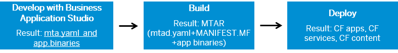

<!-- loiod04fc0e2ad894545aebfd7126384307c -->

# Multitarget Applications in the Cloud Foundry Environment

A Multitarget application \(MTA\) is logically a single application comprised of multiple parts created with different technologies, which share the same lifecycle.

The developers of the MTA describe the desired result using the MTA model, which contains MTA modules, MTA resources, and interdependencies between them. Afterward, the SAP Cloud Deployment service validates, orchestrates, and automates the deployment of the MTA, which results in Cloud Foundry applications, services and SAP specific contents. For more information about the Multitarget Application model, see the official [The Multitarget Application Model v.2](https://www.sap.com/documents/2016/06/e2f618e4-757c-0010-82c7-eda71af511fa.html) and the [The Multitarget Application Model v.3](https://www.sap.com/documents/2021/09/66d96898-fa7d-0010-bca6-c68f7e60039b.html) specification documents.

You can create and deploy a Multitarget Application in the Cloud Foundry environment as described below by following different approaches that can yield the same result:

-   Using SAP Web IDE Full-Stack as described in [Developing Multitarget Applications](https://help.sap.com/viewer/825270ffffe74d9f988a0f0066ad59f0/CF/en-US/a71bf8281254489ea8be6e323199b304.html) - both the development descriptor `mta.yaml` and the deployment descriptor `mtad.yaml` are created automatically. The `mta.yaml` is generated when you create the application project, and the `mtad.yaml` file is created when you build the project.

    > ### Note:  
    > You may still need to edit the development descriptor.

    Development descriptors are used to generate MTA deployment descriptors, which define the required deployment data. That is, the MTA development descriptor data specifies what you want to build, how to build it, while the deployment descriptor data specifies as what and how to deploy it.

    

    -   [https://help.sap.com/viewer/825270ffffe74d9f988a0f0066ad59f0/CF/en-US/a71bf8281254489ea8be6e323199b304.html](https://help.sap.com/viewer/825270ffffe74d9f988a0f0066ad59f0/CF/en-US/a71bf8281254489ea8be6e323199b304.html)
    -   [https://help.sap.com/viewer/825270ffffe74d9f988a0f0066ad59f0/CF/en-US/3b533e3723674fad90f94510b92f10af.html](https://help.sap.com/viewer/825270ffffe74d9f988a0f0066ad59f0/CF/en-US/3b533e3723674fad90f94510b92f10af.html)
    -   [https://help.sap.com/viewer/825270ffffe74d9f988a0f0066ad59f0/CF/en-US/1b0a7a0938944c7fac978d4b8e23a63f.html](https://help.sap.com/viewer/825270ffffe74d9f988a0f0066ad59f0/CF/en-US/1b0a7a0938944c7fac978d4b8e23a63f.html)

-   Using Business Application Studio - the flow is similar to WebIDE but the development is done from BAS.

    

    -   [https://help.sap.com/docs/bas/sap-business-application-studio/mta-development/](https://help.sap.com/docs/bas/sap-business-application-studio/mta-development/)
    -   [https://help.sap.com/docs/bas/sap-business-application-studio/building-and-deploying-multitarget-applications](https://help.sap.com/docs/bas/sap-business-application-studio/building-and-deploying-multitarget-applications)
    -   [https://help.sap.com/docs/bas/sap-business-application-studio/building-and-deploying-multitarget-applications](https://help.sap.com/docs/bas/sap-business-application-studio/building-and-deploying-multitarget-applications)

-   Using the [Cloud MTA Build Tool](https://sap.github.io/cloud-mta-build-tool/). Afterward, you deploy the MTA using the Cloud Foundry Command Line Interface.

    > ### Note:  
    > An MTA development descriptor `mta.yaml` is required. You have to create it manually.

    

    -   [https://sap.github.io/cloud-mta-build-tool/](https://sap.github.io/cloud-mta-build-tool/)
    -   [https://help.sap.com/viewer/65de2977205c403bbc107264b8eccf4b/Cloud/en-US/65ddb1b51a0642148c6b468a759a8a2e.html](https://help.sap.com/viewer/65de2977205c403bbc107264b8eccf4b/Cloud/en-US/65ddb1b51a0642148c6b468a759a8a2e.html)
    -   [https://help.sap.com/viewer/65de2977205c403bbc107264b8eccf4b/Cloud/en-US/c2d31e70a86440a19e47ead0cb349fdb.html](https://help.sap.com/viewer/65de2977205c403bbc107264b8eccf4b/Cloud/en-US/c2d31e70a86440a19e47ead0cb349fdb.html)

-   Manually - create the required files manually and deploy them using the Cloud Foundry Command Line Interface

    > ### Note:  
    > An MTA development descriptor `mta.yaml` is not explicitly required. In this case, a deployment descriptor is maintained instead.

    1.  Create the required files using an IDE of your choice.
    2.  To produce your custom artifacts, use a build technology of your choice.
    3.  Maintain your deployment descriptor document \(`mtad.yaml`\).
        1.  \(Optional\) If you want to have an MTA archive package, use the `mbt assemble`. For more information, see [Cloud MTA Build Tool \(MBT\)](https://sap.github.io/cloud-mta-build-tool/).

        2.  Use the `cf deploy` command to deploy the MTA package or directly from the build result directory.

<table>
<tr>
<th valign="top">

To learn more about

</th>
<th valign="top">

See

</th>
</tr>
<tr>
<td valign="top">

Multitarget Application deployment descriptor

</td>
<td valign="top">

[Defining Multitarget Application Deployment Descriptors for Cloud Foundry](defining-multitarget-application-deployment-descriptors-for-cloud-foundry-f48880b.md)

</td>
</tr>
<tr>
<td valign="top">

Multitarget Application archive

</td>
<td valign="top">

[Defining Multitarget Application Archives](defining-multitarget-application-archives-33a0e0e.md)

</td>
</tr>
<tr>
<td valign="top">

Multitarget Application extension descriptor

</td>
<td valign="top">

[Defining MTA Extension Descriptors](defining-mta-extension-descriptors-50df803.md)

</td>
</tr>
<tr>
<td valign="top">

Multitarget Application structure

</td>
<td valign="top">

[Multitarget Application Structure](multitarget-application-structure-f443b9f.md)

</td>
</tr>
<tr>
<td valign="top">

How to deploy the Multitarget Application

</td>
<td valign="top">

[Multitarget Application Plug-In for the Cloud Foundry Command Line Interface](../50-administration-and-ops/multitarget-application-plug-in-for-the-cloud-foundry-command-line-interface-e93b231.md)

</td>
</tr>
</table>

<a name="loiod04fc0e2ad894545aebfd7126384307c__section_ub3_wjn_5jb"/>

## Terms and Concepts

**Terms and Concepts**

<table>
<tr>
<th valign="top">

Term

</th>
<th valign="top">

Description

</th>
</tr>
<tr>
<td valign="top">

Multitarget application \(MTA\)

</td>
<td valign="top">

An application comprised of multiple software modules, which are created with different technologies and deployed to different runtimes.

</td>
</tr>
<tr>
<td valign="top">

Development descriptor

</td>
<td valign="top">

A `YAML` file named `mta.yaml` that contains a list of all entities, such as modules, resources, and properties that belong to an application or are used by it at runtime, and the dependencies between them. It is automatically generated when an MTA project is created or modified, or when a module is added or removed. The developer needs to edit the descriptor manually to define resources, properties, and dependencies, as well as fill in missing information.

</td>
</tr>
<tr>
<td valign="top">

Deployment descriptor

</td>
<td valign="top">

A `YAML` file named `mtad.yaml` that contains a list of all entities which is created from either SAP Web IDE Full-Stack, SAP Business Application Studio, Cloud MTA Build Tool or manually. This file is similar to Development Descriptor but is used from the SAP Cloud Deployment service.

</td>
</tr>
<tr>
<td valign="top">

Module

</td>
<td valign="top">

A self-contained application of a certain type, which is developed, packaged, and deployed.

</td>
</tr>
<tr>
<td valign="top">

Module type

</td>
<td valign="top">

A type that defines the structure and the development technology of a module. You can see a list of the module types at [Modules](modules-177d34d.md).

</td>
</tr>
<tr>
<td valign="top">

Resource

</td>
<td valign="top">

Any resource, such as an external service that is required by a module at runtime but not provided by the module itself.

</td>
</tr>
<tr>
<td valign="top">

Property

</td>
<td valign="top">

A property \(key-value pair\) of an application, module, or resource, that is used during deployment or at runtime.

</td>
</tr>
<tr>
<td valign="top">

Parameter

</td>
<td valign="top">

A reserved variable belonging to a module or resource, whose value is used during deployment or at runtime.

</td>
</tr>
<tr>
<td valign="top">

Dependency

</td>
<td valign="top">

A relationship between a module and another module, resource, or property, such as provides and requires.

-   `provides`: indicates the properties or parameters that are provided by a module or resource to other modules.

-   `requires`: indicates other modules or resources that are required by a module in order to run.

</td>
</tr>
<tr>
<td valign="top">

MTA archive \(MTAR\)

</td>
<td valign="top">

Archive containing a deployment descriptor, the module and resource binaries, and configuration files. The archive follows the JAR file specification.

</td>
</tr>
</table>

<a name="loiod04fc0e2ad894545aebfd7126384307c__section_ph2_r5h_1cb"/>

## Prerequisites and Restrictions

You have to consider the following limits for the MTA artifacts, which can be handled by the Cloud Foundry deploy service:

-   Maximum size of the MTA archive: 4 GB
-   Maximum size of MTA module content: 1 GB
-   Maximum size of MTA resource content: 1 MB
-   Maximum size of MTA descriptors \(`mtad.yaml` and `MANIFEST.MF`\): 1 MB

**Related Information**  

[JAR File Specification](http://docs.oracle.com/javase/7/docs/technotes/guides/jar/jar.html)

[Cloud MTA Build Tool](https://sap.github.io/cloud-mta-build-tool/)

[Release Notes for Multitarget Applications for Cloud Foundry](https://help.sap.com/whats-new/cf0cb2cb149647329b5d02aa96303f56?Component=Multitarget%20Applications%20for%20Cloud%20Foundry&Valid_as_Of=2022-01-01%3A2023-12-31&locale=en-US)

