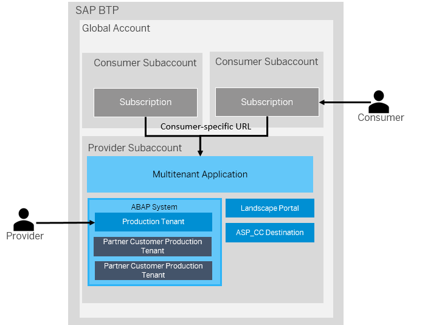

<!-- loio633cc61560734a8fb8dba64b4dd904a9 -->

# Multitenancy in the ABAP Environment

Multitenancy defines the capability to host different customers \(tenants\) on a single, shared computing infrastructure in order to optimize administration and significantly reduce TCO. A tenant is an organizationally independent unit whose IT business is entirely or partly operated together with the businesses of other tenants by a hosting provider. Multitenancy is especially relevant in a “Software as a Service” \(SaaS\) business model where customers subscribe to hosted software solutions rather than buying and installing them. For hosting providers, the operation costs per user per tenant are a decisive factor - particularly in the SME market, where typically each tenant only has a small number of users \(10 – 50\) accessing the hosted solution. Hosting providers can only operate profitably if they succeed in keeping the administration and maintenance costs for the hosted solution as low as possible. This cost pressure also limits the degree of individualization and customization a hosting provider is willing to accept for a hosted solution provided to many tenants.

Multitenancy in the ABAP environment enables independent software vendors or partners \(referred to as application **provider**\) to develop and operate ABAP solutions as software as a service \(SaaS\) leveraging SAP BTP infrastructure while hosting several consumers on the same ABAP system. The resources on SAP BTP platform consumed by the solution are paid for by the application provider.

Application **consumers** \(= end customers of the provider\) subscribe to a provider’s multitenant application and use it in a specific consumer subaccount \(= tenant\). Consumers access the provider’s SaaS application via a consumer-specific URL. Consumers cannot see the data of other consumers and Identity and Access Management is kept isolated between different tenants.

The **Multitenant Application** is deployed to the provider subaccount and serves as the entry point for the consumer-specific URLs, so that requests are routed to the corresponding consumer tenant in the ABAP system. Only after the multitenant application has been deployed, the application will be available for subscription to consumers. See [Developing Multitenant Applications in the ABAP Environment](developing-multitenant-applications-in-the-abap-environment-195031f.md).

The**ABAP system** used to serve the application to the consumers is provisioned in the provider subaccount during the first subscription as abap/standard or abap/saas\_oem system \(depending on whether add-on is used for delivery\). See [Creating an ABAP System](../20-getting-started/creating-an-abap-system-50b32f1.md). Different tenants are created as separate clients in the system. Tenants in the ABAP system have different capabilities represented by the tenant business type and a lifecycle status. The ABAP system contains by default a tenant used by the application provider \(client 100\) for system-level operations like the import of software components to the system. For each subscription to the multitenant application, a tenant used by the consumer \(client \>= 200\) is created. If any consumer tenants still exist in the ABAP system, the system cannot be deleted.

The **Landscape Portal** functions as a central plane for tenant management that allows providers to perform lifecycle management operations such as add-on updates, creating test tenants or support users and more. For more information on how to access and use the Landscape Portal, see [Using Landscape Portal to Perform Lifecycle Management Operations](using-landscape-portal-to-perform-lifecycle-management-operations-5eb70fb.md).

The **ASP\_CC Destination** is a destination created on subaccount-level in the provider subaccounts. It points to the Cloud Foundry Cloud Controller API and is utilized by the multitenant application to create the ABAP system in the Cloud Foundry space/org where the multitenant application is deployed. See [Create a Destination for the Cloud Foundry Cloud Controller Access](create-a-destination-for-the-cloud-foundry-cloud-controller-access-35b5acb.md).

> ### Note:  
> When building tenant-aware applications on top of the ABAP environment, providers need to follow specific ABAP implementation rules to ensure a content separation between different consumers. To view these guidelines, see [Multitenancy Development Guideline](multitenancy-development-guideline-9d994c8.md).

