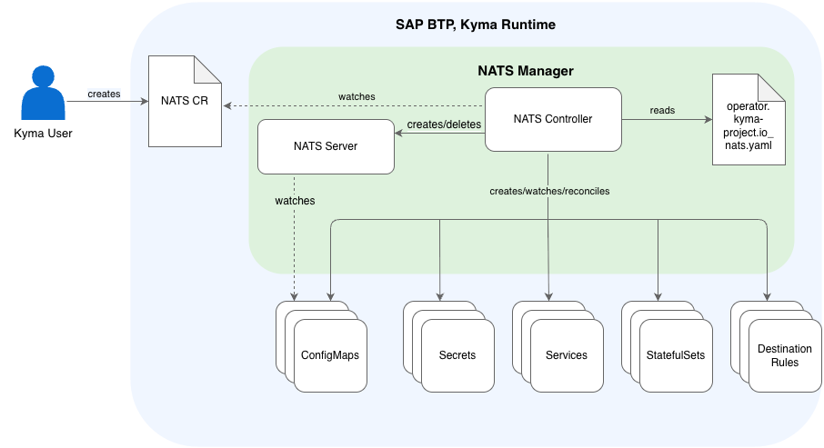

<!-- loio2c504f5391504b44800aa02c7fafb39f -->

# NATS Module

Learn more about the NATS Module. Use it to manage and configure the message-oriented middleware, NATS.

<a name="loio2c504f5391504b44800aa02c7fafb39f__section_h2t_yq2_qbc"/>

## What Is NATS?

NATS is an infrastructure that enables the exchange of data in the form of messages. One feature of NATS is JetStream. JetStream is a distributed persistence system that provides more functionalities and higher qualities of service on top of `Core NATS`.

The NATS module includes the NATS Manager, which manages the lifecycle of a [NATS JetStream](https://docs.nats.io/nats-concepts/jetstream) deployment. It observes the state of the NATS cluster and reconciles it with the desired state.

For more information about NATS and NATS JetStream, see the [official NATS documentation](https://docs.nats.io/).

The [Eventing Module](eventing-module-07b2d1d.md) can use NATS as a backend to process events and send them to subscribers.

> ### Caution:  
> Reaching the NATS storage size limits may cause the Eventing module to stop receiving events or delay them. For more information on the troubleshooting, see [NATS Backend Storage Is Full](nats-backend-storage-is-full-bb47681.md).

<a name="loio2c504f5391504b44800aa02c7fafb39f__section_prg_1r2_qbc"/>

## Features

-   Automated NATS JetStream Deployment: Deploys a production-ready NATS JetStream cluster without manual setup.
-   Persistent Messaging: Use file-based storage to ensure messages are retained even if a Pod restarts. Memory-based storage is available for higher throughput scenarios.
-   Declarative Configuration: Manage your NATS cluster configuration, including cluster size and storage options, through a simple Kubernetes custom resource.
-   Configurable Resource Allocation: Define specific CPU and memory requests and limits for the NATS Pods to fit your cluster's capacity.
-   Seamless integration with the Eventing module.

### High Availability

For high availability, set up NATS servers across different availability zones for uninterrupted operation and uptime. NATS Manager deploys the NATS servers in the availability zones where your Kubernetes cluster has Nodes. If the Kubernetes cluster has Nodes distributed across at least three availability zones, NATS Manager automatically distributes the NATS servers across these availability zones. If the Kubernetes cluster doesn’t have Nodes distributed across at least three availability zones, high availability is compromised.

<a name="loio2c504f5391504b44800aa02c7fafb39f__section_ixg_1r2_qbc"/>

## Architecture

The NATS module uses a [Kubernetes operator](https://kubernetes.io/docs/concepts/extend-kubernetes/operator/)-based architecture.

1.  You create a NATS CR.
2.  The NATS Manager starts the Controller, which creates, watches, and reconciles the relevant resources.
3.  The Controller reacts to changes in the NATS CR to adapt the resources to the desired state.
4.  The Controller creates or deletes the NATS server.

### NATS Manager

The NATS Manager is responsible for starting the Controller which creates, watches, and reconciles the relevant resources:

-   ConfigMaps
-   Secrets
-   Services
-   StatefulSets
-   DestinationRules

<a name="loio2c504f5391504b44800aa02c7fafb39f__section_j3q_qr2_qbc"/>

## API/Custom Resource Definitions

The `nats.operator.kyma-project.io` CustomResourceDefinition \(CRD\) describes the NATS CR that NATS Manager uses to manage the module. See [NATS Custom Resource.](https://kyma-project.io/external-content/nats-manager/docs/user/01-05-nats-custom-resource.html)

<a name="loio2c504f5391504b44800aa02c7fafb39f__section_u2c_qr2_qbc"/>

## Resource Consumption

To learn more about the resources used by the NATS module, see [NATS](../50-administration-and-ops/kyma-modules-sizing-3a92490.md#loio3a924906857b4f01969cb684ccd25309__section_nats).

