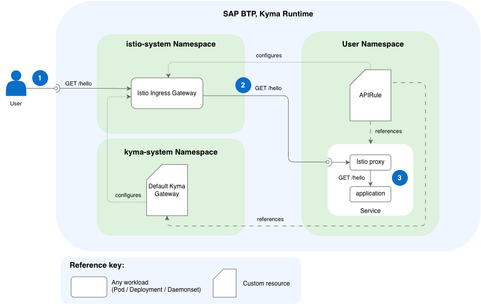

<!-- loioc4fddf6136af4ba2a6720bf11001da57 -->

# `noAuth` Configuration

Use the `noAuth` access strategy to expose a workload with no authorization or authentication configurations.

> ### Caution:  
> Exposing a workload to the outside world is always a potential security vulnerability, so be careful. In a production environment, secure the workload you expose with `jwt` or `extAuth`.


## Request Flow



To expose a workload with an `APIRule` and `noAuth`, you need the following resources:

-   An Istio Gateway resource that configures the Istio Ingress Gateway. You can use the default Kyma Gateway or define your own in any namespace. For details, see [Istio Gateways](istio-gateways-8297fa1.md).
-   An `APIRule` with the `noAuth` access strategy that references:
    -   The `Service` you want to expose.
    -   The Istio Gateway \(in this case, Kyma Gateway\) to route traffic through.


With this setup, a request is processed as follows:

1.  The client sends an HTTPS request to the exposed hostname, which enters the cluster's Istio Ingress Gateway.
2.  Istio Ingress Gateway routes the request straight to the `Service` based on the `APIRule` configuration.
3.  The Istio sidecar proxy next to your application forwards the request directly to the application, without performing any authentication or authorization checks.


## Configuring `noAuth`

The `noAuth` access strategy provides a simple configuration for exposing workloads. Use it when you need to allow access to specific HTTP methods without any authentication or authorization checks. This setup is suitable for development and testing environments where security requirements are lower and quick access to services is necessary, or when the data being accessed is not sensitive and does not require strict security measures.

See the following sample configuration:

```
...
rules:
  - path: /headers
    methods: ["GET"]
    noAuth: true

```

