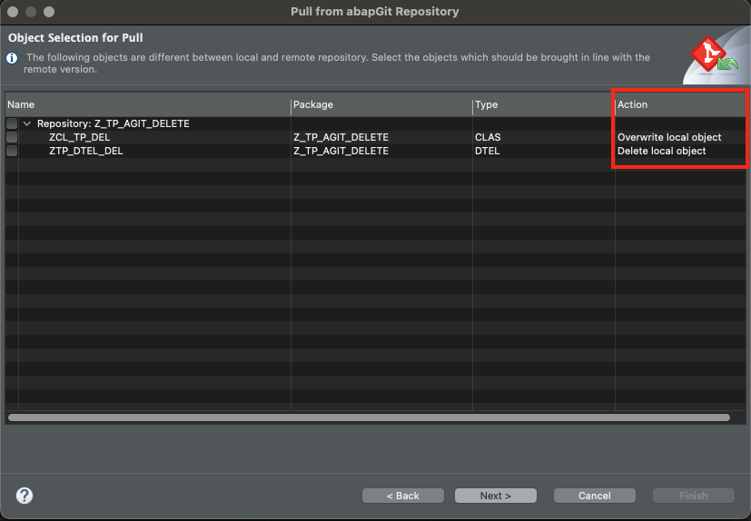
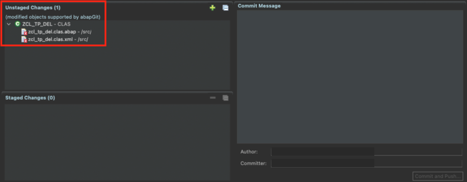

<!-- loiob281f57d97414149b118f724a81d4ef2 -->

# Object Deletions with abapGit

Initially, abapGit as a Git client has been integrated into SAP BTP, ABAP environment to enable customers to facilitate the import of code assets from customers' on-premise systems to SAP BTP, ABAP environment. Over time, additional use cases came up, so that the focus is no longer on a one-time transfer but also onrepeated export and import of development objects across different landscapes, including handling of deletions.

In general, there are two basic types of deletions.

<table>
<tr>
<th valign="top">

Deletion Type

</th>
<th valign="top">

Git Action

</th>
<th valign="top">

Leading Repository

</th>
<th valign="top">

Determination logic

</th>
</tr>
<tr>
<td valign="top">

Local

</td>
<td valign="top">

Pull

</td>
<td valign="top">

Remote

</td>
<td valign="top">

If an object exists locally but not remotely, it will be marked for deletion during the pull process.

</td>
</tr>
<tr>
<td valign="top">

Remote

</td>
<td valign="top">

Stage & Push

</td>
<td valign="top">

Local

</td>
<td valign="top">

If an object exists remotely but not locally, it will be marked for deletion during the staging and push process.

</td>
</tr>
</table>

<a name="loiob281f57d97414149b118f724a81d4ef2__section_mm5_5rp_hdc"/>

## Local Deletion

### Prerequisites

Objects from the remote repository have been pulled into your linked ABAP package.

1.  Start by deleting the file\(s\) of your objects in your abapGit remote repository.

2.  In ABAP Development Tools for Eclipse, you initiate a pull run.

    After that, the system performs a delta calculation to identify the differences between the package and the remote repository.

3.  The object previously deleted in your remote repository will now be shown as the action *delete local object*. Here, you can select the object to be deleted.

    Afterwards, click on *Next* and then *Finish*.

    

4.  After the pull run, you can check the *ABAP Object Log* for the successful deletion.

5.  Finally, reload the *Project Explorer* to see that the object has dissapeared in the overview as well.

<a name="loiob281f57d97414149b118f724a81d4ef2__section_cm5_rwp_hdc"/>

## Remote Deletion

### Prerequisites

Objects from the remote repository have been pulled into your linked ABAP package.

1.  Start by deleting your object locally in ABAP Development Tools for Eclipse first.

    In the *Project Explorer*, select the according object and delete it. This opens up a window called *Select Objects*. Here, you select the object to be deleted and then *Finish*.

2.  Next, initiate a stage and pull of the emerging changes.

    To do this, right-click your abapGit package in ABAP Development Tools for Eclipse and select *Stage and Push*. The following picture shows an example overview of unstaged and staged changes.

    

3.  In the changes overview, the previously deleted object in your package will now be shown with a deleted icon.

    You can drag and drop the object from *Unstaged Changes* to *Staged Changes*.

    Afterwards, select *Commit & Push*.

    In the tab *abapGit Repositories*, you can now see that your linked repository will show the Status *Pushed Successfully*.

