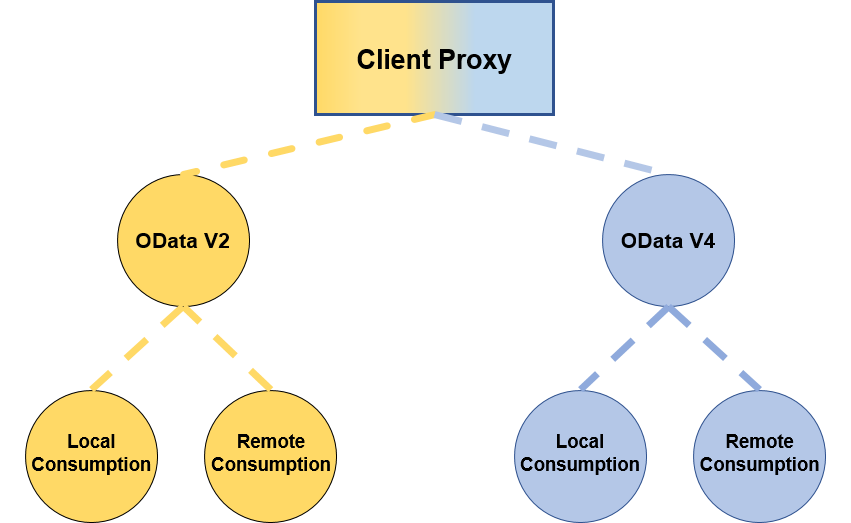

<!-- loio0d92f493624f47fba997d3a5e0dd2a0d -->

# OData Client Proxies

There are several consumption types and OData versions for your OData Client Proxy configurations, depending on your use case.

<a name="loio0d92f493624f47fba997d3a5e0dd2a0d__section_ykz_gnw_h5b"/>

## Consumption Types

The OData Client Proxy can be either local or remote.

### Local Client Proxy

Use this Client Proxy for the consumption of an OData service on the current server without HTTP.

-   No HTTP overhead

-   The OData service is processed in the same application session. This allows integration testing, for example, including stubbing.

### Remote Client Proxy

Use this Client Proxy for the consumption of an OData service that is offered on a remote server.

<a name="loio0d92f493624f47fba997d3a5e0dd2a0d__section_qfj_k4w_h5b"/>

## OData Versions

### **OData Version 2 Client Proxy**

Use this Client Proxy for the consumption of an OData Version 2 service.

### OData Version 4 Client Proxy

Use this Client Proxy for the consumption of OData Version 4 services.

> ### Note:  
> These configurations \(the OData version and consumption type\) depend on each other. For example, there is a local OData Version 2 Client Proxy or a remote OData Version 4 Client Proxy, but not a local Client Proxy independent of the OData version. The asynchronous Client Proxy is only available for remote consumption of OData Version 4 services.

<a name="loio0d92f493624f47fba997d3a5e0dd2a0d__section_o2b_wnw_h5b"/>

## Constraints

For Client Proxy known constraints, see SAP Note [2428114 - SAP Gateway Foundation SAP\_GWFND OData Client Proxy - Known Constraints](https://launchpad.support.sap.com/#/notes/2428114).

**Related Information**  

[OData Request Terms](odata-request-terms-a3b0e95.md "An overview of some OData Request terminology.")

[OData Outbound Communication](odata-outbound-communication-811b523.md "The OData Client Proxy is the interface between the client (consumer of a service) and the service implementation (data provisioning) in the OData service consumption in ABAP. This enables ABAP developers to create OData client coding to run OData requests in your ABAP coding.")

