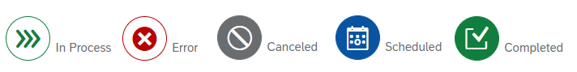

<!-- loio0a3a7359c24341b5bac61652b4858bff -->

# Operations Dashboard

The *Operations Dashboard* gives an overview of all processes that have been triggered in the*Landscape Portal* to help you monitor your operations.

<a name="loio0a3a7359c24341b5bac61652b4858bff__section_umt_xqz_1tb"/>

## Prerequisites

You need to have the “LandscapePortalAdmin” user role assigned to your user account to access this app.

<a name="loio0a3a7359c24341b5bac61652b4858bff__section_vzk_yqz_1tb"/>

## Working in the Operations Dashboard

1.  Log into the *Landscape Portal* from your provider subaccount.

2.  Click on the *Operations Dashboard* tile to open the app.

3.  Use the drop-down menu in the*Available Systems*section to choose for which systems to display the information. In case no system is selected the information is displayed for all systems.

4.  In the *Downtimes* section on the left-hand side of the screen, you can see a calendar that displays on which days downtimes are scheduled. Select a date to view more information on the downtimes.

    Calendar legend:

    

5.  The *Requests* section displays a list of all requests triggered for your systems as well as their current status. You can filter for different statuses by clicking the respective icons:

      

     

6.  In the *Active Requests* section, you can view all active processes, their request IDs, execution date, systems, and their progress bars.

