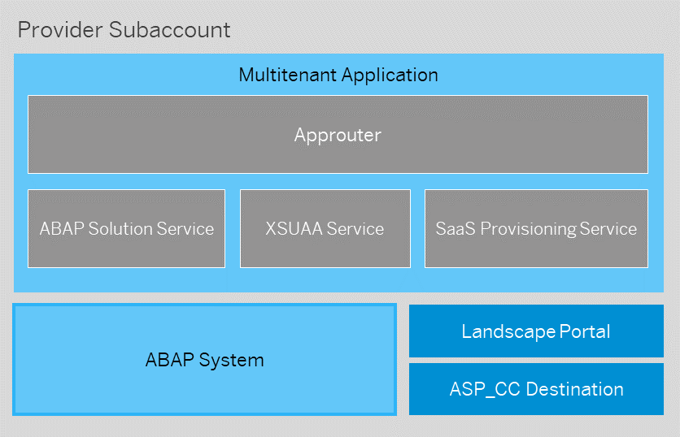

<!-- loio975bd3e54cbe4e52af346740658d1a4a -->

# Order and Provide

After the initial add-on version has been built, you must deploy and provide it as a SaaS solution so that the add-on can be consumed by customers via a subscription in the SAP BTP cockpit.

<a name="loio4e35eb027f284b7fa6219bc70561fb4e"/>

<!-- loio4e35eb027f284b7fa6219bc70561fb4e -->

## Deploy

In order to offer a multitenant application based on an ABAP add-on product, a multi-target application \(MTA\) is developed and deployed to the Cloud Foundry environment on SAP BTP. The MTA integrates the different services required for this scenario, such as the ABAP Solution service, responsible for provisioning ABAP systems, tenants, and users on demand. For more in-depth information, see [Multitenant Applications](https://help.sap.com/docs/btp/sap-business-technology-platform/entitlements-and-quotas?version=Cloud&q=entitlements%20and%20quotas).

Once you’ve configured your multitenant application, you can deploy it once for testing purposes in the global account for development. After testing the subscription process during this development phase, the multitenant application can be deployed to the global account for production. See [System Landscape/Account Model](https://help.sap.com/docs/btp/sap-business-technology-platform/concepts#system-landscape%252Faccount-model).

After the multitenant application has been deployed for production purposes, the SaaS solution is ready for commercialization.

You have two options for implementing and deploying the application. The recommended approach is to use the Maintain Solution app in the Landscape Portal. See [Maintain Solution](https://help.sap.com/docs/help/d91c4152c3d74c12bc9bd4ed92681902/d2a73509305c4ea7971ee24e68509dd8.html).

Alternatively, you can create your own multitenant application. This allows you to modify parameters that are not exposed in the Maintain Solution app; however, the app should cover all common use cases. See Developing Multitenant Applications in the Abap Environment.


### gCTS Delivery

If you use gCTS instead of add-ons for delivering software components to production systems, you have to configure the multitenant application manually. In the configuration of the ABAP solution service the value for the add-on product name must be left empty. This is currently not supported by the Maintain Solution app. See [Delivery via Add-On or gCTS](https://help.sap.com/docs/btp/sap-business-technology-platform/delivery-via-add-on-or-gcts?version=Cloud).

Prerequisites

• To configure the sizing of a SaaS solution, you have to determine the expected load per region by using the Technical Monitoring Cockpit. See [Technical Monitoring Cockpit \(Cloud Version\)](https://help.sap.com/docs/btp/technical-monitoring-cockpit-cloud-version/technical-monitoring-cockpit-cloud-version).

• To implement and deploy a multitenant application for a SaaS solution, you have to assign the necessary entitlements in the provider subaccount, for example for the ABAP Solution service. See [Multitenant Applications](https://help.sap.com/docs/btp/sap-business-technology-platform/entitlements-and-quotas?version=Cloud&q=entitlements%20and%20quotas) and [Entitlements and Quotas](https://help.sap.com/docs/btp/sap-business-technology-platform/entitlements-and-quotas?version=Cloud&q=entitlements%20and%20quotas).

<a name="loio1782f253e102484dac378887b3d6d769"/>

<!-- loio1782f253e102484dac378887b3d6d769 -->

### Sizing

A multitenant application has some central sizing properties that dictate the scope and metric of your offering, or in other words, how many resources will be available for each consumer.

*Tenant Limit:* Before deploying your application, you must decide on a tenant limit. Once that number of consumer tenants is reached in a system, a new system will be provisioned for the next consumer. If you choose a limit of 1, you will be defining a single tenant offering with one consumer per system.

> ### Tip:  
> For in-depth information about multitenancy, see [this section](https://help.sap.com/docs/btp/sap-business-technology-platform/concepts?version=Cloud#multitenancy).

Additionally, you need to define the sizing of each provisioned ABAP system. The sizing is defined by the number of ABAP compute units \(runtime\) and HANA compute units \(persistence\) each system is assigned. These values are reflected by the parameters size\_of\_runtime and size\_of\_persistence. For more information, see [Creating an ABAP System](../20-getting-started/creating-an-abap-system-50b32f1.md).

For multitenancy offerings, there’s no sizing/quota per customer. You must decide on an overall sizing depending on the expected load in a region. You can use the Technical Monitoring Cockpit to assist you in this.

> ### Note:  
> If the quota for a system is exceeded, you can request a resizing of the ABAP runtime or persistency depending on the needs of the SaaS application.

<a name="loioa44d1c7dcbf7460e9f4d4ac964dc841f"/>

<!-- loioa44d1c7dcbf7460e9f4d4ac964dc841f -->

### Using the Maintain Solution App


<a name="loioa44d1c7dcbf7460e9f4d4ac964dc841f__section_ocz_zyt_4zb"/>

## Configure the solution

As a Landscape Portal administrator, you can implement the multitenant application using the*Maintain Solution*app in the Landscape Portal. Create a new solution using:

-   the previously registered product,

-   the product version that shall be installed initially \(“latest” will always install the newest available product version\),

-   the usage mode “prod”, unless you do not intend to deploy a productive application at the end,

-   the consumer tenant limit and system sizing values that you have decided on.


For more information regarding solutions, see[Create Solution](https://help.sap.com/docs/help/d91c4152c3d74c12bc9bd4ed92681902/4441a90bb6644a02a44b2f9e25b80cc5.html).


<a name="loioa44d1c7dcbf7460e9f4d4ac964dc841f__section_jzz_jzt_4zb"/>

## Deploy the solution for test purposes

After creating the solution, it is recommended to perform a test deployment to validate the subscription process. Use the *Maintain Solution* app to create a deployment configuration for your solution:

-   Target the Provide space in the 05 Provide subaccount in your global account for development. You need to specify the corresponding CF API Endpoint, CF Organization Name and CF Space Name.

-   Choose the domain type “shared”. Since this is not a productive deployment, it is sufficient to use one of the available app domains provided by SAP.

-   Since you are deploying to a shared app domain, a unique route prefix is needed to uniquely identify your application endpoint.

-   Maintain the subdomain of the subaccount where you intend to test the subscription process.


For more information regarding deployment configurations, see[Create Deployment Configuration](https://help.sap.com/docs/help/d91c4152c3d74c12bc9bd4ed92681902/146b71650f254d57b403ec982eea82ff.html).


<a name="loioa44d1c7dcbf7460e9f4d4ac964dc841f__section_lxb_rzt_4zb"/>

## Test the solution

You can test the multitenant application by subscribing from a consumer subaccount created in the global account for development. See [Subscribe to Multitenant Applications Using the Cockpit](https://help.sap.com/docs/btp/sap-business-technology-platform/subscribe-to-multitenant-applications-using-cockpit?version=Cloud).

Once the subscription is successful, you may also want to test the initial user onboarding process. First, assign the onboarding role collection, which includes the SolutionAdmin role, to your user. Afterwards, access the application via the consumer subaccount and trigger the user onboarding. For more details, please see the section on the productive tenant onboarding.


<a name="loioa44d1c7dcbf7460e9f4d4ac964dc841f__section_fm1_zzt_4zb"/>

## Deploy the solution for production purposes

After successfully testing the subscription process you can proceed to a productive deployment of your solution. Use the *Maintain Solution* app to create a second deployment configuration for your solution:

-   Target the Provide space in the 05 Provide subaccount in the global account for production. You need to specify the corresponding CF API Endpoint, CF Organization Name and CF Space Name.

-   Choose the domain type “custom”. It is recommended to use a custom domain for your productive application, such that consumers can access it via a recognizable URL.

-   It is recommended to use a wildcard route in conjunction with custom domains. This will route all requests towards that domain to your application.


To set up a custom domain, please follow the steps outlined in [Configuring Custom Domains](https://help.sap.com/docs/custom-domain/custom-domain-manager/configuring-custom-domains?version=Cloud) or [Get Started with the Custom Domain Manager](https://developers.sap.com/tutorials/btp-custom-domain-manager-getting-started.html). After registering the custom domain in your provider subaccount, it becomes available as a private domain \(see [Private domains](https://docs.cloudfoundry.org/devguide/deploy-apps/routes-domains.html#private-domains)\) for route creation in any of the Cloud Foundry spaces of the subaccount. Once you have created the production deployment configuration, you can trigger it using the *Deploy* action, see[Deploy Solution](https://help.sap.com/docs/help/d91c4152c3d74c12bc9bd4ed92681902/aea1dfd5093c4a2bb107f6d20b8dfc83.html). Once deployed, your solution should appear in the service marketplace on SAP BTP Cockpit for subaccounts within your global account for production.

<a name="loioa4c7b148a9ab4341b876574fd54c0a18"/>

<!-- loioa4c7b148a9ab4341b876574fd54c0a18 -->

### Configuring a Solution Manually

You can configure the multitenant application manually, which allows you to finetune your solution beyond the options offered in the *Maintain Solution*app. In this case, you must configure the individual project files and deploy the project using the corresponding command line tools.

In the following sections, the general steps are described. For a description of multitenant applications in general and more detailed configuration options, see [Multitenant Applications](order-and-provide-975bd3e.md#loio195031ff8f484b51af16fe392ec2ae6e).


<a name="loioa4c7b148a9ab4341b876574fd54c0a18__section_xhz_n15_4zb"/>

## Configure the solution

It is recommended that you initially configure your solution using the Maintain Solution app and then use the Download functionality to obtain the application descriptor file. Since the download is available on deployment configuration level, it is necessary to create both a solution and a deployment configuration.

Follow the steps detailed in Using the Maintain Solution app \(see [Order and Provide](order-and-provide-975bd3e.md#loio975bd3e54cbe4e52af346740658d1a4a)\), creating both the solution and the deployment configuration for the test phase. Once configured, use the Download function to obtain the application descriptor. Finally, clone the reference solution linked below and replace the standard descriptor with the generated one. This results in a project that is already configured, making it the perfect starting point to implement your modifications.

The reference solution provided by SAP can be found here: [GitHub - sap-software/abap-saas-reference-solution: Template of an ABAP SaaS Reference Solution allowing the SAP Partner to deploy a solution containing approuter and XSUAA dependencies](https://github.com/sap-software/abap-saas-reference-solution).

> ### Note:  
> gCTS Delivery: If you use gCTS instead of add-ons for the delivery of software components to production systems, the value for the add-on product name in the application descriptor has to be empty. See [Delivery via Add-On or gCTS](delivery-via-add-on-or-gcts-438d7eb.md#loio438d7ebfdc4a41de82dcdb156f01857e).


<a name="loioa4c7b148a9ab4341b876574fd54c0a18__section_es1_w15_4zb"/>

## Deploy the solution for test purposes

After configuring the multitenant application, it is recommended to perform a test deployment to validate the subscription process.

Your project should already have the correct deployment configuration, as you maintained this in the Maintain Solution app before generating the application descriptor. As a result, you can directly build and deploy your project.

Use the [Cloud MTA Build Tool](https://sap.github.io/cloud-mta-build-tool/)and the[Cloud Foundry CLI](https://docs.cloudfoundry.org/cf-cli/install-go-cli.html).

Once deployed, your solution should appear in the service marketplace on SAP BTP Cockpit for subaccounts within your global account for development.


<a name="loioa4c7b148a9ab4341b876574fd54c0a18__section_ufj_z15_4zb"/>

## Test the solution

You can test the multitenant application by subscribing from a consumer subaccount created in the global account for development. See [Subscribe to Multitenant Applications Using the Cockpit](https://help.sap.com/docs/btp/sap-business-technology-platform/subscribe-to-multitenant-applications-using-cockpit?version=Cloud).

Once the subscription is successful, you may also want to test the initial user onboarding process. First, assign the onboarding role collection, which includes the SolutionAdmin role, to your user. Afterwards, access the application via the consumer subaccount and trigger the user onboarding. For more details, please see the section on the [Initial User Onboarding](order-and-provide-975bd3e.md#loio4a9c5011922847ac91db165c78656149).


<a name="loioa4c7b148a9ab4341b876574fd54c0a18__section_zpr_cb5_4zb"/>

## Deploy the solution for production purposes

After successfully testing the subscription process, you can proceed to a production deployment of your solution.

You can use MTA extension descriptors to configure the required values for deployment to different targets. This allows you to deploy the same project to different subaccounts. See [Multitenant Applications](order-and-provide-975bd3e.md#loio195031ff8f484b51af16fe392ec2ae6e).

Build and then deploy your project. Once deployed, your solution should appear in the service marketplace on SAP BTP Cockpit for subaccounts within your global account for production.

<a name="loio195031ff8f484b51af16fe392ec2ae6e"/>

<!-- loio195031ff8f484b51af16fe392ec2ae6e -->

### Multitenant Applications

To make the software components in the ABAP System available for multiple different consumers, a multitenant application is deployed into the provider subaccount. This application can then be accessed by different tenants through a dedicated URL.



For the multitenant application, different services and apps are used:

-   **Approuter application**: The application router is the single point-of-entry for the multitenant application and used to forward tenant-specific requests to the corresponding tenant in the ABAP system.

    See [Application Router](https://help.sap.com/docs/BTP/65de2977205c403bbc107264b8eccf4b/01c5f9ba7d6847aaaf069d153b981b51.html?locale=en-US&version=Cloud).

-   **ABAP Solution Service**: ABAP Solution service is required to create multitenant-enabled, ABAP environment-based SaaS solutions. Instead of a service binding from the approuter application to the ABAP environment business service, the approuter is bound to an ABAP Solution service instance. The service orchestrates the creation of ABAP systems upon consumer subscription as well as tenant provisioning/decommissioning. Requests routed via the approuter application to the ABAP solution service instance are automatically proxied to the corresponding ABAP tenant.

-   **SAP Authorization and Trust Management service \(XSUAA\)**: The `xsuaa` service instance acts as an OAuth 2.0 client to the multitenant application, and to the `ABAP Solution`service instance. The SAP Authorization and Trust Management service lets you manage user authorizations and trust to identity providers used for the multitenant application. The service instance is created with a corresponding security configuration. See [SAP Authorization and Trust Management Service in the Cloud Foundry Environment](https://help.sap.com/docs/CP_AUTHORIZ_TRUST_MNG/ae8e8427ecdf407790d96dad93b5f723/6373bb7a96114d619bfdfdc6f505d1b9.html?version=Cloud&locale=en-US).

-   **SaaS Provisioning Service**: The `SaaS Provisioning`service allows application providers to register multitenant applications and services in the Cloud Foundry environment in SAP Business Technology Platform. After a SaaS Provisioning service instance is created, the multitenant application becomes available for subscription in a consumer subaccount.

-   **ABAP System**: ABAP systems and tenants used to provide the multitenant application are not created manually but are managed by the ABAP Solution service: Upon first subscription the ABAP system is created as well the consumer tenant in the system. To be able to create the system, the ABAP solution service uses credentials of a technical platform user that is defined in the ASP\_CC destination. Depending on the configuration of the ABAP solution, for every subsequent subscription either a new tenant is created in the same ABAP system \(`consumer_tenant_limit` \> 1\) or a new system is created for every new subscription \(`consumer_tenant_limit` = 1\). A new ABAP system is also created if all the existing ones are "full" because the consumer tenant limit that you specified was reached. If you're using the *Manage Consumer Subscription* app, please be aware that a consumer subdomain reservation counts toward that limit, too. Note that an ABAP system can only be deleted if no consumer tenants exist.

    Consumer subscription-based multitenancy is only possible in those systems in which you provide your software as a service \(SaaS\) solution to consumers, i.e. your production and test systems. It is not available in development systems.

    See [Creating an ABAP System.](https://help.sap.com/docs/BTP/60f1b283f0fd4d0aa7b3f8cea4d73d1d/50b32f144e184154987a06e4b55ce447.html?state=DRAFT&version=Internal)

-   **Landscape Portal**: The Landscape Portal acts as a central tool to allow service providers to perform lifecycle management operations such as add-on updates, provisioning new consumers as new tenants, and more. A subscription to the Landscape Portal in the globalaccount where the multitenant application is deployed is required for the subscription flow to work.

    See [Landscape Portal](https://help.sap.com/docs/help/d91c4152c3d74c12bc9bd4ed92681902/6aa0a773510e4c82b167fcca4c755327.html).

-   **ASP\_CC Destination**: An `OAuth2Password` destination pointing to the Cloud Foundry Cloud Controller API is required for the ABAP Solution service to create and access ABAP service instances. Credentials of a technical platform user, that is assigned as a space developer in the space where the multitenant application is deployed, are maintained.


### Multitarget Application

The multitenant application is deployed as a multitarget application \(MTA\), which is logically a single application comprised of multiple parts created with different technologies.

The MTA describes the desired result in an mta.yaml file which may be extended with mta extensions \(.mtaext\) using the MTA model which contains MTA modules, MTA resources and interdependencies between them. Afterwards, the MTA deployment service validates, orchestrates, and automates the deployment of the MTA, which results in Cloud Foundry \(CF\) applications, services and SAP-specific contents. For more information about the Multitarget Application model, see the official The Multitarget Application Model specification. For more details on how to use it in the CF Environment, which is the case here, see [Multitarget Applications in the Cloud Foundry Environment.](https://help.sap.com/docs/BTP/65de2977205c403bbc107264b8eccf4b/d04fc0e2ad894545aebfd7126384307c.html?locale=en-US&version=Cloud)

A complete reference example of the multitenant application MTA is provided in GitHub/SAPSamples: [ABAP SaaS Reference Solution for ABAP solution provider](https://github.com/sap-software/abap-saas-reference-solution) 


### MTA Parameters

Parameters are defined at the beginning of the mta.yaml file, so that the actual structure of the MTA model does not have to be changed but can be extended via extension files. The parameters are referenced in the subsequent sections of the MTA using the syntax `${parameter-name}`. For more details on parameters, see [Parameters and Properties](https://help.sap.com/docs/BTP/65de2977205c403bbc107264b8eccf4b/490c8f71e2b74bc0a59302cada66117c.html?locale=en-US&version=Cloud).

-   **Freely defined parameters:**

    -   app-domain: The domain that should be used for the approuter and therefore the SaaS application. In our example, this is the $\{default-domain\} \(equals to the cfapps-domain of the current landscapes\) for a development deployment; for production it should be the custom domain \(so here: `mydomain.com`\).

    -   appname: The value that should be used as xsappname and solution name \(here: `abap-saas-reference-solution)`.

    -   route-prefix: The value that should be used as a prefix in the route of the approuter, allowing it to deploy the same MTA to the same landscape muliple times using the default landscape domain.

    -   addon-product-name: Name of add-on product to be installed

    -   provider-admin-email: Provider administrator e-mail address used for provisioning of ABAP systems

    -   saas-display-name: Display name of SaaS application shown in subscription tile

    -   saas-description: Description of SaaS application shown in subscription tile

    -   tenant-mode: Whether to provide a `'single'` or `'multi'` tenancy solution


-   **Parameter with semantics to MTA deployer:**

    -   enable-parallel-deployments: If set to `true`, deploys multiple modules at the same time.


### MTA Extension Descriptors

The parameters defined in the MTA can be adapted for the corresponding landscape using MTA extension descriptor files. These files extend the original MTA descriptor file \(mta.yaml\) and provide certain deployment specific configurations/parameters/valuest. The descriptor files have the file extension \*.mtaext and are used during the deployment using CF CLI with MultiApps plugin, see [MultiApps CF CLI Plugin](https://github.com/cloudfoundry-incubator/multiapps-cli-plugin).

For more information on MTA extension descriptors, see: [Defining MTA Extension Descriptors.](https://help.sap.com/docs/BTP/65de2977205c403bbc107264b8eccf4b/50df803465324d36851c79fd07e8972c.html) 

The extension descriptor files are usually in the folder “extensions” next to the mta.yaml file.

Depending on the stage of implementation of the multitenant application, a different approuter configuration is used. This is controlled via different extension descriptor files used during MTA deployment:

-   Configuration for **Development Phase**:

    For development, test and demo purposes, MTA deployment can be done using the`${default-domain}` as `app-domain`and a `route-prefix`, which will avoid collisions due to the default domain. Additionally, we suggest setting the property `XS_APP_LOG_LEVEL` on the approuter module to `debug` to ensure that there is more detailed logging output.

-   Configuration for **Production Phase**:

    For purpose of providing a solution / solutions to applications consumers in a production scenario, the MTA deployment should be done using a custom domain configured with the app-domain parameter \(`app-domain`\) and an empty route-prefix \(`route-prefix.`\). Using the custom domain, a wildcard route for tenant access \("`*.${app-domain}`"\) can be created.


### MTA Build and Deploy

Before MTA deployment, the MTA project is built using the[Cloud MTA Build Tool \(MBT\)](https://sap.github.io/cloud-mta-build-tool/). Afterwards the deployment-ready multitarget application archive \(\*.mtar file\) is deployed in combination with the corresponding MTA extension descriptor file using the Cloud Foundry CLI with the MultiApps plugin: `cf deploy <path to .mtar file> -e <path to MTA extension descriptor>`


### Related Information

[Installing the cf CLI](https://docs.cloudfoundry.org/cf-cli/install-go-cli.html)

[MultiApps CF CLI Plugin - Download and Installation](https://github.com/cloudfoundry-incubator/multiapps-cli-plugin#download-and-installation)

[MultiApps CF CLI Plugin - Usage](https://github.com/cloudfoundry-incubator/multiapps-cli-plugin#usage)

<a name="loio1697387c02e74e66a55cf21a05678167"/>

<!-- loio1697387c02e74e66a55cf21a05678167 -->

#### ABAP Solution Service


> ### Sample Code:  
> ```
> 
>   - name: abap-solution
>     type: org.cloudfoundry.managed-service
>     parameters:
>       service: abap-solution
>       service-plan: standard
>       service-name: ${appname}-abap-solution
>       config:
>         name: ${appname}
>         consumer_id_pattern: ${consumer-id-pattern}
>         plans:
>           - plan_name: ${plan-name}
>             addon_product_name: ${addon-product-name}
>             size_of_runtime: ${size-of-runtime}
>             size_of_persistence: ${size-of-persistence}
>             provider_admin_email: ${provider-admin-email}
>             consumer_tenant_limit: ${consumer-tenant-limit}
>             sap_system_name: ${sap-system-name}
>             usage: ${usage-mode}
>         xs-security:
>           xsappname: xs-app-${appname}
> 			
> ```

ABAP Solution Service is used to enable multitenancy for ABAP Environment systems: Instead of creating the ABAP system manually it is created by the ABAP Solution service during the first subscription of an application consumer or once the consumer tenant limit for all viable systems has been reached.

Credentials provided in the ASP\_CC destination are used by ABAP Solution Service to authenticate at the Cloud Foundry Cloud Controller API endpoint and to create required ABAP service instances.

The service plan used for created ABAP service instances is depending on the `addon_product_name` parameter: `abap/standard` is used for a system without add-on, `abap/saas_oem` is used for a system with installed add-on. Provisioning parameters like `sap_system_name`, `provider_admin_email` and sizing-relevant parameters can be defined.

After a new system is created, a tenant for the application consumer is provisioned. The business type \(see [Tenant Business Types](https://help.sap.com/docs/BTP/60f1b283f0fd4d0aa7b3f8cea4d73d1d/018e8bd109d64140ade5429c3a9dbef0.html?state=DRAFT&version=Internal)\) used for provisioning of the tenant depends on the `usage` parameter: In case of `usage = test`, the tenant is created as `Partner Customer Test` tenant. Whereas with `usage = prod`, the tenant is created as `Partner Customer Production` tenant. Parameter `tenant_mode` controls if per subscription a new tenant is created in the same system and with `consumer_tenant_limit` the number of tenants per system is configured.


### ABAP System: saas\_oem plan

This service plan is like the standard service plan of the ABAP service \(see [Create an ABAP System](https://help.sap.com/docs/BTP/60f1b283f0fd4d0aa7b3f8cea4d73d1d/50b32f144e184154987a06e4b55ce447.html?state=DRAFT&version=Internal&q=create%20an%20abap%20system)\), but it is used as "backing service" for a partner-provided SaaS solution. In comparison to a standard service plan of the ABAP service, there is one main differences: An add-on product \(see [The Add-on product](https://www.project-piper.io/scenarios/abapEnvironmentAddons/#the-add-on-product)\) which is installed during system provisioning can be specified.

-   Parameter: `addon_product_name`

    \(specifies which ABAP add-on to install during provisioning\)

-   Parameter: `addon_product_version`

    \(if - for testing purpose - another add-on version instead of the most recent released version shall be installed\)


### ABAP Solution Service Parameters


<table>
<tr>
<th valign="top">

Name

</th>
<th valign="top">

Data Type

</th>
<th valign="top">

Description

</th>
<th valign="top">

Purpose

</th>
<th valign="top">

Updateable

</th>
</tr>
<tr>
<td valign="top">

name

</td>
<td valign="top">

string

</td>
<td valign="top">

Name of the solution as defined by the provider. Must be unique in the scope of the Global Account \(or globally if this information is not available\)

</td>
<td valign="top">

Used to identify the solution and will be passed through to ABAP System \(saas\_oem plan\)

</td>
<td valign="top">

No

</td>
</tr>
<tr>
<td valign="top">

sap\_system\_name

\(optional\)

</td>
<td valign="top">

string

</td>
<td valign="top">

Name of the system as defined by the provider. If a value is supplied, the new system\(s\) will be created with this parameter.

</td>
<td valign="top">

Passed through ABAP System

</td>
<td valign="top">

No

</td>
</tr>
<tr>
<td valign="top">

addon\_product\_name

\(optional\)

</td>
<td valign="top">

string

</td>
<td valign="top">

Registered name of the add-on product

</td>
<td valign="top">

Passed through ABAP System \(saas\_oem plan\)

</td>
<td valign="top">

No

</td>
</tr>
<tr>
<td valign="top">

addon\_product\_version

\(optional\)

</td>
<td valign="top">

string

</td>
<td valign="top">

Version of the add-on product to be installed. A released product version needs to be defined. If you do not specify the parameter, the latest released product version will be used during the add-on installation. If you specify other versions than allowed, the add-on installation and therefore also the system provisioning and consumer subscription will be unsuccessful.

</td>
<td valign="top">

Passed through ABAP System \(saas\_oem plan\)

</td>
<td valign="top">

Yes \(updated value applies for new systems only\)

</td>
</tr>
<tr>
<td valign="top">

consumer\_tenant\_limit

</td>
<td valign="top">

int

</td>
<td valign="top">

Maximum number of consumer tenants in the multitenant ABAP system. If the consumer tenant limit is exceeded, a new multitenant system will be created.

consumer\_tenant\_limit \>= 1

> ### Note:  
> A recently deleted tenant will be counted towards the limit, in case it is restored during the grace period. After the 30-day grace period is up, it will no longer be considered for the limit.


</td>
<td valign="top">

Passed through ABAP System \(saas\_oem plan\)

</td>
<td valign="top">

Yes

</td>
</tr>
<tr>
<td valign="top">

size\_of\_runtime

</td>
<td valign="top">

int

</td>
<td valign="top">

Default sizing \(ABAP runtime\) of abap system\(s\) created/provisioned by solution

</td>
<td valign="top">

Passed through to ABAP System

</td>
<td valign="top">

Yes \(updated value applies for new systems only\)

</td>
</tr>
<tr>
<td valign="top">

size\_of\_persistence

</td>
<td valign="top">

int

</td>
<td valign="top">

Default sizing \(ABAP persistence \[HANA\]\) of abap system\(s\) created/provisioned by solution

</td>
<td valign="top">

Passed through to ABAP System

</td>
<td valign="top">

Yes \(updated value applies for new systems only\)

</td>
</tr>
<tr>
<td valign="top">

tenant\_mode

\(deprecated\)

</td>
<td valign="top">

enum \(string\):

\- single

\- multi

</td>
<td valign="top">

Tenant Mode of the solution

</td>
<td valign="top">

Decides whether a customer will have a tenant in

\- a dedicated system \(single\)

\- a shared system \(multi\)

**single:** will trigger a system creation and a tenant onboarding

**multi** will trigger a system creation \(only if necessary\) and a tenant onboarding

The parameter will be passed through to ABAP System \(saas\_oem plan\).

</td>
<td valign="top">

No

</td>
</tr>
<tr>
<td valign="top">

consumer\_id\_pattern

</td>
<td valign="top">

string \(regex\)

</td>
<td valign="top">

String containing a regular expression with a capturing group. The **subdomain of the consumer** is matched against this regular expression. The value of the first capturing group is used as consumer id.

</td>
<td valign="top">

To allow the provider to group his consumer subaccounts based on a self-chosen consumer identifier: e.g. the subdomains of consumer subaccounts always include a static part that identifies the application consumer, then event if there are multiple test & production consumer subaccounts, the application consumer can be identified in Landscape Portal.

</td>
<td valign="top">

No

</td>
</tr>
<tr>
<td valign="top">

provider\_admin\_email

</td>
<td valign="top">

email

</td>
<td valign="top">

Email address of initial provider user

</td>
<td valign="top">

Passed through to ABAP System \(saas\_oem plan\).

</td>
<td valign="top">

Yes

</td>
</tr>
<tr>
<td valign="top">

xs-security/xsappname

\(optional\)

</td>
<td valign="top">

tring

</td>
<td valign="top">

xsappname used for the OAuth clone during instance creation. Will be visible in the security section of SAP BTP Cockpit when assigning the initial onboarder role. Will be the "Application Name" shown in the Roles UI.

**Default:** Service Instance GUID

**Recommendation:** Provide the same value as defined in the xs-security.json of the XSUAA Instance of your application

</td>
<td valign="top">

Allows providing a meaningful application name to assign the onboarding roles.

</td>
<td valign="top">

No

</td>
</tr>
<tr>
<td valign="top">

usage

</td>
<td valign="top">

enum \(string\):

\- test

\- prod

</td>
<td valign="top">

Specifies whether it is a test or production solution.

</td>
<td valign="top">

In case of usage = test a Partner Customer Test tenant is created, whereas with usage = prod, a Partner Customer Production tenant is provisioned.

</td>
<td valign="top">

No

</td>
</tr>
</table>

<a name="loio2ce1a962c3be48dd8035513b0a2d7397"/>

<!-- loio2ce1a962c3be48dd8035513b0a2d7397 -->

#### SAP Authorization and Trust Management Service


> ### Sample Code:  
> ```
> 
>   - name: xsuaa
>     type: com.sap.xs.uaa
>     requires:
>       - name: abap-solution
>     parameters:
>       service-plan: application
>       service-name: xsuaa
>       config:
>         oauth2-configuration:
>           redirect-uris:
>             - "https://*.${app-domain}/**"
>         xsappname: ${appname}
>         tenant-mode: shared
>         scopes:
>           - name: $XSAPPNAME.Callback
>             description: With this scope set, the callbacks for tenant onboarding, offboarding and getDependencies can be called.
>             grant-as-authority-to-apps:
>               - $XSAPPNAME(application,sap-provisioning,tenant-onboarding)
>         foreign-scope-references:
>           - uaa.user
>         role-collections:
>           - name: ${appname}-admin
>             role-template-references:
>               - $XSSERVICENAME(${appname}-abap-solution).SolutionAdmin
> 
> ```

The `xsuaa` service instance, acts as an OAuth 2.0 client to the multitenant application, and to the `ABAP Solution` service instance. It provides access to the SaaS Provisioning service for calling callbacks and getting the dependencies API by granting corresponding scopes.

A role collection is defined as part of the xsuaa configuration which provides authorization for the initial user onboarding in the new ABAP tenant after a subscription was done.

For this purpose, the “SolutionAdmin” role is referenced. See [Quick Start: Create Role Collections \(with Predefined Roles\).](https://help.sap.com/docs/BTP/65de2977205c403bbc107264b8eccf4b/fe750543788a40b79a49854590ad0b11.html)

Finally, a foreign scope reference is defined to ensure a token exchange will be possible and the ABAP systems can be called.

<a name="loiocbc379ef476e460c87934d0e496b7850"/>

<!-- loiocbc379ef476e460c87934d0e496b7850 -->

#### Saas Provisioning Service


> ### Sample Code:  
> ```
> 
>   - name: saas-registry
>     type: org.cloudfoundry.managed-service
>     parameters:
>       service: saas-registry
>       service-plan: application
>       service-name: saas-registry
>       config:
>         xsappname: ${appname}
>         appName: ${appname}
>         appUrls:
>           getDependencies: https://cis${route-prefix}.${app-domain}/callback/v1.0/dependencies
>           onSubscription: https://cis${route-prefix}.${app-domain}/callback/v1.0/tenants/{tenantId}
>         displayName: ${saas-display-name}
>         description: ${saas-description}
> ```

The `SaaS Provisioning` service allows application providers to register multitenant applications and services in the Cloud Foundry environment in SAP Business Technology Platform.


### SaaS Provisioning Service Paramters


<table>
<tr>
<td valign="top">

xsappname

</td>
<td valign="top">

The xsappname configured in the security descriptor file used to create the XSUAA instance.

</td>
</tr>
<tr>
<td valign="top">

getDependencies

</td>
<td valign="top">

**\(Optional\)** Any URL that the application exposes for GET dependencies. If the application does not have dependencies and the callback is not implemented, it should not be declared. **Note:** The JSON response of the callback must be encoded as either UTF8, UTF16, or UTF32, otherwise an error is returned. Important: You can either provide your own getDependencies Callback or use the default implementation of the AppRouter \(recommended if no special logic is needed\). **But:** If an own implementation is provided you have to make sure that the ABAP Solution instance is returned as a dependency.

The path is: /callback/v1.0/dependencies

</td>
</tr>
<tr>
<td valign="top">

onSubscription

</td>
<td valign="top">

Any URL that the application exposes via PUT and DELETE subscription. It must end with /\{tenantId\}. The tenant for the subscription is passed to this callback as a path parameter. You must keep \{tenantId\} as a parameter in the URL so that it is replaced at real time with the tenant calling the subscription. This callback URL is called when a subscription between a multitenant application and a consumer tenant is created \(PUT\) and when the subscription is removed \(DELETE\). **Important:** You can either provide your own onSubscription Callback or use the default implementation of the approuter \(recommended if no special logic is needed\).

The path is: /callback/v1.0/tenants/\{tenantId\}

</td>
</tr>
<tr>
<td valign="top">

displayName

</td>
<td valign="top">

**\(Optional\)** The display name of the application when viewed in the cockpit. For example, in the application's tile. If left empty, takes the application's technical name.

</td>
</tr>
<tr>
<td valign="top">

description

</td>
<td valign="top">

**\(Optional\)** The description of the application when viewed in the cockpit. For example, in the application's tile. If left empty, takes the application's display name.

</td>
</tr>
<tr>
<td valign="top">

category

</td>
<td valign="top">

**\(Optional\)** The category to which the application is grouped in the Subscriptions page in the cockpit. If left empty, gets assigned to the default category.

</td>
</tr>
</table>


### Callback APIs

Callback URLs defined in parameters *getDependencies* and *onSubscription* are called during the subscription flow and need to be callable via a consumer-independent URL. For this purpose, a dedicated URL that matches the `TENANT_HOST_PATTERN` of the approuter application should be defined as part for the MTA project.

Depending on the phase of the multitenant application, a different `TENANT_HOST_PATTERN` is defined:

-   **During development phase:**

    `TENANT_HOST_PATTERN: ^(.*)-abap-saas-app.cfapps.eu10.hana.ondemand.com`

    Define a route cis-abap-saas-app.cfapps.eu10.hana.ondemand.com for SaaS Provisioning service callback URLs

-   **During production phase:**

    `TENANT_HOST_PATTERN: ^(.*).mydomain.com`

    Define a route cis.mydomain.com for SaaS Provisioning service callback URLs


### Subscription Management Dashboard

With Subscription Management Dashboard as the dashboard UI of SaaS Provisioning Service, the application provider can centrally manage subscriptions, e.g. unsubscribe existing application consumer subscriptions. See [Using the Subscription Management Dashboard.](https://help.sap.com/docs/BTP/65de2977205c403bbc107264b8eccf4b/434be695f9e946ccb4c28911dd1e16d0.html)

<a name="loio44dbd0ae4d4b4d9c9c8371d711c22bfe"/>

<!-- loio44dbd0ae4d4b4d9c9c8371d711c22bfe -->

#### Approuter Application


To authenticate business users of the application at runtime, a tenant-aware approuter application and the `xsuaa` service in SAP Business Technology Platform are used. This will also provide the necessary callbacks for the SaaS Provisioning Service.

The enhanced approuter application is as a logical part of the multitenant application and configured as an external access point of the application.

For more details on the application router, see [Application Router.](https://help.sap.com/docs/BTP/65de2977205c403bbc107264b8eccf4b/01c5f9ba7d6847aaaf069d153b981b51.html)

With the middleware `@sap/asp-middleware` component a library \(npm module\) is provided that enhances the approuter to also take care of automatically routing the consumer to their ABAP tenants. See [@sap/asp-middleware.](https://www.npmjs.com/package/@sap/asp-middleware) 


### Approuter Configuration

To make sure that the approuter routes all relevant requests to the ABAP Solution, a routing configuration is configured:

> ### Sample Code:  
> ```
> {
> 								"authenticationMethod": "route",
> 								"welcomeFile": "/ui",
> 								"logout": {
> 								"logoutEndpoint": "/sap/public/bc/icf/logoff",
> 								"logoutPage": "/ui"
> 								},
> 								"routes": [
> 								{
> 								"source": "^/sap/(.*)$",
> 								"target": "/sap/$1",
> 								"authenticationType": "xsuaa",
> 								"service": "com.sap.cloud.abap.solution",
> 								"csrfProtection": false
> 								},
> 								{
> 								"source": "^/ui(.*)$",
> 								"target": "/ui$1",
> 								"authenticationType": "xsuaa",
> 								"service": "com.sap.cloud.abap.solution",
> 								"csrfProtection": false
> 								}
> 								]
> 								}
> 							
> ```

-   **Requests to the …/sap/… path**are backend requests and will be routed to the ABAP Solution service after successful authentication. CSRF token protection is disabled for this route as CSRF protection is already enforced via the underlying services in the ABAP system.

-   **Requests to the …/ui/…**are requests to the Fiori Launchpad / End User UI and will be routed to the ABAP Solution service after successful authentication. CSRF token protection is disabled for this route as CSRF protection is already enforced via the underlying services in the ABAP system.


For more details on the parameters, see [Routing Configuration File.](https://help.sap.com/docs/BTP/65de2977205c403bbc107264b8eccf4b/c103fb414988447ead2023f768096dcc.html)


### Approuter Multitenancy

The consumer accesses their multitenant application via the tenant-specific url which is resolved by the app router and "forwarded" \(calls\) to the corresponding abap tenant \(client\). The URL follows the same pattern for all application consumers and differs depending on the implementation phase of the multitenant application:

-   **During development phase:**

    `<SUBSCRIBER_TENANT_SUBDOMAIN>-<APPROUTER_APPLICATION_HOST>.<SAP-PROVIDED_STANDARD_DOMAIN>`

    In each development landscape, SAP provides a different standard domain you can use to create URLs.

    Using that domain, and following the specified URL structure, an example for a created URL could be:

    tenant1-myapprouter.cfapps.eu10.hana.ondemand.com

    Here `tenant1-myapprouter` is the hostname, and `cfapps.sap.hana.ondemand.com` is the SAP-provided standard domain for this development landscape. In this format, a new route must be created manually for each new tenant.

    The common pattern identifying tenant-specific URLs is defined with `TENANT_HOST_PATTERN: ^(.*)->-<APPROUTER_APPLICATION_HOST>.<SAP-PROVIDED_STANDARD_DOMAIN>`

-   **During production phase:**

    `*.<YOUR_CUSTOM_DOMAIN>`

    A custom domain is registered via the custom domain service, then a pattern with \* as the wildcard hostname can be established.

    In this format, since the wildcard is replaced by an actual tenant during runtime, there is no need to create a new route for each new tenant manually.

    The common pattern identifying tenant-specific URLs is defined with TENANT\_HOST\_PATTERN: ^\(.\*\)-<YOUR\_CUSTOM\_DOMAIN\>

    For more information, see [Using Custom Domains.](https://help.sap.com/docs/BTP/65de2977205c403bbc107264b8eccf4b/2291aea5e22440f7a161bdeb9c16b664.html)


The application router derives the tenant from the URL and calls the tenant-aware XSUAA, which is responsible for the authentication of the business user. The UAA reads the tenant and gets the customer-specific identity provider \(IdP\) from the tenant-specific identity zone. Then, the XSUAA delegates the authentication to the configured IdP, and creates a JSON Web Token \(JWT\) that contains the tenant, the current user, and the authorization scopes of the user. The JWT is then sent back to the application router, and from there to the application.

To read and store tenant-specific data, the multitenant application needs to know the tenant ID. Using the Container Security API, the multitenant application is enabled to read the tenant, user, and scopes from the given JWT. The API also validates whether the JWT is valid. The tenant information is contained in the `identityZone` user attribute.

For more information, see:

[Web Access in the Cloud Foundry Environment](https://help.sap.com/docs/BTP/65de2977205c403bbc107264b8eccf4b/70a62d12cf91493cb9d1ec3c04d19ff9.html)

[What Is Authorization and Trust Management](https://help.sap.com/docs/BTP/65de2977205c403bbc107264b8eccf4b/649961f8d4ad463daca33b3a20deba4c.html)

<a name="loio35b5acbb32024aa6b90a22e9f957a9f6"/>

<!-- loio35b5acbb32024aa6b90a22e9f957a9f6 -->

#### Cloud Controller Access Destination


A destination called ASP\_CC needs to be created for ABAP Solution Service to be able to access the Cloud Foundry Cloud Controller API for creation and access to ABAP service instances.


### Prerequisites

-   You've created a user in SAP ID service.

-   The user has been added as a Cloud Foundry org member in the provider subaccount where the Cloud Foundy environment is enabled.

-   The User has been added with the role of a Space Developer, in the space where the multitenant application \(MTA\) is deployed.


> ### Note:  
> Please note that you should never set personal credentials \(e.g. for your account\) in the User and Password fields. Always use a technical user instead.


### Process Steps

1.  In the provider subaccount navigate to Connectivity -\> Destinations
2.  Create a new destination as follows:


    <table>
    <tr>
    <th valign="top">

    Property
    
    </th>
    <th valign="top">

    Value
    
    </th>
    </tr>
    <tr>
    <td valign="top">
    
    Name
    
    </td>
    <td valign="top">
    
    ASP\_CC
    
    </td>
    </tr>
    <tr>
    <td valign="top">
    
    Type
    
    </td>
    <td valign="top">
    
    HTTP
    
    </td>
    </tr>
    <tr>
    <td valign="top">
    
    Description
    
    </td>
    <td valign="top">
    
    Access the Cloud Foundry Cloud Controller API
    
    </td>
    </tr>
    <tr>
    <td valign="top">
    
    URL
    
    </td>
    <td valign="top">
    
    < API Endpoint domain of Cloud Foundry landscape\>

    You can find it under your subaccount \> Overview.

    > ### Example:  
    > https://api.cf.eu10.hana.ondemand.com


    
    </td>
    </tr>
    <tr>
    <td valign="top">
    
    Proxy Type
    
    </td>
    <td valign="top">
    
    Internet
    
    </td>
    </tr>
    <tr>
    <td valign="top">
    
    Authentication
    
    </td>
    <td valign="top">
    
    OAuth2Password
    
    </td>
    </tr>
    <tr>
    <td valign="top">
    
    User
    
    </td>
    <td valign="top">
    
    <User ID/E-mail\>
    
    </td>
    </tr>
    <tr>
    <td valign="top">
    
    Password
    
    </td>
    <td valign="top">
    
    <Password\>
    
    </td>
    </tr>
    <tr>
    <td valign="top">
    
    Client ID
    
    </td>
    <td valign="top">
    
    cf
    
    </td>
    </tr>
    <tr>
    <td valign="top">
    
    Client Secret
    
    </td>
    <td valign="top">
    
    <needs to be left blank\>
    
    </td>
    </tr>
    <tr>
    <td valign="top">
    
    Token Service URL
    
    </td>
    <td valign="top">
    
    http:// uaa.<landscape-host\>/oauth/token

    > ### Example:  
    > https://uaa.cf.eu10.hana.ondemand.com/oauth/token


    
    </td>
    </tr>
    </table>
    
    For more information on landscapes/regions, see [Regions and API Endpoints for the ABAP Environment.](https://help.sap.com/docs/BTP/65de2977205c403bbc107264b8eccf4b/350356d1dc314d3199dca15bd2ab9b0e.html#879f37370d9b45e99a16538e0f37ff2c.html)


Instead of creating the ASP\_CC destination manually, you can also save the following as a text file instead and then import the destination as a template:

> ### Sample Code:  
> ```
> Type=HTTP
> 						clientId=cf
> 						Authentication=OAuth2Password
> 						Name=ASP_CC
> 						tokenServiceURL=https\://uaa.cf.eu10.hana.ondemand.com/oauth/token
> 						ProxyType=Internet
> 						URL=https\://api.cf.<e.g.eu10>.hana.ondemand.com
> 					
> ```

<a name="loio08d09e41fc5b4592aea2f3b7075785de"/>

<!-- loio08d09e41fc5b4592aea2f3b7075785de -->

#### Regions


As a provider, you can deploy your SaaS solution in a subaccount that is located in one of the regions available for the ABAP environment, see [Regions and API Endpoints for the ABAP Environment](../10-concepts/regions-and-api-endpoints-for-the-abap-environment-879f373.md).

A consumer can then subscribe to and access your SaaS solution from a subaccount. The consumer subaccount needs to be located in the same region as the subaccount which you deployed the SaaS solution in.

Keep in mind that regions are chosen on the subaccount level: For each subaccount, you select exactly one region. This is done when creating the subaccount. The **Landscape Portal** can be accessed from subaccounts located in regions that are available for the ABAP environment. You thus need to make sure that the subaccount from which you want to access the **Landscape Portal** has the correct region attribute \(that is, the technical key, such as cf-eu10\). For more information on regions, see [Regions](https://help.sap.com/docs/BTP/65de2977205c403bbc107264b8eccf4b/350356d1dc314d3199dca15bd2ab9b0e.html) and [Accessing the Landscape Portal](https://help.sap.com/docs/help/d91c4152c3d74c12bc9bd4ed92681902/d9e865ad47204b80816b6f62af57b823.html).

<a name="loio3a7648b69f514365b1842dde29cfda85"/>

<!-- loio3a7648b69f514365b1842dde29cfda85 -->

#### Troubleshooting


<a name="loio3a7648b69f514365b1842dde29cfda85__section_q4v_pnn_ysb"/>

## Multitenant application cannot be undeployed

-   Always use MTA Undeployment \(cf undeploy <MTA ID\> --delete-services\) instead of deleting service instances individually.

-   Check if the saas-registry service instance still contains active subscriptions: the saas-registry instance can only be deleted once there are no more active subscriptions. Unsubscribe using the [Subscription Management Dashboard](https://help.sap.com/products/BTP/65de2977205c403bbc107264b8eccf4b/434be695f9e946ccb4c28911dd1e16d0.html?locale=en-US&version=Cloud) Note, however that if the subscription is forced to be deleted through any additional channel \(using the Subscription Management Dashboard or by subaccount deletion\), it will lead to an orphan tenant in the ABAP Solution. Providers need to be aware of this before deleting subscriptions with the ‘force’ option.


<a name="loio3a7648b69f514365b1842dde29cfda85__section_qfm_snn_ysb"/>

## Cannot create consumer-specific route according to `TENANT_HOST_PATTERN` \(in the development phase\)

> ### Sample Code:  
> ```
> TENANT_HOST_PATTERN: (.*)-my-consumer-subdomain-productabcdefghijklmnopq-saas-solution-dev.cfapps.eu10.hana.ondemand.com
> Consumer Subaccount Subdomain: my-consumer-subdomain
> Route Domain: cfapps.eu10.hana.ondemand.com
> Route Hostname: my-consumer-subdomain-productabcdefghijklmnopq-saas-solution-dev (64 characters)
> 
> ```


<a name="loio3a7648b69f514365b1842dde29cfda85__section_bzz_5nn_ysb"/>

## After deployment of MTA for multitenant application, no abap system is created

-   ABAP systems are automatically created by the ABAP Solution Provider \(ASP\) during the first subscription and not after the solution deployment.


<a name="loio3a7648b69f514365b1842dde29cfda85__section_kxc_wnn_ysb"/>

## Issues with parameter consumer\_tenant\_limit

-   Keep in mind that recently deleted consumer tenants are counted towards the tenant limit as long as they are still in retention time. Systems are automatically created. Non-consumer tenants \(provider tenant, test tenants\) do not count towards this limit.


<a name="loioc52ca397062a4f9e9cff449babe82122"/>

<!-- loioc52ca397062a4f9e9cff449babe82122 -->

#### Using a Custom Domain for the Multitenant Application

The SAP Custom Domain Service \(see [SAP Custom Domain service](https://discovery-center.cloud.sap/serviceCatalog/custom-domain?region=all&service_plan=custom-domain&commercialModel=cpea)\) lets you configure your own custom domain \(see [What Is Custom Domain?](https://help.sap.com/docs/custom-domain/custom-domain-manager/what-is-custom-domain?version=Cloud)\) to publicly expose your application instead of using an SAP-provided default/shared/standard domain like cfapps.eu10.hana.ondemand.com for your application URLs.

By using this service, subaccount owners can make their SAP BTP applications accessible via a custom domain that is different from the default one; for example, myshop.com.

In case of multitenant applications \(see [Multitenant Applications](order-and-provide-975bd3e.md#loio195031ff8f484b51af16fe392ec2ae6e)\), using a custom domain comes with another advantage: For each subscription there needs to be a CF route \(see [Routes](https://docs.cloudfoundry.org/devguide/deploy-apps/routes-domains.html#routes)\) that is mapped to the approuter module of the multitenant application, so that the application is accessible via a URL.

While using a default domain, a new route like `<SUBSCRIBER_TENANT_SUBDOMAIN>-<APPROUTER_APPLICATION_HOST>.<SAP-PROVIDED_STANDARD_DOMAIN>` must be created manually for each new tenant.

By configuring the multitenant application with a custom domain, a route with a wildcard hostname like `*.<YOUR_CUSTOM_DOMAIN>` can be mapped, so that there is no need to create a new route for each new tenant manually. For more information, refer to [Approuter Application](order-and-provide-975bd3e.md#loio44dbd0ae4d4b4d9c9c8371d711c22bfe).

It is recommended to use a custom domain for your multitenant application only during the production phase; during the development phase using a default domain is sufficient.

Please follow the steps outlined in [Configuring Custom Domains](https://help.sap.com/docs/custom-domain/custom-domain-manager/configuring-custom-domains?version=Cloud) or[Get Started with the Custom Domain Manager](https://developers.sap.com/tutorials/btp-custom-domain-manager-getting-started.html) \(refer to PaaS-User\) to register your custom domain in the provider subaccount’s CF org \(see [Multitenancy in the ABAP Environment](multitenancy-in-the-abap-environment-633cc61.md)\). After registering the custom domain successfully, the domain becomes available as private domain \(see [Private domains](https://docs.cloudfoundry.org/devguide/deploy-apps/routes-domains.html#private-domains)\) for route creation in any space of the provider subaccount’s CF org.

To create a multitenant application for use with a custom domain, following configurations are adjusted accordingly:

-   `TENANT_HOST_PATTERN` configuration of the approuter application: String containing a regular expression with a capturing group. The request host is matched against this regular expression. The value of the first capturing group is used as tenant id. Please refer to [TENANT\_HOST\_PATTERN](https://help.sap.com/docs/btp/sap-business-technology-platform/environment-variables?state=DRAFT#loioba527058dc4d423a9e0a69ecc67f4593__section_zhq_xch_wx).

-   SaaS Registry Callback URLs getDependencies and onSubscription. Please refer to [Saas Provisioning Service](order-and-provide-975bd3e.md#loiocbc379ef476e460c87934d0e496b7850).

-   XSUAA OAuth 2.0 Client configuration redirect-uris. Please refer to [Listing Allowed Redirect URIs](https://help.sap.com/docs/btp/sap-business-technology-platform/security-considerations-for-sap-authorization-and-trust-management-service?version=Cloud#loio88b7d9d4c6ff4498b48dbc0b7be8a294) 

-   [CF routes](https://docs.cloudfoundry.org/devguide/deploy-apps/routes-domains.html#routes) assigned to approuter application


For the subscriptions to the multitenant application to work correctly, configured SaaS Registry callback URLs need to be reachable \(cis… route\). For Application Routing routing to work, the approuter needs to be able to resolve the application URL based on current `TENANT_HOST_PATTERN` configuration.

You can use the[Maintain Solution](https://help.sap.com/docs/help/d91c4152c3d74c12bc9bd4ed92681902/d2a73509305c4ea7971ee24e68509dd8.html) app in the Landscape Portal to easily create such a multitenant application with custom domain, please refer to [Create Deployment Configuration](https://help.sap.com/docs/help/d91c4152c3d74c12bc9bd4ed92681902/146b71650f254d57b403ec982eea82ff.html) → **Step 3: Routing Information**.

Or, if you are following the MTA-based approach to create your multitenant application, in the [MTA Extension descriptor for production phase](https://github.com/sap-software/abap-saas-reference-solution/blob/main/extensions/examples/prod.mtaext) these configurations are changed using following MTA parameters:

-   app-domain: the registered custom domain, e.g. mydomain.com

-   route-prefix: needs to be empty because application URLs are mapped using following structure:`*.<YOUR_CUSTOM_DOMAIN>` \(dot separator\) and therefore do not include a route prefix


A route with wildcard hostname for tenant access is added to the approuter module, on top of the route used for SaaS Registry callback URLs:

> ### Sample Code:  
> ```
> 
> modules: 
> 
>   - name: approuter 
>     parameters: 
>       routes: 
>         - route: "cis${route-prefix}.${app-domain}" 
>         - route: "*${route-prefix}.${app-domain}" 
> ```

To reduce risks use[Blue-Green Deployment of Multitarget Applications](https://help.sap.com/docs/btp/sap-business-technology-platform/blue-green-deployment-strategy) while deploying multitenant application MTA during production phase.

After MTA build and deployment, the approuter application is created with a route cis.mydomain.com that is used for the SaaS Registry callback URLs `getDependencies` and `onSubscription`. On top of that a route with wild card hostname `*.mydomain.com` is mapped to the approuter. In this format, since the wildcard is replaced by an actual tenant during runtime, there is no need to create a new route for each new tenant manually.

If you change the domain type of your multitenant application from shared to custom domain, you need to update the application URL of existing subscriptions. Please use the option to update the application URL of an active subscription in the [Subscription Management Dashboard](https://help.sap.com/docs/btp/sap-business-technology-platform/using-subscription-management-dashboard?version=Cloud). In such case, make sure to inform application consumers beforehand about temporary downtimes that might occur during this change.

<a name="loio57c19c7c4dfa4c3cbb846c1ac57e2095"/>

<!-- loio57c19c7c4dfa4c3cbb846c1ac57e2095 -->

## Commercialize


To offer your SaaS solution to customers, register the SaaS solution in the SAP Store. See [SAP Store](https://store.sap.com/dcp/en/).

Additionally, you can request an SAP Extension Suite certification for your product so that it gets listed in the SAP Certified Solutions Directory. See [SAP Extension Suite Certification](https://www.sap.com/documents/2016/10/7cf3eaec-907c-0010-82c7-eda71af511fa.html) and [SAP Certified Solutions Directory](https://www.sap.com/dmc/exp/2013_09_adpd/enEN/#/solutions).

After finishing this process, your customers can order the SaaS solution, which is the preliminary step to actual subscription.


<a name="loio57c19c7c4dfa4c3cbb846c1ac57e2095__section_p4d_j1p_drb"/>

## Prerequisites

Before registering a SaaS solution in SAP Store or certifying the solution, you have to deploy the first add-on version and multitenant application. See [Multitenant Applications](order-and-provide-975bd3e.md#loio195031ff8f484b51af16fe392ec2ae6e).

<a name="loio607aa8614ea34ee7b366b01ad03bfc4c"/>

<!-- loio607aa8614ea34ee7b366b01ad03bfc4c -->

### \(Optional\) Register SaaS Solution in SAP Store

SAP Store is the enterprise marketplace where we bring together customers and partners on a single, easy-to-use, global online platform. See [SAP Store](https://store.sap.com/dcp/en/).

To learn more about how you can offer your SaaS solution to SAP customers via SAP Store, see [Getting Started with SAP Store](https://store.sap.com/dcp/en/partner-with-us/documentation/getting-started-with-sap-app-center).

<a name="loioace3b22147eb40d3989c5525491eb729"/>

<!-- loioace3b22147eb40d3989c5525491eb729 -->

### \(Optional\) Certification

With an SAP Extension Suite certification, your SaaS solution is featured in the SAP Certified Solution Directory, which allows for more growth and customer participation. See [SAP ICC Integration Scenario - SAP Extension Suite Certification](https://www.sap.com/documents/2016/10/7cf3eaec-907c-0010-82c7-eda71af511fa.html) and [SAP Certified Solution Directory](https://www.sap.com/dmc/exp/2013_09_adpd/enEN/#/solutions).

> ### Note:  
> Certification of SaaS solutions is only available if you have used add-on build delivery.

<a name="loioa24217a0d6fa434bbce97869dfb70dda"/>

<!-- loioa24217a0d6fa434bbce97869dfb70dda -->

## Subscribe

Once the SaaS solution has been fully deployed and commercialized, customers can order the offered product. After the buying process has been completed, you, as a SaaS solution operator, are responsible for onboarding the customer.

<a name="loio8b92024cc5d44268bf4737551e4fa981"/>

<!-- loio8b92024cc5d44268bf4737551e4fa981 -->

### Create Consumer Subaccount


Since your solution is only available within your global accounts for production, you as the solution operator must create a consumer subaccount for your customer. After a customer has ordered the SaaS solution, create a 06 Consume subaccount in the global account for production, which will be used to create the subscription. See [Set Up a Global Account for Production](prepare-4338854.md#loio2e7b4b631e814de1b8fe3959af4105bc).

While creating the subaccount, you must provide the following details:

-   Name: Give the subaccount a unique display name. This can be the name of the customer, a customer number or a specific naming pattern.

-   Provider: Choose the IaaS provider according to the IaaS provider selected for the provider subaccount.

-   Region: Choose the subaccount region according to the region where the provider subaccount was created. See [Regions and API Endpoints for the ABAP Environment](https://help.sap.com/docs/btp/sap-business-technology-platform/regions?version=Cloud#loio879f37370d9b45e99a16538e0f37ff2c).

-   Subdomain: The subdomain plays an important role, as it becomes the consumer-specific part of the tenant-specific application URL.


<a name="loio477ea31394504182b2ea5ef9ce26802d"/>

<!-- loio477ea31394504182b2ea5ef9ce26802d -->

### Subscribe to SaaS Solution


After you as the solution operator have created the consumer subaccount, the subscription to the SaaS solution is enabled for the consumer.

In the consumer subaccount, navigate to the Service Marketplace. To subscribe to the SaaS solution, select the solution and the desired service plan and choose Create. The subscribed application is now displayed in Services Instances and Subscriptions.

The subscription process triggers the provisioning of:

-   a new ABAP system in case all other systems have reached the consumer tenant limit.

-   a new consumer tenant that is represented by an additional client in the ABAP system.


In both cases, a confirmation mail will be sent to the initial administrator maintained in the solution configuration. You can also monitor the provisioning using the *Systems Overview* and *Operations Dashboard* apps in the Landscape Portal.

The business type of the consumer tenant that is created depends on the usage parameter configured for your solution. If you have set `usage = prod`, a tenant of business type *Partner Customer Production Tenant* is created. If you have set `usage = test`, a tenant of business type *Partner Customer Test Tenant* is created. For more information, see [Tenant Business Types](tenant-business-types-018e8bd.md).

> ### Note:  
> gCTS Delivery: In case of delivery via gCTS, you, as a SaaS solution operator, can use a separate test subscription that is not related to a customer to trigger the creation of the system before the actual customer subscription. This initial system creation and import of the software components needs to be performed for each customer production system.

<a name="loio6301a275af664613a51147e3451386e6"/>

<!-- loio6301a275af664613a51147e3451386e6 -->

### Configure Consumer Subaccount


Depending on the scope of the SaaS solution and customer requirements, you can make the following configurations in the consumer subaccount:

-   Trust Configuration: You can configure a custom identity provider for the authentication of subscribed applications in the consumer subaccount. See Trust and Federation with Identity Providers. To restrict access based on certain criteria, such as the IP address, use the SAP Cloud Identity Services - Identity Authentication.

    > ### Note:  
    > With new subaccounts created after September 24th 2020,[ automatic creation of shadow users](https://help.sap.com/docs/btp/sap-business-technology-platform/switch-off-automatic-creation-of-shadow-users?version=Cloud) is switched off  by default for the default identity provider, SAP ID service. If the creation of shadow users is disabled, any additional business users need to be added manually to the users of the consumer subaccount so that authentication on subaccount level is possible. Business users can only log on to the ABAP tenant if there is an existing employee/business user in the ABAP system.

-   Cloud Connector: Using Cloud Connector, you can create a link between SAP BTP applications and on-premise systems. See [Managing Subaccounts](https://help.sap.com/docs/connectivity/sap-btp-connectivity-cf/managing-subaccounts?version=Cloud&locale=en-US) on how to add and connect a consumer subaccount to Cloud Connector.

-   Destination: Configure destinations, including technical information about the target resource, to connect your application to a remote service or system. See [Managing Destinations](https://help.sap.com/docs/connectivity/sap-btp-connectivity-cf/managing-destinations?version=Cloud&locale=en-US).


These configurations can be done directly by you, the SaaS solution operator, or by the customer. In the latter case you provide the necessary authorizations by assigning the role collection Subaccount Administrator to a consumer subaccount administrator. The consumer subaccount administrator can then access the consumer subaccount in the SAP BTP cockpit including subscriptions, trust configuration, Cloud Connectors and destinations without having access to other consumer subaccounts in the global account for production.

The consumer subaccount administrator can assign role collection Cloud Connector Administrator to a user to operate the data transmission tunnels used by the Cloud Connector. While adding the consumer subaccount in Cloud Connector, the same Cloud Connector administrator user is being configured.

See Role Collections and [Roles in Global Accounts, Directories, and Subaccounts \[Feature Set B\]](https://help.sap.com/docs/btp/sap-business-technology-platform/role-collections-and-roles-in-global-accounts-directories-and-subaccounts?version=Cloud) for more information on available role collections in the consumer subaccount.

<a name="loio4a9c5011922847ac91db165c78656149"/>

<!-- loio4a9c5011922847ac91db165c78656149 -->

### Initial User Onboarding

In order to be able to start using the solution, your customer needs to receive an initial administrator user in their consumer tenant. This is done automatically via the initial tenant onboarding of your solution.

To trigger this onboarding process, you as the provider need to be assigned to the SolutionAdmin role collection in the consumer subaccount:

1.  Log on to the consumer subaccount and navigate to Security Role Collections.

2.  Select the role collection SolutionAdmin, choose Edit, scroll down to Users, and select +. Enter the email address of your user, select SAP ID Service as your identity provider or use your preferred custom identity provider, and save your changes.


Now you are ready to access the solution’s new tenant, where you will see the initial onboarding screen. In the confirmation dialog, you must confirm details such as email, subdomain, and subaccount ID to onboard an initial user for the customer:

1.  Open the URL your provider has sent you to get access to their SaaS application.

2.  On the initial administrator onboarding screen, your email address, subdomain, and subaccount ID are displayed. Select Onboard User to start the onboarding process. This might take a few minutes. Once the process is finished, you are redirected to the system. This onboarding process only needs to be performed once.


You can also monitor the tenant user provisioning using the Systems Overview and Operations Dashboard apps in the Landscape Portal. Ongoing tenant user provisionings are displayed in the Requests section of the Systems Overview app. See [Systems Overview](https://help.sap.com/docs/help/d91c4152c3d74c12bc9bd4ed92681902/4f812863a1bf4eff928951a9e14eb01b.html?locale=en-US).

