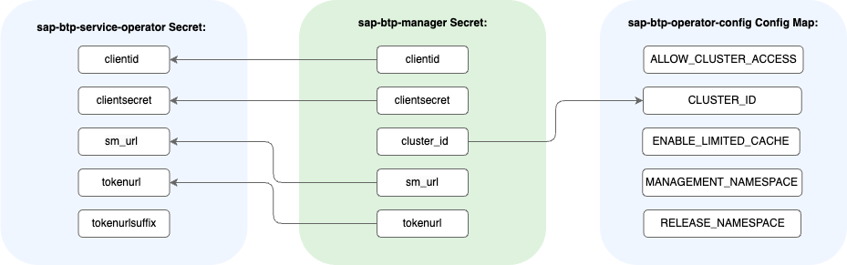

<!-- loioab106d78f9704b10b7c46a8de880da9c -->

# Preconfigured Credentials and Access

When you create SAP BTP, Kyma runtime, all necessary resources for consuming SAP BTP services are created, and the basic cluster access is configured.

<a name="loioab106d78f9704b10b7c46a8de880da9c__section_uyv_vfq_tcc"/>

## Credentials

When you create a Kyma instance in the SAP BTP cockpit, the following events happen in your subaccount:

1.  An SAP Service Manager service instance with the `service-operator-access` plan is created.

2.  An SAP Service Manager service binding with access credentials for the SAP BTP Operator is created.

3.  The credentials from the service binding are passed on to the Kyma service instance in the creation process.

4.  The `sap-btp-manager` Secret is created and managed in the `kyma-system` namespace.

5.  By default, the SAP BTP Operator module is installed together with:

    -   The `sap-btp-manager` Secret.

    -   The `sap-btp-service-operator` Secret with the access credentials for the SAP BTP service operator. You can view the credentials in the `kyma-system` namespace.

    -   The `sap-btp-operator-config` ConfigMap.

The `sap-btp-manager` Secret provides the following credentials:

-   `clientid`

-   `clientsecret`

-   `cluster_id`

-   `sm_url`

-   `tokenurl`

> ### Note:  
> If you modify or delete the `sap-btp-manager` Secret, it is modified back to its previous settings or regenerated within 24 hours.
> 
> To prevent your changes from being reverted, label the Secret with `kyma-project.io/skip-reconciliation: "true"`. For more information, see [Customizing the Default Credentials and Access](customizing-the-default-credentials-and-access-15f22d5.md).

When the SAP BTP Operator module is added to your cluster by default, the `sap-btp-manager` Secret generates the SAP BTP service operator's resources as shown in the following diagram: 

The cluster ID represents and identifies Kyma service instance created in a particular subaccount. You can view the cluster ID in Kyma dashboard:

-   In the `sap-btp-manager` Secret.

-   In the `sap-btp-service-operator` Secret.

-   In the `sap-btp-operator-config` ConfigMap.

<a name="loioab106d78f9704b10b7c46a8de880da9c__section_plw_jmq_tcc"/>

## Cluster Access

By default, SAP BTP Operator has cluster-wide permissions. The following parameters manage cluster access:

**Cluster Access Parameters**

<table>
<tr>
<th valign="top">

Parameter

</th>
<th valign="top">

Description

</th>
</tr>
<tr>
<td valign="top">

`CLUSTER_ID`

</td>
<td valign="top">

Generated when Kyma runtime is created.

</td>
</tr>
<tr>
<td valign="top">

`MANAGEMENT_NAMESPACE`

</td>
<td valign="top">

Indicates the namespace for Secrets referenced in service instances and Secrets, with the name containing a prefix of the service instance's namespace. Always set to `kyma-system`.

</td>
</tr>
<tr>
<td valign="top">

`RELEASE_NAMESPACE`

</td>
<td valign="top">

Stores the chart's release namespace and indicates the namespace for the `sap-btp-service-operator` and `sap-btp-operator-clusterid` Secrets. By default, set to `kyma-system`.

</td>
</tr>
<tr>
<td valign="top">

`ALLOW_CLUSTER_ACCESS`

</td>
<td valign="top">

You can use every namespace for your operations. The parameter is always set to *true*. If you change it to *false*, your setting is automatically reverted.

</td>
</tr>
</table>

<a name="loioab106d78f9704b10b7c46a8de880da9c__section_t24_zn5_g2c"/>

## **Default Credentials and Kyma Runtime Deletion**

The preconfigured credentials described in the [Credentials](preconfigured-credentials-and-access-ab106d7.md#loioab106d78f9704b10b7c46a8de880da9c__credentials_start) section may affect the deletion of your Kyma cluster.

If any non-deleted service instances in your Kyma cluster use the credentials from the SAP Service Manager resources created automatically, you can't delete the cluster. In this case, the existing service instances block the cluster's deletion. Before you attempt to delete the cluster from the SAP BTP cockpit, delete your service instances and bindings in Kyma dashboard. See [Deleting Service Bindings and Service Instances](deleting-service-bindings-and-service-instances-5deca69.md).

However, if all existing service instances in your Kyma cluster use your custom SAP Service Manager credentials, the non-deleted service instances do not block the cluster's deletion. See [Customizing the Default Credentials and Access](customizing-the-default-credentials-and-access-15f22d5.md).

If you have not deleted service instances and bindings connected to your expired free tier service, you can still find the service binding credentials in the SAP Service Manager instance details in the SAP BTP cockpit. Use them to delete the leftover service instances and bindings.

