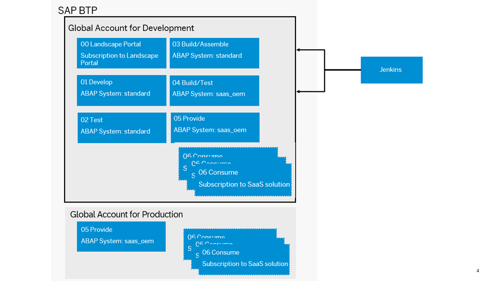

<!-- loio4338854e3133407abb47d3a281dbd1e1 -->

# Prepare

Before you can proceed with the development of the add-on, you have to perform several preliminary steps.

-   Register the development namespaces before any system is set up. To start the actual add-on development process, you have to set up the system landscape and global account structure for development. For pipeline automation, set up a CI/CD server, in this case a Jenkins server.
-   Create one or more software components that make up the add-on in the namespaces registered for you. In this scenario, namespaces are required for both the add-on product name and software components. You can register these namespaces with the development namespace/license keys tool.
-   Purchase the SAP BTP, Cloud Foundry environment entitlements necessary for the account setup, which includes the service ABAP environment for development. The ABAP environment \(service plan `saas_oem`\), Application runtime, SaaS provisioning, ABAP Solution service as well as the Landscape Portal are used for providing the SaaS app.

    > ### Recommendation:  
    > We recommend using the browser-based IDE SAP Business Application Studio for UI development. In this case, additional configuration is required to enable developers to use this service.

Once you’ve completed these steps, you can start developing an add-on.

<a name="loio4338854e3133407abb47d3a281dbd1e1__section_zxr_sp4_drb"/>

## Prerequisites

-   To register a namespace, you need an S-user in SAP One Support Launchpad with authorization to reserve a development namespace. See SAP note [1271482](https://me.sap.com/notes/1271482).
-   To set up global accounts for development and poduction, you need two global accounts on the SAP Business Technology Platform with the corresponding entitlements for services and applications. See [Entitlements and Quotas](https://help.sap.com/viewer/65de2977205c403bbc107264b8eccf4b/Cloud/en-US/00aa2c23479d42568b18882b1ca90d79.html).
-   To create ABAP instances, you have to set up the account structure in the global account for development, and assign entitlements for each subaccount. See [Configure Entitlements and Quotas for Subaccounts](https://help.sap.com/viewer/65de2977205c403bbc107264b8eccf4b/Cloud/en-US/5ba357b4fa1e4de4b9fcc4ae771609da.html).
-   To develop UIs, you need an entitlement for SAP Business Application Studio and an assignment to a subaccount for development. See [SAP Business Application Studio](https://help.sap.com/viewer/product/SAP%20Business%20Application%20Studio/Cloud/en-US).
-   To set up transports from the development to the test system, you need a test system and optionally a pipeline in a Jenkins CI/CD server that is provisioned using a Cx Server to automatically import new changes. See [Jenkins](https://www.jenkins.io/) and [Cx Server](https://www.project-piper.io/infrastructure/overview/#cx-server-recommended).
-   To set up add-on development, you need a development system.

<a name="loiocc5a3c6f78cf4889960c314dd09a5060"/>

<!-- loiocc5a3c6f78cf4889960c314dd09a5060 -->

## Register a Namespace

Using a reserved namespace for add-on development and build is necessary for a unique add-on product and software component name.

> ### Note:  
> You need to register a namespace before the first ABAP system is provisioned. To activate namespaces in already existing systems after system provisioning, see [Maintain Namespaces](https://help.sap.com/docs/help/d91c4152c3d74c12bc9bd4ed92681902/59e9ddee17ee496fa14e2760c78bf9da.html).

If you need a new S-user, get in touch with a user administrator in SAP ONE Support Launchpad.

As an S-user with authorization *Reserve Namespaces*, you have to reserve a namespace for your partner customer ID to register a namespace with the *Namespace* app. See [Namespace Application](https://launchpad.support.sap.com/#/namespaces).

Due to length restrictions of some objects, namespaces should have 5–8 characters. See SAP note [105132](https://me.sap.com/notes/105132) and [395083](https://me.sap.com/notes/395083).

<a name="loio9f2150f2b15e414aacd46c1723ce48fb"/>

<!-- loio9f2150f2b15e414aacd46c1723ce48fb -->

## Set Up a Global Account for Development

As a SaaS solution operator, you have to configure the global account for development \(used for development, testing, and demo purposes\).

> ### Recommendation:  
> We recommend the following subaccount structure:
> 
> -   In the *00 Landscape Portal* subaccount, your subscription to the Landscape Portal is created. If required, the CI/CD service should also be subscribed in this subaccount. No Cloud Foundry environment is required.
> 
> -   In the *01 Develop* subaccount, add-on development is performed in a permanent development system. See [Development in the ABAP Environment](development-in-the-abap-environment-31367ef.md).
> -   In the *02 Test* subaccount, the developed software components are tested after a successful import into a permanent test system.
> -   In the *03 Build/Assemble* subaccount, the add-on package assembly is performed in a transient assembly system that is created and deleted automatically by the build pipeline.
> -   In the *04 Build/Test* subaccount, the add-on product is installed and tested again.
> -   In the *05 Provide* subaccount, the add-on product is provided as a SaaS solution for testing purposes in the development phase.

> ### Note:  
> You can use a booster \(see [Booster for Landscape Portal](prepare-4338854.md#loio8d34e0f80489468088a99202a7fb4a60)\) to automatically perform the setup of subaccounts 00 Landscape Portal, 03 Build/Assemble and 04 Build/Test. This includes the assignment of entitlements, creation of subscriptions and trust setup as described below.

> ### Note:  
> If you use gCTS instead of add-ons for delivering software components to production systems, the setup and usage of the following subaccounts is redundant:
> 
> -   *03 Build/Assemble* \(used for the add-on assembly\)
> -   *04 Build/Test* \(used for add-on installation test\)
> 
> Additionally, considering the availability of software components only in the same global accounts, you have to create the production systems as well as development and test systems in the same global account \(only one global account is used\).
> 
> In the provider subaccount, the entitlement for an ABAP instance of service plan type `abap/standard` instead of `abap/saas_oem` needs to be available.
> 
> See [Delivery via Add-On or gCTS](delivery-via-add-on-or-gcts-438d7eb.md#loio438d7ebfdc4a41de82dcdb156f01857e).

You should configure a Cloud Foundry space in each subaccount. Dividing the development, testing, and assembling activities into different subaccounts allows for maximum flexibility. For instance, you may want to use different identity providers or consume different connectivity services during testing and development.

The ABAP systems that you use for development, testing, and add-on assembly are of type `abap/standard` and made available via entitlements. ABAP systems for add-on installation are of type `abap/saas_oem`. These service entitlements must be assigned by an administrator to different subaccounts, according to the following structure:

<table>
<tr>
<th valign="top">

Global Account

</th>
<th valign="top">

Subaccount

</th>
<th valign="top">

Space

</th>
<th valign="top">

Services

</th>
</tr>
<tr>
<td valign="top" rowspan="5">

Global Account for Development

</td>
<td valign="top">

01 Develop

</td>
<td valign="top">

Develop

</td>
<td valign="top">

1x abap/standard

abap/hana\_compute\_unit \(standard: 2\)

abap/abap\_compute\_unit \(standard: 1\)

</td>
</tr>
<tr>
<td valign="top">

02 Test

</td>
<td valign="top">

Test

</td>
<td valign="top">

1x abap/standard

abap/hana\_compute\_unit \(standard: 2\)

abap/abap\_compute\_unit \(standard: 1\)

</td>
</tr>
<tr>
<td valign="top">

03 Build/Assemble

</td>
<td valign="top">

Build/Assemble

</td>
<td valign="top">

1x abap/standard

abap/hana\_compute\_unit \(standard: 2\)

abap/abap\_compute\_unit \(standard: 1\)

</td>
</tr>
<tr>
<td valign="top">

04 Build/Test

</td>
<td valign="top">

Build/Test

</td>
<td valign="top">

1x abap/saas\_oem

abap/hana\_compute\_unit \(standard: 2\)

abap/abap\_compute\_unit \(standard: 1\)

</td>
</tr>
<tr>
<td valign="top">

05 Provide

</td>
<td valign="top">

Provide

</td>
<td valign="top">

1x abap/saas\_oem

abap/hana\_compute\_unit \(standard: 2\)

abap/abap\_compute\_unit \(standard: 1\)

Application Runtime

abap-solution

saas-registry

xsuaa

</td>
</tr>
</table>

Additionally, the following entitlements for SaaS application subscriptions are required:

-   SAP Business Application Studio for UI development. See [SAP Business Application Studio](sap-business-application-studio-c736960.md).
-   Web access for ABAP for access to systems during development phase. See [Subscribing to the Web Access for ABAP](../20-getting-started/subscribing-to-the-web-access-for-abap-98928b0.md).
-   Landscape Portal to manage systems and tenants in the provider subaccount. See [Landscape Portal](https://help.sap.com/docs/help/d91c4152c3d74c12bc9bd4ed92681902/6aa0a773510e4c82b167fcca4c755327.html).

If you want to integrate an existing corporate identity provider in the subaccounts of the global account for development for authentication/authorization, see [Trust and Federation with Identity Providers](../50-administration-and-ops/trust-and-federation-with-identity-providers-cb1bc8f.md). To restrict access based on certain criteria such as the IP address, you need to use the [SAP Cloud Identity Services - Identity Authentication](https://help.sap.com/viewer/6d6d63354d1242d185ab4830fc04feb1/Cloud/en-US/d17a116432d24470930ebea41977a888.html).

> ### Tip:  
> For in-depth information about the system landscape/account model, check out [System Landscape/Account Model](concepts-9482e7e.md#loio4ca756395fc24e56a42b77632a6bd862).

<a name="loio2e7b4b631e814de1b8fe3959af4105bc"/>

<!-- loio2e7b4b631e814de1b8fe3959af4105bc -->

## Set Up a Global Account for Production

As a SaaS solution operator, you have to configure the global account for production.

> ### Recommendation:  
> We recommend the following subaccount structure:
> 
> In the *00 Landscape Portal* subaccount, your subscription to the Landscape Portal is created. If required, the CI/CD service should also be subscribed in this subaccount. No Cloud Foundry environment is required.
> 
> In the *05 Provide* subaccount, the add-on product is provided as a SaaS solution for production purposes in the production phase. The solution is consumed by your customers from consumer subaccounts.

In the provider context, the `ABAP environment (saas_oem)` service plan is used.

> ### Note:  
> In the provider subaccount, the entitlement for an ABAP instance of service plan type `abap/standard` needs to be available.
> 
> Additionally, considering the availability of software components only in the same global accounts, you have to create the production systems as well as development and test systems in the same global account.
> 
> See [Delivery via Add-On or gCTS](delivery-via-add-on-or-gcts-438d7eb.md#loio438d7ebfdc4a41de82dcdb156f01857e).

These provider ABAP instances allow flexible sizing, multitenancy, and the possibility to install an add-on product during provisioning.

For the provisioning of these ABAP systems of service plan `saas_oem`, another set of services comes into play: With the ABAP Solution Provider and the saas-registry service, you can provide your add-ons as SaaS solution offerings. See [ABAP Solution Service](order-and-provide-975bd3e.md#loio1697387c02e74e66a55cf21a05678167).

Note that these service entitlements must be assigned to different subaccounts, according to the following structure:

<table>
<tr>
<th valign="top">

Global Account

</th>
<th valign="top">

Subaccount

</th>
<th valign="top">

Space

</th>
<th valign="top">

Services

</th>
</tr>
<tr>
<td valign="top">

Global Account for Production

</td>
<td valign="top">

05 Provide

</td>
<td valign="top">

Provide

</td>
<td valign="top">

abap/saas\_oem

abap/hana\_compute\_unit \(standard: 4\)

abap/abap\_compute\_unit \(standard: 1\)

Application Runtime

abap-solution

saas-registry

xsuaa

</td>
</tr>
</table>

Additionally, the following entitlements for SaaS application subscriptions are required:

-   Web access for ABAP for access to systems during the development phase. See [Subscribing to the Web Access for ABAP](https://help.sap.com/docs/BTP/65de2977205c403bbc107264b8eccf4b/98928b0941294c74b946cdcefca9b047.html?version=Cloud).
-   Landscape Portal to manage systems and tenants in the provider subaccount. See [Landscape Portal](https://help.sap.com/docs/help/d91c4152c3d74c12bc9bd4ed92681902/6aa0a773510e4c82b167fcca4c755327.html).

If you want to integrate an existing corporate identity provider in the subaccounts of the global account for production for authentication/authorization, see [Trust and Federation with Identity Providers](../50-administration-and-ops/trust-and-federation-with-identity-providers-cb1bc8f.md). To restrict access based on certain criteria such as the IP address, you need to use the [SAP Cloud Identity Services - Identity Authentication](https://help.sap.com/viewer/6d6d63354d1242d185ab4830fc04feb1/Cloud/en-US/d17a116432d24470930ebea41977a888.html).

> ### Tip:  
> For in-depth information about the system landscape/account model, check out [System Landscape/Account Model](concepts-9482e7e.md#loio4ca756395fc24e56a42b77632a6bd862).

<a name="loio17aa433273c24bd2b949c297513851fe"/>

<!-- loio17aa433273c24bd2b949c297513851fe -->

## Create ABAP Instances

As a SaaS solution operator, you have to create ABAP instances.

For development and testing in the development codeline, one system is provisioned in each of the development and test subaccounts. Use service parameter `is_development_allowed` to differentiate between development and production systems. The test and assembly systems must be productive to avoid changes being made to the add-on outside of the development system.

<table>
<tr>
<th valign="top">

Global Account

</th>
<th valign="top">

Subaccount

</th>
<th valign="top">

Space

</th>
<th valign="top">

ABAP Instances

</th>
</tr>
<tr>
<td valign="top" rowspan="2">

Global Account for Development

</td>
<td valign="top">

01 Develop

</td>
<td valign="top">

Develop

</td>
<td valign="top">

Create an ABAP instance \(abap/standard\) DEV

Set parameter `is_development_allowed = true`

</td>
</tr>
<tr>
<td valign="top">

02 Test

</td>
<td valign="top">

Test

</td>
<td valign="top">

Create an ABAP instance \(abap/standard\) TST

Set parameter `is_development_allowed = false`

</td>
</tr>
</table>

> ### Note:  
> You don't have to create an ABAP instance in the*03 Build/Assemble*, *04 Build/Test*, and *05 Provide* subaccount because the system is created automatically.

In the *03 Build/Assemble* account, assembly systems are provisioned by the add-on build pipeline. These systems are used to import the desired software components that are then packaged for add-on delivery \(see [Software Assembly Integration \(SAP\_COM\_0582\)](software-assembly-integration-sap-com-0582-26b8df5.md)\). As an operator, you don’t have to provision these systems manually.

In the *04 Build/Test* subaccount of the global account for production, an add-on installation test system is automatically created. This ABAP environment service instance of plan `saas_oem` is provisioned with parameter `is_development_allowed = false`.

In the *05 Provide* subaccount of the global accounts for development and production, a customer production system is created automatically by the ABAP Solution Service during the first subscription. For more information on how to get started with your customer account, see [Getting Started with a Customer Account in the ABAP Environment](../20-getting-started/getting-started-with-a-customer-account-in-the-abap-environment-e34a329.md) and [Creating an ABAP System](https://help.sap.com/viewer/65de2977205c403bbc107264b8eccf4b/Cloud/en-US/50b32f144e184154987a06e4b55ce447.html).

Use service parameter `is_development_allowed` to differentiate between development and production systems. The test and assembly systems must be productive to avoid changes being made to the add-on outside of the development system.

Subscribe to the Web Access for ABAP to gain access to the SAP Fiori launchpad in all subaccounts of the global production account.

<a name="loio3f03dfe2f21b471ab98abc6f208c3762"/>

<!-- loio3f03dfe2f21b471ab98abc6f208c3762 -->

## Set Up UI Development

As a SaaS solution operator, you have to set up SAP Business Application Studio for development.

As a developer user, you can then create an SAP Fiori dev space and generate UI projects.

> ### Recommendation:  
> For frontend development, we recommend using SAP Business Application Studio. See [Develop an SAP Fiori Application UI and Deploy it to ABAP Using SAP Business Application Studio](develop-an-sap-fiori-application-ui-and-deploy-it-to-abap-using-sap-business-application-eaaeba4.md).

<a name="loio89a353151e534380a03b2a572a227731"/>

<!-- loio89a353151e534380a03b2a572a227731 -->

## Set Up Add-On Development

Learn how to set up add-on development by creating and importing software components. Furthermore, read about configuring ABAP Test Cockpit checks and check variants, as well as enabling transport blocking to fix issues early on during development.

**Create and Import Software Components**

To transport new developments from system to system, the add-on development is structured by software components. Software components are independent development containers.

To create a new software component for add-on development, as an add-on admin user, use the *Manage Software Components* app and create a new component of type `Development`. The name of the software component begins with a namespace that was activated in the development system. By default, all namespaces of the global account owner are enabled in the systems. See [How to Create Software Components](https://help.sap.com/docs/btp/sap-business-technology-platform/how-to-create-software-components?version=Cloud&q=how%20to%20create%20software%20components).

Clone the main branch of the software component to the development and test system.

Software components in the development and test system should always stay on the main branch. If you want to work on maintenance branches to develop bug fixes and other maintenance deliveries, create a dedicated hotfix development and test system \(maintenance codeline\).

> ### Tip:  
> For in-depth information about versioning and branches, check out [Versioning and Branches](https://help.sap.com/docs/btp/sap-business-technology-platform/concepts?version=Cloud#versioning-and-branches).

**Configure ABAP Test Cockpit Checks, Check Variants**

By default, a check variant `ABAP_CLOUD_DEVELOPMENT_DEFAULT` is generated in ABAP environment systems. You should use this variant for ABAP Test Cockpit check runs or create a custom check variant based on the default check. See [Creating ATC Check Variants](https://help.sap.com/docs/btp/sap-abap-development-user-guide/creating-atc-check-variants?version=Cloud). You can also create custom ABAP Test Cockpit checks. See [Creating ATC Checks](https://help.sap.com/docs/btp/sap-abap-development-user-guide/creating-atc-checks?version=Cloud).

Custom ABAP Test Cockpit checks and check variants are created as part of a software component, whereas the default check variant is generated locally.

**Configure ABAP Test Cockpit to Interrupt Transport Releases**

We recommend enabling the blocking of transport releases in case of priority 1 \(error\) findings using the default check variant `ABAP_CLOUD_DEVELOPMENT_DEFAULT` or a custom check variant. You can enable transport blocking in the ABAP Test Cockpit Configurator app. See [ABAP Test Cockpit Configurator](https://help.sap.com/docs/btp/sap-business-technology-platform/abap-test-cockpit-configurator?version=Cloud&q=ABAP%20Test%20Cockpit%20Configurator.).

Interrupting a transport release in case of severe findings can help to fix issues early on during development. The later errors are detected in the development process, the more costly it is to resolve them. See [Launching ATC Check Implicitly](https://help.sap.com/docs/btp/sap-abap-development-user-guide/launching-atc-check-implicitly?version=Cloud).

<a name="loiobf557544f90f4bc88911c4865ec78207"/>

<!-- loiobf557544f90f4bc88911c4865ec78207 -->

## Set Up Transport from Development to Test System

You can perform the import of your software components into a test system either manually by using the *Manage Software Components* app or in an automated way using the [ABAP Environment Pipeline](concepts-9482e7e.md#loio2398b874f7c5445db188b780ff0cef89).

**Manual Import into Test System**

As an add-on admin user, you can pull the latest released changes of a software component to the test system by using the main branch. You can test these changes in the test system independent from ongoing development. See [How to Pull Software Components](../50-administration-and-ops/how-to-pull-software-components-90b9b9d.md) and [ABAP Lifecycle Management](abap-lifecycle-management-5c7b17d.md).

**Automatic Import into Test System with ABAP Environment Pipeline**

> ### Tip:  
> For in-depth information about the ABAP environment pipeline used for automatic import into a test system, see [ABAP Environment Pipeline](concepts-9482e7e.md#loio2398b874f7c5445db188b780ff0cef89).

As a DevOps engineer, you can configure the ABAP environment pipeline for an automated import of software components to test system TST. With the pipeline, the pulling of specified software components is automated and performed on a regular schedule.

The continuous testing scenario of the ABAP environment pipeline is described in detail in [Continuous Testing on SAP BTP ABAP Environment](https://sap.github.io/jenkins-library/scenarios/abapEnvironmentTest/).

<a name="loio8d34e0f80489468088a99202a7fb4a60"/>

<!-- loio8d34e0f80489468088a99202a7fb4a60 -->

## Booster for Landscape Portal

One of the main use cases of the Landscape Portal is the building of product \(add-on\) versions. While the Landscape Portal hides much of the complexity involved in the process, it is required that a partner set up a suitable account model before starting.

The “Landscape Portal for SAP BTP ABAP Environment” booster is an automated process that automates the setup required to use the *Build Product Version* app in the Landscape Portal. Upon execution, it creates three new subaccounts corresponding to 00 Landscape Portal, 03 Build/Assemble and 04 Build/Test as described in [Set Up a Global Account for Development](prepare-4338854.md#loio9f2150f2b15e414aacd46c1723ce48fb).

The three subaccounts fulfil the following roles:

-   **00 Landscape Portal**: This subaccount will host your Landscape Portal subscription, which can be used for a wide range of lifecycle management tasks.

-   **03 Build/Assemble**: This subaccount will host ABAP environment instances that are used to build new add-on product versions.

-   **04 Build/Test**: This subaccount will host ABAP environment instances that are used to test the installation of new add-on product versions.

It is recommended to use a transient build system during the add-on build process. This means that with every build that is triggered, a new ABAP environment instance is provisioned and, after the process is finished, it is deleted again. The booster also offers the possibility to provision such an instance during the booster execution, which can be later used during the build process.

You can start the booster from your global account for development. A wizard queries the user for the necessary data for the configuration of the subaccounts.

## Prerequisites

-   Your global account for development should be assigned the necessary entitlements:

    -   Landscape Portal \(1x standard\)
    -   Continuous Integration & Delivery \(1x standard\)
    -   abap \(2x standard, 2x abap\_compute\_unit, 4x hana\_compute\_unit\)
    -   Web Access for ABAP \(1x default\)

## Procedure

1.  Navigate to your global account for development in the BTP Cockpit.
2.  Navigate to the *Boosters* tab.
3.  Select the “Landscape Portal for SAP BTP ABAP Environment” booster and click *Start*.
4.  Configure the *00 Landscape Portal*subaccount.
    1.  Choose a subaccount name and subdomain.

5.  Configure the 03 Build/Assemble subaccount.
    1.  Choose a subaccount name and subdomain.
    2.  Choose a Cloud Foundry organization and space name.
    3.  Specify a technical user from your identity provider that shall be used for the provisioning of build systems.
    4.  Specify whether to provision a build system.
    5.  If a system shall be provisioned, choose a system ID.

6.  Configure the*04 Build/Test* subaccount.
    1.  Choose a subaccount name and subdomain.
    2.  Choose a Cloud Foundry organization and space name.
    3.  Specify a technical user from your identity provider that shall be used for the provisioning of installation test systems.

7.  Configure the user groups.
    1.  Specify a list of administrator users. These users will be assigned authorizations as described in *Results* down below.
    2.  Specify a list of viewer users. These users will be assigned authorizations as described in *Results* down below.

SAP ID Service is configured as the identity provider in all three subaccounts. If you wish to use different trust settings for different subaccounts, you can adjust the configuration as necessary after the booster execution.

> ### Note:  
> Currently,the Landscape Portal can only be used with SAP ID service as the application identity provider.

<a name="loio8d34e0f80489468088a99202a7fb4a60__section_xrb_pzg_fcc"/>

## Results

After successful execution, your global account for development should contain three new subaccounts with the following properties:

**00 Landscape Portal** 

-   Entitlements: Landscape Portal \(1x standard\), Continuous Integration and Delivery \(1x default\)

-   Subscriptions: Landscape Portal, Continuous Integration and Delivery

-   Administrator users have role collections *Subaccount Administrator*and *LandscapePortalAdminRoleCollection*.

-   Viewer users have role collections *Subaccount Viewer*.

**03 Build/Assemble**

-   Entitlements: abap \(1x standard, 2x abap\_compute\_unit, 2x hana\_compute\_unit\)

-   Subscriptions: -

-   Cloud Foundry is enabled

-   1 Cloud Foundry space is created

-   If configured, an ABAP environment instance is provisioned

-   Administrator users have role collection *Subaccount Administrator*, are *CF Org Managers* and *Space Managers* 

-   Viewer users have role collection *Subaccount Viewer*, are*CF Org Members* and *Space Developers* 

-   The specified technical user is granted the same authorizations as the viewer user group.

**04 Build/Test**

-   Entitlements: abap \(1x standard, 2x abap\_compute\_unit, 2x hana\_compute\_unit\), Web Access for ABAP \(1x default\)
-   Subscriptions: Web Access for ABAP
-   Cloud Foundry is enabled
-   1 Cloud Foundry space is created
-   Administrator users have role collection *Subaccount Administrator,* are *CF Org Managers* and *Space Managers*
-   Viewer users have role collection*Subaccount Viewer*, are *CF Org Members* and *Space Developers*
-   The specified technical user is granted the same authorizations as the viewer user group.

After executing the booster, you maintain the same technical user\(s\) in the *Credentials* section of the *Build Product Version* app.

You are then ready to configure one or more pipeline templates, see[Configure a Pipeline Template](https://help.sap.com/docs/help/d91c4152c3d74c12bc9bd4ed92681902/5919ca97b3d54c758cf56dfb0887c306.html).

When configuring a template, reuse the resources created by the booster as follows:

For the "Prepare System" stage, reuse the subaccount/CF space from the **03 Build/Assemble** subaccount. If you provisioned a system during the booster execution, specify its instance name in the template so that it will be used.

For the "Integration Tests" stage, reuse the subaccount/CF space from the**04 Build/Test** subaccount. If you provisioned a system during the booster execution, specify its instance name in the template so that it will be used.

