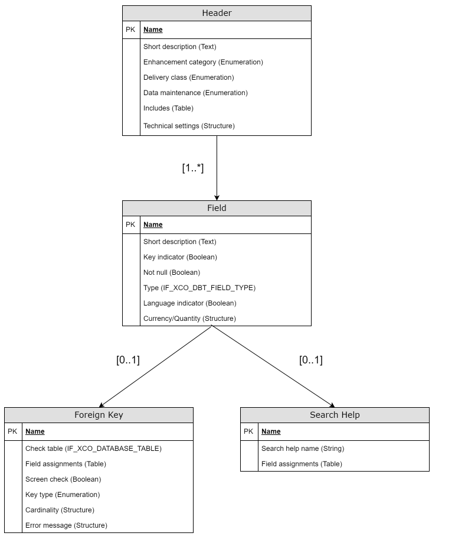

<!-- loio754531670079438dabf4fe11c960e9ab -->

# Read APIs

The XCO Read APIs provide homogenous, yet strongly-typed, APIs that allow to access the content of ABAP Repository objects in a structured way.


<a name="loio754531670079438dabf4fe11c960e9ab__section_g5q_sl3_3tb"/>

## Hierarchical Object Model

The overall design of the XCO Read APIs \(regardless of the concrete object type\) is based on a natural hierarchical model for each respective object type. The hierarchical model used by the XCO Read APIs regards an object as a rooted tree, with the root node given by the header of the object and all other nodes corresponding to parts of the object. To illustrate, the diagram below contains the hierarchical object model for a database table of the ABAP Dictionary as used by the XCO Read APIs:

  

For each node in the hierarchical object model for an object type, two abstractions are provided:

-   Object/part handle

-   Content handle


<a name="loio754531670079438dabf4fe11c960e9ab__section_jsq_xl3_3tb"/>

## Object/Part Handles

The object/part handle provides an abstraction which encapsulates all key values \(object name and keys of the parts if applicable\) of an object/part. For the database table example above we have:

-   IF\_XCO\_DATABASE\_TABLE: The object handle for the database table \(encapsulating the name of the database table\)

-   IF\_XCO\_DBT\_FIELD: The handle for the field of a database table \(encapsulating the name of the database table and the name of the field\)

-   IF\_XCO\_DBT\_FOREIGN\_KEY: The handle for the foreign key of a field of a database table \(encapsulating the name of the database table and the name of the field for which to consider the foreign key\)

-   IF\_XCO\_DBT\_SEARCH\_HELP: The handle for the search help of a field of a database table \(encapsulating the name of the database table and the name of the field for which to consider the search help\)


The following code sample illustrates how these four handles can be obtained:

> ### Sample Code:  
> ```abap
> " Handle for database table ZMY_DBT (IF_XCO_DATABASE_TABLE).
> DATA(lo_database_table) = xco_cp_abap_dictionary=>database_table( 'ZMY_DBT' ).
>  
> " Handle for the field KEY_FIELD of database table ZMY_DBT (IF_XCO_DBT_FIELD).
> DATA(lo_field) = lo_database_table->field( 'KEY_FIELD' ).
>  
> " Handle for the foreign key of field KEY_FIELD of database table ZMY_DBT (IF_XCO_DBT_FOREIGN_KEY).
> DATA(lo_foreign_key) = lo_field->foreign_key.
>  
> " Handle for the search help of field KEY_FIELD of database table ZMY_DBT (IF_XCO_DBT_SEARCH_HELP).
> DATA(lo_search_help) = lo_field->search_help.
> ```

A given object/part handle allows to check the existence via the EXISTS method and provides access to the content handle of the respective object/part via the CONTENT method.


<a name="loio754531670079438dabf4fe11c960e9ab__section_rps_zl3_3tb"/>

## Content Handles

Content handles exist in a natural 1:1 relationship with object/part handles and can be obtained via the CONTENT method of the object/part handle. In case the object type supports different versions \(e.g. active and inactive\) a choice for the version needs to be made before obtaining a content handle. More generally, a content handle fixes all degrees of freedom except for the origin \(see below\) such that the attributes exposed by the content handle can be read out.

A given content handle provides a dedicated GET\_\* method for each exposed attribute as well as a method GET which will return all exposed attributes in a single structure. Note that for language-dependent attributes, e.g. short descriptions, the value will always be retrieved in the original language of the underlying ABAP Repository object.

For the database table example we have:

-   IF\_XCO\_DBT\_CONTENT: The content handle for the header of the database table

-   IF\_XCO\_DBT\_FIELD\_CONTENT: The content handle for a field of a database table

-   IF\_XCO\_DBT\_FOREIGN\_KEY\_CONTENT: The content handle for the foreign key of a field of a database table

-   IF\_XCO\_DBT\_SEARCH\_HELP\_CONTENT: The content handle for the search help of a field of a database table


The code sample below illustrates how the content handle for a database table field is obtained and used to read out the attributes of the field:

> ### Sample Code:  
> ```abap
> " Content handle for the field KEY_FIELD of database table ZMY_DBT.
> DATA(lo_field_content) = xco_cp_abap_dictionary=>database_table( 'ZMY_DBT'
>   )->field( 'KEY_FIELD'
>   )->content( ).
>  
> " Get the complete content (i.e. all the available attributes of the field)
> " as a structure of all attributes.
> DATA(ls_field_content) = lo_field_content->get( ).
>  
> " Get each attribute individually.
> DATA(lv_short_description) = lo_field_content->get_short_description( ).
> DATA(lv_key_indicator) = lo_field_content->get_key_indicator( ).
> DATA(lv_not_null) = lo_field_content->get_not_null( ).
> DATA(lo_type) = lo_field_content->get_type( ).
> DATA(lv_language_indicator) = lo_field_content->get_language_indicator( ).
> DATA(ls_currency_quantity) = lo_field_content->get_currency_quantity( ).
> ```


<a name="loio754531670079438dabf4fe11c960e9ab__section_qcm_bm3_3tb"/>

## Origins

An origin is an abstraction that encapsulates where the content \(and existence status\) of an object or part thereof are read from. As explained above, object/part as well as content handles are only backed by the semantic identifiers \(e.g. the name of the database table\) but do not make any choices if the content is read from the local system or from elsewhere. To this extent, each GET\* method on a content handle asks for an \(optional\) origin from which the attribute will henceforth be read. In short:

-   Content handle: Encapsulates **what** shall be read

-   Origin: Encapsulates **where** content shall be read from


As of now, the XCO Read APIs define the following three kinds of origins \(availability depending on the implementation status of each object type\):

-   Default: The default origin will be used when no explicit origin is supplied. With the default origin, an object will be read exactly once per ABAP session from the local system. Once read from the local database, the content will be cached for the duration of the ABAP Session and used for any subsequent reads

-   Local: The local origin reads from the local database. The caching behavior for individual or groups of objects can be configured freely

-   Remote: Based on an RFC destination \(given as IF\_RFC\_DEST\) objects are read from remote systems. The caching behavior for individual or groups of objects can be configured freely


Note that not all object types support the origin concept yet \(see table below\). In case an object type does not yet support the origin concept the content will always be read from the local database.


<a name="loio754531670079438dabf4fe11c960e9ab__section_cd1_dm3_3tb"/>

## Object Type Feature Matrix


<table>
<tr>
<th valign="top" colspan="2">

Object Type


</th>
<th valign="top">

Supports Origins?


</th>
<th valign="top">

Origin Factory


</th>
<th valign="top">

Supports Local Origin


</th>
<th valign="top">

Supports Remote Origin


</th>
</tr>
<tr>
<td valign="top">

APLO


</td>
<td valign="top">

Application Log Object


</td>
<td valign="top">

No


</td>
<td valign="top">

\-


</td>
<td valign="top">

\-


</td>
<td valign="top">

\-


</td>
</tr>
<tr>
<td valign="top">

CLAS


</td>
<td valign="top">

Class


</td>
<td valign="top">

Yes


</td>
<td valign="top">

XCO\_CP\_ABAP\_OBJECTS=\>ORIGIN


</td>
<td valign="top">

Yes


</td>
<td valign="top">

Yes


</td>
</tr>
<tr>
<td valign="top">

DDLS


</td>
<td valign="top">

Data Definition


</td>
<td valign="top">

No


</td>
<td valign="top">

\-


</td>
<td valign="top">

\-


</td>
<td valign="top">

\-


</td>
</tr>
<tr>
<td valign="top">

DOMA


</td>
<td valign="top">

Domain


</td>
<td valign="top">

No


</td>
<td valign="top">

\-


</td>
<td valign="top">

\-


</td>
<td valign="top">

\-


</td>
</tr>
<tr>
<td valign="top">

DTEL


</td>
<td valign="top">

Data Element


</td>
<td valign="top">

Yes


</td>
<td valign="top">

XCO\_CP\_DATA\_ELEMENT=\>ORIGIN


</td>
<td valign="top">

Yes


</td>
<td valign="top">

No


</td>
</tr>
<tr>
<td valign="top" rowspan="2">

FUGR


</td>
<td valign="top">

Function Group


</td>
<td valign="top">

No


</td>
<td valign="top">

\-


</td>
<td valign="top">

\-


</td>
<td valign="top">

\-


</td>
</tr>
<tr>
<td valign="top">

Function Module


</td>
<td valign="top">

No


</td>
<td valign="top">

\-


</td>
<td valign="top">

\-


</td>
<td valign="top">

\-


</td>
</tr>
<tr>
<td valign="top">

INTF


</td>
<td valign="top">

Interface


</td>
<td valign="top">

Yes


</td>
<td valign="top">

XCO\_CP\_ABAP\_OBJECTS=\>ORIGIN


</td>
<td valign="top">

Yes


</td>
<td valign="top">

Yes


</td>
</tr>
<tr>
<td valign="top">

MSAG


</td>
<td valign="top">

Message Class


</td>
<td valign="top">

No


</td>
<td valign="top">

\-


</td>
<td valign="top">

\-


</td>
<td valign="top">

\-


</td>
</tr>
<tr>
<td valign="top">

SRVB


</td>
<td valign="top">

Service Binding


</td>
<td valign="top">

No


</td>
<td valign="top">

\-


</td>
<td valign="top">

\-


</td>
<td valign="top">

\-


</td>
</tr>
<tr>
<td valign="top">

SRVD


</td>
<td valign="top">

Service Definition


</td>
<td valign="top">

Yes


</td>
<td valign="top">

XCO\_CP\_SERVICE\_DEFINITION=\>ORIGIN


</td>
<td valign="top">

Yes


</td>
<td valign="top">

No


</td>
</tr>
<tr>
<td valign="top" rowspan="3">

TABL


</td>
<td valign="top">

Structure


</td>
<td valign="top">

No


</td>
<td valign="top">

\-


</td>
<td valign="top">

\-


</td>
<td valign="top">

\-


</td>
</tr>
<tr>
<td valign="top">

Database Table


</td>
<td valign="top">

Yes


</td>
<td valign="top">

XCO\_CP\_DATABASE\_TABLE=\>ORIGIN


</td>
<td valign="top">

Yes


</td>
<td valign="top">

No


</td>
</tr>
<tr>
<td valign="top">

Global Temporary Table


</td>
<td valign="top">

No


</td>
<td valign="top">

\-


</td>
<td valign="top">

\-


</td>
<td valign="top">

\-


</td>
</tr>
<tr>
<td valign="top">

TTYP


</td>
<td valign="top">

Table Type


</td>
<td valign="top">

No


</td>
<td valign="top">

\-


</td>
<td valign="top">

\-


</td>
<td valign="top">

\-


</td>
</tr>
<tr>
<td valign="top">

XSLT


</td>
<td valign="top">

Transformation


</td>
<td valign="top">

No


</td>
<td valign="top">

\-


</td>
<td valign="top">

\-


</td>
<td valign="top">

\-


</td>
</tr>
</table>

