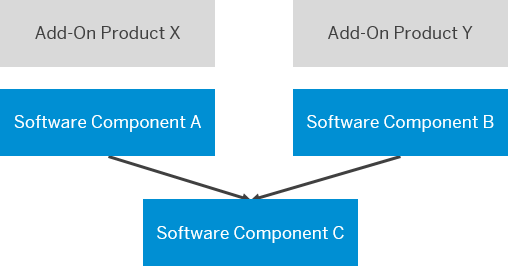

<!-- loio919be04888aa4e07b1a99416fb8bb68d -->

# Reuse Software Components


<a name="loio919be04888aa4e07b1a99416fb8bb68d__section_fl4_cby_ffc"/>

## Released APIs and API snapshots

Add-On products can consist of multiple software components. However, objects of one software component can't be used in another software component by default. Software components provide their functionality to other software components via explicitly released APIs. This means, you must set the API state of an object to *Released* if you want to use it from another software component.

Once you have released an object, we recommend not changing it incompatibly because this can lead to errors for its consumers. Released APIs need to fulfill certain stability and consistency criteria depending on the underlying release contract. To fulfill these criteria, any changes done to already released APIs need to be checked for compatibility. This is done using so called API snapshots that are created locally in development and test systems. For more information, see [Released APIs and API Snapshots](https://help.sap.com/docs/btp/sap-business-technology-platform/concepts?version=Cloud#released-apis-and-api-snapshots).

> ### Note:  
> The `abapEnvironmentAssemblePackages` step in the *Build* stage of the ABAP environment pipeline, which is used to assemble delivery packages while following the add-on delivery approach, will automatically create a new API snapshot for each semantic version. The created snapshot will be searched for at the beginning of the build of the next version and will then be set as check-relevant. Finally, the `API_COMPATIBILITY` check will be used to look for any incompatible changes on the piece list of the delivery, comparing the latest state of the released APIs in a software component to the state of the API facades in the API snapshot. With this, there is no need to manually create API snapshots in an add-on assembly system. For more information, see [abapEnvironmentAssemblePackages](https://www.project-piper.io/steps/abapEnvironmentAssemblePackages/) and [Software Assembly Integration \(SAP\_COM\_0582\)](https://help.sap.com/docs/btp/sap-business-technology-platform/software-assembly-integration-sap-com-0582?version=Cloud).
> 
> You also have the option to download the API snapshot for use in other systems. See [Downloading API Snapshots](https://help.sap.com/docs/sap-btp-abap-environment/abap-environment/downloading-api-snapshots?version=Cloud).
> 
> Performing manual actions \(e.g. regenerate or delete\) on the API snapshots created in the build system is not recommended. Instead, use ATC exemptions to mitigate compatibility check findings that are false-positive or cannot be resolved in time. For more information, see [Working with ATC Exemptions](https://help.sap.com/docs/abap-cloud/abap-development-tools-user-guide/working-with-atc-exemptions). If your add-on build system is transient, the semantic version API snapshots won’t be carried over from system to system and the compatibility checks will be skipped.


### Software Component Relations

Software components must not have cyclic dependencies. For more information on software component restrictions, see [Software Components](https://help.sap.com/docs/btp/sap-business-technology-platform/software-components?version=Cloud).

You should however use software component relations to define access permissions and dependencies between specific software components. This approach of permitting usage across software components does not come with the same stability and consistency requirements as is the case with the release state on object level \(which is also not targeted to specific software components\). For more information, see [Software Component Relations](https://help.sap.com/docs/abap-cloud/abap-development-tools-user-guide/software-component-relations).

> ### Note:  
> The abapEnvironmentAssemblePackages step in the Build stage of the ABAP Environment Pipeline, which is used to assemble delivery packages while following the add-on delivery approach, will automatically run the `SCR_CONSISTENCY ATC` Check. Refer to [abapEnvironmentAssemblePackages](https://www.project-piper.io/steps/abapEnvironmentAssemblePackages/) and [Software Assembly Integration \(SAP\_COM\_0582\)](https://help.sap.com/docs/btp/sap-business-technology-platform/software-assembly-integration-sap-com-0582?version=Cloud).
> 
> The `SCR_CONSISTENCY` check will fail if undeclared dependencies between add-on software components are found. In such cases resolve the findings by defining the missing dependencies as part of a software component relation or removing the dependencies if unintended. For more information, see [Software Component Relations](https://help.sap.com/docs/abap-cloud/abap-development-tools-user-guide/software-component-relations). Use ATC exemptions to mitigate dependency consistency check findings that are false-positives or cannot be resolved in time. See [Working with ATC Exemptions](https://help.sap.com/docs/abap-cloud/abap-development-tools-user-guide/working-with-atc-exemptions).


### Software Component Dependencies in Add-ons

Having this in mind, you can structure development into reuse components that are used across several components.



In this example, one add-on product consists of a leading software component A and software component C, whereas another add-on product consists of a leading software component B and C. Software component A and B use released objects of software component C, and thereby depend on this software component.

In the add-on descriptor file, dependencies are reflected by the order of the components in the repositories list:

```
---
addonProduct: "/NAMESPC/PRODUCT_X"
addonVersion: "1.2.0"
repositories:
  - name: "/NAMESPC/COMPONENT_C"
    branch: "v1.2.0"
    version: "1.2.0" 
    commitID: "7d4516e9"
  - name: "/NAMESPC/COMPONENT_A"
    branch: "v2.0.0"
    version: "2.0.0" 
    commitID: "9f102ffb" 
    
```

In this case, component `/NAMESPC/COMPONENT_C` is the reuse component. It has no dependencies to any other top components and is therefore listed first. This is important for the right order during software component import. `/NAMESPC/COMPONENT_C` needs to be imported before `/NAMESPC/COMPONENT_A` to avoid import errors. In addition to that, software components in the bundle can use different namespaces in the software component name.

> ### Recommendation:  
> In a software component bundle with a reuse component, this component is assembled whenever the software component version is defined for the first time in the add-on descriptor file. Therefore, make sure to define the correct software component version to prevent building the wrong software component version for `/NAMESPC/COMPONENT_C`.
> 
> We recommend following the same delivery model \(identical shipment cycles\) for all involved software components in a delivery scenario with a reuse component.


In this scenario, add-on product X and Y are based on the continuous delivery model and still undergo development. That means, for both add-on products, a new version can be shipped on a bi-weekly basis.

Consequently, the leading software components A and B refer to objects in the same branch of the reuse software component C, for example branch v1.2.0

Let’s assume that development and correction of both software components is performed in one DEV and COR system. If there has to be a bug fix in reuse software component C, corrections to the corresponding software components A and B are still possible. This is due to the fact that branch v1.2.0 can remain checked out in software component C, while these changes are made.

The same applies to the development process: A new feature can be developed in leading software component A using the main branch of reuse software component C. Since only the main branch of reuse software component C is used in the DEV system, the development in the corresponding software components A and B can continue in parrallel.

This scenario is resource-efficient: only one system is required for development in system DEV and one for corrections in COR. With respect to the developer experience, it is more convenient to have all implementation components in one development system because everything is in one place and the whole system landscape is easily understandable.


The system setup regarding the testing and quality assurance for corrections depends on how you want to test the add-on products:

-   Do you want to provide a test environment that is identical to a production system with the add-on product installed? Then you should establish one TST and one QAS system for each add-on product in the sense that only those software components used for each add-on product are imported into these systems.

-   Do you want to reduce the number of systems without restricting the test environment? Then you only need one TST and one QAS system, where all software components are imported.


> ### Recommendation:  
> The number of required systems for DEV, COR, TST, and QAS depends on the number of branches that are actively used in dev, test, and build processes. Whenever more than one branch is actively used, one ABAP system is required per branch because an ABAP system always checks out only one branch of a software component.

