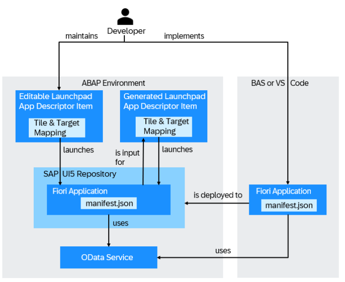
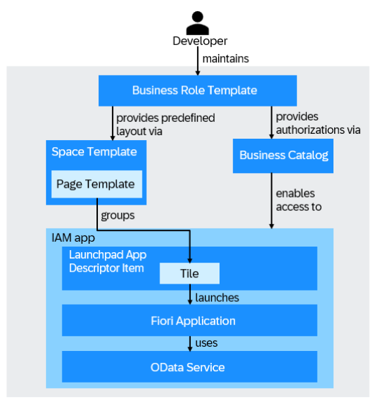
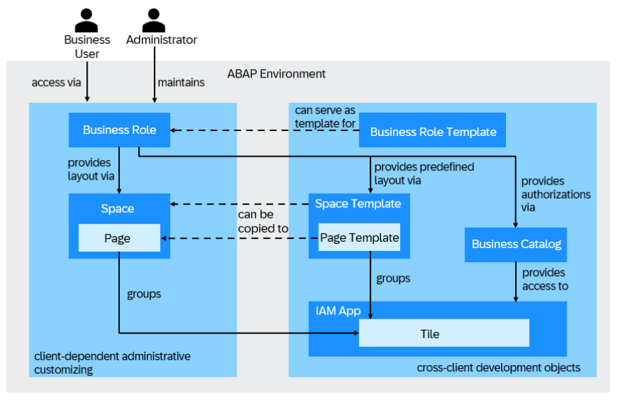

<!-- loio1d9deef79d7d4936850b2d6343206ec8 -->

# SAP Fiori Applications in the ABAP Environment

When you plan to create an SAP Fiori application in the ABAP environment and want to provide this application to business users, you may want to get a better understanding of the required steps before getting started with the UI development.

<a name="loio1d9deef79d7d4936850b2d6343206ec8__section_o4c_g1n_ktb"/>

## Implementing and Deploying the UI

### Implementing an SAP Fiori Application

To implement an SAP Fiori application for an OData service, you can use the Fiori tools application generator in SAP Business Application Studio or Visual Studio Code. When generating the application, you can select one of the available OData services for UI development and choose the main entity. Amongst others, the generator will create the `manifest.json` file. The manifest defines static information about the application, such as the name of the application or OData service used. You can add a SAP Fiori launchpad configuration to the manifest.json file, for example, a tile with an icon. The SAP Fiori launchpad configuration can be added from the application generator or from the application information page.

After generating the app, you can run the application in preview mode.

> ### Restriction:  
> -   Only OData services from your custom service binding are supported.
> 
> -   API services on SAP Business Accelerator Hub are not supported. They are released for external consumption only.

To discover the available OData services, the `SAP_A4_BC_DEV_UID_PC` business catalog needs to be assigned. In order to run the application in preview mode, the `SAP_CORE_BC_EXT_TST` business catalog has to be assigned. This business catalog is contained in the `SAP_BR_DEVELOPER` business role template.

### Deploying an SAP Fiori Application

To deploy the SAP Fiori application, you have to create a deployment configuration and provide the target package and workbench request. You can create the deployment configuration from the application generator or from the application information page.

When deploying the application to the SAPUI5 ABAP repository in the ABAP environment, the following objects are automatically created and recorded on the workbench request.

-   A business server page \(BSP\) application, which stores the code of the SAP Fiori application
-   A folder in the MIME repository, which stores all MIME objects, such as graphics or icons of the app
-   A node in the Internet Communication Framework \(ICF\), which enables clients \(browser\) to access the code stored in the BSP application
-   SAP Fiori launchpad app descriptor items which enable launching the app from the Fiori launchpad

You can find the BSP application and the generated launchpad app descriptor items in your deployment package in ABAP development tools for Eclipse. The folder in the MIME repository and the node in the ICF are not visible in ABAP development tools for Eclipse but are listed in the transport request. Alternatively, you can use CDS view `I_CustABAPObjDirectoryEntry` to inspect those objects in the ABAP object directory. The CDS view gives you customer object centric visibility of the classic ABAP table `TADIR`.

The launchpad app descriptor items are created from the SAP Fiori launchpad configuration in the `manifest.json` file. For more information, please navigate to the entry *crossnavigation* in table `sap.app` of [Descriptor for Applications, Components, and Libraries \(manifest.json\)](https://ui5.sap.com/#/topic/be0cf40f61184b358b5faedaec98b2da.html%23loiobe0cf40f61184b358b5faedaec98b2da/section_sap_app). Each app descriptor item consists of a target mapping and a tile. The target mapping maps the deployed app \(navigation target\) to the intent \(combination of semantic object and action\). Moreover, the generated Fiori launchpad app descriptor items follow the application deployment lifecycle and cannot be edited in ABAP development tools for Eclipse.

> ### Note:  
> If you change the ID of the SAP Fiori launchpad configuration intent in the manifest.json file of the Fiori application and deploy the latter, existing references from the SAP Fiori launchpad to the corresponding Fiori launchpad app descriptor item will break.

The Fiori UI is deployed in ABAP language version ABAP for Cloud development which restricts access to data sources. Data sources must be released for system-internal use in cloud development or must be in the same software component. For more information, see [Use System-Internally \(C1\)](https://help.sap.com/docs/abap-cloud/abap-development-tools-user-guide/use-system-internally-c1?version=sap_btp).

To deploy the application, the `SAP_A4C_BC_DEV_UID_PC` business catalog needs to be assigned. This business catalog is contained in the `SAP_BR_DEVELOPER` business role template.

<a name="loio1d9deef79d7d4936850b2d6343206ec8__section_unq_cmd_ddc"/>

## Creating Launchpad App Descriptor Items

In addition to the launchpad app descriptor items that are generated automatically from the `manifest.json` file during deployment, you can also create launchpad app descriptor items manually in ABAP development tools for Eclipse. The launchpad app descriptor item consists of a target mapping and one or more tiles. The target mapping maps the application \(navigation target\) to the intent \(combination of semantic object and action\).

If you want to provide different tiles for the app, for example, a static tile and a dynamic tile with a counter, then you can add additional tiles to the launchpad app descriptor. In this case, users can personalize the launchpad with the tile of their choice. If you are intending to provide different tiles for different personas, then it is recommended to create distinct launchpad app descriptor items. For more information, see [Working with Launchpad App Descriptor Items](https://help.sap.com/docs/abap-cloud/abap-development-tools-user-guide/working-with-launchpad-app-descriptor-items). The properties provided under [Editing Launchpad App Descriptor Items](https://help.sap.com/docs/abap-cloud/abap-development-tools-user-guide/editing-launchpad-app-descriptor-items) can be maintained.

These manually created launchpad app descriptor items can be created with a freely chosen name. Keep in mind that the lifecycle of those manually created objects is decoupled from the Fiori application deployment lifecycle, so they can be edited in ABAP development tools for Eclipse independently.

It is recommended to utilize launchpad app descriptor items created from the `manifest.json` file during app deployment. This read-only app-descriptor item serves as reference and fallback tile for any other tiles that are created in addition to that. You can manually create these items in ABAP development tools for Eclipse if specialized tiles are needed for an already deployed Fiori application. For example, if you wish to create a separate tile that displays a specific subset of data and has a different title, you can manually create an additional app descriptor item with a dedicated tile. This additional app descriptor item can also be used for enabling access and defining the predefined launchpad layout.

<a name="loio1d9deef79d7d4936850b2d6343206ec8__section_izl_sfn_ktb"/>

## Enabling Access and Providing Predefined Launchpad Layout

After you have deployed the SAP Fiori application and created Fiori launchpad app descriptor items, either automatically from the manifest or manually in ABAP development tools for Eclipse, you need to create an IAM app and assign the created SAP Fiori launchpad app descriptor item to the IAM app. Furthermore, you need to create a business catalog and assign the IAM app to the business catalog. The business catalog enables access to the SAP Fiori application.

Additionally, you can provide a predefined launchpad layout by creatinge a space template and a page template referring to the tile of the SAP Fiori launchpad app descriptor item.

Moreover, you can maintain a business role template to have a streamlined process for an administrator to set up business roles by providing predefined roles with predefined layouts.

This saves time and effort for an administrator but still allows for a more tailored user experience.

While the business catalog defines the access to the apps, the space and page template determine which apps are visible for the users on the Fiori Launchpad. The business role template combines the business catalogs and space templates that are typically needed for such a role.

> ### Restriction:  
> Creation of Space Templates and Page Templates
> 
> Space templates can’t be merged with other space templates directly. To merge a space template with another space template, one of the templates must be copied to create a space first.
> 
> When you want to merge one or more customer-created spaces with a predefined space \(e.g. delivered by SAP\) or a template, open the general details for the customer-created space, then enter the space ID of the predefined space or template in the field *Merge ID*. The same is true for the merging of page templates.

### Scoping

Business catalogs, business role templates as well as Fiori space and page templates are not visible in the development system by default and therefore cannot be used.

To use space and page templates in the development system, you need to publish it locally. After the business catalog and role template are published, they are visible in the Business Catalogs and Business Role Templates apps. To use the space and page templates in the development system, you need to programmatically scope them. See [Scoping Space and Page Templates](scoping-space-and-page-templates-74d5b1a.md) for more details about scoping. After the page and pace templates are scoped, they are visible as predefined spaces and pages in the [Manage Launchpad Spaces](https://help.sap.com/docs/btp/user-interface-configurations/manage-launchpad-spaces?version=Cloud) and [Manage Launchpad Pages](https://help.sap.com/docs/btp/user-interface-configurations/manage-launchpad-pages?version=Cloud) apps. In non-development systems the space and page templates are scoped automatically during import into the system.

### Preview

As a developer you can launch the preview of the page template in the [Manage Launchpad Pages](https://help.sap.com/docs/btp/user-interface-configurations/manage-launchpad-pages?version=Cloud) app from the ABAP development tools for Eclipse editor. To preview the created page template, you need authorization for the [Manage Launchpad Pages](https://help.sap.com/docs/btp/user-interface-configurations/manage-launchpad-pages?version=Cloud) app.

<a name="loio1d9deef79d7d4936850b2d6343206ec8__section_nkd_gfd_bbc"/>

## Translation

*Maintain Translations*

When it comes to managing translation, there are basically two areas: Texts from the ABAP development objects and texts from the SAP Fiori application, e.g., texts for the IAM app or IAM business catalog. Texts from the SAP Fiori application are usually defined in i18n \(internationalization\) property files, e.g. the texts for the tile used in the `manifest.json`.

To handle texts from the ABAP development objects, you use the[Maintain Translations App](https://help.sap.com/docs/btp/sap-business-technology-platform/maintain-translations?version=Cloud). This application provides a user-friendly interface for managing translations within the ABAP environment. It allows you to easily maintain and update translations used in ABAP development objects.

For non-ABAP based texts, such as those found in the SAP Fiori application, a different approach is needed. In this case, you need to follow the Fiori translation process. Please refer to [Translate Texts in SAP Fiori](https://help.sap.com/docs/SAP_FIORI_OVERVIEW/a1482918da994432859015bf1a083d9b/1a165cd7eb15425ab2a62b86625c3ef2.html) for more details.

> ### Note:  
> Texts of launchpad app descriptor items created manually in ABAP development tools for Eclipse can be translated in the *Maintain Translations* app. Texts of launchpad app descriptor items generated from the `manifest.json` file during application deployment origin from i18n property files and follow the translation approach for non-ABAP based texts.

<a name="loio1d9deef79d7d4936850b2d6343206ec8__section_qn2_2gd_bbc"/>

## Providing Access and Launchpad Layout

You as an administrator create a [business role](https://help.sap.com/docs/btp/sap-business-technology-platform/maintain-business-roles-new-preview?version=Cloud), so that the application appears in the SAP Fiori launchpad for [business users](https://help.sap.com/docs/btp/sap-business-technology-platform/maintain-business-users?version=Cloud) that are assigned to the business role. Using role templates as well as predefined space and page templates simplifies the process for an administrator of setting up business roles.

To make an SAP Fiori application accessible on the SAP Fiori launchpad home page of business users, you must perform the following steps:

-   Create a business role and assign at least one [business catalog](https://help.sap.com/docs/btp/sap-business-technology-platform/iam-business-catalogs?version=Cloud) to the role. The business role controls the access to your applications. The business catalog contains the actual authorizations that allow users to access apps.

-   You can either assign a predefined space \(space template\) to the [business role](https://help.sap.com/docs/btp/sap-business-technology-platform/maintain-business-roles-new-preview?version=Cloud), copy an existing one, or create a new launchpad space and page and then add apps to the page. The space and page control the layout of the Fiori launchpad. More information and tips on creating and handling spaces and pages can be found in [Best Practices for Managing Spaces and Pages](https://help.sap.com/docs/btp/user-interface-configurations/best-practices-for-managing-spaces-and-pages?version=Cloud).

-   You can also create a business role from a business role template and adapt the business role to your needs.

-   Business users that are assigned to the business role can now access the app.

-   You can also create spaces, pages, and business roles for testing purposes locally in the development system. If you want to import these artifacts into the production system, you must transport the spaces, pages, and business roles into the production system via a customizing request. See [Export Customizing Transport](https://help.sap.com/docs/btp/sap-business-technology-platform/export-customizing-transports?version=Cloud)s for more details on how to use it.

-   If you are using a group-based layout in the SAP Fiori launchpad, you must enable SAP Fiori launchpad spaces in the [Manage Launchpad Settings](https://help.sap.com/docs/btp/user-interface-configurations/manage-launchpad-settings?version=Cloud) app.

    > ### Note:  
    > This is a one-time effort.

**Related Information**  

[Develop an SAP Fiori Application UI and Deploy it to ABAP Using SAP Business Application Studio](develop-an-sap-fiori-application-ui-and-deploy-it-to-abap-using-sap-business-application-eaaeba4.md "Get an overview about how to create and deploy an SAP Fiori application to ABAP using SAP Business Application Studio.")

